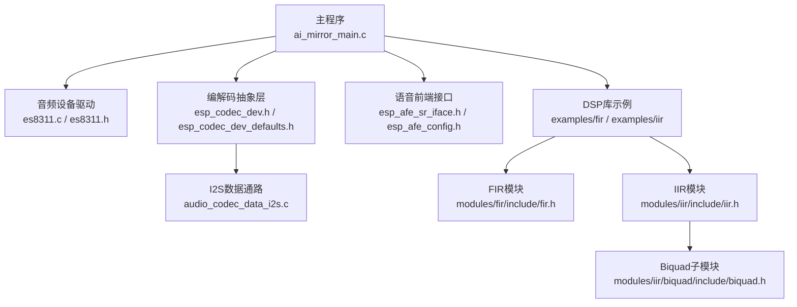
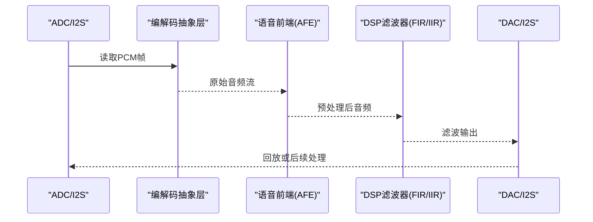
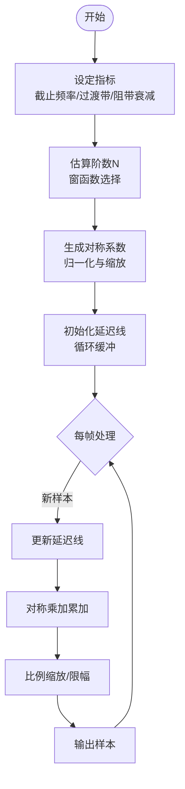
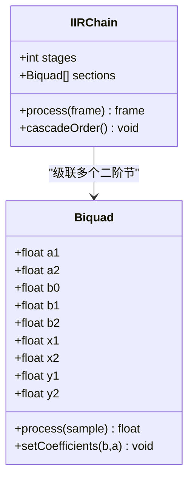
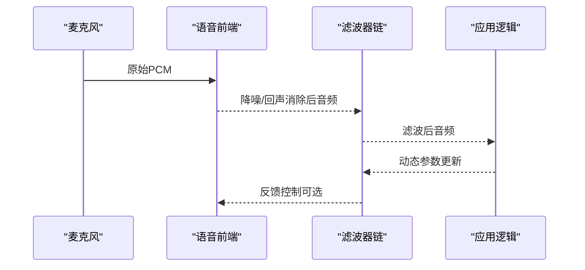
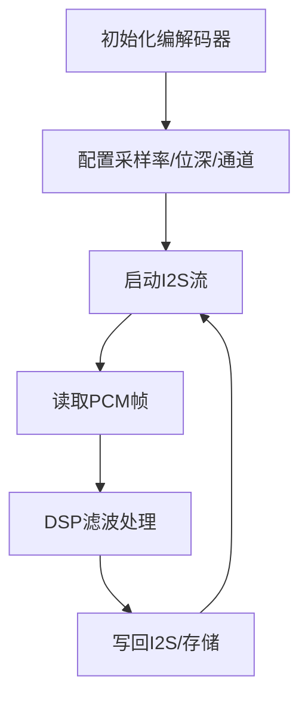
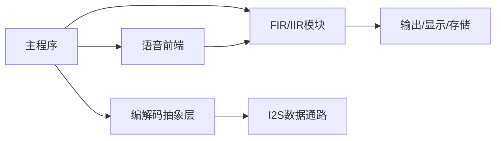

# DSP滤波器设计

<cite>
**本文引用的文件**   
- [README.md](file://Firmware/esp32_ai_mirror/README.md)
- [CMakeLists.txt](file://Firmware/esp32_ai_mirror/CMakeLists.txt)
- [sdkconfig.defaults](file://Firmware/esp32_ai_mirror/sdkconfig.defaults)
- [ai_mirror_main.c](file://Firmware/esp32_ai_mirror/main/ai_mirror_main.c)
- [ai_mirror_config.h](file://Firmware/esp32_ai_mirror/main/ai_mirror_config.h)
- [es8311.h](file://Firmware/esp32_ai_mirror/managed_components/espressif__es8311/include/es8311.h)
- [es8311.c](file://Firmware/esp32_ai_mirror/managed_components/espressif__es8311/es8311.c)
- [esp_codec_dev.h](file://Firmware/esp32_ai_mirror/managed_components/espressif__esp_codec_dev/include/esp_codec_dev.h)
- [esp_codec_dev_defaults.h](file://Firmware/esp32_ai_mirror/managed_components/espressif__esp_codec_dev/include/esp_codec_dev_defaults.h)
- [audio_codec_data_i2s.c](file://Firmware/esp32_ai_mirror/managed_components/espressif__esp_codec_dev/platform/audio_codec_data_i2s.c)
- [esp_afe_sr_iface.h](file://Firmware/esp32_ai_mirror/components/espressif__esp-sr/include/esp_afe_sr_iface.h)
- [esp_afe_config.h](file://Firmware/esp32_ai_mirror/components/espressif__esp-sr/include/esp_afe_config.h)
- [dl_lib_conv_queue.h](file://Firmware/esp32_ai_mirror/components/espressif__esp-sr/include/esp32/dl_lib_conv_queue.h)
- [dl_lib_matrix.h](file://Firmware/esp32_ai_mirror/components/espressif__esp-sr/include/esp32/dl_lib_matrix.h)
- [fir 示例 CMakeLists.txt](file://Firmware/esp32_ai_mirror/managed_components/espressif__esp-dsp/examples/fir/CMakeLists.txt)
- [iir 示例 CMakeLists.txt](file://Firmware/esp32_ai_mirror/managed_components/espressif__esp-dsp/examples/iir/CMakeLists.txt)
- [fir 模块头文件](file://Firmware/esp32_ai_mirror/managed_components/espressif__esp-dsp/modules/fir/include/fir.h)
- [iir 模块头文件](file://Firmware/esp32_ai_mirror/managed_components/espressif__esp-dsp/modules/iir/include/iir.h)
- [biquad 头文件](file://Firmware/esp32_ai_mirror/managed_components/espressif__esp-dsp/modules/iir/biquad/include/biquad.h)
</cite>

## 目录
1. [简介](#简介)
2. [项目结构](#项目结构)
3. [核心组件](#核心组件)
4. [架构总览](#架构总览)
5. [详细组件分析](#详细组件分析)
6. [依赖关系分析](#依赖关系分析)
7. [性能考虑](#性能考虑)
8. [故障排查指南](#故障排查指南)
9. [结论](#结论)
10. [附录](#附录)

## 简介
本文件面向在ESP32平台上进行数字信号处理（DSP）的工程师与开发者，系统阐述FIR与IIR滤波器的设计原理、适用场景、系数计算与优化方法、频率与相位特性分析方法，以及高通、低通、带通的具体实现思路。同时覆盖实时卷积算法优化、内存管理、稳定性与精度考量，并提供可操作的测试与验证方法。文档结合仓库中的ESP-DSP库、ESP-SR前端与音频编解码驱动，给出从理论到落地的完整路径。

## 项目结构
本项目基于ESP-IDF构建，包含主应用、音频编解码驱动、语音前端（ESP-SR）与通用DSP库（ESP-DSP）。与滤波器相关的关键位置：
- 主应用入口与配置：main/ai_mirror_main.c、main/ai_mirror_config.h
- 音频编解码驱动：managed_components/espressif__es8311/* 与 managed_components/espressif__esp_codec_dev/*
- 语音前端接口与配置：components/espressif__esp-sr/include/esp_afe_*
- DSP库示例与模块：managed_components/espressif__esp-dsp/examples/{fir,iir} 与 modules/{fir,iir,biquad}

图表来源 
- [ai_mirror_main.c](file://Firmware/esp32_ai_mirror/main/ai_mirror_main.c)
- [es8311.c](file://Firmware/esp32_ai_mirror/managed_components/espressif__es8311/es8311.c)
- [esp_codec_dev.h](file://Firmware/esp32_ai_mirror/managed_components/espressif__esp_codec_dev/include/esp_codec_dev.h)
- [audio_codec_data_i2s.c](file://Firmware/esp32_ai_mirror/managed_components/espressif__esp_codec_dev/platform/audio_codec_data_i2s.c)
- [esp_afe_sr_iface.h](file://Firmware/esp32_ai_mirror/components/espressif__esp-sr/include/esp_afe_sr_iface.h)
- [fir 示例 CMakeLists.txt](file://Firmware/esp32_ai_mirror/managed_components/espressif__esp-dsp/examples/fir/CMakeLists.txt)
- [iir 示例 CMakeLists.txt](file://Firmware/esp32_ai_mirror/managed_components/espressif__esp-dsp/examples/iir/CMakeLists.txt)
- [fir 模块头文件](file://Firmware/esp32_ai_mirror/managed_components/espressif__esp-dsp/modules/fir/include/fir.h)
- [iir 模块头文件](file://Firmware/esp32_ai_mirror/managed_components/espressif__esp-dsp/modules/iir/include/iir.h)
- [biquad 头文件](file://Firmware/esp32_ai_mirror/managed_components/espressif__esp-dsp/modules/iir/biquad/include/biquad.h)

章节来源
- [README.md](file://Firmware/esp32_ai_mirror/README.md)
- [CMakeLists.txt](file://Firmware/esp32_ai_mirror/CMakeLists.txt)
- [sdkconfig.defaults](file://Firmware/esp32_ai_mirror/sdkconfig.defaults)

## 核心组件
- FIR滤波器模块：提供多精度浮点与定点实现，支持高效卷积与延迟线管理，适用于线性相位与稳定性的要求。
- IIR滤波器模块：以二阶节（Biquad）级联为主，适合低阶高选择性响应，注意极点位置与数值精度。
- 语音前端（AFE）：提供麦克风阵列采集、噪声抑制、回声消除等预处理能力，常与滤波器链配合使用。
- 音频编解码与I2S：负责ADC/DAC采样率、位深与时钟配置，是滤波器输入输出的物理通道。

章节来源
- [fir 模块头文件](file://Firmware/esp32_ai_mirror/managed_components/espressif__esp-dsp/modules/fir/include/fir.h)
- [iir 模块头文件](file://Firmware/esp32_ai_mirror/managed_components/espressif__esp-dsp/modules/iir/include/iir.h)
- [biquad 头文件](file://Firmware/esp32_ai_mirror/managed_components/espressif__esp-dsp/modules/iir/biquad/include/biquad.h)
- [esp_afe_sr_iface.h](file://Firmware/esp32_ai_mirror/components/espressif__esp-sr/include/esp_afe_sr_iface.h)
- [esp_afe_config.h](file://Firmware/esp32_ai_mirror/components/espressif__esp-sr/include/esp_afe_config.h)
- [esp_codec_dev.h](file://Firmware/esp32_ai_mirror/managed_components/espressif__esp_codec_dev/include/esp_codec_dev.h)
- [audio_codec_data_i2s.c](file://Firmware/esp32_ai_mirror/managed_components/espressif__esp_codec_dev/platform/audio_codec_data_i2s.c)

## 架构总览
下图展示从音频采集到DSP滤波处理的典型数据流，包括I2S、编解码抽象层、语音前端与DSP模块的协作关系。

图表来源 
- [audio_codec_data_i2s.c](file://Firmware/esp32_ai_mirror/managed_components/espressif__esp_codec_dev/platform/audio_codec_data_i2s.c)
- [esp_codec_dev.h](file://Firmware/esp32_ai_mirror/managed_components/espressif__esp_codec_dev/include/esp_codec_dev.h)
- [esp_afe_sr_iface.h](file://Firmware/esp32_ai_mirror/components/espressif__esp-sr/include/esp_afe_sr_iface.h)
- [fir 模块头文件](file://Firmware/esp32_ai_mirror/managed_components/espressif__esp-dsp/modules/fir/include/fir.h)
- [iir 模块头文件](file://Firmware/esp32_ai_mirror/managed_components/espressif__esp-dsp/modules/iir/include/iir.h)

## 详细组件分析

### FIR滤波器设计与实现
- 设计原理
  - FIR为有限冲激响应滤波器，传递函数仅含零点，天然稳定；可实现严格线性相位，适合保真度要求高的场景。
  - 常用窗函数法、频率采样法、Parks-McClellan等设计方法，得到对称系数以实现线性相位。
- 适用场景
  - 需要线性相位或精确群延迟控制的场合，如语音增强、音频重放、频谱分析前置滤波。
- 系数计算与优化
  - 根据截止频率与过渡带宽确定阶数N，选择合适窗函数控制旁瓣衰减。
  - 利用对称性减少乘加次数；对长核采用重叠保存/相加法（FFT-based）提升吞吐。
- 频率与相位特性
  - 幅度响应由DFT决定；相位为线性（对称系数），群延迟恒定。
- 具体实现要点
  - 延迟线管理与循环缓冲，避免频繁内存拷贝。
  - SIMD/向量指令加速卷积；定点化时注意量化误差与溢出保护。
- 高通/低通/带通实现
  - 低通：窗函数法设计截止频率fc，归一化频率ωc=2πfc/fs。
  - 高通：全通减去低通响应，或频域移位。
  - 带通：两个截止频率fc1,fc2，低通与高通组合或频域窗口。

图表来源 
- [fir 模块头文件](file://Firmware/esp32_ai_mirror/managed_components/espressif__esp-dsp/modules/fir/include/fir.h)
- [fir 示例 CMakeLists.txt](file://Firmware/esp32_ai_mirror/managed_components/espressif__esp-dsp/examples/fir/CMakeLists.txt)

章节来源
- [fir 模块头文件](file://Firmware/esp32_ai_mirror/managed_components/espressif__esp-dsp/modules/fir/include/fir.h)
- [fir 示例 CMakeLists.txt](file://Firmware/esp32_ai_mirror/managed_components/espressif__esp-dsp/examples/fir/CMakeLists.txt)

### IIR滤波器设计与实现
- 设计原理
  - IIR为无限冲激响应滤波器，含极点和零点，可用较低阶实现陡峭过渡带；常见原型有巴特沃斯、切比雪夫、椭圆。
  - 二阶节（Biquad）级联实现高阶响应，便于调试与稳定性控制。
- 适用场景
  - 资源受限平台上的高选择性滤波、均衡、去噪、抗混叠等。
- 系数计算与优化
  - 先设计模拟原型，再双线性变换离散化；注意预畸变补偿。
  - 按灵敏度排序级联，优先放置对量化最敏感的节；必要时调整Q值。
- 频率与相位特性
  - 幅度响应陡峭，相位非线性；可通过全通校正或选择线性相位近似方案权衡。
- 稳定性与精度
  - 极点需位于单位圆内；固定点实现需关注舍入与饱和策略。
  - 直接II型转置结构减少状态变量，提高数值稳定性。
- 高通/低通/带通实现
  - 低通：截止频率fc，选择原型与阶数，转换为Biquad系数。
  - 高通：低通频域映射或s→1/s变换后离散化。
  - 带通：中心频率f0与带宽BW，设计双峰响应。

图表来源 
- [biquad 头文件](file://Firmware/esp32_ai_mirror/managed_components/espressif__esp-dsp/modules/iir/biquad/include/biquad.h)
- [iir 模块头文件](file://Firmware/esp32_ai_mirror/managed_components/espressif__esp-dsp/modules/iir/include/iir.h)
- [iir 示例 CMakeLists.txt](file://Firmware/esp32_ai_mirror/managed_components/espressif__esp-dsp/examples/iir/CMakeLists.txt)

章节来源
- [iir 模块头文件](file://Firmware/esp32_ai_mirror/managed_components/espressif__esp-dsp/modules/iir/include/iir.h)
- [biquad 头文件](file://Firmware/esp32_ai_mirror/managed_components/espressif__esp-dsp/modules/iir/biquad/include/biquad.h)
- [iir 示例 CMakeLists.txt](file://Firmware/esp32_ai_mirror/managed_components/espressif__esp-dsp/examples/iir/CMakeLists.txt)

### 语音前端（AFE）与滤波器链集成
- AFE提供麦克风采集、降噪、回声消除等预处理，输出干净音频供下游滤波器进一步处理。
- 通过接口配置采样率、通道数、增益与处理模式，确保与滤波器输入匹配。
- 与IIR/FIR串联时，需注意整体延迟与相位一致性。

图表来源 
- [esp_afe_sr_iface.h](file://Firmware/esp32_ai_mirror/components/espressif__esp-sr/include/esp_afe_sr_iface.h)
- [esp_afe_config.h](file://Firmware/esp32_ai_mirror/components/espressif__esp-sr/include/esp_afe_config.h)

章节来源
- [esp_afe_sr_iface.h](file://Firmware/esp32_ai_mirror/components/espressif__esp-sr/include/esp_afe_sr_iface.h)
- [esp_afe_config.h](file://Firmware/esp32_ai_mirror/components/espressif__esp-sr/include/esp_afe_config.h)

### 音频编解码与I2S数据通路
- 编解码抽象层统一不同硬件驱动，暴露统一的API用于设置采样率、位深、通道数与音量。
- I2S数据通路负责DMA传输与缓冲区管理，保证低延迟连续流式处理。
- 滤波器应适配采样率与数据格式，避免重采样引入额外失真。

图表来源 
- [esp_codec_dev.h](file://Firmware/esp32_ai_mirror/managed_components/espressif__esp_codec_dev/include/esp_codec_dev.h)
- [esp_codec_dev_defaults.h](file://Firmware/esp32_ai_mirror/managed_components/espressif__esp_codec_dev/include/esp_codec_dev_defaults.h)
- [audio_codec_data_i2s.c](file://Firmware/esp32_ai_mirror/managed_components/espressif__esp_codec_dev/platform/audio_codec_data_i2s.c)

章节来源
- [esp_codec_dev.h](file://Firmware/esp32_ai_mirror/managed_components/espressif__esp_codec_dev/include/esp_codec_dev.h)
- [esp_codec_dev_defaults.h](file://Firmware/esp32_ai_mirror/managed_components/espressif__esp_codec_dev/include/esp_codec_dev_defaults.h)
- [audio_codec_data_i2s.c](file://Firmware/esp32_ai_mirror/managed_components/espressif__esp_codec_dev/platform/audio_codec_data_i2s.c)

## 依赖关系分析
- 主程序依赖编解码抽象层与语音前端接口，二者共同提供稳定的音频数据源与预处理能力。
- DSP库的FIR/IIR模块独立于硬件，通过统一接口接入数据流。
- ESP-DSP示例提供构建与调用范式，便于在主工程中复用。

图表来源 
- [ai_mirror_main.c](file://Firmware/esp32_ai_mirror/main/ai_mirror_main.c)
- [esp_codec_dev.h](file://Firmware/esp32_ai_mirror/managed_components/espressif__esp_codec_dev/include/esp_codec_dev.h)
- [esp_afe_sr_iface.h](file://Firmware/esp32_ai_mirror/components/espressif__esp-sr/include/esp_afe_sr_iface.h)
- [fir 模块头文件](file://Firmware/esp32_ai_mirror/managed_components/espressif__esp-dsp/modules/fir/include/fir.h)
- [iir 模块头文件](file://Firmware/esp32_ai_mirror/managed_components/espressif__esp-dsp/modules/iir/include/iir.h)

章节来源
- [CMakeLists.txt](file://Firmware/esp32_ai_mirror/CMakeLists.txt)
- [sdkconfig.defaults](file://Firmware/esp32_ai_mirror/sdkconfig.defaults)

## 性能考虑
- 实时性与延迟
  - FIR短核直接卷积满足低延迟；长核采用分块FFT（重叠保存/相加）降低复杂度。
  - IIR二阶节串行处理，单样本开销小，适合极低延迟场景。
- 内存管理
  - 使用循环缓冲与双缓冲技术减少拷贝；合理分配堆栈，避免碎片。
  - 定点化时选择合适字长与小数位，平衡精度与内存占用。
- 计算优化
  - 利用SIMD/向量指令加速乘加；对称系数减半乘法。
  - 对IIR级联按灵敏度排序，必要时降Q值提升鲁棒性。
- 功耗与热管理
  - 动态关闭未用通道；降低采样率或位深在不影响质量前提下。

[本节为通用指导，不直接分析具体文件]

## 故障排查指南
- 无输出或静音
  - 检查I2S时钟与引脚配置；确认编解码器初始化成功。
  - 验证数据流方向与缓冲区大小是否匹配。
- 噪声或失真
  - 检查增益设置与限幅阈值；确认定点化溢出保护有效。
  - 滤波器系数是否归一化，是否存在数值不稳定。
- 延迟过大
  - 缩短FIR核长度或改用IIR；优化分块大小与DMA队列。
- 相位异常
  - 确认FIR系数对称性；IIR链路中避免不必要的非线性处理。

章节来源
- [es8311.c](file://Firmware/esp32_ai_mirror/managed_components/espressif__es8311/es8311.c)
- [audio_codec_data_i2s.c](file://Firmware/esp32_ai_mirror/managed_components/espressif__esp_codec_dev/platform/audio_codec_data_i2s.c)

## 结论
在本项目中，FIR与IIR滤波器分别适用于线性相位与资源受限的高选择性场景。通过ESP-DSP模块与ESP-SR前端、编解码抽象层的协同，可在ESP32上实现稳定高效的实时滤波链路。设计时应综合考虑指标、稳定性、精度与内存，结合仿真与实测验证，确保最终产品性能与可靠性。

[本节为总结性内容，不直接分析具体文件]

## 附录
- 滤波器性能测试与验证方法
  - 频率响应：注入正弦扫频，测量幅度与相位曲线，对比理论设计。
  - 脉冲响应：注入冲激信号，观察瞬态与稳态行为，验证延迟与振铃。
  - 信噪比与THD：使用标准测试音，计算SNR与总谐波失真。
  - 实时负载：监控CPU占用与内存峰值，评估分块大小与队列深度。
- 系数设计与工具
  - 使用MATLAB/Python（SciPy）生成FIR/IIR系数，导出为C数组。
  - 对IIR进行灵敏度分析与级联顺序优化，必要时微调Q值。
- 稳定性与精度
  - 检查极点位置与单位圆内约束；定点化时采用饱和与舍入策略。
  - 对关键节点增加限幅与溢出检测，防止发散。

[本节为补充信息，不直接分析具体文件]