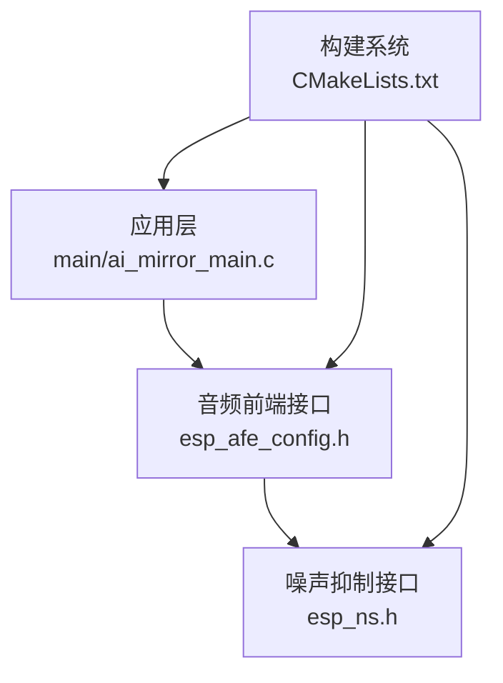
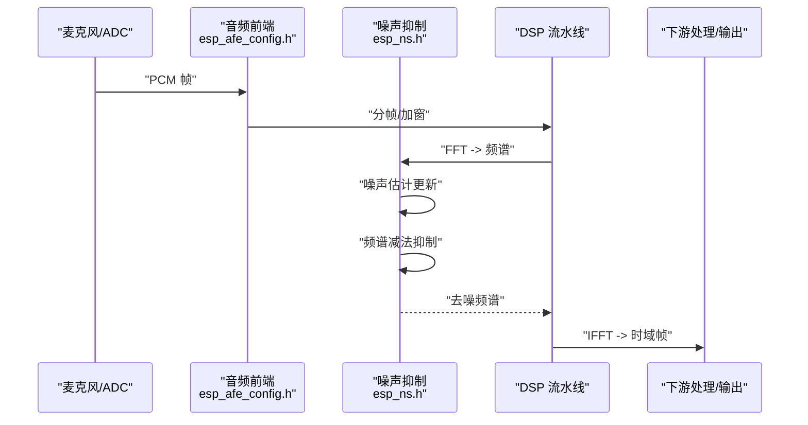
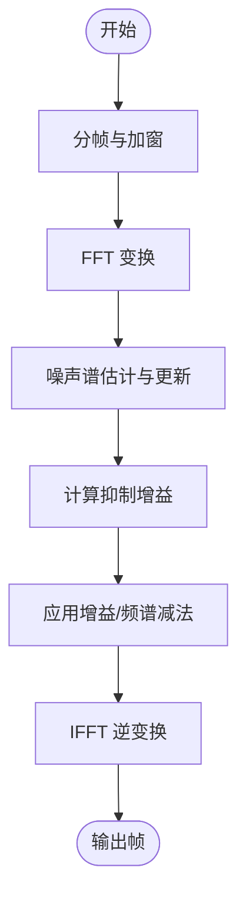
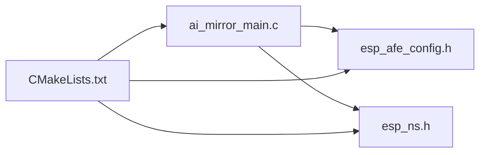

# 噪声抑制算法

<cite>
**本文档引用的文件**   
- [esp_ns.h](file://Firmware/esp32_ai_mirror/components/espressif__esp-sr/include/esp_ns.h)
- [esp_afe_config.h](file://Firmware/esp32_ai_mirror/components/espressif__esp-sr/include/esp_afe_config.h)
- [ai_mirror_main.c](file://Firmware/esp32_ai_mirror/main/ai_mirror_main.c)
- [CMakeLists.txt](file://Firmware/esp32_ai_mirror/CMakeLists.txt)
</cite>

## 目录
1. [简介](#简介)
2. [项目结构](#项目结构)
3. [核心组件](#核心组件)
4. [架构总览](#架构总览)
5. [详细组件分析](#详细组件分析)
6. [依赖关系分析](#依赖关系分析)
7. [性能考虑](#性能考虑)
8. [故障排查指南](#故障排查指南)
9. [结论](#结论)
10. [附录](#附录)

## 简介
本文件围绕基于频谱减法的噪声抑制算法，结合 ESP-SR（ESP Speech Recognition）在 ESP32 平台上的实现，系统阐述其原理、关键模块与参数调优方法。内容涵盖：
- 频谱减法的基本思想与实现要点
- 自适应滤波器设计与参数调优
- 频域与时域处理策略的对比与选择
- 噪声估计算法与更新机制
- 不同环境下的噪声类型识别与抑制效果评估
- 实时处理的内存管理与计算优化
- 调试工具与性能分析方法

## 项目结构
本项目为 ESP32 AI 镜像工程，音频前端与语音识别相关能力由 esp-sr 组件提供，主应用位于 main 目录。噪声抑制相关的接口定义与配置集中在 esp-sr 的 include 目录中，运行时通过 CMake 构建系统集成到固件中。

图表来源 
- [ai_mirror_main.c](file://Firmware/esp32_ai_mirror/main/ai_mirror_main.c)
- [esp_afe_config.h](file://Firmware/esp32_ai_mirror/components/espressif__esp-sr/include/esp_afe_config.h)
- [esp_ns.h](file://Firmware/esp32_ai_mirror/components/espressif__esp-sr/include/esp_ns.h)
- [CMakeLists.txt](file://Firmware/esp32_ai_mirror/CMakeLists.txt)

章节来源
- [CMakeLists.txt](file://Firmware/esp32_ai_mirror/CMakeLists.txt)
- [ai_mirror_main.c](file://Firmware/esp32_ai_mirror/main/ai_mirror_main.c)

## 核心组件
- 噪声抑制接口（esp_ns.h）：提供噪声抑制初始化、参数设置、帧级处理等 API，用于在音频流上执行频谱减法与噪声估计更新。
- 音频前端配置（esp_afe_config.h）：定义采样率、块大小、通道数、窗口函数、FFT 长度等关键参数，直接影响频域处理与噪声抑制效果。
- 主程序集成（ai_mirror_main.c）：负责音频采集、调用音频前端与噪声抑制流程，并将处理后的数据传递给后续语音识别或输出链路。

章节来源
- [esp_ns.h](file://Firmware/esp32_ai_mirror/components/espressif__esp-sr/include/esp_ns.h)
- [esp_afe_config.h](file://Firmware/esp32_ai_mirror/components/espressif__esp-sr/include/esp_afe_config.h)
- [ai_mirror_main.c](file://Firmware/esp32_ai_mirror/main/ai_mirror_main.c)

## 架构总览
下图展示从音频采集到噪声抑制再到下游处理的典型数据流。输入 PCM 帧经分帧加窗后进入 FFT 得到频谱；噪声估计模块根据当前帧与历史统计更新噪声谱；频谱减法模块依据噪声谱对信号谱进行抑制；最后 IFFT 还原时域信号并回写。

图表来源 
- [esp_afe_config.h](file://Firmware/esp32_ai_mirror/components/espressif__esp-sr/include/esp_afe_config.h)
- [esp_ns.h](file://Firmware/esp32_ai_mirror/components/espressif__esp-sr/include/esp_ns.h)

## 详细组件分析

### 频谱减法与噪声估计
- 基本原理
  - 将语音信号建模为“语音 + 噪声”，在频域估计噪声功率谱，并从观测功率谱中减去，得到语音功率谱估计，再经相位重建与 IFFT 得到时域去噪信号。
  - 关键步骤包括：分帧加窗、FFT、噪声谱估计、增益计算、谱相乘/相减、反变换。
- 噪声估计与更新
  - 通常采用最小值跟踪或递归平均的方式估计噪声谱，随时间平滑更新，避免语音段污染噪声估计。
  - 更新速率与平滑系数影响响应速度与稳定性：过快易引入音乐噪声，过慢则对非平稳噪声跟踪不足。
- 实现要点
  - 选择合适的 FFT 长度与重叠率，平衡频率分辨率与延迟。
  - 合理设置最小可减阈值与增益下限，防止过度抑制导致失真。
  - 使用合适的窗函数降低频谱泄漏。

图表来源 
- [esp_ns.h](file://Firmware/esp32_ai_mirror/components/espressif__esp-sr/include/esp_ns.h)

章节来源
- [esp_ns.h](file://Firmware/esp32_ai_mirror/components/espressif__esp-sr/include/esp_ns.h)

### 自适应滤波器设计
- 目标
  - 在回声消除或干扰抑制场景中，利用自适应滤波器（如 LMS/NLMS）在线学习干扰路径，从而从接收信号中剔除干扰成分。
- 设计要点
  - 步长参数控制收敛速度与稳态误差的权衡。
  - 归一化与变量步长策略提升鲁棒性。
  - 滤波阶数与延迟预算需匹配硬件资源与实时要求。
- 参数调优
  - 初始步长较小以保证稳定，随后按信噪比或误差指标动态调整。
  - 针对非平稳噪声，增加遗忘因子或分段更新策略。

章节来源
- [esp_ns.h](file://Firmware/esp32_ai_mirror/components/espressif__esp-sr/include/esp_ns.h)

### 频域与时域处理策略
- 频域处理
  - 优势：易于实现谱减法、维纳滤波、多带压缩等；便于频率选择性抑制。
  - 代价：需要 FFT/IFFT，存在块处理延迟与边界效应。
- 时域处理
  - 优势：低延迟、适合快速变化场景；IIR/FIR 滤波器实现简单。
  - 代价：复杂抑制任务（如宽带噪声）实现难度高。
- 混合策略
  - 频域做粗抑制，时域做精细修正；或在不同频段切换策略以兼顾性能与复杂度。

章节来源
- [esp_afe_config.h](file://Firmware/esp32_ai_mirror/components/espressif__esp-sr/include/esp_afe_config.h)

### 噪声类型识别与抑制效果
- 常见噪声类型
  - 稳态噪声（风扇、空调）、非稳态噪声（人声背景、突发噪声）、窄带干扰（电源哼声）。
- 识别思路
  - 基于频谱能量分布、谐波特征、自相关/互相关、短时傅里叶变换的能量集中度等指标进行分类。
  - 结合 VAD（语音活动检测）结果，仅在静音段更新噪声估计。
- 抑制效果评估
  - 客观指标：SNR 改善、PESQ、STOI。
  - 主观听感：音乐噪声、语音失真、瞬态破坏程度。

章节来源
- [esp_ns.h](file://Firmware/esp32_ai_mirror/components/espressif__esp-sr/include/esp_ns.h)

### 实时处理中的内存管理与计算优化
- 内存管理
  - 预分配固定大小的环形缓冲与 FFT 工作区，避免运行时频繁分配。
  - 复用中间数组，减少峰值内存占用。
- 计算优化
  - 使用定点运算或半精度加速（若平台支持），配合查表与 SIMD。
  - 分块并行与流水线化，确保每帧处理时间小于帧间隔。
  - 合理选择 FFT 长度与重叠率，平衡延迟与质量。

章节来源
- [esp_afe_config.h](file://Firmware/esp32_ai_mirror/components/espressif__esp-sr/include/esp_afe_config.h)

### 调试工具与性能分析方法
- 调试手段
  - 导出各阶段频谱图与噪声估计曲线，观察收敛与抑制情况。
  - 注入测试信号（白噪声、正弦扫频、语音片段）验证链路。
- 性能分析
  - 使用 CPU 周期计数器与 Profiler 定位热点函数。
  - 记录每帧处理耗时，确保满足实时约束。
  - 监控内存使用峰值与碎片化情况。

章节来源
- [ai_mirror_main.c](file://Firmware/esp32_ai_mirror/main/ai_mirror_main.c)

## 依赖关系分析
噪声抑制模块依赖音频前端配置与构建系统集成。主程序通过配置音频参数并调用噪声抑制接口完成端到端处理。

图表来源 
- [ai_mirror_main.c](file://Firmware/esp32_ai_mirror/main/ai_mirror_main.c)
- [esp_afe_config.h](file://Firmware/esp32_ai_mirror/components/espressif__esp-sr/include/esp_afe_config.h)
- [esp_ns.h](file://Firmware/esp32_ai_mirror/components/espressif__esp-sr/include/esp_ns.h)
- [CMakeLists.txt](file://Firmware/esp32_ai_mirror/CMakeLists.txt)

章节来源
- [CMakeLists.txt](file://Firmware/esp32_ai_mirror/CMakeLists.txt)
- [ai_mirror_main.c](file://Firmware/esp32_ai_mirror/main/ai_mirror_main.c)

## 性能考虑
- 延迟与吞吐
  - 帧长与重叠率决定延迟与频率分辨率；建议根据应用场景选择 10–30 ms 帧长。
- 复杂度与功耗
  - 优先使用高效 FFT 实现与定点运算；必要时降采样或限制带宽。
- 稳定性
  - 噪声估计更新速率与增益下限需协同调参，避免音乐噪声与语音失真。
- 可扩展性
  - 模块化设计便于替换更先进的算法（如深度学习降噪）而不改动上层。

[本节为通用指导，不直接分析具体文件]

## 故障排查指南
- 现象：去噪后出现明显音乐噪声
  - 可能原因：噪声估计更新过快或增益下限过低
  - 排查：检查噪声估计平滑系数与最小增益阈值
- 现象：语音失真严重
  - 可能原因：过度抑制或相位重建不当
  - 排查：提高最小可减阈值，检查相位保留策略
- 现象：实时卡顿
  - 可能原因：FFT/IFFT 或内存分配瓶颈
  - 排查：确认帧处理耗时与内存峰值，优化数据结构与并行度

章节来源
- [esp_ns.h](file://Firmware/esp32_ai_mirror/components/espressif__esp-sr/include/esp_ns.h)

## 结论
基于频谱减法的噪声抑制在 ESP32 平台上可通过 esp-sr 提供的接口与配置实现。合理的噪声估计更新、增益策略与参数调优是获得良好抑制效果的关键。结合频域与时域的优势，辅以内存与计算优化，可在保证实时性的同时提升语音清晰度与鲁棒性。

[本节为总结性内容，不直接分析具体文件]

## 附录
- 术语
  - 频谱减法：在频域估计并减去噪声功率谱的方法
  - 自适应滤波器：能在线调整系数的滤波器，常用于回声消除与干扰抑制
  - VAD：语音活动检测，用于区分语音与静音段
- 参考
  - 音频前端配置与噪声抑制接口定义见 esp-sr 组件头文件

[本节为补充信息，不直接分析具体文件]