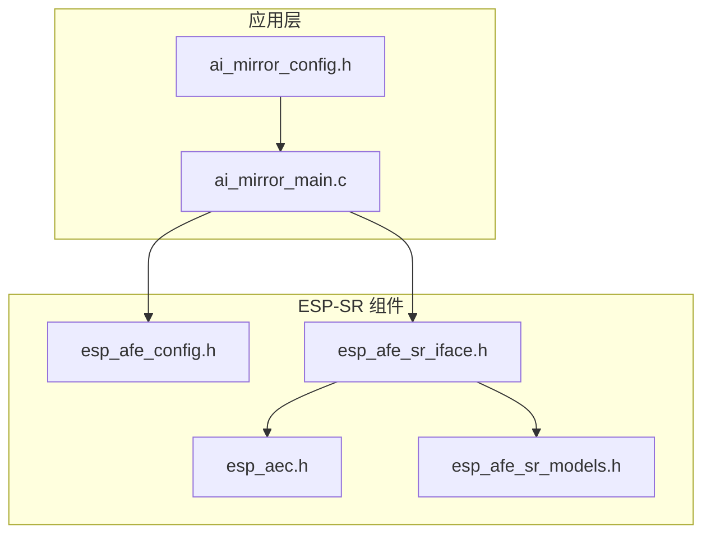
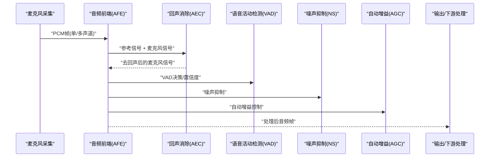
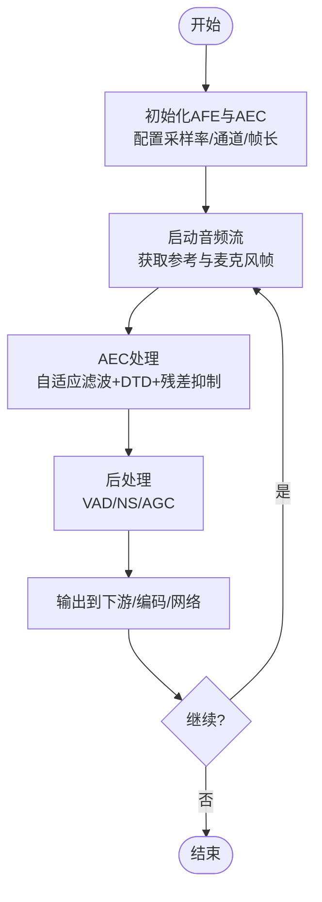
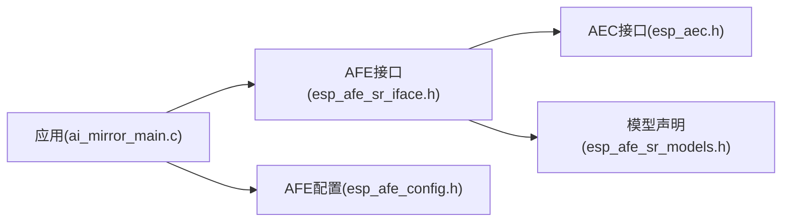

# 回声消除(AEC)

<cite>
**本文引用的文件**   
- [esp_aec.h](file://Firmware/esp32_ai_mirror/components/espressif__esp-sr/include/esp32/esp_aec.h)
- [esp_afe_config.h](file://Firmware/esp32_ai_mirror/components/espressif__esp-sr/include/esp32/esp_afe_config.h)
- [esp_afe_sr_iface.h](file://Firmware/esp32_ai_mirror/components/espressif__esp-sr/include/esp32/esp_afe_sr_iface.h)
- [esp_afe_sr_models.h](file://Firmware/esp32_ai_mirror/components/espressif__esp-sr/include/esp32/esp_afe_sr_models.h)
- [ai_mirror_main.c](file://Firmware/esp32_ai_mirror/main/ai_mirror_main.c)
- [ai_mirror_config.h](file://Firmware/esp32_ai_mirror/main/ai_mirror_config.h)
</cite>

## 目录
1. [简介](#简介)
2. [项目结构](#项目结构)
3. [核心组件](#核心组件)
4. [架构总览](#架构总览)
5. [详细组件分析](#详细组件分析)
6. [依赖关系分析](#依赖关系分析)
7. [性能考量](#性能考量)
8. [故障排查指南](#故障排查指南)
9. [结论](#结论)
10. [附录](#附录)

## 简介
本文件面向在ESP32 AI镜像项目中实现与调优回声消除（AEC）的工程师，系统阐述自适应滤波在AEC中的应用原理、双端检测（DTD）算法的实现要点与参数配置、滤波器长度选择与收敛速度优化、非线性失真处理与残余回声抑制、与音频前端的同步机制与延迟补偿，以及实时处理中的内存分配与计算优化策略。同时给出回声路径变化跟踪与自适应更新机制的工程化建议，帮助读者在资源受限的嵌入式平台上稳定落地高质量AEC。

## 项目结构
本项目中AEC相关能力由ESP-SR组件提供，并通过应用层进行集成与配置。关键位置如下：
- AEC接口与类型定义位于 esp32 平台的 include 目录
- 音频前端（AFE）统一接口与模型声明位于 esp32 平台的 include 目录
- 应用入口与配置位于 main 目录

图表来源 
- [ai_mirror_main.c:1-200](file://Firmware/esp32_ai_mirror/main/ai_mirror_main.c#L1-L200)
- [ai_mirror_config.h:1-200](file://Firmware/esp32_ai_mirror/main/ai_mirror_config.h#L1-L200)
- [esp_aec.h:1-200](file://Firmware/esp32_ai_mirror/components/espressif__esp-sr/include/esp32/esp_aec.h#L1-L200)
- [esp_afe_config.h:1-200](file://Firmware/esp32_ai_mirror/components/espressif__esp-sr/include/esp32/esp_afe_config.h#L1-L200)
- [esp_afe_sr_iface.h:1-200](file://Firmware/esp32_ai_mirror/components/espressif__esp-sr/include/esp32/esp_afe_sr_iface.h#L1-L200)
- [esp_afe_sr_models.h:1-200](file://Firmware/esp32_ai_mirror/components/espressif__esp-sr/include/esp32/esp_afe_sr_models.h#L1-L200)

章节来源
- [ai_mirror_main.c:1-200](file://Firmware/esp32_ai_mirror/main/ai_mirror_main.c#L1-L200)
- [ai_mirror_config.h:1-200](file://Firmware/esp32_ai_mirror/main/ai_mirror_config.h#L1-L200)
- [esp_aec.h:1-200](file://Firmware/esp32_ai_mirror/components/espressif__esp-sr/include/esp32/esp_aec.h#L1-L200)
- [esp_afe_config.h:1-200](file://Firmware/esp32_ai_mirror/components/espressif__esp-sr/include/esp32/esp_afe_config.h#L1-L200)
- [esp_afe_sr_iface.h:1-200](file://Firmware/esp32_ai_mirror/components/espressif__esp-sr/include/esp32/esp_afe_sr_iface.h#L1-L200)
- [esp_afe_sr_models.h:1-200](file://Firmware/esp32_ai_mirror/components/espressif__esp-sr/include/esp32/esp_afe_sr_models.h#L1-L200)

## 核心组件
- AEC接口与状态管理：通过 esp_aec.h 暴露AEC句柄创建、初始化、帧处理、参数设置与销毁等API，用于驱动自适应滤波器完成回声估计与相减。
- 音频前端（AFE）统一接口：esp_afe_sr_iface.h 定义了统一的音频前端调用方式，AEC作为AFE管线中的一个模块被编排调用。
- AFE配置与模型：esp_afe_config.h 提供采样率、通道数、缓冲区大小、VAD/NS/AGC/AEC等模块的配置项；esp_afe_sr_models.h 声明可用的前端模型与实例化方法。
- 应用集成：ai_mirror_main.c 负责初始化AFE与AEC、配置参数、启动数据流并调度处理循环；ai_mirror_config.h 集中管理平台与功能开关。

章节来源
- [esp_aec.h:1-200](file://Firmware/esp32_ai_mirror/components/espressif__esp-sr/include/esp32/esp_aec.h#L1-L200)
- [esp_afe_sr_iface.h:1-200](file://Firmware/esp32_ai_mirror/components/espressif__esp-sr/include/esp32/esp_afe_sr_iface.h#L1-L200)
- [esp_afe_config.h:1-200](file://Firmware/esp32_ai_mirror/components/espressif__esp-sr/include/esp32/esp_afe_config.h#L1-L200)
- [esp_afe_sr_models.h:1-200](file://Firmware/esp32_ai_mirror/components/espressif__esp-sr/include/esp32/esp_afe_sr_models.h#L1-L200)
- [ai_mirror_main.c:1-200](file://Firmware/esp32_ai_mirror/main/ai_mirror_main.c#L1-L200)
- [ai_mirror_config.h:1-200](file://Firmware/esp32_ai_mirror/main/ai_mirror_config.h#L1-L200)

## 架构总览
下图展示AEC在音频前端管线中的位置与数据流向，包括参考信号（扬声器播放）与麦克风输入信号的同步、AEC处理、以及后续VAD/NS/AGC等模块的协作。

图表来源 
- [esp_afe_sr_iface.h:1-200](file://Firmware/esp32_ai_mirror/components/espressif__esp-sr/include/esp32/esp_afe_sr_iface.h#L1-L200)
- [esp_aec.h:1-200](file://Firmware/esp32_ai_mirror/components/espressif__esp-sr/include/esp32/esp_aec.h#L1-L200)

章节来源
- [esp_afe_sr_iface.h:1-200](file://Firmware/esp32_ai_mirror/components/espressif__esp-sr/include/esp32/esp_afe_sr_iface.h#L1-L200)
- [esp_aec.h:1-200](file://Firmware/esp32_ai_mirror/components/espressif__esp-sr/include/esp32/esp_aec.h#L1-L200)

## 详细组件分析

### 自适应滤波与AEC原理
- 基本思想：利用参考信号（扬声器回放）通过自适应滤波器估计回声路径，从麦克风信号中减去估计的回声，得到仅含近端语音与噪声的信号。
- 常用算法：NLMS/RLS及其变体，结合步长控制、归一化、泄漏项等提升稳定性与收敛性。
- 工程要点：
  - 滤波器长度需覆盖声学环境最大时延与混响尾长。
  - 步长需在“收敛快”和“稳态误差小”之间折衷。
  - 需要双端检测（DTD）避免远端静音时的误更新。

章节来源
- [esp_aec.h:1-200](file://Firmware/esp32_ai_mirror/components/espressif__esp-sr/include/esp32/esp_aec.h#L1-L200)

### 双端检测（DTD）算法与参数
- 作用：区分远端/近端/双端说话场景，决定何时更新滤波器、如何调整步长与阈值，防止发散或过度抑制。
- 典型参数：
  - 远端能量阈值、近端能量阈值
  - 平滑因子（时间常数）
  - 更新门限与回退策略
  - 非线性失真检测阈值
- 行为模式：
  - 仅远端：快速收敛，适度步长
  - 仅近端：冻结或慢速更新，避免破坏已学回声
  - 双端：保守更新，降低步长，增强鲁棒性

章节来源
- [esp_aec.h:1-200](file://Firmware/esp32_ai_mirror/components/espressif__esp-sr/include/esp32/esp_aec.h#L1-L200)

### 滤波器长度与收敛速度优化
- 滤波器长度选择：
  - 依据房间尺寸、扬声器-麦克风距离、混响时间估算最大时延与尾长。
  - 过短导致残余回声大，过长增加计算与内存开销。
- 收敛速度优化：
  - 初始阶段使用较大步长加速收敛，随后逐步减小。
  - 引入泄漏项与正则化防止数值不稳定。
  - 频域/分带处理可降低复杂度并提高对非平稳信号的适应性。

章节来源
- [esp_aec.h:1-200](file://Firmware/esp32_ai_mirror/components/espressif__esp-sr/include/esp32/esp_aec.h#L1-L200)

### 非线性失真处理与残余回声抑制
- 非线性失真来源：功放饱和、扬声器非线性、ADC/DAC量化非线性等。
- 处理方法：
  - 非线性检测：基于参考信号与估计回声的相关性、功率比等指标。
  - 残差抑制：在AEC后级联窄带/宽带抑制器，或使用谱减法/维纳滤波。
  - 动态范围控制：限制强信号段更新幅度，避免发散。

章节来源
- [esp_aec.h:1-200](file://Firmware/esp32_ai_mirror/components/espressif__esp-sr/include/esp32/esp_aec.h#L1-L200)

### 与音频前端的同步机制与延迟补偿
- 同步要求：参考信号与麦克风信号必须严格对齐，否则产生相位误差与残余回声。
- 延迟补偿：
  - 硬件链路延迟（编解码、缓冲、DMA）需测量并补偿。
  - 软件流水线延迟（帧大小、块处理）需纳入整体时延预算。
- 实现建议：
  - 使用固定帧长与确定性调度，保证抖动可控。
  - 在线估计剩余时延并微调对齐（如插值/重采样）。

章节来源
- [esp_afe_sr_iface.h:1-200](file://Firmware/esp32_ai_mirror/components/espressif__esp-sr/include/esp32/esp_afe_sr_iface.h#L1-L200)
- [esp_afe_config.h:1-200](file://Firmware/esp32_ai_mirror/components/espressif__esp-sr/include/esp32/esp_afe_config.h#L1-L200)

### 实时处理中的内存分配与计算优化
- 内存策略：
  - 预分配环形缓冲与滤波器状态，避免运行时频繁分配。
  - 复用帧缓冲，减少拷贝与碎片。
- 计算优化：
  - 使用定点/半精度运算与SIMD指令（若可用）。
  - 分块卷积/频域滤波降低O(N^2)复杂度。
  - 条件更新：仅在有效更新窗口内更新系数。

章节来源
- [esp_afe_config.h:1-200](file://Firmware/esp32_ai_mirror/components/espressif__esp-sr/include/esp32/esp_afe_config.h#L1-L200)

### 回声路径变化跟踪与自适应更新机制
- 路径变化场景：设备移动、遮挡、温度漂移、功放工作点变化。
- 跟踪策略：
  - 增量式更新：小步长持续微调。
  - 事件触发：检测到显著失配时增大步长或重启学习。
  - 遗忘因子：指数加权以快速适应新路径。
- 监控指标：
  - 回声衰减量、残差功率、DTD置信度、步长历史。

章节来源
- [esp_aec.h:1-200](file://Firmware/esp32_ai_mirror/components/espressif__esp-sr/include/esp32/esp_aec.h#L1-L200)

### AEC在AFE管线中的调用流程

图表来源 
- [esp_afe_sr_iface.h:1-200](file://Firmware/esp32_ai_mirror/components/espressif__esp-sr/include/esp32/esp_afe_sr_iface.h#L1-L200)
- [esp_aec.h:1-200](file://Firmware/esp32_ai_mirror/components/espressif__esp-sr/include/esp32/esp_aec.h#L1-L200)

章节来源
- [esp_afe_sr_iface.h:1-200](file://Firmware/esp32_ai_mirror/components/espressif__esp-sr/include/esp32/esp_afe_sr_iface.h#L1-L200)
- [esp_aec.h:1-200](file://Firmware/esp32_ai_mirror/components/espressif__esp-sr/include/esp32/esp_aec.h#L1-L200)

## 依赖关系分析
- 应用层依赖AFE接口与配置，AFE内部编排AEC与其他模块。
- AEC依赖底层DSP库（如复数运算、FFT/FIR/IIR等），但对外暴露简洁API。
- 配置项集中在头文件中，便于编译期与运行期切换。

图表来源 
- [ai_mirror_main.c:1-200](file://Firmware/esp32_ai_mirror/main/ai_mirror_main.c#L1-L200)
- [esp_afe_sr_iface.h:1-200](file://Firmware/esp32_ai_mirror/components/espressif__esp-sr/include/esp32/esp_afe_sr_iface.h#L1-L200)
- [esp_afe_config.h:1-200](file://Firmware/esp32_ai_mirror/components/espressif__esp-sr/include/esp32/esp_afe_config.h#L1-L200)
- [esp_aec.h:1-200](file://Firmware/esp32_ai_mirror/components/espressif__esp-sr/include/esp32/esp_aec.h#L1-L200)
- [esp_afe_sr_models.h:1-200](file://Firmware/esp32_ai_mirror/components/espressif__esp-sr/include/esp32/esp_afe_sr_models.h#L1-L200)

章节来源
- [ai_mirror_main.c:1-200](file://Firmware/esp32_ai_mirror/main/ai_mirror_main.c#L1-L200)
- [esp_afe_sr_iface.h:1-200](file://Firmware/esp32_ai_mirror/components/espressif__esp-sr/include/esp32/esp_afe_sr_iface.h#L1-L200)
- [esp_afe_config.h:1-200](file://Firmware/esp32_ai_mirror/components/espressif__esp-sr/include/esp32/esp_afe_config.h#L1-L200)
- [esp_aec.h:1-200](file://Firmware/esp32_ai_mirror/components/espressif__esp-sr/include/esp32/esp_aec.h#L1-L200)
- [esp_afe_sr_models.h:1-200](file://Firmware/esp32_ai_mirror/components/espressif__esp-sr/include/esp32/esp_afe_sr_models.h#L1-L200)

## 性能考量
- 计算复杂度：滤波器长度N越大，复杂度越高；采用分块/频域方法可显著降低。
- 内存占用：状态向量、历史缓冲、临时数组需合理规划，避免峰值内存过高。
- 实时性：确保每帧处理时间小于帧周期，必要时降低采样率或帧长。
- 功耗：在满足质量前提下关闭不必要的模块（如高复杂度NS/AGC）。

[本节为通用指导，不直接分析具体文件]

## 故障排查指南
- 现象：残余回声明显
  - 检查参考信号与麦克风信号是否对齐，确认延迟补偿是否正确。
  - 验证滤波器长度是否足够覆盖混响尾长。
  - 检查DTD阈值是否过严导致更新不足。
- 现象：语音被过度抑制
  - 降低AEC步长或启用更保守的DTD策略。
  - 检查非线性失真检测阈值是否过低。
- 现象：系统卡顿或丢帧
  - 评估每帧处理耗时，优化算法或降低复杂度。
  - 检查内存分配是否频繁，改为预分配与复用。
- 现象：路径变化后性能下降
  - 增大遗忘因子或触发重新学习。
  - 监控回声衰减与残差功率，动态调整参数。

章节来源
- [esp_aec.h:1-200](file://Firmware/esp32_ai_mirror/components/espressif__esp-sr/include/esp32/esp_aec.h#L1-L200)
- [esp_afe_config.h:1-200](file://Firmware/esp32_ai_mirror/components/espressif__esp-sr/include/esp32/esp_afe_config.h#L1-L200)

## 结论
在ESP32 AI镜像项目中，AEC通过AFE统一接口与AEC模块协同工作，借助自适应滤波与DTD实现稳健的回声消除。工程上需重点关注滤波器长度与步长选择、非线性失真与残差抑制、严格的同步与延迟补偿、以及内存与计算的实时性优化。通过合理的参数配置与监控反馈，可在资源受限设备上获得高质量的通话体验。

[本节为总结性内容，不直接分析具体文件]

## 附录
- 推荐调试流程：
  - 离线录制参考与麦克风信号，离线评估AEC效果。
  - 在线采集统计指标（回声衰减、DTD置信度、步长历史）。
  - 逐步放宽/收紧DTD阈值，观察语音保真与残余回声平衡。
- 常见配置项（示例类别，具体字段见头文件）：
  - 采样率、通道数、帧长
  - 滤波器长度、步长、泄漏项
  - DTD阈值、平滑因子、更新门限
  - 非线性失真阈值、残差抑制强度

[本节为补充信息，不直接分析具体文件]