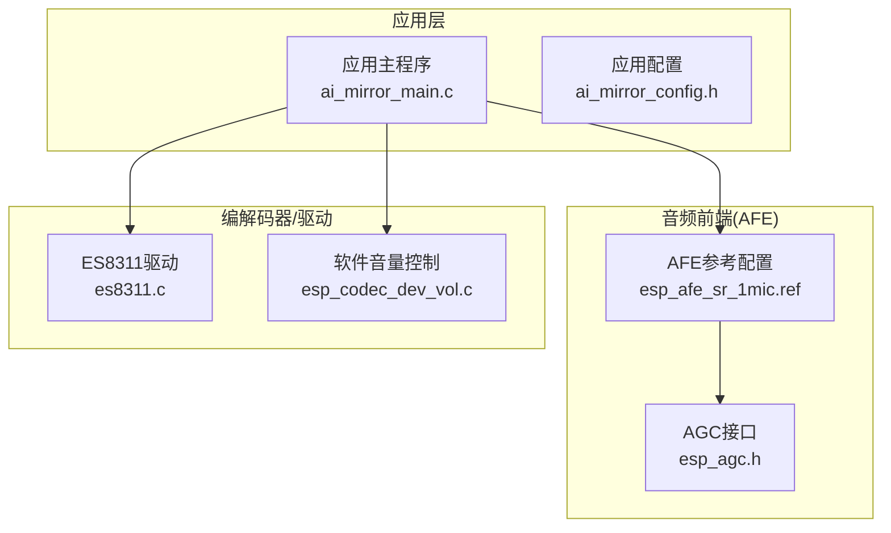
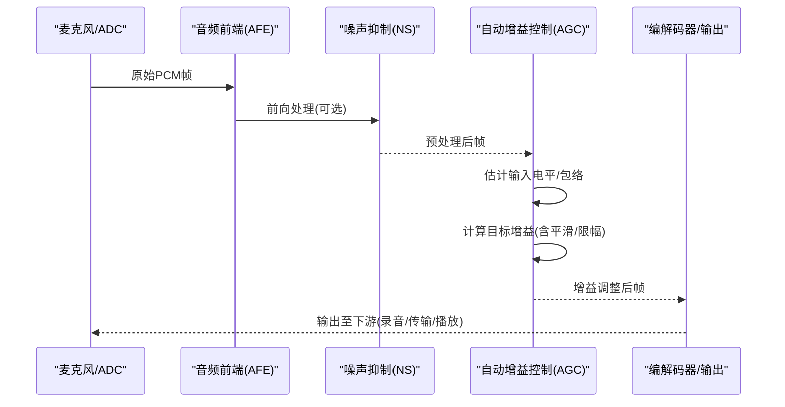
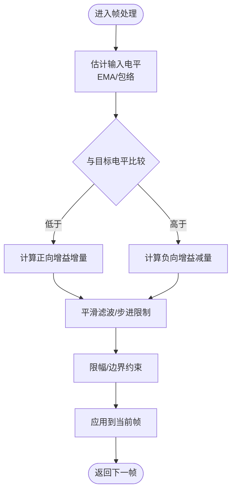
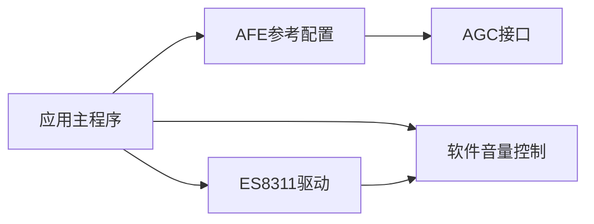

# 自动增益控制(AGC)

<cite>
**本文引用的文件**   
- [esp_agc.h](file://Firmware/esp32_ai_mirror/components/espressif__esp-sr/include/esp_agc.h)
- [esp_afe_sr_1mic.ref](file://Firmware/esp32_ai_mirror/components/espressif__esp-sr/src/esp_afe_sr_1mic.ref)
- [ai_mirror_main.c](file://Firmware/esp32_ai_mirror/main/ai_mirror_main.c)
- [ai_mirror_config.h](file://Firmware/esp32_ai_mirror/main/ai_mirror_config.h)
- [es8311.c](file://Firmware/esp32_ai_mirror/managed_components/espressif__es8311/es8311.c)
- [esp_codec_dev_vol.c](file://Firmware/esp32_ai_mirror/managed_components/espressif__esp_codec_dev/esp_codec_dev_vol.c)
</cite>

## 目录
1. [简介](#简介)
2. [项目结构](#项目结构)
3. [核心组件](#核心组件)
4. [架构总览](#架构总览)
5. [详细组件分析](#详细组件分析)
6. [依赖关系分析](#依赖关系分析)
7. [性能考量](#性能考量)
8. [故障排查指南](#故障排查指南)
9. [结论](#结论)
10. [附录](#附录)

## 简介
本文件围绕自动增益控制（Automatic Gain Control, AGC）在ESP32语音前端链路中的实现与使用进行系统化说明。内容涵盖：
- 动态范围压缩的数学模型与实现要点
- 响应时间与平滑处理机制
- 输入信号电平检测与阈值设置策略
- 不同语音场景下的增益调整策略
- 与噪声抑制模块的协同工作机制
- 实时处理稳定性分析与参数优化建议
- 测试方法与性能评估标准

## 项目结构
本项目基于ESP-IDF构建，音频采集与处理位于“components/espressif__esp-sr”中，AGC接口定义于头文件中；主程序通过任务或回调调用音频前端（AFE），并在必要时联动硬件音量控制。关键路径如下：
- AGC接口与配置：include/esp_agc.h
- AFE参考配置与管线：src/esp_afe_sr_1mic.ref
- 应用入口与任务编排：main/ai_mirror_main.c
- 设备音量控制：managed_components/espressif__es8311/es8311.c、esp_codec_dev_vol.c

图表来源 
- [ai_mirror_main.c](file://Firmware/esp32_ai_mirror/main/ai_mirror_main.c)
- [ai_mirror_config.h](file://Firmware/esp32_ai_mirror/main/ai_mirror_config.h)
- [esp_afe_sr_1mic.ref](file://Firmware/esp32_ai_mirror/components/espressif__esp-sr/src/esp_afe_sr_1mic.ref)
- [esp_agc.h](file://Firmware/esp32_ai_mirror/components/espressif__esp-sr/include/esp_agc.h)
- [es8311.c](file://Firmware/esp32_ai_mirror/managed_components/espressif__es8311/es8311.c)
- [esp_codec_dev_vol.c](file://Firmware/esp32_ai_mirror/managed_components/espressif__esp_codec_dev/esp_codec_dev_vol.c)

章节来源
- [ai_mirror_main.c](file://Firmware/esp32_ai_mirror/main/ai_mirror_main.c)
- [ai_mirror_config.h](file://Firmware/esp32_ai_mirror/main/ai_mirror_config.h)
- [esp_afe_sr_1mic.ref](file://Firmware/esp32_ai_mirror/components/espressif__esp-sr/src/esp_afe_sr_1mic.ref)
- [esp_agc.h](file://Firmware/esp32_ai_mirror/components/espressif__esp-sr/include/esp_agc.h)

## 核心组件
- AGC接口与状态机：提供初始化、参数配置、帧级处理与查询接口，用于按块计算目标增益并应用到音频流。
- AFE参考配置：定义麦克风通道、降噪、回声消除、AGC等模块的启用顺序与参数模板。
- 应用主程序：负责创建音频采集任务、启动AFE、周期性地读取/写入音频帧，并在需要时联动硬件音量。
- 编解码器与音量控制：ES8311作为音频编解码芯片，配合软件音量控制API实现硬件/软件两级增益调节。

章节来源
- [esp_agc.h](file://Firmware/esp32_ai_mirror/components/espressif__esp-sr/include/esp_agc.h)
- [esp_afe_sr_1mic.ref](file://Firmware/esp32_ai_mirror/components/espressif__esp-sr/src/esp_afe_sr_1mic.ref)
- [ai_mirror_main.c](file://Firmware/esp32_ai_mirror/main/ai_mirror_main.c)
- [es8311.c](file://Firmware/esp32_ai_mirror/managed_components/espressif__es8311/es8311.c)
- [esp_codec_dev_vol.c](file://Firmware/esp32_ai_mirror/managed_components/espressif__esp_codec_dev/esp_codec_dev_vol.c)

## 架构总览
下图展示从麦克风到输出的典型数据流，以及AGC在其中的位置与作用点。

图表来源 
- [esp_afe_sr_1mic.ref](file://Firmware/esp32_ai_mirror/components/espressif__esp-sr/src/esp_afe_sr_1mic.ref)
- [esp_agc.h](file://Firmware/esp32_ai_mirror/components/espressif__esp-sr/include/esp_agc.h)

## 详细组件分析

### 数学模型与算法流程
- 输入电平估计
  - 对每帧计算短时能量或包络，通常采用指数滑动平均（EMA）以跟踪慢变趋势。
  - 可结合峰值保持与回落时间常数，区分瞬态与稳态。
- 目标增益计算
  - 将估计电平与目标参考电平比较，得到误差并映射为dB增益。
  - 引入软限幅与斜率控制，避免过冲与快速波动。
- 平滑与约束
  - 对增益变化施加一阶低通滤波，限制最大步进，保证听感稳定。
  - 设置最小/最大增益边界，防止溢出或底噪放大过度。
- 输出缩放
  - 将线性增益转换为采样点乘积，必要时进行饱和保护与量化处理。

图表来源 
- [esp_agc.h](file://Firmware/esp32_ai_mirror/components/espressif__esp-sr/include/esp_agc.h)

章节来源
- [esp_agc.h](file://Firmware/esp32_ai_mirror/components/espressif__esp-sr/include/esp_agc.h)

### 响应时间与平滑处理机制
- 响应时间
  - 上升时间由“增益增加速率”和“平滑系数”共同决定，适合应对突发小声。
  - 下降时间由“衰减时间常数”控制，避免大声突然消失造成听觉不适。
- 平滑处理
  - 常用一阶IIR低通对增益轨迹进行平滑，减少抖动。
  - 可加入死区带（Deadband）抑制微小波动，提升稳定性。
- 切换策略
  - 静音/非静音门限用于抑制长时间静默时的增益漂移。
  - 过渡模式（如“快速捕获-慢速跟踪”）兼顾启动速度与稳态精度。

章节来源
- [esp_agc.h](file://Firmware/esp32_ai_mirror/components/espressif__esp-sr/include/esp_agc.h)

### 输入信号电平检测与阈值设置策略
- 电平检测
  - 短窗能量/均方根值作为基础指标，结合峰值因子判断瞬态。
  - 可选频域加权（如强调语音频段）提高鲁棒性。
- 阈值策略
  - 目标参考电平根据应用场景设定（会议、远场、近场）。
  - 自适应阈值：根据历史统计（均值、方差）动态调整，适应环境噪声变化。
- 静音判定
  - 能量+零交叉率/谱熵等多特征融合，降低误判。
  - 静音期间冻结增益更新，避免底噪放大。

章节来源
- [esp_agc.h](file://Firmware/esp32_ai_mirror/components/espressif__esp-sr/include/esp_agc.h)

### 不同语音场景下的增益调整策略
- 安静室内（会议/通话）
  - 中等目标电平，较快上升时间，较慢下降时间，增强小语音量。
- 嘈杂环境（街道/工厂）
  - 较低目标电平，强限幅与更保守的增益步进，优先抑制噪声放大。
- 远场拾音
  - 更高的目标电平与更强的平滑，容忍更大动态范围。
- 近场拾音
  - 适度目标电平，更快的响应，避免削波。

章节来源
- [esp_agc.h](file://Firmware/esp32_ai_mirror/components/espressif__esp-sr/include/esp_agc.h)

### 与噪声抑制模块的协调工作机制
- 处理顺序
  - 常见顺序：AEC → NS → AGC → 输出。AGC放在NS之后，避免对噪声频谱的过度放大。
- 反馈与耦合
  - NS可能改变信号能量分布，AGC需重新校准目标电平与检测窗口。
  - 若NS存在增益补偿，需在AGC中考虑其影响，避免双重放大。
- 联合优化
  - 根据NS置信度（如VAD/NS强度）动态调整AGC步进与目标电平。

章节来源
- [esp_afe_sr_1mic.ref](file://Firmware/esp32_ai_mirror/components/espressif__esp-sr/src/esp_afe_sr_1mic.ref)
- [esp_agc.h](file://Firmware/esp32_ai_mirror/components/espressif__esp-sr/include/esp_agc.h)

### 实时处理中的稳定性分析与参数优化
- 稳定性要点
  - 确保增益更新频率与帧长匹配，避免积分发散。
  - 限制最大增益步进与上限，防止振荡与削波。
  - 使用双时间常数（快/慢）平衡瞬态与稳态。
- 参数优化建议
  - 目标电平：依据场景与硬件增益能力标定。
  - 平滑系数：上升/下降分别调优，观察听感与失真。
  - 死区带：抑制小幅波动，提升鲁棒性。
  - 限幅阈值：与ADC满量程对齐，避免溢出。
- 监控与诊断
  - 记录瞬时增益、估计电平、目标电平曲线，便于离线分析。
  - 在线告警：检测到持续高增益或频繁跳变时提示参数不匹配。

章节来源
- [esp_agc.h](file://Firmware/esp32_ai_mirror/components/espressif__esp-sr/include/esp_agc.h)

### 与硬件音量控制的联动
- 软件增益（AGC）与硬件增益（ES8311）分工
  - AGC负责细粒度、快速响应的动态控制。
  - 硬件音量用于粗调与整体电平偏移，减少AGC工作范围。
- 联动策略
  - 当AGC接近上限/下限时，触发硬件音量微调，扩大动态范围。
  - 避免两者同时大幅变化，防止听感突变。

章节来源
- [es8311.c](file://Firmware/esp32_ai_mirror/managed_components/espressif__es8311/es8311.c)
- [esp_codec_dev_vol.c](file://Firmware/esp32_ai_mirror/managed_components/espressif__esp_codec_dev/esp_codec_dev_vol.c)

## 依赖关系分析
- 模块耦合
  - AFE参考配置依赖AGC接口；应用主程序依赖AFE与编解码器。
  - 音量控制与AGC松耦合，通过应用层协调。
- 外部依赖
  - ESP-SR库提供AGC与AFE能力。
  - ES8311驱动提供硬件寄存器访问与音量控制。

图表来源 
- [ai_mirror_main.c](file://Firmware/esp32_ai_mirror/main/ai_mirror_main.c)
- [esp_afe_sr_1mic.ref](file://Firmware/esp32_ai_mirror/components/espressif__esp-sr/src/esp_afe_sr_1mic.ref)
- [esp_agc.h](file://Firmware/esp32_ai_mirror/components/espressif__esp-sr/include/esp_agc.h)
- [es8311.c](file://Firmware/esp32_ai_mirror/managed_components/espressif__es8311/es8311.c)
- [esp_codec_dev_vol.c](file://Firmware/esp32_ai_mirror/managed_components/espressif__esp_codec_dev/esp_codec_dev_vol.c)

章节来源
- [ai_mirror_main.c](file://Firmware/esp32_ai_mirror/main/ai_mirror_main.c)
- [esp_afe_sr_1mic.ref](file://Firmware/esp32_ai_mirror/components/espressif__esp-sr/src/esp_afe_sr_1mic.ref)
- [esp_agc.h](file://Firmware/esp32_ai_mirror/components/espressif__esp-sr/include/esp_agc.h)
- [es8311.c](file://Firmware/esp32_ai_mirror/managed_components/espressif__es8311/es8311.c)
- [esp_codec_dev_vol.c](file://Firmware/esp32_ai_mirror/managed_components/espressif__esp_codec_dev/esp_codec_dev_vol.c)

## 性能考量
- 计算复杂度
  - 每帧EMA与简单乘法为主，适合MCU实时执行。
- 内存占用
  - 仅需少量状态变量（估计电平、目标增益、平滑缓冲）。
- 延迟与吞吐
  - 帧长与更新频率决定端到端延迟；建议与AFE帧长一致。
- 功耗
  - 合理设置更新间隔与平滑系数，降低CPU占用。

[本节为通用指导，无需特定文件引用]

## 故障排查指南
- 症状：增益震荡或啸叫
  - 检查最大增益步进与限幅阈值是否过小/过大。
  - 确认NS与AGC顺序与参数是否冲突。
- 症状：小声听不清或底噪放大
  - 调整目标电平与死区带；检查静音门限是否过低。
- 症状：削波或失真
  - 降低目标电平或提高硬件增益裕量；检查输出饱和保护。
- 症状：响应迟缓
  - 增大上升速率或减小平滑系数；缩短帧长。
- 调试手段
  - 导出增益轨迹与估计电平曲线，定位异常区间。
  - 分模块开关验证（仅NS、仅AGC）隔离问题。

章节来源
- [esp_agc.h](file://Firmware/esp32_ai_mirror/components/espressif__esp-sr/include/esp_agc.h)

## 结论
AGC在语音前端链路中起到稳定听感、扩展动态范围的关键作用。通过合理的电平估计、目标增益计算、平滑与限幅策略，以及与NS和硬件音量的协同，可在多种场景中取得良好效果。实际部署应结合场景标定参数，并通过在线监控与离线分析持续优化。

[本节为总结性内容，无需特定文件引用]

## 附录
- 测试方法
  - 基准信号注入：正弦扫频、粉红噪声、语音片段。
  - 指标测量：SPL变化、THD、增益步进统计、延迟。
  - 场景回放：安静、嘈杂、远场、近场。
- 评估标准
  - 主观：清晰度、自然度、舒适度。
  - 客观：SNR改善、动态范围利用率、削波率。
- 推荐工具
  - 频谱分析仪、声卡采集回放、日志抓取与分析脚本。

[本节为通用指导，无需特定文件引用]