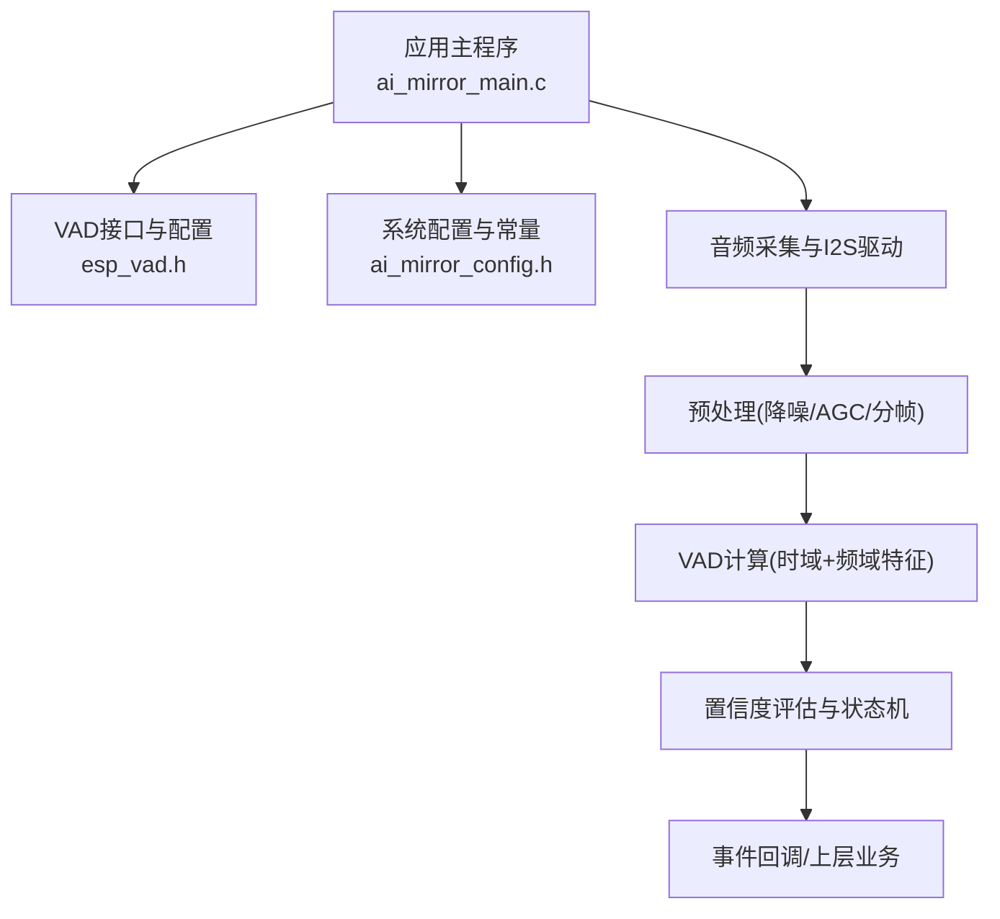
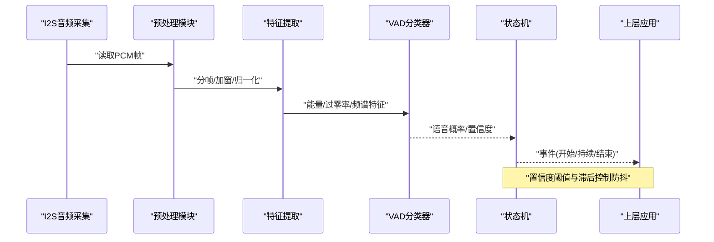
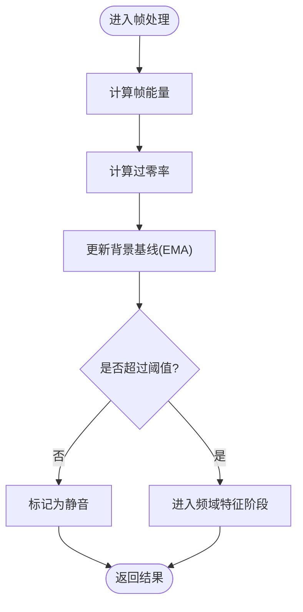
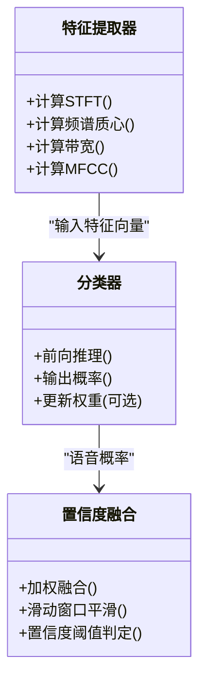
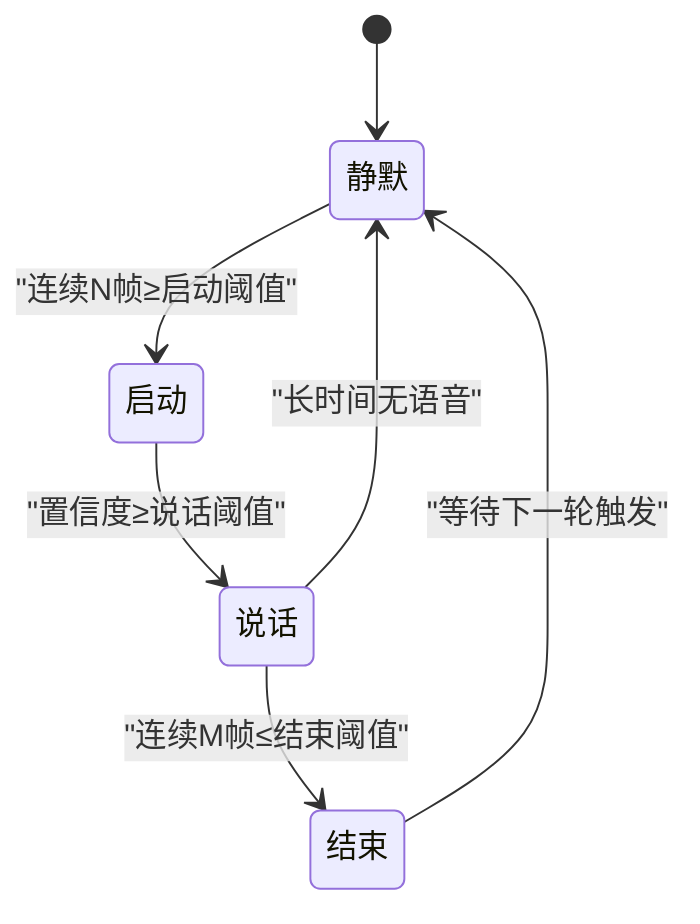
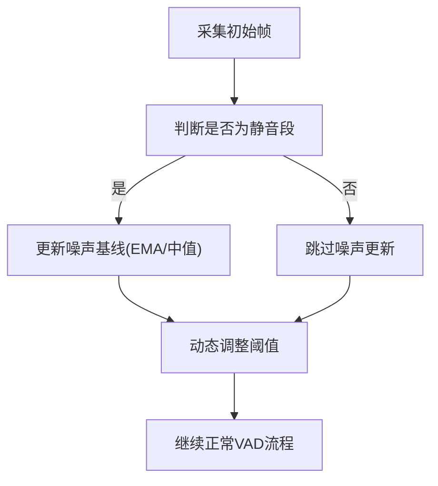
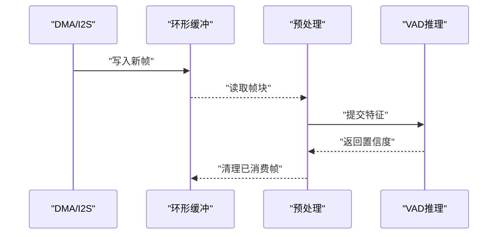
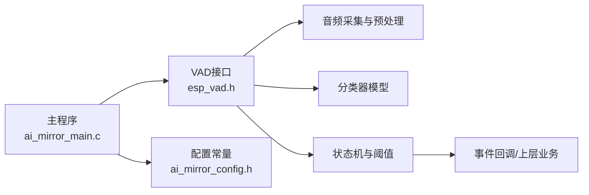

# 语音活动检测(VAD)

<cite>
**本文档引用的文件**   
- [esp_vad.h](file://Firmware/esp32_ai_mirror/components/espressif__esp-sr/include/esp_vad.h)
- [ai_mirror_main.c](file://Firmware/esp32_ai_mirror/main/ai_mirror_main.c)
- [ai_mirror_config.h](file://Firmware/esp32_ai_mirror/main/ai_mirror_config.h)
- [README.md](file://Firmware/esp32_ai_mirror/README.md)
</cite>

## 目录
1. [简介](#简介)
2. [项目结构](#项目结构)
3. [核心组件](#核心组件)
4. [架构总览](#架构总览)
5. [详细组件分析](#详细组件分析)
6. [依赖关系分析](#依赖关系分析)
7. [性能考量](#性能考量)
8. [故障排查指南](#故障排查指南)
9. [结论](#结论)
10. [附录](#附录)

## 简介
本文件面向ESP32平台上的语音活动检测（VAD）子系统，系统性阐述基于能量与过零率的检测方法、频域特征提取与机器学习分类器的工作原理、置信度分级与状态机设计、背景噪声适应与环境变化处理、误检率与漏检率的平衡策略，以及实时帧处理与缓冲管理。文档同时给出在不同语言与环境下的调优建议，帮助读者在资源受限的嵌入式设备上实现稳定、低延迟且鲁棒的VAD。

## 项目结构
本项目为ESP32语音识别应用，VAD能力由esp-sr组件提供，并通过主程序进行集成与调度。关键路径包括：
- esp-sr组件中的VAD头文件定义接口与模型配置
- 主程序初始化音频采集、VAD模块并驱动实时处理循环
- 配置文件集中管理采样率、帧长、阈值等关键参数

图表来源
- [ai_mirror_main.c](file://Firmware/esp32_ai_mirror/main/ai_mirror_main.c)
- [esp_vad.h](file://Firmware/esp32_ai_mirror/components/espressif__esp-sr/include/esp_vad.h)
- [ai_mirror_config.h](file://Firmware/esp32_ai_mirror/main/ai_mirror_config.h)

章节来源
- [README.md](file://Firmware/esp32_ai_mirror/README.md)
- [ai_mirror_main.c](file://Firmware/esp32_ai_mirror/main/ai_mirror_main.c)
- [ai_mirror_config.h](file://Firmware/esp32_ai_mirror/main/ai_mirror_config.h)
- [esp_vad.h](file://Firmware/esp32_ai_mirror/components/espressif__esp-sr/include/esp_vad.h)

## 核心组件
- VAD接口与模型配置：定义VAD初始化、推理、释放等API及模型选择、参数配置结构体。
- 音频采集与预处理：I2S读取PCM数据，完成增益控制、预加重、分帧加窗等。
- 特征提取：时域能量与过零率，频域短时傅里叶变换（STFT）、频谱质心、带宽、MFCC等。
- 分类器与置信度：轻量级机器学习模型输出语音/静音概率，结合滑动窗口平滑得到最终置信度。
- 状态机：根据置信度序列与阈值规则切换“静默-启动-说话-结束”等状态，抑制抖动与瞬态干扰。
- 环境自适应：动态更新噪声统计、能量基线、过零率分布，支持在线或离线校准。

章节来源
- [esp_vad.h](file://Firmware/esp32_ai_mirror/components/espressif__esp-sr/include/esp_vad.h)
- [ai_mirror_main.c](file://Firmware/esp32_ai_mirror/main/ai_mirror_main.c)
- [ai_mirror_config.h](file://Firmware/esp32_ai_mirror/main/ai_mirror_config.h)

## 架构总览
下图展示从音频输入到VAD决策的整体流程，强调实时性与资源约束下的模块化分工。

图表来源
- [ai_mirror_main.c](file://Firmware/esp32_ai_mirror/main/ai_mirror_main.c)
- [esp_vad.h](file://Firmware/esp32_ai_mirror/components/espressif__esp-sr/include/esp_vad.h)

## 详细组件分析

### 基于能量与过零率的时域检测
- 能量特征：对每帧信号求平方和或对数能量，用于快速区分语音与静音。
- 过零率（ZCR）：统计相邻样本符号变化的次数，语音通常具有更高的ZCR。
- 联合判据：能量与ZCR共同构成初筛门限，降低计算量并提升鲁棒性。
- 自适应阈值：通过指数移动平均更新背景能量与ZCR基线，适应环境噪声变化。

图表来源
- [esp_vad.h](file://Firmware/esp32_ai_mirror/components/espressif__esp-sr/include/esp_vad.h)
- [ai_mirror_main.c](file://Firmware/esp32_ai_mirror/main/ai_mirror_main.c)

章节来源
- [esp_vad.h](file://Firmware/esp32_ai_mirror/components/espressif__esp-sr/include/esp_vad.h)
- [ai_mirror_main.c](file://Firmware/esp32_ai_mirror/main/ai_mirror_main.c)

### 频域特征提取与机器学习分类器
- STFT与窗函数：使用汉明窗或类似窗函数减少频谱泄漏，得到短时频谱。
- 常用特征：频谱质心、带宽、谐波比、MFCC（可选），作为分类器输入。
- 分类器：轻量级模型（如小型神经网络或树模型）输出语音概率；可结合HMM或CRF做时序建模。
- 置信度融合：将时域初筛与频域模型输出加权融合，得到稳健的置信度曲线。

图表来源
- [esp_vad.h](file://Firmware/esp32_ai_mirror/components/espressif__esp-sr/include/esp_vad.h)
- [ai_mirror_main.c](file://Firmware/esp32_ai_mirror/main/ai_mirror_main.c)

章节来源
- [esp_vad.h](file://Firmware/esp32_ai_mirror/components/espressif__esp-sr/include/esp_vad.h)
- [ai_mirror_main.c](file://Firmware/esp32_ai_mirror/main/ai_mirror_main.c)

### 置信度级别与状态机设计
- 置信度级别：高置信语音、中置信语音、低置信/不确定、静音。
- 状态机：包含“静默-启动-说话-结束”等状态，使用滞后阈值与最小持续时间抑制抖动。
- 触发条件：连续多帧达到“启动阈值”进入说话状态；低于“结束阈值”并保持一定时长后回到静默。
- 抗噪策略：在强噪声下提高启动阈值、延长确认帧数，降低误触发。

图表来源
- [esp_vad.h](file://Firmware/esp32_ai_mirror/components/espressif__esp-sr/include/esp_vad.h)
- [ai_mirror_main.c](file://Firmware/esp32_ai_mirror/main/ai_mirror_main.c)

章节来源
- [esp_vad.h](file://Firmware/esp32_ai_mirror/components/espressif__esp-sr/include/esp_vad.h)
- [ai_mirror_main.c](file://Firmware/esp32_ai_mirror/main/ai_mirror_main.c)

### 背景噪声适应与环境变化处理
- 噪声估计：利用静音段更新噪声谱与能量基线，采用指数移动平均或中值滤波。
- 动态阈值：根据噪声水平调整能量/ZCR阈值与置信度阈值，保持误检率稳定。
- 环境漂移：周期性重新校准，或在检测到显著环境变化时触发快速重估。
- 场景适配：室内/室外、风噪/人声混叠等不同场景需差异化参数集。

图表来源
- [esp_vad.h](file://Firmware/esp32_ai_mirror/components/espressif__esp-sr/include/esp_vad.h)
- [ai_mirror_main.c](file://Firmware/esp32_ai_mirror/main/ai_mirror_main.c)

章节来源
- [esp_vad.h](file://Firmware/esp32_ai_mirror/components/espressif__esp-sr/include/esp_vad.h)
- [ai_mirror_main.c](file://Firmware/esp32_ai_mirror/main/ai_mirror_main.c)

### 误检率与漏检率的平衡策略
- 阈值权衡：提高启动阈值降低误检但可能增加漏检；反之亦然。
- 时间一致性：要求连续多帧满足阈值，减少瞬时噪声导致的误触发。
- 置信度融合：结合时域与频域特征，提升判别稳定性。
- 场景化参数：针对不同语言与环境训练/校准不同参数集，避免一刀切。

章节来源
- [esp_vad.h](file://Firmware/esp32_ai_mirror/components/espressif__esp-sr/include/esp_vad.h)
- [ai_mirror_main.c](file://Firmware/esp32_ai_mirror/main/ai_mirror_main.c)

### 实时帧处理与缓冲管理
- 帧长与步长：典型帧长10-30ms，步长5-15ms，保证低延迟与足够特征分辨率。
- 环形缓冲：I2S与VAD之间使用环形缓冲，避免阻塞与丢帧。
- 流水线并行：采集、预处理、特征提取、分类器推理尽量并行执行。
- 内存管理：固定大小缓冲区与对象池，减少动态分配开销。

图表来源
- [ai_mirror_main.c](file://Firmware/esp32_ai_mirror/main/ai_mirror_main.c)
- [esp_vad.h](file://Firmware/esp32_ai_mirror/components/espressif__esp-sr/include/esp_vad.h)

章节来源
- [ai_mirror_main.c](file://Firmware/esp32_ai_mirror/main/ai_mirror_main.c)
- [esp_vad.h](file://Firmware/esp32_ai_mirror/components/espressif__esp-sr/include/esp_vad.h)

### 不同语言与环境下的性能调优方法
- 语言差异：中文、英文等在频谱特性上存在差异，需分别校准阈值与特征权重。
- 环境差异：安静房间、嘈杂街道、车内等场景需要不同的噪声模型与阈值策略。
- 设备差异：麦克风灵敏度、前置放大、A/D量化噪声影响能量与ZCR分布。
- 调参建议：以误检率与漏检率为目标，结合ROC曲线与混淆矩阵优化阈值与模型参数。

章节来源
- [ai_mirror_config.h](file://Firmware/esp32_ai_mirror/main/ai_mirror_config.h)
- [esp_vad.h](file://Firmware/esp32_ai_mirror/components/espressif__esp-sr/include/esp_vad.h)

## 依赖关系分析
VAD模块依赖音频采集、预处理库与分类器实现，并与上层应用通过事件接口交互。

图表来源
- [ai_mirror_main.c](file://Firmware/esp32_ai_mirror/main/ai_mirror_main.c)
- [esp_vad.h](file://Firmware/esp32_ai_mirror/components/espressif__esp-sr/include/esp_vad.h)
- [ai_mirror_config.h](file://Firmware/esp32_ai_mirror/main/ai_mirror_config.h)

章节来源
- [ai_mirror_main.c](file://Firmware/esp32_ai_mirror/main/ai_mirror_main.c)
- [esp_vad.h](file://Firmware/esp32_ai_mirror/components/espressif__esp-sr/include/esp_vad.h)
- [ai_mirror_config.h](file://Firmware/esp32_ai_mirror/main/ai_mirror_config.h)

## 性能考量
- 计算复杂度：能量与ZCR为O(N)，STFT为O(N log N)，MFCC进一步增加开销；需在精度与延迟间权衡。
- 内存占用：环形缓冲与特征缓存需合理分配，避免碎片与溢出。
- 功耗优化：在低功率模式下降低采样率或帧率，必要时关闭频域特征。
- 实时性保障：中断与任务优先级设置、批处理与流水线并行，确保端到端延迟可控。

[本节为通用指导，不直接分析具体文件]

## 故障排查指南
- 频繁误触发：检查能量/ZCR阈值是否过低，增大启动阈值与确认帧数。
- 漏检严重：降低结束阈值，缩短确认帧数，或增强频域特征权重。
- 环境噪声波动：启用噪声自适应，缩短更新周期，或引入更稳健的基线估计。
- 延迟过高：减小帧长/步长，简化特征提取，或提升CPU频率。
- 内存不足：检查缓冲大小与对象生命周期，避免重复分配。

章节来源
- [esp_vad.h](file://Firmware/esp32_ai_mirror/components/espressif__esp-sr/include/esp_vad.h)
- [ai_mirror_main.c](file://Firmware/esp32_ai_mirror/main/ai_mirror_main.c)

## 结论
通过在时域与频域特征的协同、轻量级分类器的稳健推理、以及自适应阈值与状态机的综合设计，可在ESP32等资源受限平台上实现高质量的VAD。合理的参数调优与场景化适配是达成低误检与低漏检的关键。实际部署中应结合测试数据持续优化，确保在不同语言与环境下的稳定性与实时性。

[本节为总结性内容，不直接分析具体文件]

## 附录
- 推荐参数范围：帧长10-30ms，步长5-15ms，采样率16kHz，MFCC维度13-20。
- 评估指标：误检率（False Alarm Rate）、漏检率（Miss Rate）、平均延迟、吞吐率。
- 工具建议：使用频谱分析仪与日志记录辅助调试，绘制ROC曲线与混淆矩阵。

[本节为补充信息，不直接分析具体文件]