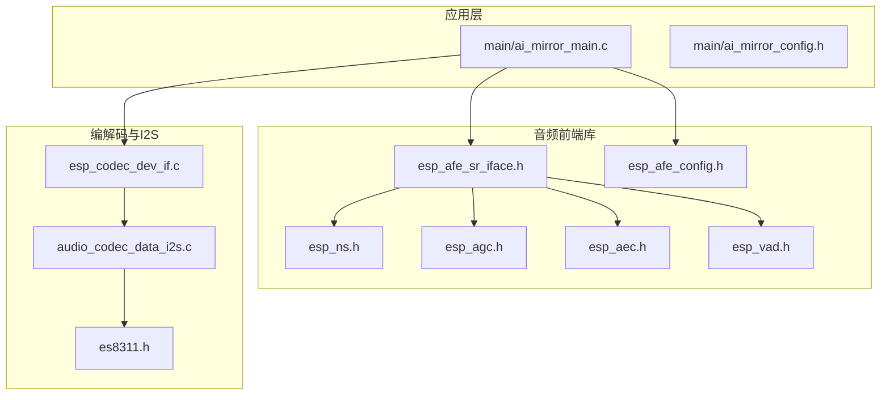
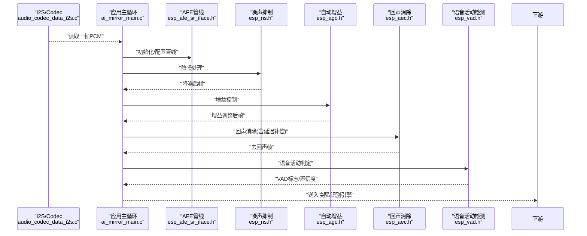
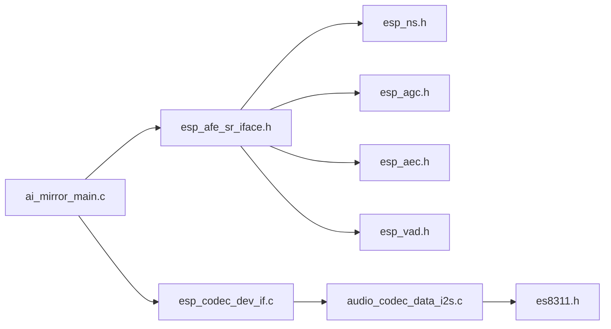

# 音频前处理

<cite>
**本文引用的文件**   
- [ai_mirror_main.c](file://Firmware/esp32_ai_mirror/main/ai_mirror_main.c)
- [ai_mirror_config.h](file://Firmware/esp32_ai_mirror/main/ai_mirror_config.h)
- [esp_afe_sr_iface.h](file://Firmware/esp32_ai_mirror/components/espressif__esp-sr/include/esp_afe_sr_iface.h)
- [esp_afe_config.h](file://Firmware/esp32_ai_mirror/components/espressif__esp-sr/include/esp_afe_config.h)
- [esp_ns.h](file://Firmware/esp32_ai_mirror/components/espressif__esp-sr/include/esp_ns.h)
- [esp_agc.h](file://Firmware/esp32_ai_mirror/components/espressif__esp-sr/include/esp_agc.h)
- [esp_aec.h](file://Firmware/esp32_ai_mirror/components/espressif__esp-sr/include/esp_aec.h)
- [esp_vad.h](file://Firmware/esp32_ai_mirror/components/espressif__esp-sr/include/esp_vad.h)
- [es8311.h](file://Firmware/esp32_ai_mirror/managed_components/espressif__es8311/include/es8311.h)
- [esp_codec_dev_if.c](file://Firmware/esp32_ai_mirror/managed_components/espressif__esp_codec_dev/esp_codec_dev_if.c)
- [audio_codec_data_i2s.c](file://Firmware/esp32_ai_mirror/managed_components/espressif__esp_codec_dev/platform/audio_codec_data_i2s.c)
</cite>

## 目录
1. [简介](#简介)
2. [项目结构](#项目结构)
3. [核心组件](#核心组件)
4. [架构总览](#架构总览)
5. [详细组件分析](#详细组件分析)
6. [依赖关系分析](#依赖关系分析)
7. [性能考虑](#性能考虑)
8. [故障排查指南](#故障排查指南)
9. [结论](#结论)
10. [附录](#附录)

## 简介
本文件面向嵌入式语音采集与识别系统中的“音频前处理”链路，围绕噪声抑制、自动增益控制(AGC)、回声消除(AEC)、语音活动检测(VAD)以及DSP滤波器的设计与调优进行系统化说明。文档同时给出模块级联顺序、数据流控制、实时性能优化与内存管理策略，帮助开发者在ESP32/S3平台上实现低延迟、高鲁棒性的语音前端。

## 项目结构
本项目基于ESP-IDF构建，音频前处理相关能力主要来源于：
- espressif__esp-sr 组件：提供AEC、NS、AGC、VAD等算法接口与配置结构体
- esp_codec_dev 组件：封装I2S编解码器驱动（如ES8311），负责ADC/DAC数据通路
- main 应用层：初始化音频设备、创建并调度前处理流水线、与唤醒/识别引擎对接

图表来源 
- [ai_mirror_main.c](file://Firmware/esp32_ai_mirror/main/ai_mirror_main.c)
- [esp_afe_sr_iface.h](file://Firmware/esp32_ai_mirror/components/espressif__esp-sr/include/esp_afe_sr_iface.h)
- [esp_afe_config.h](file://Firmware/esp32_ai_mirror/components/espressif__esp-sr/include/esp_afe_config.h)
- [esp_codec_dev_if.c](file://Firmware/esp32_ai_mirror/managed_components/espressif__esp_codec_dev/esp_codec_dev_if.c)
- [audio_codec_data_i2s.c](file://Firmware/esp32_ai_mirror/managed_components/espressif__esp_codec_dev/platform/audio_codec_data_i2s.c)
- [es8311.h](file://Firmware/esp32_ai_mirror/managed_components/espressif__es8311/include/es8311.h)

章节来源
- [ai_mirror_main.c](file://Firmware/esp32_ai_mirror/main/ai_mirror_main.c)
- [ai_mirror_config.h](file://Firmware/esp32_ai_mirror/main/ai_mirror_config.h)

## 核心组件
- 噪声抑制(NS)：通过频域或时频域估计背景噪声谱并进行衰减，降低稳态/非稳态噪声对语音的影响
- 自动增益控制(AGC)：根据输入信号能量动态调整增益，保持输出幅度稳定，避免削波与过小音量
- 回声消除(AEC)：利用参考声道（扬声器播放）自适应抵消麦克风中的声学回声，支持延迟补偿与双讲保护
- 语音活动检测(VAD)：基于能量、过零率、频谱特征或轻量模型判断语音段，用于节能与后续识别触发
- DSP滤波器：包括高通/低通/带通、去混响预处理、抗混叠与抗量化噪声整形等

章节来源
- [esp_ns.h](file://Firmware/esp32_ai_mirror/components/espressif__esp-sr/include/esp_ns.h)
- [esp_agc.h](file://Firmware/esp32_ai_mirror/components/espressif__esp-sr/include/esp_agc.h)
- [esp_aec.h](file://Firmware/esp32_ai_mirror/components/espressif__esp-sr/include/esp_aec.h)
- [esp_vad.h](file://Firmware/esp32_ai_mirror/components/espressif__esp-sr/include/esp_vad.h)

## 架构总览
典型的前处理数据流为：I2S ADC → 可选预滤波 → NS → AGC → AEC → VAD → 下游识别/唤醒。各模块以块为单位处理固定长度帧，保证端到端延迟可控。

图表来源 
- [audio_codec_data_i2s.c](file://Firmware/esp32_ai_mirror/managed_components/espressif__esp_codec_dev/platform/audio_codec_data_i2s.c)
- [ai_mirror_main.c](file://Firmware/esp32_ai_mirror/main/ai_mirror_main.c)
- [esp_afe_sr_iface.h](file://Firmware/esp32_ai_mirror/components/espressif__esp-sr/include/esp_afe_sr_iface.h)
- [esp_ns.h](file://Firmware/esp32_ai_mirror/components/espressif__esp-sr/include/esp_ns.h)
- [esp_agc.h](file://Firmware/esp32_ai_mirror/components/espressif__esp-sr/include/esp_agc.h)
- [esp_aec.h](file://Firmware/esp32_ai_mirror/components/espressif__esp-sr/include/esp_aec.h)
- [esp_vad.h](file://Firmware/esp32_ai_mirror/components/espressif__esp-sr/include/esp_vad.h)

## 详细组件分析

### 噪声抑制(NS)
- 原理要点
  - 估计背景噪声功率谱，计算信噪比(SNR)并生成频域增益曲线
  - 支持稳态噪声与瞬态噪声的差异化处理
  - 可结合谱减、维纳滤波或深度学习增强路径
- 关键参数
  - 目标衰减量、最小保留底噪、平滑因子、更新速率
  - 频段划分与权重策略（低频强噪声场景可调）
- 调优建议
  - 在安静环境先标定噪声谱；在强噪声环境中提高更新速率但避免过度波动
  - 与AGC配合，防止NS过度衰减导致AGC拉满增益
- 常见问题
  - “音乐噪声”残留：增大平滑或引入谱门限
  - 语音失真：减小最大衰减或放宽SNR阈值

章节来源
- [esp_ns.h](file://Firmware/esp32_ai_mirror/components/espressif__esp-sr/include/esp_ns.h)

### 自动增益控制(AGC)
- 工作机制
  - 测量输入短时能量，按目标电平与压缩比调整增益
  - 具备慢/快模式切换：慢模式保音质，快模式抗突发噪声
  - 限制最大增益与最小增益，防止削波与底噪放大
- 关键参数
  - 目标电平、压缩比、最大增益、启动/释放时间常数、峰值限制
- 调优建议
  - 远场小音量场景：提高目标电平、缩短启动时间
  - 近场大音量场景：降低最大增益、增加释放时间
- 与NS/AEC协作
  - 建议AGC置于NS之后，避免噪声被放大
  - 与AEC联动时，确保参考信号与回声音量匹配

章节来源
- [esp_agc.h](file://Firmware/esp32_ai_mirror/components/espressif__esp-sr/include/esp_agc.h)

### 回声消除(AEC)
- 技术细节
  - 使用自适应滤波器（如NLMS/FFTS）拟合声通道，从麦克风信号中减去估计的回声
  - 支持双讲检测与半双工保护，避免在对方说话时误消
  - 延迟补偿：估计并校正从DAC到ADC的总延迟（含编解码、I2S、缓冲）
- 关键参数
  - 滤波器阶数、步长/收敛因子、双讲阈值、延迟估计窗口
- 调优建议
  - 房间混响较大时适当增大滤波器阶数，但需权衡CPU与延迟
  - 参考信号需与回放一致（同一采样率、位深、通道数）
- 常见问题
  - 残余回声：检查参考信号同步、校准延迟、提升收敛速度
  - 语音失真：降低步长或启用双讲保护

章节来源
- [esp_aec.h](file://Firmware/esp32_ai_mirror/components/espressif__esp-sr/include/esp_aec.h)

### 语音活动检测(VAD)
- 工作原理
  - 基于能量、过零率、频谱平坦度或轻量模型输出语音概率
  - 输出二值或软概率，可用于唤醒触发或降噪开关
- 阈值设置
  - 初始阈值按环境分贝级设定；静默期自适应更新底噪
  - 误检率优化：引入短时平滑、连续帧一致性校验
- 调优建议
  - 高噪声环境：提高阈值、增加滞后区间，减少抖动
  - 弱语音场景：降低阈值、扩大分析窗
- 与下游联动
  - 与唤醒引擎协同，避免频繁唤醒/休眠切换

章节来源
- [esp_vad.h](file://Firmware/esp32_ai_mirror/components/espressif__esp-sr/include/esp_vad.h)

### DSP滤波器设计与调优
- 常用类型
  - 高通：去除风噪与低频漂移
  - 低通/抗混叠：限制带宽，满足采样定理
  - 带通：聚焦语音频段（约300–3400Hz）
- 设计步骤
  - 确定采样率与截止频率，选择FIR/IIR
  - FIR线性相位保真度高但延迟大；IIR计算量小但相位非线性
  - 窗函数法或等波纹法设计，验证幅频/相频响应
- 调优要点
  - 过渡带宽度与阻带衰减的折中
  - 量化位宽与定点实现时的系数缩放
  - 多段级联时注意稳定性与群延迟累积

章节来源
- [esp_codec_dev_if.c](file://Firmware/esp32_ai_mirror/managed_components/espressif__esp_codec_dev/esp_codec_dev_if.c)
- [audio_codec_data_i2s.c](file://Firmware/esp32_ai_mirror/managed_components/espressif__esp_codec_dev/platform/audio_codec_data_i2s.c)

### 模块级联顺序与数据流控制
- 推荐顺序
  - I2S ADC → 预滤波(HP/LP) → NS → AGC → AEC → VAD → 下游
- 数据流控制
  - 固定帧长（如10ms/20ms），逐帧流水线处理
  - 参考信号与主路严格同步，必要时插入对齐缓冲
  - 状态机管理：初始化→运行→异常恢复
- 延迟预算
  - 每模块估算处理时间与缓冲深度，确保端到端延迟满足交互需求

章节来源
- [ai_mirror_main.c](file://Firmware/esp32_ai_mirror/main/ai_mirror_main.c)
- [esp_afe_sr_iface.h](file://Firmware/esp32_ai_mirror/components/espressif__esp-sr/include/esp_afe_sr_iface.h)

## 依赖关系分析
- 应用层依赖AFE接口与配置结构体，统一编排NS/AGC/AEC/VAD
- 编解码层通过esp_codec_dev抽象I2S与具体Codec（如ES8311）
- 各算法模块通过统一数据结构交换帧数据，避免耦合

图表来源 
- [ai_mirror_main.c](file://Firmware/esp32_ai_mirror/main/ai_mirror_main.c)
- [esp_afe_sr_iface.h](file://Firmware/esp32_ai_mirror/components/espressif__esp-sr/include/esp_afe_sr_iface.h)
- [esp_ns.h](file://Firmware/esp32_ai_mirror/components/espressif__esp-sr/include/esp_ns.h)
- [esp_agc.h](file://Firmware/esp32_ai_mirror/components/espressif__esp-sr/include/esp_agc.h)
- [esp_aec.h](file://Firmware/esp32_ai_mirror/components/espressif__esp-sr/include/esp_aec.h)
- [esp_vad.h](file://Firmware/esp32_ai_mirror/components/espressif__esp-sr/include/esp_vad.h)
- [esp_codec_dev_if.c](file://Firmware/esp32_ai_mirror/managed_components/espressif__esp_codec_dev/esp_codec_dev_if.c)
- [audio_codec_data_i2s.c](file://Firmware/esp32_ai_mirror/managed_components/espressif__esp_codec_dev/platform/audio_codec_data_i2s.c)
- [es8311.h](file://Firmware/esp32_ai_mirror/managed_components/espressif__es8311/include/es8311.h)

章节来源
- [ai_mirror_main.c](file://Firmware/esp32_ai_mirror/main/ai_mirror_main.c)
- [esp_afe_sr_iface.h](file://Firmware/esp32_ai_mirror/components/espressif__esp-sr/include/esp_afe_sr_iface.h)
- [esp_codec_dev_if.c](file://Firmware/esp32_ai_mirror/managed_components/espressif__esp_codec_dev/esp_codec_dev_if.c)

## 性能考虑
- 实时性
  - 控制每帧处理时间，优先使用定点运算与SIMD指令
  - 合理分配任务优先级，避免阻塞式I/O
- 内存管理
  - 预分配环形缓冲与共享帧缓冲区，减少动态分配
  - 复用FFT/滤波器状态数组，避免重复malloc/free
- 功耗优化
  - 在无语音时关闭或降级NS/AEC，仅保留低功耗VAD
  - 动态调节采样率与帧长，平衡质量与功耗
- 延迟与吞吐
  - 采用双缓冲/乒乓缓冲，流水线并行处理
  - 参考信号与主路对齐，减少额外拷贝

[本节为通用指导，不直接分析具体文件]

## 故障排查指南
- 现象：回声未消除
  - 检查参考信号是否同步、延迟补偿是否准确
  - 增大AEC滤波器阶数或步长，确认双讲保护未误关
- 现象：语音失真或“音乐噪声”
  - 降低NS最大衰减，增加平滑因子
  - 检查AGC最大增益与限制器设置
- 现象：VAD误检率高
  - 提高阈值、增加连续帧一致性校验
  - 在强噪声环境下重新标定底噪
- 现象：CPU占用过高
  - 简化滤波器阶数，减少不必要的模块
  - 使用更高效的实现（如定点化、查表）

章节来源
- [esp_aec.h](file://Firmware/esp32_ai_mirror/components/espressif__esp-sr/include/esp_aec.h)
- [esp_ns.h](file://Firmware/esp32_ai_mirror/components/espressif__esp-sr/include/esp_ns.h)
- [esp_agc.h](file://Firmware/esp32_ai_mirror/components/espressif__esp-sr/include/esp_agc.h)
- [esp_vad.h](file://Firmware/esp32_ai_mirror/components/espressif__esp-sr/include/esp_vad.h)

## 结论
通过合理的模块级联与参数调优，可在资源受限的嵌入式平台上实现高质量的音频前处理。关键在于：稳定的参考信号与延迟校准、NS/AGC/AEC的参数协同、VAD的稳健阈值与误检优化，以及严格的实时与内存管理策略。建议在真实环境与多种噪声条件下进行系统级评测，持续迭代参数以获得最佳体验。

[本节为总结性内容，不直接分析具体文件]

## 附录
- 配置入口与示例
  - 查看AFE配置结构体与初始化流程，了解如何启用/禁用各模块
  - 参考应用主循环中对I2S与AFE的调用时序
- 调试工具
  - 抓取I2S原始PCM与参考信号，离线验证AEC/NS效果
  - 记录VAD输出轨迹，评估阈值与平滑策略

章节来源
- [ai_mirror_config.h](file://Firmware/esp32_ai_mirror/main/ai_mirror_config.h)
- [ai_mirror_main.c](file://Firmware/esp32_ai_mirror/main/ai_mirror_main.c)
- [esp_afe_config.h](file://Firmware/esp32_ai_mirror/components/espressif__esp-sr/include/esp_afe_config.h)