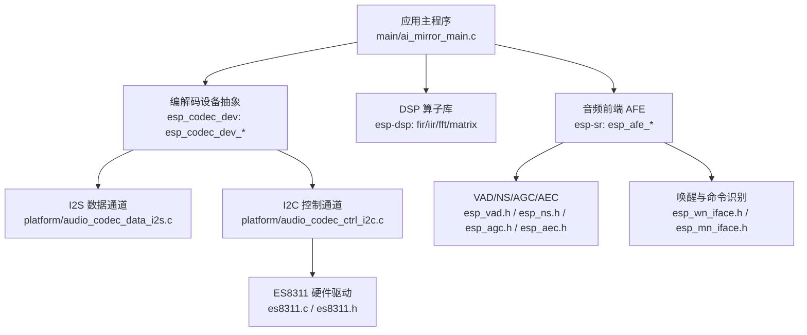
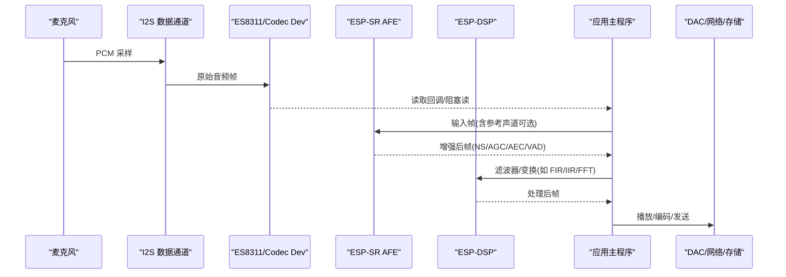
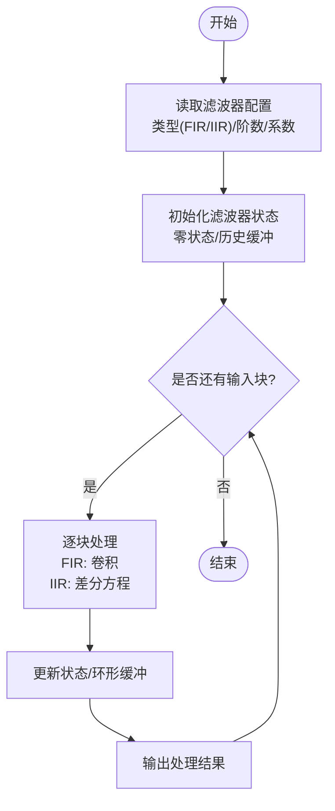
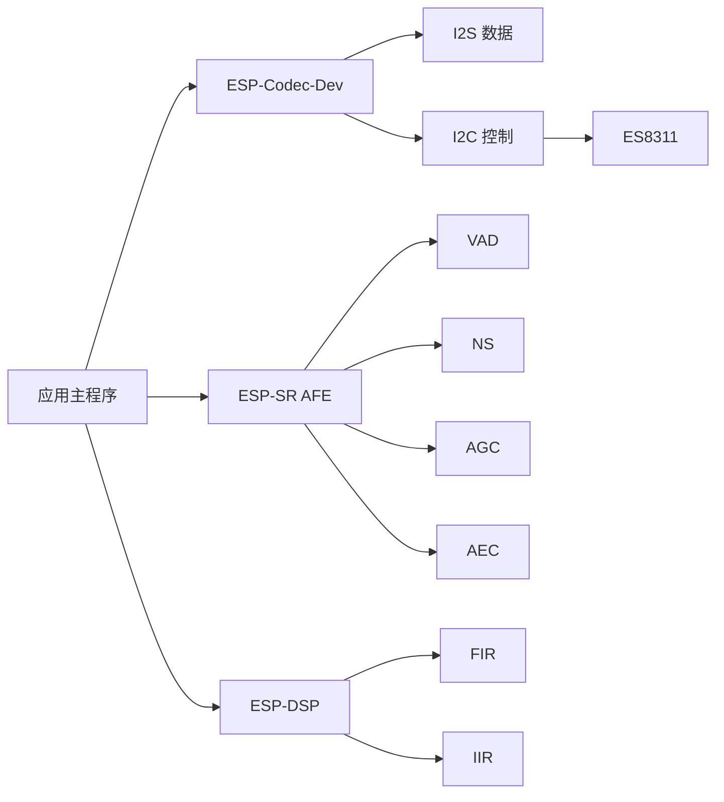

# 音频后处理

<cite>
**本文引用的文件**   
- [ai_mirror_main.c](file://Firmware/esp32_ai_mirror/main/ai_mirror_main.c)
- [ai_mirror_config.h](file://Firmware/esp32_ai_mirror/main/ai_mirror_config.h)
- [board_buttons.c](file://Firmware/esp32_ai_mirror/main/board_buttons.c)
- [board_buttons.h](file://Firmware/esp32_ai_mirror/main/board_buttons.h)
- [board_rgb.c](file://Firmware/esp32_ai_mirror/main/board_rgb.c)
- [board_rgb.h](file://Firmware/esp32_ai_mirror/main/board_rgb.h)
- [board_wifi_prov.c](file://Firmware/esp32_ai_mirror/main/board_wifi_prov.c)
- [board_wifi_prov.h](file://Firmware/esp32_ai_mirror/main/board_wifi_prov.h)
- [CMakeLists.txt](file://Firmware/esp32_ai_mirror/main/CMakeLists.txt)
- [Kconfig.projbuild](file://Firmware/esp32_ai_mirror/main/Kconfig.projbuild)
- [idf_component.yml](file://Firmware/esp32_ai_mirror/main/idf_component.yml)
- [esp_afe_sr_iface.h](file://Firmware/esp32_ai_mirror/components/espressif__esp-sr/include/esp32s3/esp_afe_sr_iface.h)
- [esp_afe_config.h](file://Firmware/esp32_ai_mirror/components/espressif__esp-sr/include/esp32s3/esp_afe_config.h)
- [esp_mn_iface.h](file://Firmware/esp32_ai_mirror/components/espressif__esp-sr/include/esp32s3/esp_mn_iface.h)
- [esp_wn_iface.h](file://Firmware/esp32_ai_mirror/components/espressif__esp-sr/include/esp32s3/esp_wn_iface.h)
- [esp_vad.h](file://Firmware/esp32_ai_mirror/components/espressif__esp-sr/include/esp32s3/esp_vad.h)
- [esp_ns.h](file://Firmware/esp32_ai_mirror/components/espressif__esp-sr/include/esp32s3/esp_ns.h)
- [esp_agc.h](file://Firmware/esp32_ai_mirror/components/espressif__esp-sr/include/esp32s3/esp_agc.h)
- [esp_aec.h](file://Firmware/esp32_ai_mirror/components/espressif__esp-sr/include/esp32s3/esp_aec.h)
- [esp_mase.h](file://Firmware/esp32_ai_mirror/components/espressif__esp-sr/include/esp32s3/esp_mase.h)
- [es8311.h](file://Firmware/esp32_ai_mirror/managed_components/espressif__es8311/include/es8311.h)
- [es8311.c](file://Firmware/esp32_ai_mirror/managed_components/espressif__es8311/es8311.c)
- [audio_codec_if.h](file://Firmware/esp32_ai_mirror/managed_components/espressif__esp_codec_dev/interface/audio_codec_if.h)
- [audio_codec_data_if.h](file://Firmware/esp32_ai_mirror/managed_components/espressif__esp_codec_dev/interface/audio_codec_data_if.h)
- [audio_codec_ctrl_if.h](file://Firmware/esp32_ai_mirror/managed_components/espressif__esp_codec_dev/interface/audio_codec_ctrl_if.h)
- [audio_codec_gpio_if.h](file://Firmware/esp32_ai_mirror/managed_components/espressif__esp_codec_dev/interface/audio_codec_gpio_if.h)
- [audio_codec_vol_if.h](file://Firmware/esp32_ai_mirror/managed_components/espressif__esp_codec_dev/interface/audio_codec_vol_if.h)
- [esp_codec_dev.h](file://Firmware/esp32_ai_mirror/managed_components/espressif__esp_codec_dev/include/esp_codec_dev.h)
- [esp_codec_dev_defaults.h](file://Firmware/esp32_ai_mirror/managed_components/espressif__esp_codec_dev/include/esp_codec_dev_defaults.h)
- [esp_codec_dev_types.h](file://Firmware/esp32_ai_mirror/managed_components/espressif__esp_codec_dev/include/esp_codec_dev_types.h)
- [audio_codec_data_i2s.c](file://Firmware/esp32_ai_mirror/managed_components/espressif__esp_codec_dev/platform/audio_codec_data_i2s.c)
- [audio_codec_ctrl_i2c.c](file://Firmware/esp32_ai_mirror/managed_components/espressif__esp_codec_dev/platform/audio_codec_ctrl_i2c.c)
- [audio_codec_sw_vol.c](file://Firmware/esp32_ai_mirror/managed_components/espressif__esp_codec_dev/audio_codec_sw_vol.c)
- [audio_codec_sw_vol.h](file://Firmware/esp32_ai_mirror/managed_components/espressif__esp_codec_dev/audio_codec_sw_vol.h)
- [dl_lib_conv_queue.h](file://Firmware/esp32_ai_mirror/components/espressif__esp-sr/include/esp32s3/dl_lib_conv_queue.h)
- [dl_lib_matrix.h](file://Firmware/esp32_ai_mirror/components/espressif__esp-sr/include/esp32s3/dl_lib_matrix.h)
- [fir_example_main.c](file://Firmware/esp32_ai_mirror/managed_components/espressif__esp-dsp/examples/fir/main/main.c)
- [iir_example_main.c](file://Firmware/esp32_ai_mirror/managed_components/espressif__esp-dsp/examples/iir/main/main.c)
- [README.md](file://Firmware/esp32_ai_mirror/README.md)
</cite>

## 目录
1. [简介](#简介)
2. [项目结构](#项目结构)
3. [核心组件](#核心组件)
4. [架构总览](#架构总览)
5. [详细组件分析](#详细组件分析)
6. [依赖关系分析](#依赖关系分析)
7. [性能考虑](#性能考虑)
8. [故障排查指南](#故障排查指南)
9. [结论](#结论)
10. [附录](#附录)

## 简介
本文件面向“音频后处理”主题，围绕数字滤波器（FIR/IIR）设计实现、音频增强算法效果与优化、音频格式转换与采样率重采样、音频压缩与解码流程、质量评估指标与测试方法、语音识别模块数据接口与传输协议、实时处理延迟优化与缓冲区管理策略进行系统化说明。文档以仓库中的 ESP-SR（语音识别前端）、ESP-DSP（数字信号处理库）、ESP-Codec-Dev（编解码设备抽象层）以及 ES8311 音频编解码芯片驱动为核心依据，结合工程主程序与配置，给出可落地的设计与优化建议。

## 项目结构
本项目基于 ESP-IDF 构建，主要目录与职责如下：
- main：应用入口、板级初始化、按键与 RGB 控制、WiFi 配网等
- components/espressif__esp-sr：语音识别前端（AEC/NS/AGC/VAD/WakeNet/MultiNet）及模型
- managed_components/espressif__esp-dsp：DSP 基础算子（FIR/IIR/FFT/矩阵等）
- managed_components/espressif__esp_codec_dev：音频编解码设备抽象与平台适配（I2S/I2C/GPIO/音量）
- managed_components/espressif__es8311：ES8311 编解码器驱动

图表来源
- [ai_mirror_main.c](file://Firmware/esp32_ai_mirror/main/ai_mirror_main.c)
- [esp_afe_sr_iface.h](file://Firmware/esp32_ai_mirror/components/espressif__esp-sr/include/esp32s3/esp_afe_sr_iface.h)
- [esp_codec_dev.h](file://Firmware/esp32_ai_mirror/managed_components/espressif__esp_codec_dev/include/esp_codec_dev.h)
- [audio_codec_data_i2s.c](file://Firmware/esp32_ai_mirror/managed_components/espressif__esp_codec_dev/platform/audio_codec_data_i2s.c)
- [audio_codec_ctrl_i2c.c](file://Firmware/esp32_ai_mirror/managed_components/espressif__esp_codec_dev/platform/audio_codec_ctrl_i2c.c)
- [es8311.c](file://Firmware/esp32_ai_mirror/managed_components/espressif__es8311/es8311.c)

章节来源
- [README.md](file://Firmware/esp32_ai_mirror/README.md)
- [CMakeLists.txt](file://Firmware/esp32_ai_mirror/main/CMakeLists.txt)
- [idf_component.yml](file://Firmware/esp32_ai_mirror/main/idf_component.yml)

## 核心组件
- 音频前端（AFE）：提供降噪（NS）、自动增益（AGC）、回声消除（AEC）、语音活动检测（VAD）与唤醒/命令识别（WakeNet/MultiNet）能力，统一通过 esp_afe_* 接口接入。
- DSP 算子库：提供 FIR/IIR/FFT/矩阵运算等基础算子，用于滤波器设计与频谱分析。
- 编解码设备抽象（esp_codec_dev）：屏蔽 I2S/I2C/GPIO/音量控制差异，向上暴露统一的音频采集/播放 API。
- ES8311 驱动：负责 ADC/DAC、时钟、Mixer、HP/LP 滤波器等硬件寄存器配置。

章节来源
- [esp_afe_sr_iface.h](file://Firmware/esp32_ai_mirror/components/espressif__esp-sr/include/esp32s3/esp_afe_sr_iface.h)
- [esp_afe_config.h](file://Firmware/esp32_ai_mirror/components/espressif__esp-sr/include/esp32s3/esp_afe_config.h)
- [esp_codec_dev.h](file://Firmware/esp32_ai_mirror/managed_components/espressif__esp_codec_dev/include/esp_codec_dev.h)
- [es8311.h](file://Firmware/esp32_ai_mirror/managed_components/espressif__es8311/include/es8311.h)

## 架构总览
整体数据流从麦克风经 I2S 进入，由 AFE 完成增强（NS/AGC/AEC/VAD），再由 DSP 模块执行滤波器或变换，最后输出至 DAC 或网络/存储。

图表来源
- [audio_codec_data_i2s.c](file://Firmware/esp32_ai_mirror/managed_components/espressif__esp_codec_dev/platform/audio_codec_data_i2s.c)
- [esp_afe_sr_iface.h](file://Firmware/esp32_ai_mirror/components/espressif__esp-sr/include/esp32s3/esp_afe_sr_iface.h)
- [esp_codec_dev.h](file://Firmware/esp32_ai_mirror/managed_components/espressif__esp_codec_dev/include/esp_codec_dev.h)

## 详细组件分析

### 数字滤波器（FIR/IIR）设计与实现
- 设计要点
  - FIR：线性相位、稳定易实现，适合噪声抑制与均衡；阶数越高计算量越大。
  - IIR：低阶高选择性，适合高通/低通/带通；注意稳定性与量化误差。
- 实现路径
  - 使用 ESP-DSP 的 FIR/IIR 算子进行卷积/差分方程求解，支持浮点与定点优化。
  - 在 AFE 之后插入滤波器链，按频段分路处理（多段 EQ）。
- 复杂度与优化
  - FIR 卷积 O(N·L)，可用重叠相加/保存法降低开销；IIR 为 O(L)。
  - 利用 SIMD/向量指令与内存对齐提升吞吐。
- 参数选择
  - 截止频率、Q 值、增益、阶数需结合环境噪声谱与目标语音频带权衡。
- 验证方法
  - 频响曲线、群延迟、THD+N、SNR、PSU（功率谱均匀性）对比。

图表来源
- [fir_example_main.c](file://Firmware/esp32_ai_mirror/managed_components/espressif__esp-dsp/examples/fir/main/main.c)
- [iir_example_main.c](file://Firmware/esp32_ai_mirror/managed_components/espressif__esp-dsp/examples/iir/main/main.c)

章节来源
- [fir_example_main.c](file://Firmware/esp32_ai_mirror/managed_components/espressif__esp-dsp/examples/fir/main/main.c)
- [iir_example_main.c](file://Firmware/esp32_ai_mirror/managed_components/espressif__esp-dsp/examples/iir/main/main.c)

### 音频增强算法（NS/AGC/AEC/VAD）效果与优化
- NS（降噪）：抑制稳态/非稳态噪声，保持语音清晰度；过强会引入音乐噪声。
- AGC（自动增益）：自适应调节增益，避免削波与过小电平；注意瞬态响应。
- AEC（回声消除）：需要参考声道，收敛速度与步长影响残差回声。
- VAD（语音活动检测）：减少无效帧处理，节省算力；误检/漏检需平衡。
- 优化建议
  - 分级处理：先粗增强（AGC/NS），再细处理（AEC/VAD）。
  - 动态参数：根据信噪比/能量自适应调整阈值与步长。
  - 缓存与流水线：将 AFE 与 DSP 解耦，采用双缓冲/队列降低抖动。

章节来源
- [esp_ns.h](file://Firmware/esp32_ai_mirror/components/espressif__esp-sr/include/esp32s3/esp_ns.h)
- [esp_agc.h](file://Firmware/esp32_ai_mirror/components/espressif__esp-sr/include/esp32s3/esp_agc.h)
- [esp_aec.h](file://Firmware/esp32_ai_mirror/components/espressif__esp-sr/include/esp32s3/esp_aec.h)
- [esp_vad.h](file://Firmware/esp32_ai_mirror/components/espressif__esp-sr/include/esp32s3/esp_vad.h)

### 音频格式转换与采样率重采样
- 格式转换
  - PCM 位深转换（16bit↔24bit）、端序与通道布局重排。
  - 通过 esp_codec_dev 的读写接口获取/写入标准 PCM 帧。
- 重采样
  - 常用方法：线性插值、多项式插值、多相滤波器组；精度与延迟折中。
  - 在 ESP-DSP 中结合 FIR 实现高质量重采样。
- 实践建议
  - 固定块大小（如 10ms/20ms）便于流水线与同步。
  - 预分配环形缓冲，避免频繁分配。

章节来源
- [esp_codec_dev.h](file://Firmware/esp32_ai_mirror/managed_components/espressif__esp_codec_dev/include/esp_codec_dev.h)
- [audio_codec_data_i2s.c](file://Firmware/esp32_ai_mirror/managed_components/espressif__esp_codec_dev/platform/audio_codec_data_i2s.c)

### 音频压缩与解码处理流程
- 压缩
  - 常见格式：OPUS/MP3/AAC；嵌入式侧通常以 OPUS 为主（低延迟、高音质）。
  - 编码管线：预处理→分帧→特征提取→熵编码→打包。
- 解码
  - 解包→解码→后处理（去抖/平滑）→重采样/格式转换→DAC。
- 工程集成
  - 通过 esp_codec_dev 或第三方库封装，统一输入输出 PCM 帧。
  - 注意码率、帧长、丢包恢复策略。

章节来源
- [esp_codec_dev.h](file://Firmware/esp32_ai_mirror/managed_components/espressif__esp_codec_dev/include/esp_codec_dev.h)
- [audio_codec_data_i2s.c](file://Firmware/esp32_ai_mirror/managed_components/espressif__esp_codec_dev/platform/audio_codec_data_i2s.c)

### 音频质量评估指标与测试方法
- 客观指标
  - SNR、PESQ、STOI、THD+N、频响平坦度、群延迟、峰值因数。
- 主观测试
  - 听感评分、清晰度/自然度打分、回声/噪声残留评价。
- 测试方法
  - 标准语料+噪声场景（房间混响、风扇/键盘噪声）。
  - 自动化脚本：生成激励信号（正弦扫频/白噪声）→采集→离线分析。
  - 在线监控：统计丢帧率、卡顿时长、CPU 占用。

章节来源
- [esp_codec_dev.h](file://Firmware/esp32_ai_mirror/managed_components/espressif__esp_codec_dev/include/esp_codec_dev.h)

### 与语音识别模块的数据接口与传输协议
- 接口规范
  - 输入：单/多声道 PCM，采样率常为 16kHz，16bit，块大小 10~20ms。
  - 输出：VAD 事件、唤醒/命令结果、置信度。
- 传输协议
  - 本地：队列/环形缓冲传递帧指针或拷贝，避免锁竞争。
  - 远程：UDP/TCP 封装帧头（时间戳/序列号/长度/校验）。
- 关键约束
  - 时序一致性：时钟源一致，避免漂移。
  - 背压机制：下游慢则上游降速或丢弃旧帧。

章节来源
- [esp_mn_iface.h](file://Firmware/esp32_ai_mirror/components/espressif__esp-sr/include/esp32s3/esp_mn_iface.h)
- [esp_wn_iface.h](file://Firmware/esp32_ai_mirror/components/espressif__esp-sr/include/esp32s3/esp_wn_iface.h)
- [esp_vad.h](file://Firmware/esp32_ai_mirror/components/espressif__esp-sr/include/esp32s3/esp_vad.h)

### 实时处理延迟优化与缓冲区管理策略
- 延迟优化
  - 减小块大小（10ms）但权衡 CPU；合理设置 AEC/NS 窗口。
  - 使用 DMA + I2S 中断，零拷贝传递帧。
- 缓冲区管理
  - 双缓冲/三缓冲避免读写冲突；环形缓冲容量=最大抖动×采样率×通道数×字节数。
  - 优先级调度：音频线程高于 UI/网络。
- 监控与调优
  - 记录端到端时延分布（P50/P95/P99）；CPU 热点定位。
  - 动态降级：在高负载时关闭非必要增强步骤。

章节来源
- [audio_codec_data_i2s.c](file://Firmware/esp32_ai_mirror/managed_components/espressif__esp_codec_dev/platform/audio_codec_data_i2s.c)
- [dl_lib_conv_queue.h](file://Firmware/esp32_ai_mirror/components/espressif__esp-sr/include/esp32s3/dl_lib_conv_queue.h)

## 依赖关系分析
- 组件耦合
  - 应用主程序依赖 AFE、DSP、Codec Dev；Codec Dev 依赖 I2S/I2C/GPIO 抽象。
  - AFE 依赖 VAD/NS/AGC/AEC 模块；DSP 依赖矩阵/FFT 等基础算子。
- 外部依赖
  - ES8311 硬件寄存器；ESP-IDF 内核与外设驱动。
- 潜在环路
  - 确保 AFE→DSP→输出单向流动，避免反馈回环导致不稳定。

图表来源
- [ai_mirror_main.c](file://Firmware/esp32_ai_mirror/main/ai_mirror_main.c)
- [esp_afe_sr_iface.h](file://Firmware/esp32_ai_mirror/components/espressif__esp-sr/include/esp32s3/esp_afe_sr_iface.h)
- [esp_codec_dev.h](file://Firmware/esp32_ai_mirror/managed_components/espressif__esp_codec_dev/include/esp_codec_dev.h)
- [audio_codec_data_i2s.c](file://Firmware/esp32_ai_mirror/managed_components/espressif__esp_codec_dev/platform/audio_codec_data_i2s.c)
- [audio_codec_ctrl_i2c.c](file://Firmware/esp32_ai_mirror/managed_components/espressif__esp_codec_dev/platform/audio_codec_ctrl_i2c.c)
- [es8311.c](file://Firmware/esp32_ai_mirror/managed_components/espressif__es8311/es8311.c)

章节来源
- [idf_component.yml](file://Firmware/esp32_ai_mirror/main/idf_component.yml)
- [CMakeLists.txt](file://Firmware/esp32_ai_mirror/main/CMakeLists.txt)

## 性能考虑
- 计算复杂度
  - FIR 阶数与块大小直接影响 CPU；IIR 更省算力但需注意稳定性。
- 内存占用
  - 滤波器状态、环形缓冲、FFT 工作区需预估并静态分配。
- 功耗与热
  - 高频采样与复杂增强会增加功耗；按需开关功能。
- 吞吐与延迟
  - 增大块大小提高吞吐但增加延迟；寻找平衡点。
- 并行化
  - 多核/任务分离：采集、增强、编码、网络各占一任务。

[本节为通用指导，不直接分析具体文件]

## 故障排查指南
- 常见问题
  - 爆音/破音：检查 AGC 上限、削峰保护、DAC 配置。
  - 回声未消除：确认参考声道连接、AEC 收敛参数。
  - 噪声大：调整 NS 强度、检查麦克风前置放大。
  - 卡顿/掉帧：检查缓冲区大小、任务优先级、I2S 中断。
- 诊断手段
  - 抓取 I2S 原始波形与处理后波形对比。
  - 打印 VAD/唤醒事件日志，观察触发时机。
  - 使用频谱分析工具定位异常频带。

章节来源
- [esp_vad.h](file://Firmware/esp32_ai_mirror/components/espressif__esp-sr/include/esp32s3/esp_vad.h)
- [esp_aec.h](file://Firmware/esp32_ai_mirror/components/espressif__esp-sr/include/esp32s3/esp_aec.h)
- [audio_codec_data_i2s.c](file://Firmware/esp32_ai_mirror/managed_components/espressif__esp_codec_dev/platform/audio_codec_data_i2s.c)

## 结论
本项目以 ESP-SR 与 ESP-DSP 为核心，结合 ESP-Codec-Dev 与 ES8311 驱动，构建了完整的音频采集、增强、滤波与输出链路。通过合理的滤波器设计、增强参数调优、重采样与压缩解码流程，以及严格的缓冲区与时序管理，可实现低延迟、高清晰度的音频后处理体验。建议在真实场景中持续迭代参数，并结合客观与主观评测完善系统。

[本节为总结，不直接分析具体文件]

## 附录
- 配置项参考
  - 采样率、位深、块大小、通道数、滤波器阶数、NS/AGC/AEC/VAD 开关与阈值。
- 扩展方向
  - 多麦克风阵列与波束形成；AI 增强模型嵌入；跨设备同步与回声协同。

[本节为补充信息，不直接分析具体文件]