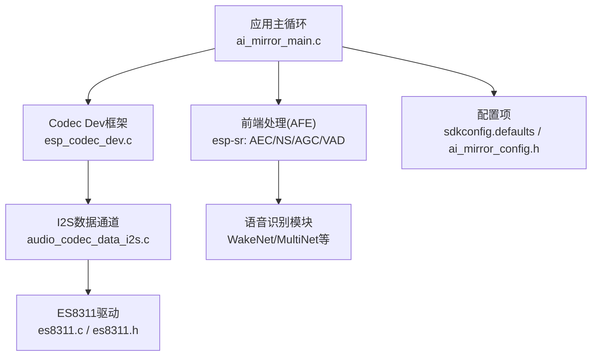
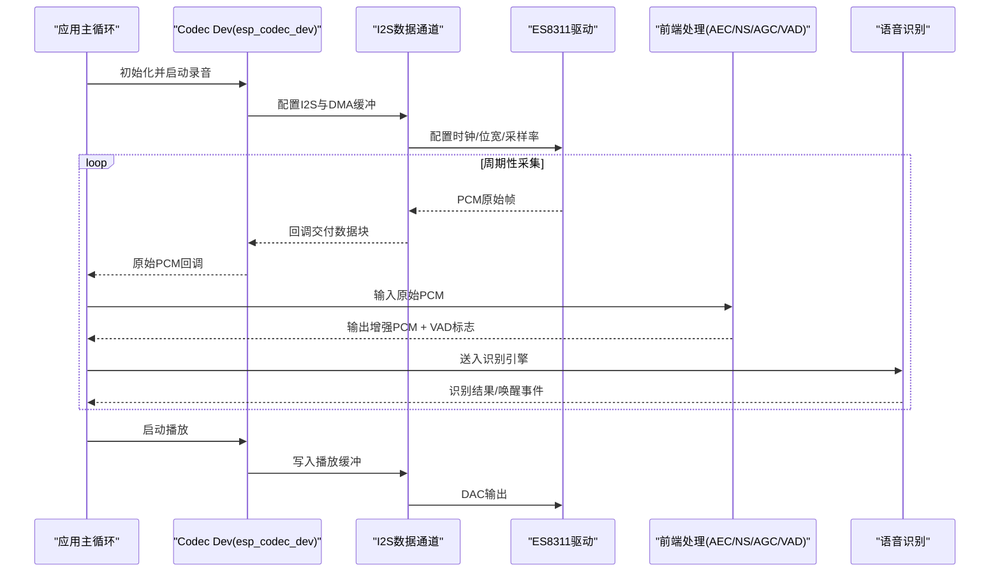
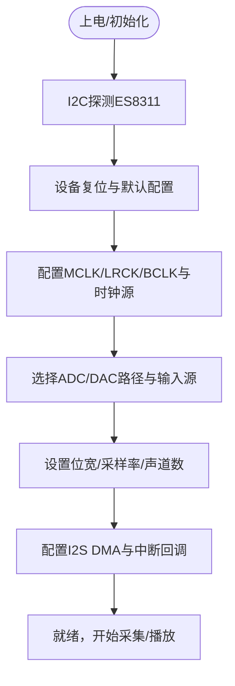
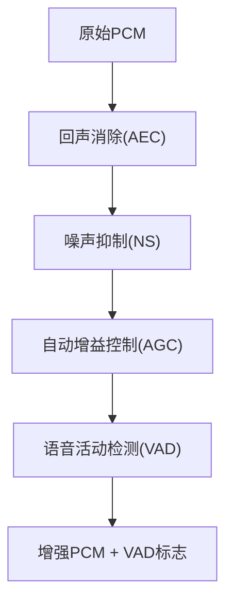
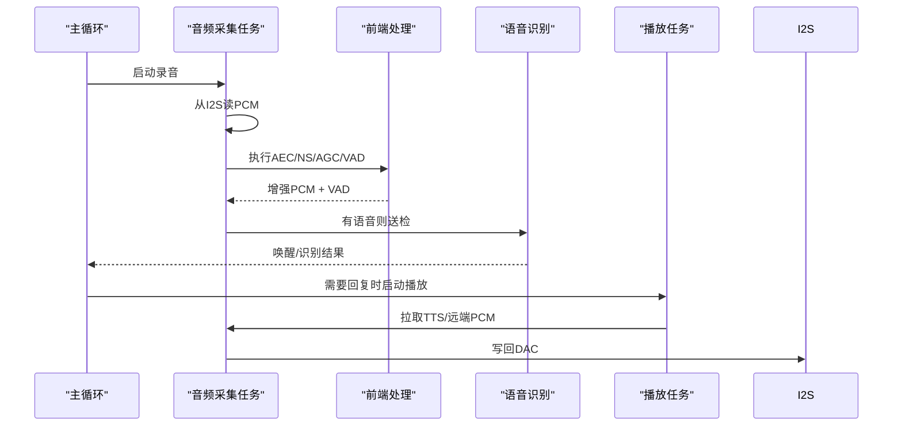
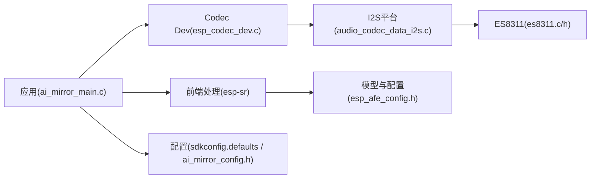

# 音频处理

<cite>
**本文引用的文件**   
- [ai_mirror_main.c](file://Firmware/esp32_ai_mirror/main/ai_mirror_main.c)
- [ai_mirror_config.h](file://Firmware/esp32_ai_mirror/main/ai_mirror_config.h)
- [es8311.c](file://Firmware/esp32_ai_mirror/managed_components/espressif__es8311/es8311.c)
- [es8311.h](file://Firmware/esp32_ai_mirror/managed_components/espressif__es8311/include/es8311.h)
- [esp_codec_dev.c](file://Firmware/esp32_ai_mirror/managed_components/espressif__esp_codec_dev/esp_codec_dev.c)
- [audio_codec_data_i2s.c](file://Firmware/esp32_ai_mirror/managed_components/espressif__esp_codec_dev/platform/audio_codec_data_i2s.c)
- [esp_afe_sr_1mic.ref](file://Firmware/esp32_ai_mirror/components/espressif__esp-sr/src/esp_afe_sr_1mic.ref)
- [esp_afe_config.h](file://Firmware/esp32_ai_mirror/components/espressif__esp-sr/include/esp_afe_config.h)
- [esp_aec.h](file://Firmware/esp32_ai_mirror/components/espressif__esp-sr/include/esp_aec.h)
- [esp_ns.h](file://Firmware/esp32_ai_mirror/components/espressif__esp-sr/include/esp_ns.h)
- [esp_agc.h](file://Firmware/esp32_ai_mirror/components/espressif__esp-sr/include/esp_agc.h)
- [esp_vad.h](file://Firmware/esp32_ai_mirror/components/espressif__esp-sr/include/esp_vad.h)
- [sdkconfig.defaults](file://Firmware/esp32_ai_mirror/sdkconfig.defaults)
</cite>

## 目录
1. [简介](#简介)
2. [项目结构](#项目结构)
3. [核心组件](#核心组件)
4. [架构总览](#架构总览)
5. [详细组件分析](#详细组件分析)
6. [依赖关系分析](#依赖关系分析)
7. [性能考虑](#性能考虑)
8. [故障排查指南](#故障排查指南)
9. [结论](#结论)
10. [附录](#附录)

## 简介
本文件面向AI镜子音频处理系统，围绕基于ES8311的音频采集与播放链路，系统阐述前处理算法（噪声抑制、自动增益控制、回声消除、语音活动检测）的实现与优化策略，并说明DSP算法在嵌入式环境中的实现要点、音频格式转换、采样率配置与缓冲区管理。文档同时给出与语音识别模块的数据接口约定与实时性要求，以及质量调优方法与常见问题排查建议，帮助开发者快速定位问题并提升整体音频体验。

## 项目结构
本项目采用分层模块化设计：
- 应用层：main入口与业务逻辑，负责初始化各子系统、调度音频采集/播放任务、与前处理及语音识别模块交互。
- 驱动层：ES8311编解码器驱动与ESP Codec Dev框架，提供I2S数据通路、时钟与音量控制等能力。
- 算法层：esp-sr的前端处理库（AEC/NS/AGC/VAD），通过统一接口接入音频流。
- 配置层：sdkconfig与项目头文件集中管理采样率、缓冲区大小、I2S引脚、算法参数等。

图示来源
- [ai_mirror_main.c](file://Firmware/esp32_ai_mirror/main/ai_mirror_main.c)
- [esp_codec_dev.c](file://Firmware/esp32_ai_mirror/managed_components/espressif__esp_codec_dev/esp_codec_dev.c)
- [audio_codec_data_i2s.c](file://Firmware/esp32_ai_mirror/managed_components/espressif__esp_codec_dev/platform/audio_codec_data_i2s.c)
- [es8311.c](file://Firmware/esp32_ai_mirror/managed_components/espressif__es8311/es8311.c)
- [es8311.h](file://Firmware/esp32_ai_mirror/managed_components/espressif__es8311/include/es8311.h)
- [esp_afe_config.h](file://Firmware/esp32_ai_mirror/components/espressif__esp-sr/include/esp_afe_config.h)
- [sdkconfig.defaults](file://Firmware/esp32_ai_mirror/sdkconfig.defaults)

章节来源
- [ai_mirror_main.c](file://Firmware/esp32_ai_mirror/main/ai_mirror_main.c)
- [sdkconfig.defaults](file://Firmware/esp32_ai_mirror/sdkconfig.defaults)

## 核心组件
- ES8311编解码器驱动：封装I2C寄存器配置、I2S数据收发、时钟与MCLK/LRCK/BCLK设置，支持单/双声道、不同位宽与采样率。
- ESP Codec Dev框架：抽象ADC/DAC、音量、数据回调与事件，屏蔽底层差异，向上提供统一API。
- I2S数据通道：负责DMA缓冲、中断回调、数据搬运与对齐，保证低延迟稳定吞吐。
- esp-sr前端处理：提供AEC（回声消除）、NS（噪声抑制）、AGC（自动增益控制）、VAD（语音活动检测）的统一接口与模型配置。
- 应用主循环：协调采集、前处理、识别与播放，维护状态机与资源生命周期。

章节来源
- [es8311.c](file://Firmware/esp32_ai_mirror/managed_components/espressif__es8311/es8311.c)
- [es8311.h](file://Firmware/esp32_ai_mirror/managed_components/espressif__es8311/include/es8311.h)
- [esp_codec_dev.c](file://Firmware/esp32_ai_mirror/managed_components/espressif__esp_codec_dev/esp_codec_dev.c)
- [audio_codec_data_i2s.c](file://Firmware/esp32_ai_mirror/managed_components/espressif__esp_codec_dev/platform/audio_codec_data_i2s.c)
- [esp_afe_config.h](file://Firmware/esp32_ai_mirror/components/espressif__esp-sr/include/esp_afe_config.h)

## 架构总览
下图展示从麦克风到扬声器/喇叭的端到端路径，以及前处理与识别模块的集成方式。

图示来源
- [ai_mirror_main.c](file://Firmware/esp32_ai_mirror/main/ai_mirror_main.c)
- [esp_codec_dev.c](file://Firmware/esp32_ai_mirror/managed_components/espressif__esp_codec_dev/esp_codec_dev.c)
- [audio_codec_data_i2s.c](file://Firmware/esp32_ai_mirror/managed_components/espressif__esp_codec_dev/platform/audio_codec_data_i2s.c)
- [es8311.c](file://Firmware/esp32_ai_mirror/managed_components/espressif__es8311/es8311.c)
- [esp_afe_config.h](file://Firmware/esp32_ai_mirror/components/espressif__esp-sr/include/esp_afe_config.h)

## 详细组件分析

### ES8311编解码器与I2S数据通路
- 初始化流程：I2C总线探测、复位、时钟树配置（MCLK/LRCK/BCLK）、ADC/DAC路径选择、位宽与采样率设定。
- 数据通路：I2S DMA环形缓冲，中断触发回调将数据递交上层；播放侧由上层填充PCM至I2S发送队列。
- 关键配置：采样率（如16kHz）、位深（16bit）、声道数（单声道用于采集，立体声或单声道用于播放）、音量与静音控制。

图示来源
- [es8311.c](file://Firmware/esp32_ai_mirror/managed_components/espressif__es8311/es8311.c)
- [es8311.h](file://Firmware/esp32_ai_mirror/managed_components/espressif__es8311/include/es8311.h)
- [audio_codec_data_i2s.c](file://Firmware/esp32_ai_mirror/managed_components/espressif__esp_codec_dev/platform/audio_codec_data_i2s.c)

章节来源
- [es8311.c](file://Firmware/esp32_ai_mirror/managed_components/espressif__es8311/es8311.c)
- [audio_codec_data_i2s.c](file://Firmware/esp32_ai_mirror/managed_components/espressif__esp_codec_dev/platform/audio_codec_data_i2s.c)

### 音频前处理管线（AEC/NS/AGC/VAD）
- 输入：来自I2S的原始PCM（通常为16kHz/16bit/单声道）。
- 处理顺序：通常先进行AEC（若存在本地播放回放参考），再NS降噪，随后AGC增益归一化，最后VAD判断是否包含语音。
- 输出：增强后的PCM与VAD标志，供语音识别使用。

图示来源
- [esp_aec.h](file://Firmware/esp32_ai_mirror/components/espressif__esp-sr/include/esp_aec.h)
- [esp_ns.h](file://Firmware/esp32_ai_mirror/components/espressif__esp-sr/include/esp_ns.h)
- [esp_agc.h](file://Firmware/esp32_ai_mirror/components/espressif__esp-sr/include/esp_agc.h)
- [esp_vad.h](file://Firmware/esp32_ai_mirror/components/espressif__esp-sr/include/esp_vad.h)
- [esp_afe_config.h](file://Firmware/esp32_ai_mirror/components/espressif__esp-sr/include/esp_afe_config.h)

章节来源
- [esp_aec.h](file://Firmware/esp32_ai_mirror/components/espressif__esp-sr/include/esp_aec.h)
- [esp_ns.h](file://Firmware/esp32_ai_mirror/components/espressif__esp-sr/include/esp_ns.h)
- [esp_agc.h](file://Firmware/esp32_ai_mirror/components/espressif__esp-sr/include/esp_agc.h)
- [esp_vad.h](file://Firmware/esp32_ai_mirror/components/espressif__esp-sr/include/esp_vad.h)
- [esp_afe_config.h](file://Firmware/esp32_ai_mirror/components/espressif__esp-sr/include/esp_afe_config.h)

### 应用主循环与任务调度
- 启动阶段：初始化显示、网络、音频子系统（Codec Dev + ES8311），创建前处理实例与识别引擎。
- 运行阶段：周期性从I2S读取PCM，送入前处理，根据VAD触发识别；播放时从识别或TTS获取PCM，经I2S输出。
- 资源管理：合理分配/释放缓冲区，避免内存碎片；使用线程/任务隔离音频与UI/网络任务。

图示来源
- [ai_mirror_main.c](file://Firmware/esp32_ai_mirror/main/ai_mirror_main.c)
- [esp_codec_dev.c](file://Firmware/esp32_ai_mirror/managed_components/espressif__esp_codec_dev/esp_codec_dev.c)

章节来源
- [ai_mirror_main.c](file://Firmware/esp32_ai_mirror/main/ai_mirror_main.c)

### 音频格式转换、采样率与缓冲区管理
- 格式与采样率：采集与识别常用16kHz/16bit/单声道；播放可复用相同格式以简化链路。如需跨采样率，应在前处理前后插入重采样模块。
- 缓冲区：I2S DMA分片大小需与算法帧长匹配（例如每帧10ms=160样本@16kHz），避免跨帧切割导致算法失效。
- 对齐与拷贝：确保字节序、对齐与填充一致，减少CPU拷贝开销；优先使用零拷贝或最小拷贝策略。

章节来源
- [sdkconfig.defaults](file://Firmware/esp32_ai_mirror/sdkconfig.defaults)
- [esp_codec_dev.c](file://Firmware/esp32_ai_mirror/managed_components/espressif__esp_codec_dev/esp_codec_dev.c)
- [audio_codec_data_i2s.c](file://Firmware/esp32_ai_mirror/managed_components/espressif__esp_codec_dev/platform/audio_codec_data_i2s.c)

### 与语音识别模块的数据接口与实时性
- 数据接口：统一为固定采样率与位深的PCM流，按帧推送；VAD标志作为触发条件，降低无效识别负载。
- 实时性：端到端延迟目标一般<200ms；I2S分片与算法帧长应使处理流水线保持连续无停顿。
- 错误恢复：当VAD持续为“无声”时，可降低识别频率或进入低功耗监听模式；异常时自动重启音频任务。

章节来源
- [esp_afe_config.h](file://Firmware/esp32_ai_mirror/components/espressif__esp-sr/include/esp_afe_config.h)
- [esp_vad.h](file://Firmware/esp32_ai_mirror/components/espressif__esp-sr/include/esp_vad.h)

## 依赖关系分析
- 应用依赖Codec Dev抽象，Codec Dev依赖I2S平台实现，I2S平台依赖ES8311驱动。
- 前端处理依赖esp-sr提供的AEC/NS/AGC/VAD接口与模型配置。
- 配置项集中在sdkconfig与项目头文件中，影响I2S、采样率、缓冲区与算法参数。

图示来源
- [ai_mirror_main.c](file://Firmware/esp32_ai_mirror/main/ai_mirror_main.c)
- [esp_codec_dev.c](file://Firmware/esp32_ai_mirror/managed_components/espressif__esp_codec_dev/esp_codec_dev.c)
- [audio_codec_data_i2s.c](file://Firmware/esp32_ai_mirror/managed_components/espressif__esp_codec_dev/platform/audio_codec_data_i2s.c)
- [es8311.c](file://Firmware/esp32_ai_mirror/managed_components/espressif__es8311/es8311.c)
- [es8311.h](file://Firmware/esp32_ai_mirror/managed_components/espressif__es8311/include/es8311.h)
- [esp_afe_config.h](file://Firmware/esp32_ai_mirror/components/espressif__esp-sr/include/esp_afe_config.h)
- [sdkconfig.defaults](file://Firmware/esp32_ai_mirror/sdkconfig.defaults)

章节来源
- [ai_mirror_main.c](file://Firmware/esp32_ai_mirror/main/ai_mirror_main.c)
- [sdkconfig.defaults](file://Firmware/esp32_ai_mirror/sdkconfig.defaults)

## 性能考虑
- I2S与DMA：增大分片可减少中断次数但增加延迟；建议在10~20ms之间折中，结合算法帧长对齐。
- 前处理复杂度：AEC对计算敏感，需限制滤波器长度与更新步长；NS/AGC可采用轻量级参数集。
- 内存占用：避免频繁动态分配，预分配固定大小缓冲；使用环形缓冲减少拷贝。
- CPU利用率：将音频任务置于高优先级，UI/网络任务降权；必要时启用硬件加速（如DSP库）。
- 功耗管理：在无语音时关闭非必要外设，降低采样率或进入低功耗监听模式。

## 故障排查指南
- 无声或底噪大
  - 检查ES8311 ADC路径与增益配置是否正确。
  - 确认I2S时钟与位宽与驱动一致。
  - 调整NS强度与AGC目标电平。
- 回声未消除
  - 确认AEC参考信号（播放输出）与采集信号同步。
  - 调整AEC收敛参数与环境建模长度。
- 识别率低
  - 检查VAD阈值与误报率；适当放宽或收紧。
  - 确认输入采样率与识别模型一致。
- 卡顿或爆音
  - 检查I2S DMA缓冲不足或溢出；增大缓冲或降低处理耗时。
  - 避免在主循环中进行耗时操作。
- 无法初始化
  - 检查I2C地址与引脚定义；查看电源与复位时序。

章节来源
- [es8311.c](file://Firmware/esp32_ai_mirror/managed_components/espressif__es8311/es8311.c)
- [audio_codec_data_i2s.c](file://Firmware/esp32_ai_mirror/managed_components/espressif__esp_codec_dev/platform/audio_codec_data_i2s.c)
- [esp_afe_config.h](file://Firmware/esp32_ai_mirror/components/espressif__esp-sr/include/esp_afe_config.h)

## 结论
本系统以ES8311为核心编解码器，结合ESP Codec Dev与I2S数据通路，构建稳定的音频采集与播放链路；通过esp-sr前端处理实现AEC/NS/AGC/VAD，显著提升语音识别鲁棒性与用户体验。合理的采样率、缓冲区与任务调度策略是保障低延迟与高可靠性的关键。通过本文档的配置与调优建议，可快速定位问题并达到预期音质与响应速度。

## 附录
- 典型参数建议
  - 采样率：16kHz；位深：16bit；声道：采集单声道，播放可按需求。
  - I2S分片：10~20ms；算法帧长：10ms（160样本@16kHz）。
  - AEC：滤波器长度与环境建模长度按房间大小调节。
  - NS：初始中等强度，依据环境噪声自适应调整。
  - AGC：目标电平适中，避免削波。
  - VAD：阈值按场景微调，平衡漏检与误报。
- 相关参考
  - 前端参考实现与配置：esp_afe_sr_1mic.ref
  - 配置项位置：sdkconfig.defaults、ai_mirror_config.h

章节来源
- [esp_afe_sr_1mic.ref](file://Firmware/esp32_ai_mirror/components/espressif__esp-sr/src/esp_afe_sr_1mic.ref)
- [sdkconfig.defaults](file://Firmware/esp32_ai_mirror/sdkconfig.defaults)
- [ai_mirror_config.h](file://Firmware/esp32_ai_mirror/main/ai_mirror_config.h)