# 音频播放

<cite>
**本文引用的文件**   
- [ai_mirror_main.c](file://Firmware/esp32_ai_mirror/main/ai_mirror_main.c)
- [board_buttons.c](file://Firmware/esp32_ai_mirror/main/board_buttons.c)
- [board_buttons.h](file://Firmware/esp32_ai_mirror/main/board_buttons.h)
- [es8311.c](file://Firmware/esp32_ai_mirror/managed_components/espressif__es8311/es8311.c)
- [es8311.h](file://Firmware/esp32_ai_mirror/managed_components/espressif__es8311/include/es8311.h)
- [esp_codec_dev.c](file://Firmware/esp32_ai_mirror/managed_components/espressif__esp_codec_dev/esp_codec_dev.c)
- [esp_codec_dev_if.c](file://Firmware/esp32_ai_mirror/managed_components/espressif__esp_codec_dev/esp_codec_dev_if.c)
- [audio_codec_data_i2s.c](file://Firmware/esp32_ai_mirror/managed_components/espressif__esp_codec_dev/platform/audio_codec_data_i2s.c)
- [audio_codec_sw_vol.c](file://Firmware/esp32_ai_mirror/managed_components/espressif__esp_codec_dev/audio_codec_sw_vol.c)
- [esp_tts_chinese.c](file://Firmware/esp32_ai_mirror/components/espressif__esp-sr/esp-tts/esp_tts_chinese/esp32/esp_tts_chinese.c)
- [CMakeLists.txt](file://Firmware/esp32_ai_mirror/CMakeLists.txt)
- [sdkconfig.defaults](file://Firmware/esp32_ai_mirror/sdkconfig.defaults)
</cite>

## 目录
1. [简介](#简介)
2. [项目结构](#项目结构)
3. [核心组件](#核心组件)
4. [架构总览](#架构总览)
5. [详细组件分析](#详细组件分析)
6. [依赖关系分析](#依赖关系分析)
7. [性能与延迟优化](#性能与延迟优化)
8. [故障排查指南](#故障排查指南)
9. [结论](#结论)
10. [附录](#附录)

## 简介
本文件面向“小智”AI镜像设备的音频播放子系统，重点说明TTS语音合成数据的播放流程、缓冲管理、音频格式转换与D/A转换、播放质量控制与平滑技术、音量控制与静音处理、多路音频混合与优先级调度、网络音频流与本地文件播放支持，以及播放延迟优化与卡顿处理方法。文档以代码级为依据，结合ESP-IDF生态中的ESP Codec Dev、ES8311编解码器驱动、ESP-TTS中文语音合成等模块进行系统化阐述。

## 项目结构
本项目采用分层与模块化组织：
- 应用层（main）：业务入口、任务调度、事件处理、UI交互与音频状态机。
- 音频驱动层（managed_components）：I2S数据通道、Codec设备抽象、音量与静音控制、硬件寄存器配置。
- 算法与模型层（components）：ESP-TTS中文语音合成、DSP工具链（可选）。
- 构建与配置：CMake与sdkconfig用于启用I2S、ESP Codec Dev、TTS等特性。

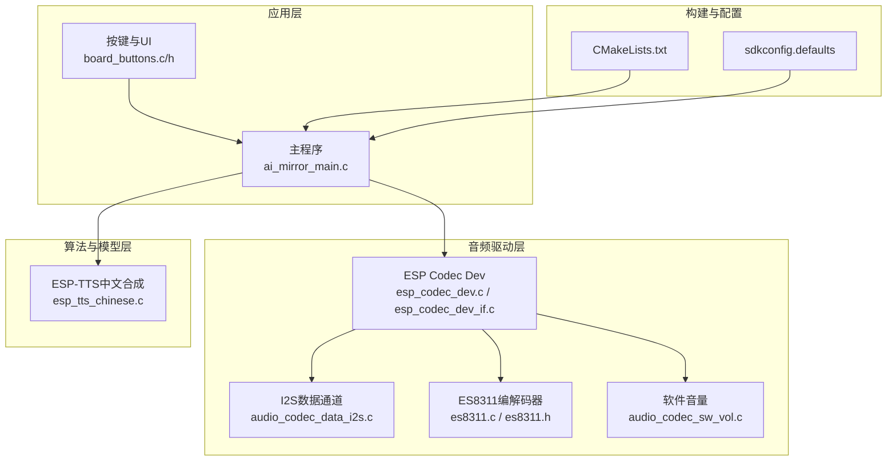

图表来源
- [ai_mirror_main.c](file://Firmware/esp32_ai_mirror/main/ai_mirror_main.c)
- [board_buttons.c](file://Firmware/esp32_ai_mirror/main/board_buttons.c)
- [esp_codec_dev.c](file://Firmware/esp32_ai_mirror/managed_components/espressif__esp_codec_dev/esp_codec_dev.c)
- [audio_codec_data_i2s.c](file://Firmware/esp32_ai_mirror/managed_components/espressif__esp_codec_dev/platform/audio_codec_data_i2s.c)
- [es8311.c](file://Firmware/esp32_ai_mirror/managed_components/espressif__es8311/es8311.c)
- [audio_codec_sw_vol.c](file://Firmware/esp32_ai_mirror/managed_components/espressif__esp_codec_dev/audio_codec_sw_vol.c)
- [esp_tts_chinese.c](file://Firmware/esp32_ai_mirror/components/espressif__esp-sr/esp-tts/esp_tts_chinese/esp32/esp_tts_chinese.c)
- [CMakeLists.txt](file://Firmware/esp32_ai_mirror/CMakeLists.txt)
- [sdkconfig.defaults](file://Firmware/esp32_ai_mirror/sdkconfig.defaults)

章节来源
- [CMakeLists.txt](file://Firmware/esp32_ai_mirror/CMakeLists.txt)
- [sdkconfig.defaults](file://Firmware/esp32_ai_mirror/sdkconfig.defaults)

## 核心组件
- ESP Codec Dev：统一的音频设备抽象，封装I2S数据通道、采样率/位深/声道配置、音量与静音控制、设备打开/关闭/暂停/恢复等生命周期管理。
- ES8311编解码器驱动：通过I2C配置寄存器，设置ADC/DAC路径、增益、滤波、时钟源等。
- I2S数据通道：负责PCM帧的DMA传输，提供环形缓冲与中断回调，保证稳定吞吐。
- 软件音量控制：在PCM域对样本进行缩放，实现无级音量调节与静音。
- ESP-TTS中文合成：将文本转换为PCM音频流，输出固定采样率与位深的PCM帧，供播放器消费。

章节来源
- [esp_codec_dev.c](file://Firmware/esp32_ai_mirror/managed_components/espressif__esp_codec_dev/esp_codec_dev.c)
- [esp_codec_dev_if.c](file://Firmware/esp32_ai_mirror/managed_components/espressif__esp_codec_dev/esp_codec_dev_if.c)
- [audio_codec_data_i2s.c](file://Firmware/esp32_ai_mirror/managed_components/espressif__esp_codec_dev/platform/audio_codec_data_i2s.c)
- [es8311.c](file://Firmware/esp32_ai_mirror/managed_components/espressif__es8311/es8311.c)
- [audio_codec_sw_vol.c](file://Firmware/esp32_ai_mirror/managed_components/espressif__esp_codec_dev/audio_codec_sw_vol.c)
- [esp_tts_chinese.c](file://Firmware/esp32_ai_mirror/components/espressif__esp-sr/esp-tts/esp-tts_chinese/esp32/esp_tts_chinese.c)

## 架构总览
下图展示从TTS到DAC的端到端数据流与控制流，涵盖缓冲、格式转换、D/A与质量保障环节。

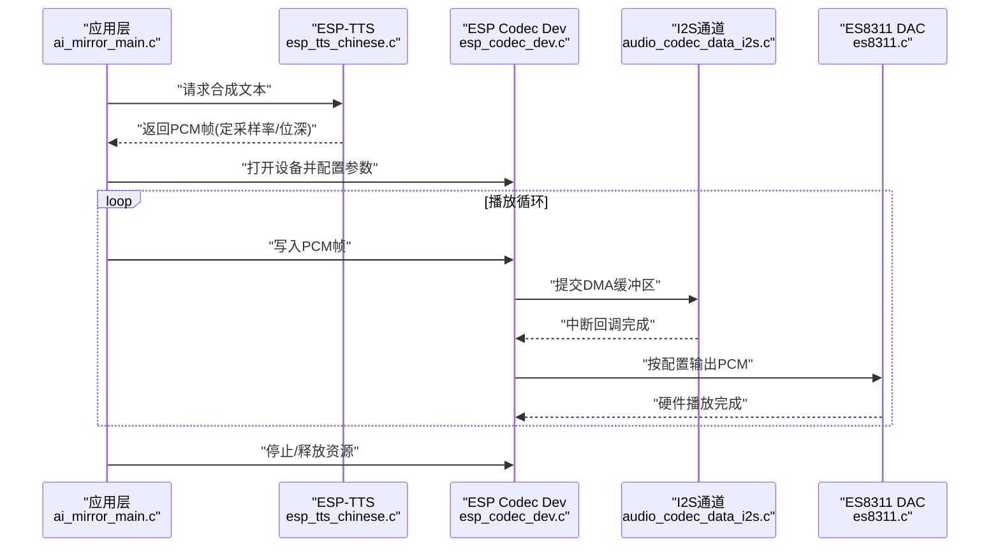

图表来源
- [ai_mirror_main.c](file://Firmware/esp32_ai_mirror/main/ai_mirror_main.c)
- [esp_tts_chinese.c](file://Firmware/esp32_ai_mirror/components/espressif__esp-sr/esp-tts/esp-tts_chinese/esp32/esp_tts_chinese.c)
- [esp_codec_dev.c](file://Firmware/esp32_ai_mirror/managed_components/espressif__esp_codec_dev/esp_codec_dev.c)
- [audio_codec_data_i2s.c](file://Firmware/esp32_ai_mirror/managed_components/espressif__esp_codec_dev/platform/audio_codec_data_i2s.c)
- [es8311.c](file://Firmware/esp32_ai_mirror/managed_components/espressif__es8311/es8311.c)

## 详细组件分析

### TTS语音合成与播放流程
- 输入：文本或SSML片段。
- 处理：ESP-TTS内部进行分词、声学模型推理、声码器生成，输出PCM流。
- 输出：固定采样率（如16kHz）、位深（如16bit）、单/双声道PCM帧。
- 播放：应用层将PCM帧写入ESP Codec Dev，由I2S DMA推送到ES8311 DAC。

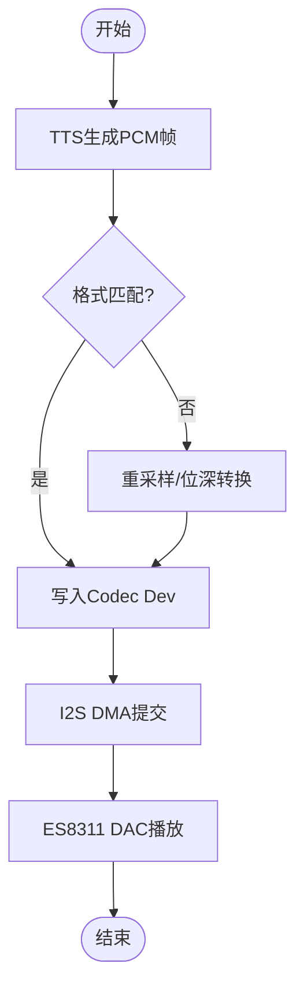

图表来源
- [esp_tts_chinese.c](file://Firmware/esp32_ai_mirror/components/espressif__esp-sr/esp-tts/esp-tts_chinese/esp32/esp_tts_chinese.c)
- [esp_codec_dev.c](file://Firmware/esp32_ai_mirror/managed_components/espressif__esp_codec_dev/esp_codec_dev.c)
- [audio_codec_data_i2s.c](file://Firmware/esp32_ai_mirror/managed_components/espressif__esp_codec_dev/platform/audio_codec_data_i2s.c)
- [es8311.c](file://Firmware/esp32_ai_mirror/managed_components/espressif__es8311/es8311.c)

章节来源
- [esp_tts_chinese.c](file://Firmware/esp32_ai_mirror/components/espressif__esp-sr/esp-tts/esp-tts_chinese/esp32/esp_tts_chinese.c)
- [esp_codec_dev.c](file://Firmware/esp32_ai_mirror/managed_components/espressif__esp_codec_dev/esp_codec_dev.c)

### 缓冲管理与数据流
- 生产者：TTS或网络/本地文件读取线程。
- 消费者：I2S DMA中断驱动的播放线程。
- 缓冲策略：环形缓冲+双缓冲，避免阻塞；根据I2S FIFO大小与中断周期调整队列长度。
- 背压机制：当缓冲接近上限时，降低生产者速率或丢弃低优先级数据。

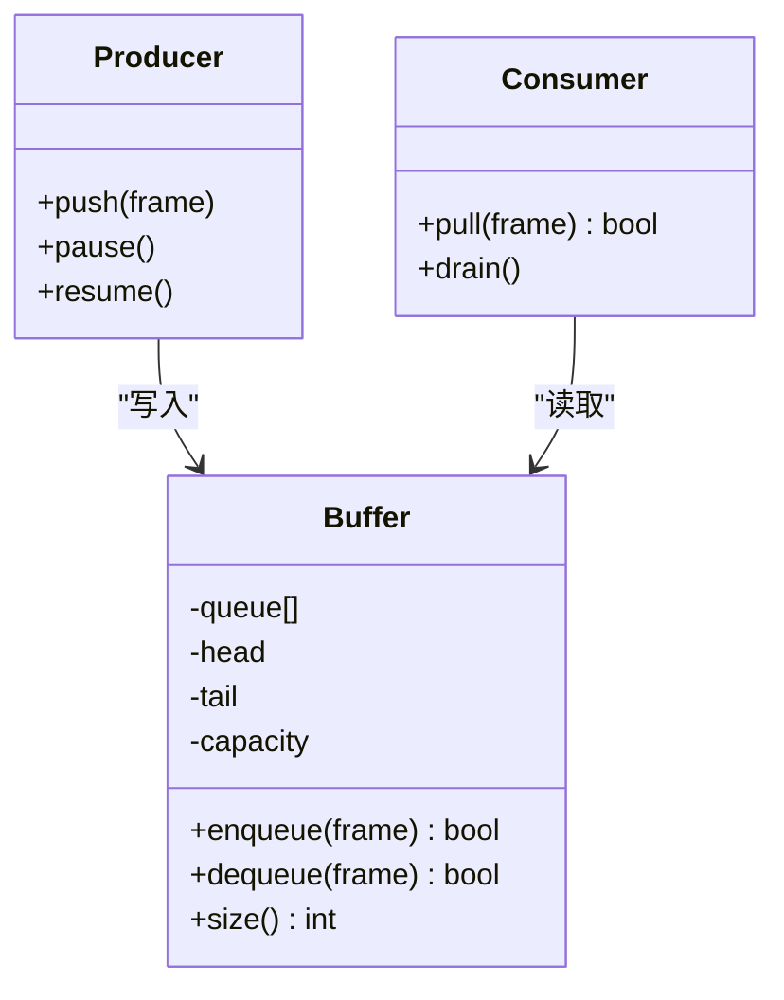

图表来源
- [audio_codec_data_i2s.c](file://Firmware/esp32_ai_mirror/managed_components/espressif__esp_codec_dev/platform/audio_codec_data_i2s.c)
- [esp_codec_dev.c](file://Firmware/esp32_ai_mirror/managed_components/espressif__esp_codec_dev/esp_codec_dev.c)

章节来源
- [audio_codec_data_i2s.c](file://Firmware/esp32_ai_mirror/managed_components/espressif__esp_codec_dev/platform/audio_codec_data_i2s.c)
- [esp_codec_dev.c](file://Firmware/esp32_ai_mirror/managed_components/espressif__esp_codec_dev/esp_codec_dev.c)

### 音频格式转换与D/A转换
- 格式转换：统一为I2S期望的采样率、位深、声道数；必要时进行重采样与量化转换。
- D/A转换：ES8311内部DAC将PCM数字信号转换为模拟音频输出；需正确配置时钟、MCLK/BCLK/LRCK。
- 路径选择：Line-out/Headphone/SPK输出路径与增益配置。

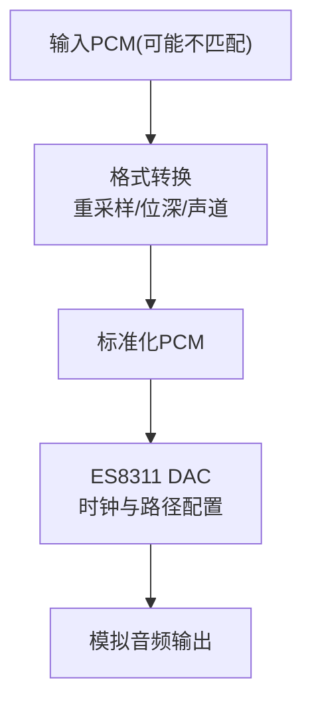

图表来源
- [esp_codec_dev.c](file://Firmware/esp32_ai_mirror/managed_components/espressif__esp_codec_dev/esp_codec_dev.c)
- [es8311.c](file://Firmware/esp32_ai_mirror/managed_components/espressif__es8311/es8311.c)

章节来源
- [esp_codec_dev.c](file://Firmware/esp32_ai_mirror/managed_components/espressif__esp_codec_dev/esp_codec_dev.c)
- [es8311.c](file://Firmware/esp32_ai_mirror/managed_components/espressif__es8311/es8311.c)

### 播放质量控制与音频平滑
- 平滑过渡：淡入淡出、交叉淡化，避免突变导致的爆音。
- 抖动抑制：基于时间戳对齐与缓冲水位自适应，减少卡顿与重复帧。
- 噪声门限：低电平静音阈值，消除底噪。

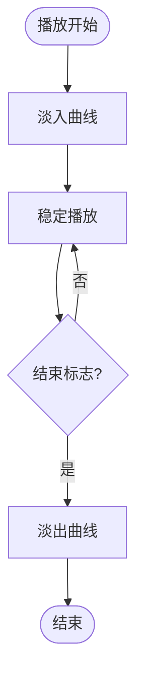

图表来源
- [audio_codec_sw_vol.c](file://Firmware/esp32_ai_mirror/managed_components/espressif__esp_codec_dev/audio_codec_sw_vol.c)
- [esp_codec_dev.c](file://Firmware/esp32_ai_mirror/managed_components/espressif__esp_codec_dev/esp_codec_dev.c)

章节来源
- [audio_codec_sw_vol.c](file://Firmware/esp32_ai_mirror/managed_components/espressif__esp_codec_dev/audio_codec_sw_vol.c)
- [esp_codec_dev.c](file://Firmware/esp32_ai_mirror/managed_components/espressif__esp_codec_dev/esp_codec_dev.c)

### 音量控制、静音处理与状态管理
- 音量控制：软件音量（PCM缩放）与硬件音量（ES8311寄存器）组合，实现精细控制。
- 静音处理：快速置零输出，支持软静音（渐变）与硬静音（瞬时）。
- 状态管理：空闲、播放中、暂停、停止、错误等状态机，配合事件回调通知上层。

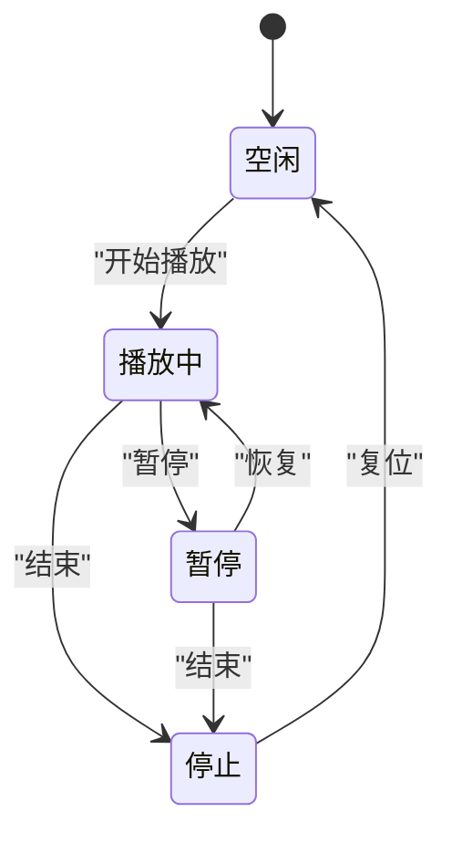

图表来源
- [esp_codec_dev.c](file://Firmware/esp32_ai_mirror/managed_components/espressif__esp_codec_dev/esp_codec_dev.c)
- [audio_codec_sw_vol.c](file://Firmware/esp32_ai_mirror/managed_components/espressif__esp_codec_dev/audio_codec_sw_vol.c)
- [es8311.c](file://Firmware/esp32_ai_mirror/managed_components/espressif__es8311/es8311.c)

章节来源
- [esp_codec_dev.c](file://Firmware/esp32_ai_mirror/managed_components/espressif__esp_codec_dev/esp_codec_dev.c)
- [audio_codec_sw_vol.c](file://Firmware/esp32_ai_mirror/managed_components/espressif__esp_codec_dev/audio_codec_sw_vol.c)
- [es8311.c](file://Firmware/esp32_ai_mirror/managed_components/espressif__es8311/es8311.c)

### 多路音频混合与优先级调度
- 混合策略：线性叠加或加权混合，限制峰值防止削波；支持动态混音（TTS优先于媒体）。
- 优先级：系统提示音 > TTS > 媒体音乐 > 背景音；高优先级可抢占或衰减低优先级。
- 路由：通过Codec Dev的多路输入接口或软件混音器实现。

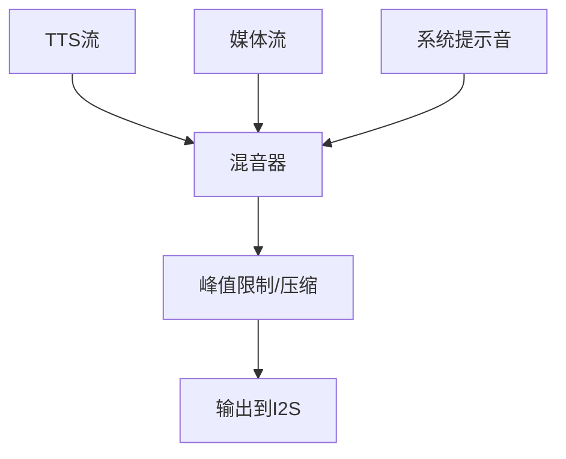

图表来源
- [esp_codec_dev.c](file://Firmware/esp32_ai_mirror/managed_components/espressif__esp_codec_dev/esp_codec_dev.c)
- [audio_codec_sw_vol.c](file://Firmware/esp32_ai_mirror/managed_components/espressif__esp_codec_dev/audio_codec_sw_vol.c)

章节来源
- [esp_codec_dev.c](file://Firmware/esp32_ai_mirror/managed_components/espressif__esp_codec_dev/esp_codec_dev.c)
- [audio_codec_sw_vol.c](file://Firmware/esp32_ai_mirror/managed_components/espressif__esp_codec_dev/audio_codec_sw_vol.c)

### 网络音频流与本地文件播放支持
- 网络流：HTTP/RTSP/UDP等协议接收数据包，解封装后转为PCM；使用缓冲与丢包策略保证流畅。
- 本地文件：SPIFFS/SD卡读取，解析容器格式（MP3/AAC/WAV），解码为PCM。
- 统一接口：通过ESP Codec Dev的写接口接入，屏蔽底层差异。

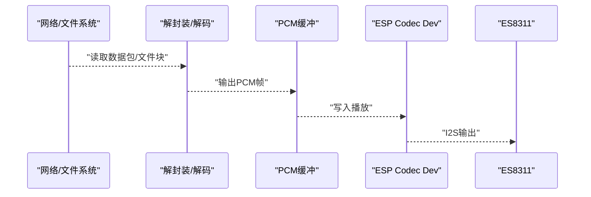

图表来源
- [esp_codec_dev.c](file://Firmware/esp32_ai_mirror/managed_components/espressif__esp_codec_dev/esp_codec_dev.c)
- [audio_codec_data_i2s.c](file://Firmware/esp32_ai_mirror/managed_components/espressif__esp_codec_dev/platform/audio_codec_data_i2s.c)

章节来源
- [esp_codec_dev.c](file://Firmware/esp32_ai_mirror/managed_components/espressif__esp_codec_dev/esp_codec_dev.c)
- [audio_codec_data_i2s.c](file://Firmware/esp32_ai_mirror/managed_components/espressif__esp_codec_dev/platform/audio_codec_data_i2s.c)

### 播放延迟优化与卡顿处理
- 延迟优化：减小缓冲队列、提高I2S中断频率、预取数据、批量化写入。
- 卡顿处理：水位监控与自适应扩容、丢帧策略、插值补帧、重传（网络场景）。
- 同步机制：时间戳对齐、A/V同步（若涉及视频）、播放进度回环。

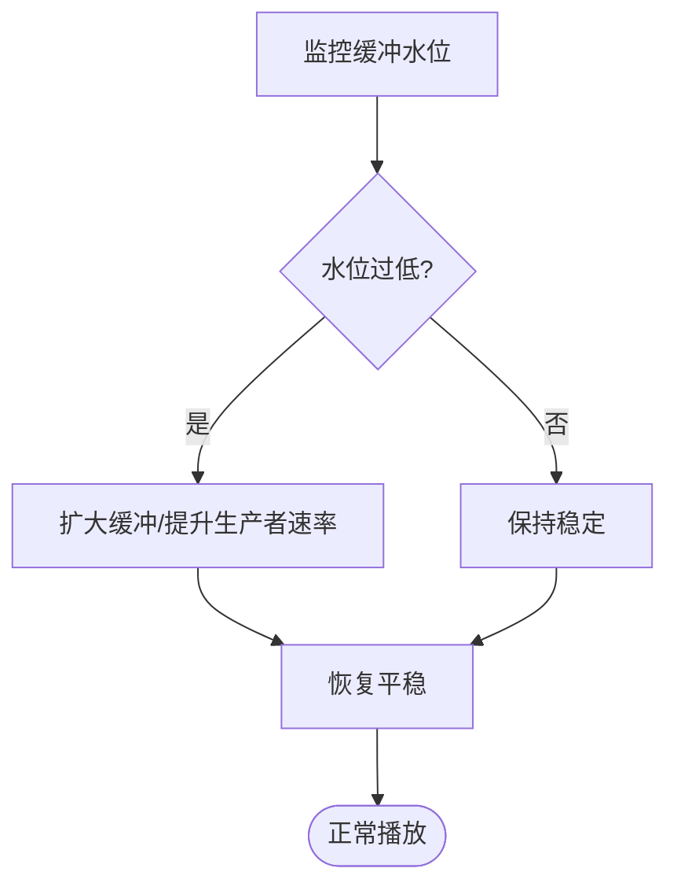

图表来源
- [audio_codec_data_i2s.c](file://Firmware/esp32_ai_mirror/managed_components/espressif__esp_codec_dev/platform/audio_codec_data_i2s.c)
- [esp_codec_dev.c](file://Firmware/esp32_ai_mirror/managed_components/espressif__esp_codec_dev/esp_codec_dev.c)

章节来源
- [audio_codec_data_i2s.c](file://Firmware/esp32_ai_mirror/managed_components/espressif__esp_codec_dev/platform/audio_codec_data_i2s.c)
- [esp_codec_dev.c](file://Firmware/esp32_ai_mirror/managed_components/espressif__esp_codec_dev/esp_codec_dev.c)

## 依赖关系分析
- 应用层依赖ESP Codec Dev提供的统一API，间接依赖I2S与ES8311驱动。
- ESP Codec Dev依赖平台I2S数据通道与硬件寄存器访问。
- TTS模块独立于播放链路，仅输出PCM帧，便于复用。

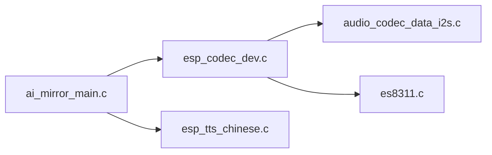

图表来源
- [ai_mirror_main.c](file://Firmware/esp32_ai_mirror/main/ai_mirror_main.c)
- [esp_codec_dev.c](file://Firmware/esp32_ai_mirror/managed_components/espressif__esp_codec_dev/esp_codec_dev.c)
- [audio_codec_data_i2s.c](file://Firmware/esp32_ai_mirror/managed_components/espressif__esp_codec_dev/platform/audio_codec_data_i2s.c)
- [es8311.c](file://Firmware/esp32_ai_mirror/managed_components/espressif__es8311/es8311.c)
- [esp_tts_chinese.c](file://Firmware/esp32_ai_mirror/components/espressif__esp-sr/esp-tts/esp-tts_chinese/esp32/esp_tts_chinese.c)

章节来源
- [ai_mirror_main.c](file://Firmware/esp32_ai_mirror/main/ai_mirror_main.c)
- [esp_codec_dev.c](file://Firmware/esp32_ai_mirror/managed_components/espressif__esp_codec_dev/esp_codec_dev.c)
- [audio_codec_data_i2s.c](file://Firmware/esp32_ai_mirror/managed_components/espressif__esp_codec_dev/platform/audio_codec_data_i2s.c)
- [es8311.c](file://Firmware/esp32_ai_mirror/managed_components/espressif__es8311/es8311.c)
- [esp_tts_chinese.c](file://Firmware/esp32_ai_mirror/components/espressif__esp-sr/esp-tts/esp-tts_chinese/esp32/esp_tts_chinese.c)

## 性能与延迟优化
- 合理设置I2S缓冲区大小与中断粒度，平衡CPU占用与延迟。
- 使用批量写入与零拷贝策略，减少内存复制开销。
- 针对TTS与网络流，采用异步生产与消费者模式，避免阻塞。
- 动态调整采样率与位深，权衡音质与算力。
- 启用硬件加速（如DSP库）进行重采样与混音。

[本节为通用指导，无需特定文件引用]

## 故障排查指南
- 无声或杂音：检查ES8311时钟配置、I2S引脚映射、音量与静音状态。
- 卡顿与爆音：观察缓冲水位，调整队列长度与生产者速率；启用淡入淡出。
- 播放不同步：核对时间戳与采样率一致性；检查网络丢包与重传策略。
- 资源泄漏：确认设备打开/关闭配对，释放缓冲区与句柄。

章节来源
- [es8311.c](file://Firmware/esp32_ai_mirror/managed_components/espressif__es8311/es8311.c)
- [audio_codec_data_i2s.c](file://Firmware/esp32_ai_mirror/managed_components/espressif__esp_codec_dev/platform/audio_codec_data_i2s.c)
- [esp_codec_dev.c](file://Firmware/esp32_ai_mirror/managed_components/espressif__esp_codec_dev/esp_codec_dev.c)

## 结论
本音频播放系统以ESP Codec Dev为核心，结合ES8311硬件驱动与ESP-TTS合成模块，构建了从文本到模拟音频的完整链路。通过合理的缓冲管理、格式转换、D/A配置与质量控制，实现了低延迟、稳定的语音播放体验。在多路混合与优先级调度方面具备扩展能力，适用于网络流与本地文件的统一播放场景。后续可通过DSP加速与更精细的缓冲策略进一步优化性能。

[本节为总结性内容，无需特定文件引用]

## 附录
- 关键配置项：I2S采样率、位深、声道数；ES8311时钟源与输出路径；音量范围与静音阈值。
- 调试建议：打印缓冲水位、中断计数、错误码；使用逻辑分析仪观测I2S波形。
- 最佳实践：预取数据、批量化写入、淡入淡出、峰值限制、动态混音。

[本节为补充信息，无需特定文件引用]