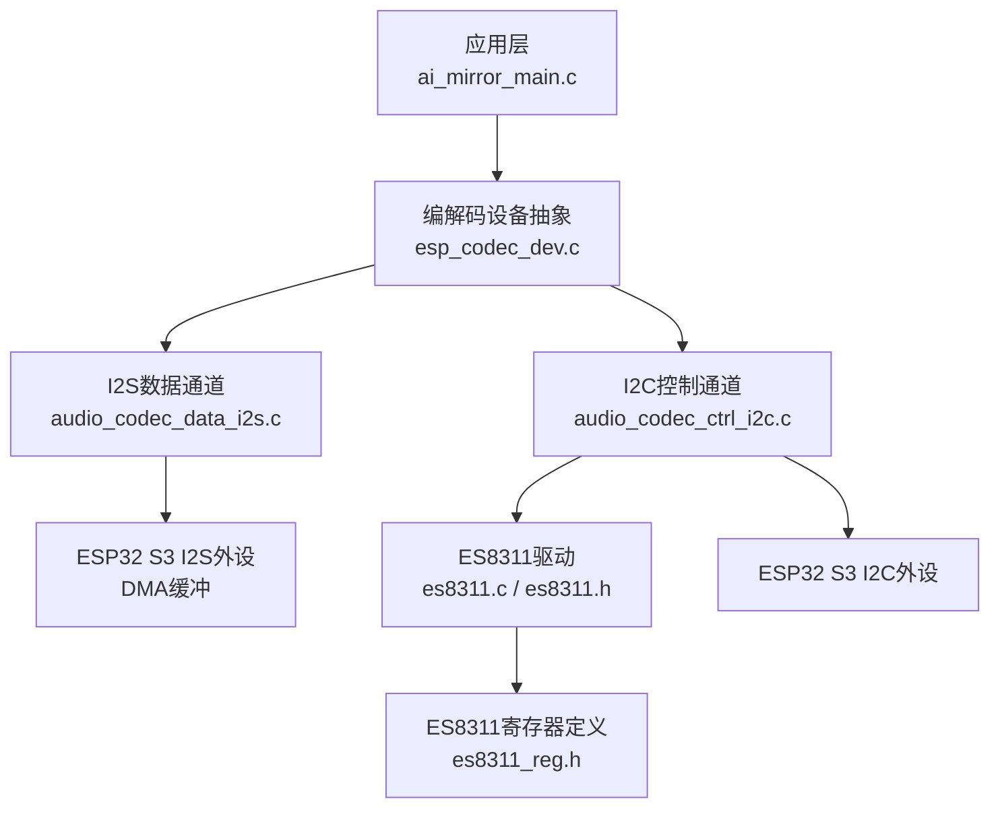
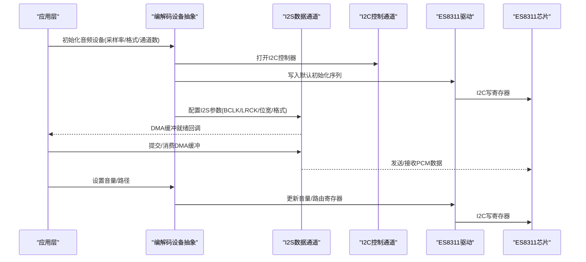
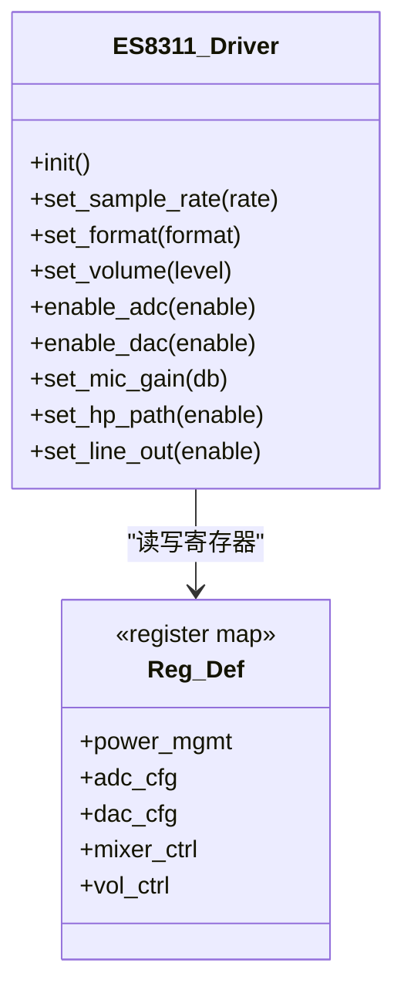
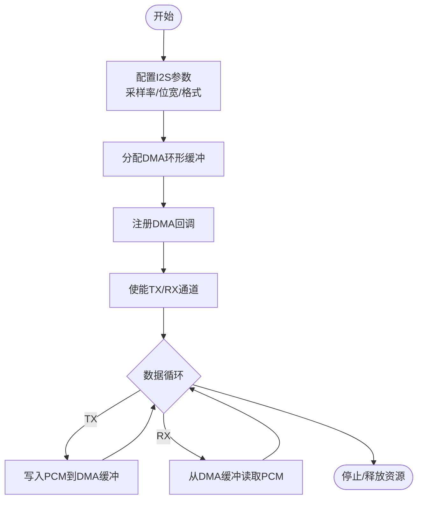
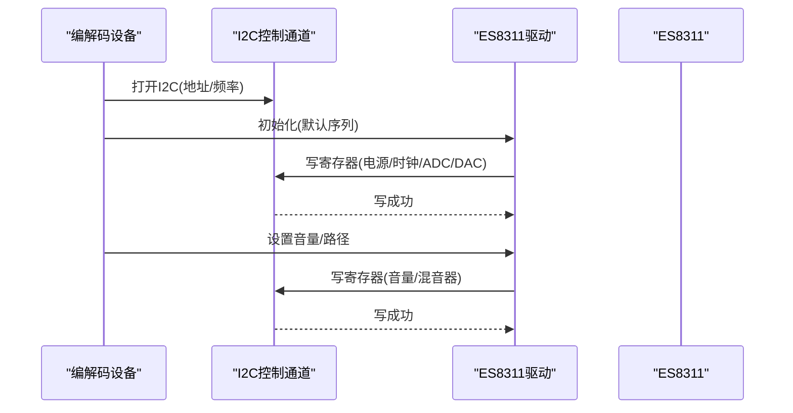
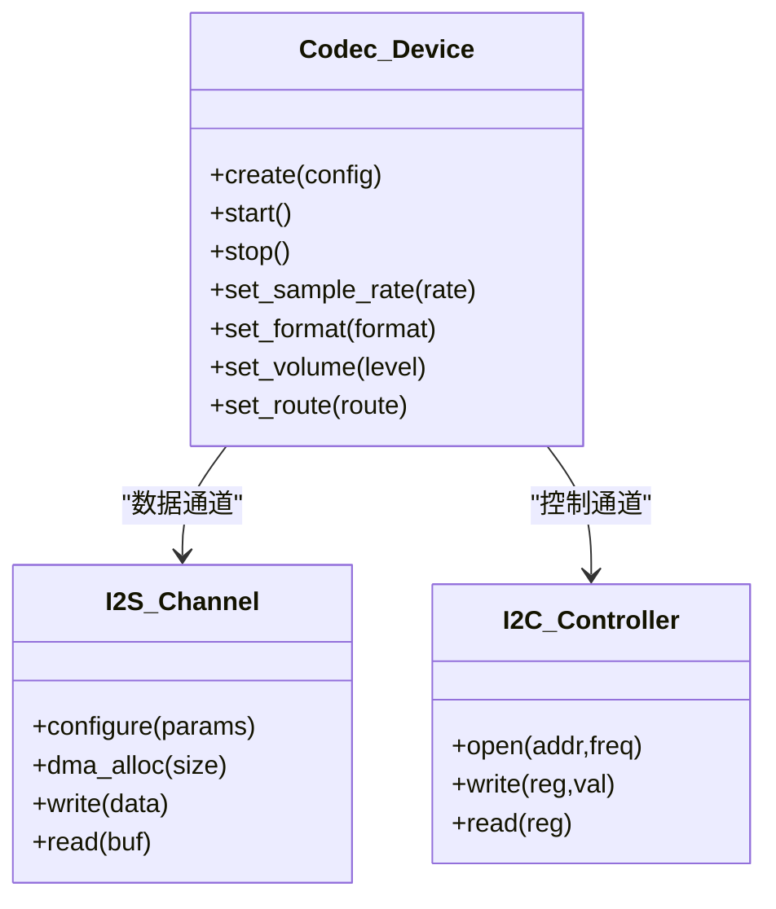
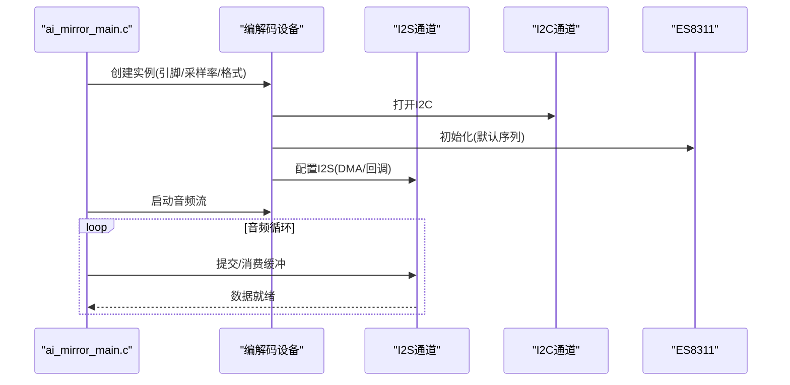
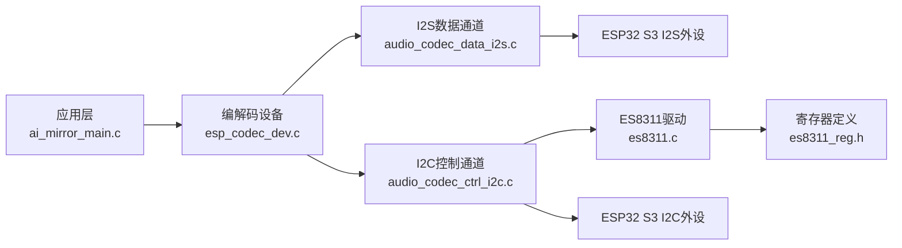

# 音频硬件接口

<cite>
**本文引用的文件**   
- [es8311.h](file://managed_components/espressif__es8311/include/es8311.h)
- [es8311.c](file://managed_components/espressif__es8311/es8311.c)
- [es8311_reg.h](file://managed_components/espressif__es8311/priv_include/es8311_reg.h)
- [audio_codec_data_i2s.c](file://managed_components/espressif__esp_codec_dev/platform/audio_codec_data_i2s.c)
- [audio_codec_ctrl_i2c.c](file://managed_components/espressif__esp_codec_dev/platform/audio_codec_ctrl_i2c.c)
- [esp_codec_dev.c](file://managed_components/espressif__esp_codec_dev/esp_codec_dev.c)
- [esp_codec_dev_types.h](file://managed_components/espressif__esp_codec_dev/include/esp_codec_dev_types.h)
- [ai_mirror_main.c](file://Firmware/esp32_ai_mirror/main/ai_mirror_main.c)
- [sdkconfig.defaults](file://Firmware/esp32_ai_mirror/sdkconfig.defaults)
</cite>

## 目录
1. [简介](#简介)
2. [项目结构](#项目结构)
3. [核心组件](#核心组件)
4. [架构总览](#架构总览)
5. [详细组件分析](#详细组件分析)
6. [依赖关系分析](#依赖关系分析)
7. [性能考虑](#性能考虑)
8. [故障排查指南](#故障排查指南)
9. [结论](#结论)
10. [附录](#附录)

## 简介
本文件面向ES8311音频编解码器在ESP32 S3平台上的硬件接口与驱动集成，重点覆盖：
- I2S音频接口配置、时钟设置与DMA缓冲区管理
- ES8311寄存器配置、增益控制与音频路径设置
- ADC/DAC初始化流程、采样率配置与音频格式设置
- 硬件连接图、引脚定义与电气特性说明
- 与ESP32 S3的集成方式与性能优化策略
- 常见硬件问题排查方法与调试技巧

## 项目结构
本项目通过ESP-IDF组件体系将ES8311驱动与通用编解码设备抽象层解耦：
- es8311组件提供芯片级驱动（I2C寄存器访问、默认初始化、音量控制等）
- esp_codec_dev提供统一的编解码设备抽象（数据通道I2S、控制通道I2C、GPIO等）
- 应用层main入口负责系统初始化与任务调度，调用上层API完成音频流启动

**图示来源** 
- [ai_mirror_main.c](file://Firmware/esp32_ai_mirror/main/ai_mirror_main.c)
- [esp_codec_dev.c](file://managed_components/espressif__esp_codec_dev/esp_codec_dev.c)
- [audio_codec_data_i2s.c](file://managed_components/espressif__esp_codec_dev/platform/audio_codec_data_i2s.c)
- [audio_codec_ctrl_i2c.c](file://managed_components/espressif__esp_codec_dev/platform/audio_codec_ctrl_i2c.c)
- [es8311.c](file://managed_components/espressif__es8311/es8311.c)
- [es8311.h](file://managed_components/espressif__es8311/include/es8311.h)
- [es8311_reg.h](file://managed_components/espressif__es8311/priv_include/es8311_reg.h)

**章节来源**
- [ai_mirror_main.c](file://Firmware/esp32_ai_mirror/main/ai_mirror_main.c)
- [esp_codec_dev.c](file://managed_components/espressif__esp_codec_dev/esp_codec_dev.c)
- [audio_codec_data_i2s.c](file://managed_components/espressif__esp_codec_dev/platform/audio_codec_data_i2s.c)
- [audio_codec_ctrl_i2c.c](file://managed_components/espressif__esp_codec_dev/platform/audio_codec_ctrl_i2c.c)
- [es8311.c](file://managed_components/espressif__es8311/es8311.c)
- [es8311.h](file://managed_components/espressif__es8311/include/es8311.h)
- [es8311_reg.h](file://managed_components/espressif__es8311/priv_include/es8311_reg.h)

## 核心组件
- ES8311驱动组件
  - 提供I2C写寄存器、读寄存器、默认初始化、音量控制、音频路径开关等能力
  - 关键头文件与实现：[es8311.h](file://managed_components/espressif__es8311/include/es8311.h)、[es8311.c](file://managed_components/espressif__es8311/es8311.c)
  - 寄存器定义：[es8311_reg.h](file://managed_components/espressif__es8311/priv_include/es8311_reg.h)
- 编解码设备抽象层（esp_codec_dev）
  - 统一封装I2S数据通道与I2C控制通道，屏蔽底层差异
  - 关键实现：[esp_codec_dev.c](file://managed_components/espressif__esp_codec_dev/esp_codec_dev.c)
  - 类型与配置：[esp_codec_dev_types.h](file://managed_components/espressif__esp_codec_dev/include/esp_codec_dev_types.h)
  - I2S数据通道：[audio_codec_data_i2s.c](file://managed_components/espressif__esp_codec_dev/platform/audio_codec_data_i2s.c)
  - I2C控制通道：[audio_codec_ctrl_i2c.c](file://managed_components/espressif__esp_codec_dev/platform/audio_codec_ctrl_i2c.c)
- 应用入口
  - 系统初始化、任务创建、音频链路启动：[ai_mirror_main.c](file://Firmware/esp32_ai_mirror/main/ai_mirror_main.c)
  - 构建配置（I2S/I2C引脚、采样率等）参考：[sdkconfig.defaults](file://Firmware/esp32_ai_mirror/sdkconfig.defaults)

**章节来源**
- [es8311.h](file://managed_components/espressif__es8311/include/es8311.h)
- [es8311.c](file://managed_components/espressif__es8311/es8311.c)
- [es8311_reg.h](file://managed_components/espressif__es8311/priv_include/es8311_reg.h)
- [esp_codec_dev.c](file://managed_components/espressif__esp_codec_dev/esp_codec_dev.c)
- [esp_codec_dev_types.h](file://managed_components/espressif__esp_codec_dev/include/esp_codec_dev_types.h)
- [audio_codec_data_i2s.c](file://managed_components/espressif__esp_codec_dev/platform/audio_codec_data_i2s.c)
- [audio_codec_ctrl_i2c.c](file://managed_components/espressif__esp_codec_dev/platform/audio_codec_ctrl_i2c.c)
- [ai_mirror_main.c](file://Firmware/esp32_ai_mirror/main/ai_mirror_main.c)
- [sdkconfig.defaults](file://Firmware/esp32_ai_mirror/sdkconfig.defaults)

## 架构总览
ES8311通过I2C进行寄存器配置，通过I2S传输PCM音频数据。ESP32 S3侧由I2S外设产生BCLK/LRCK并搬运数据，DMA负责内存到外设的高效拷贝；ES8311内部包含ADC/DAC、PGA、Mixer、HP/LP输出等模块。

**图示来源** 
- [esp_codec_dev.c](file://managed_components/espressif__esp_codec_dev/esp_codec_dev.c)
- [audio_codec_data_i2s.c](file://managed_components/espressif__esp_codec_dev/platform/audio_codec_data_i2s.c)
- [audio_codec_ctrl_i2c.c](file://managed_components/espressif__esp_codec_dev/platform/audio_codec_ctrl_i2c.c)
- [es8311.c](file://managed_components/espressif__es8311/es8311.c)

## 详细组件分析

### ES8311驱动与寄存器配置
- 功能要点
  - I2C读写寄存器、默认初始化序列、音量控制、音频路径开关（ADC/MIC PGA、DAC、HP/LP）
  - 支持多种采样率与I2S格式（需与ESP32 S3 I2S配置一致）
- 关键文件
  - 接口与实现：[es8311.h](file://managed_components/espressif__es8311/include/es8311.h)、[es8311.c](file://managed_components/espressif__es8311/es8311.c)
  - 寄存器定义：[es8311_reg.h](file://managed_components/espressif__es8311/priv_include/es8311_reg.h)

**图示来源** 
- [es8311.c](file://managed_components/espressif__es8311/es8311.c)
- [es8311_reg.h](file://managed_components/espressif__es8311/priv_include/es8311_reg.h)

**章节来源**
- [es8311.h](file://managed_components/espressif__es8311/include/es8311.h)
- [es8311.c](file://managed_components/espressif__es8311/es8311.c)
- [es8311_reg.h](file://managed_components/espressif__es8311/priv_include/es8311_reg.h)

### I2S数据通道与DMA缓冲管理
- 功能要点
  - 配置I2S时序（BCLK/LRCK极性、MSB/LSB对齐、位宽、帧长）
  - 分配DMA环形缓冲，设置回调以处理数据上/下行
  - 与ES8311的I2S模式匹配（TDM/标准I2S、左/右对齐）
- 关键文件
  - I2S数据通道实现：[audio_codec_data_i2s.c](file://managed_components/espressif__esp_codec_dev/platform/audio_codec_data_i2s.c)
  - 编解码设备类型与配置：[esp_codec_dev_types.h](file://managed_components/espressif__esp_codec_dev/include/esp_codec_dev_types.h)

**图示来源** 
- [audio_codec_data_i2s.c](file://managed_components/espressif__esp_codec_dev/platform/audio_codec_data_i2s.c)
- [esp_codec_dev_types.h](file://managed_components/espressif__esp_codec_dev/include/esp_codec_dev_types.h)

**章节来源**
- [audio_codec_data_i2s.c](file://managed_components/espressif__esp_codec_dev/platform/audio_codec_data_i2s.c)
- [esp_codec_dev_types.h](file://managed_components/espressif__esp_codec_dev/include/esp_codec_dev_types.h)

### I2C控制通道与寄存器写入
- 功能要点
  - 通过I2C总线对ES8311进行寄存器读写
  - 初始化序列按顺序写入电源管理、时钟、ADC/DAC、混音器、音量等寄存器
- 关键文件
  - I2C控制通道实现：[audio_codec_ctrl_i2c.c](file://managed_components/espressif__esp_codec_dev/platform/audio_codec_ctrl_i2c.c)
  - ES8311驱动实现：[es8311.c](file://managed_components/espressif__es8311/es8311.c)

**图示来源** 
- [audio_codec_ctrl_i2c.c](file://managed_components/espressif__esp_codec_dev/platform/audio_codec_ctrl_i2c.c)
- [es8311.c](file://managed_components/espressif__es8311/es8311.c)

**章节来源**
- [audio_codec_ctrl_i2c.c](file://managed_components/espressif__esp_codec_dev/platform/audio_codec_ctrl_i2c.c)
- [es8311.c](file://managed_components/espressif__es8311/es8311.c)

### 编解码设备抽象层（esp_codec_dev）
- 功能要点
  - 统一API封装I2S数据通道与I2C控制通道
  - 提供设备实例创建、参数配置、启动/停止、音量控制、路径切换
- 关键文件
  - 核心实现：[esp_codec_dev.c](file://managed_components/espressif__esp_codec_dev/esp_codec_dev.c)
  - 类型与枚举：[esp_codec_dev_types.h](file://managed_components/espressif__esp_codec_dev/include/esp_codec_dev_types.h)

**图示来源** 
- [esp_codec_dev.c](file://managed_components/espressif__esp_codec_dev/esp_codec_dev.c)
- [esp_codec_dev_types.h](file://managed_components/espressif__esp_codec_dev/include/esp_codec_dev_types.h)

**章节来源**
- [esp_codec_dev.c](file://managed_components/espressif__esp_codec_dev/esp_codec_dev.c)
- [esp_codec_dev_types.h](file://managed_components/espressif__esp_codec_dev/include/esp_codec_dev_types.h)

### 应用层集成（ESP32 S3）
- 功能要点
  - 在main中初始化系统、配置I2S/I2C引脚、创建音频任务
  - 调用编解码设备API完成ES8311初始化、采样率/格式设置、音量与路径配置
  - 通过DMA回调或队列在任务间传递音频数据
- 关键文件
  - 主程序入口：[ai_mirror_main.c](file://Firmware/esp32_ai_mirror/main/ai_mirror_main.c)
  - 构建配置（引脚/采样率等）：[sdkconfig.defaults](file://Firmware/esp32_ai_mirror/sdkconfig.defaults)

**图示来源** 
- [ai_mirror_main.c](file://Firmware/esp32_ai_mirror/main/ai_mirror_main.c)
- [esp_codec_dev.c](file://managed_components/espressif__esp_codec_dev/esp_codec_dev.c)
- [audio_codec_data_i2s.c](file://managed_components/espressif__esp_codec_dev/platform/audio_codec_data_i2s.c)
- [audio_codec_ctrl_i2c.c](file://managed_components/espressif__esp_codec_dev/platform/audio_codec_ctrl_i2c.c)

**章节来源**
- [ai_mirror_main.c](file://Firmware/esp32_ai_mirror/main/ai_mirror_main.c)
- [sdkconfig.defaults](file://Firmware/esp32_ai_mirror/sdkconfig.defaults)

## 依赖关系分析
- 组件耦合
  - 应用层依赖编解码设备抽象层
  - 编解码设备抽象层依赖I2S数据通道与I2C控制通道
  - I2C控制通道依赖ES8311驱动与寄存器定义
- 外部依赖
  - ESP32 S3 I2S外设（DMA、中断）
  - ESP32 S3 I2C外设（主机模式）

**图示来源** 
- [ai_mirror_main.c](file://Firmware/esp32_ai_mirror/main/ai_mirror_main.c)
- [esp_codec_dev.c](file://managed_components/espressif__esp_codec_dev/esp_codec_dev.c)
- [audio_codec_data_i2s.c](file://managed_components/espressif__esp_codec_dev/platform/audio_codec_data_i2s.c)
- [audio_codec_ctrl_i2c.c](file://managed_components/espressif__esp_codec_dev/platform/audio_codec_ctrl_i2c.c)
- [es8311.c](file://managed_components/espressif__es8311/es8311.c)
- [es8311_reg.h](file://managed_components/espressif__es8311/priv_include/es8311_reg.h)

**章节来源**
- [esp_codec_dev.c](file://managed_components/espressif__esp_codec_dev/esp_codec_dev.c)
- [audio_codec_data_i2s.c](file://managed_components/espressif__esp_codec_dev/platform/audio_codec_data_i2s.c)
- [audio_codec_ctrl_i2c.c](file://managed_components/espressif__esp_codec_dev/platform/audio_codec_ctrl_i2c.c)
- [es8311.c](file://managed_components/espressif__es8311/es8311.c)
- [es8311_reg.h](file://managed_components/espressif__es8311/priv_include/es8311_reg.h)

## 性能考虑
- I2S与DMA
  - 合理设置DMA缓冲大小以降低CPU占用与延迟
  - 使用双缓冲或环形缓冲避免数据竞争
  - 确保I2S时钟与采样率匹配，避免溢出/欠载
- 功耗与热设计
  - 关闭未使用的音频路径（如仅用ADC或仅用DAC）
  - 降低不必要的PGA增益以减少噪声与功耗
- 实时性
  - 将音频任务置于较高优先级，保证DMA回调及时响应
  - 避免在回调中进行阻塞操作

[本节为通用指导，不直接分析具体文件]

## 故障排查指南
- 无声音/无声
  - 检查I2S引脚连接（BCLK/LRCK/DATA）与极性配置
  - 确认ES8311的DAC与输出路径已启用（HP/LP）
  - 验证音量寄存器与软件音量设置
- 杂音/爆音
  - 检查时钟同步（BCLK/LRCK相位），确认左右声道对齐
  - 调整DMA缓冲大小与任务优先级，避免数据抖动
  - 检查模拟前端接地与电源去耦
- I2C通信失败
  - 核对ES8311 I2C地址与上拉电阻
  - 检查I2C频率与时序是否满足器件要求
  - 使用逻辑分析仪抓取I2C波形定位问题
- 采样率/格式不匹配
  - 确保I2S位宽、帧长与ES8311寄存器配置一致
  - 校验采样率分频与PLL设置

[本节为通用指导，不直接分析具体文件]

## 结论
通过将ES8311驱动与ESP-IDF的编解码设备抽象层结合，可在ESP32 S3平台上高效实现稳定的音频采集与播放链路。关键在于正确配置I2S时序与DMA缓冲、精确设置ES8311寄存器以实现期望的音频路径与增益，并在应用中合理安排任务与数据流。遵循本文的架构与排障建议，可快速定位并解决常见问题，提升系统稳定性与音质表现。

[本节为总结性内容，不直接分析具体文件]

## 附录
- 硬件连接要点（概念性说明）
  - I2C：SDA/SCL连接至ESP32 S3对应引脚，注意上拉电阻与地址跳线
  - I2S：BCLK/LRCK/DOUT/DIN连接至ESP32 S3 I2S引脚，注意极性与时钟相位
  - 模拟输入/输出：MIC/Line-In与HP/Line-Out按板级原理图连接，注意阻抗匹配与滤波
- 电气特性（概念性说明）
  - 工作电压与I/O电平需与ESP32 S3兼容
  - 模拟部分供电与数字部分供电应分别去耦，减少噪声耦合
- 常用配置项（概念性说明）
  - 采样率：8k/16k/44.1k/48k等
  - 位宽：16/24/32位
  - 格式：I2S标准、左对齐、右对齐、TDM
  - 通道：单声道/立体声

[本节为概念性说明，不直接分析具体文件]