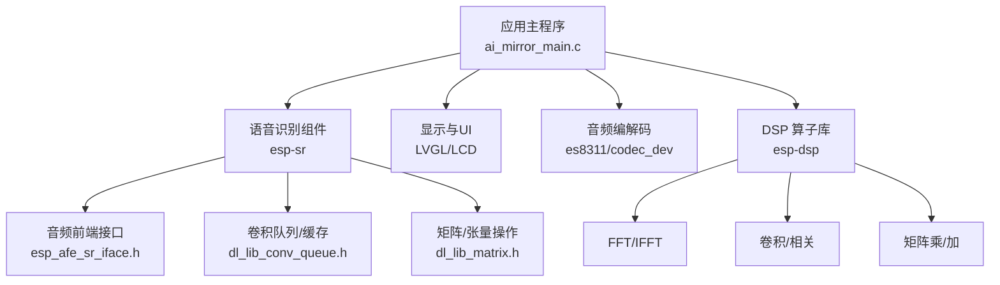
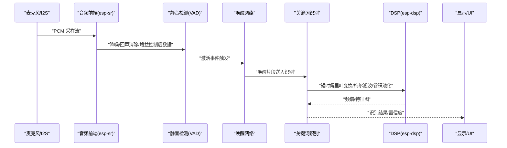
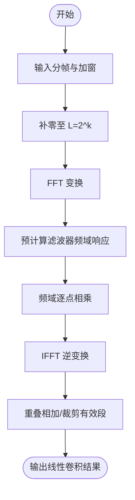
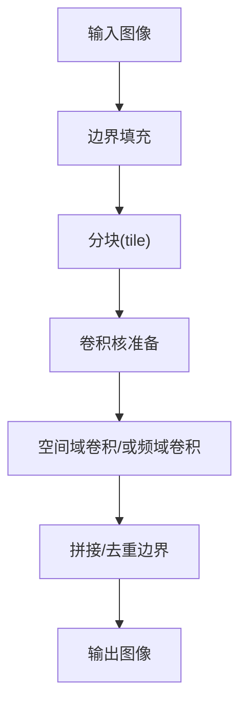
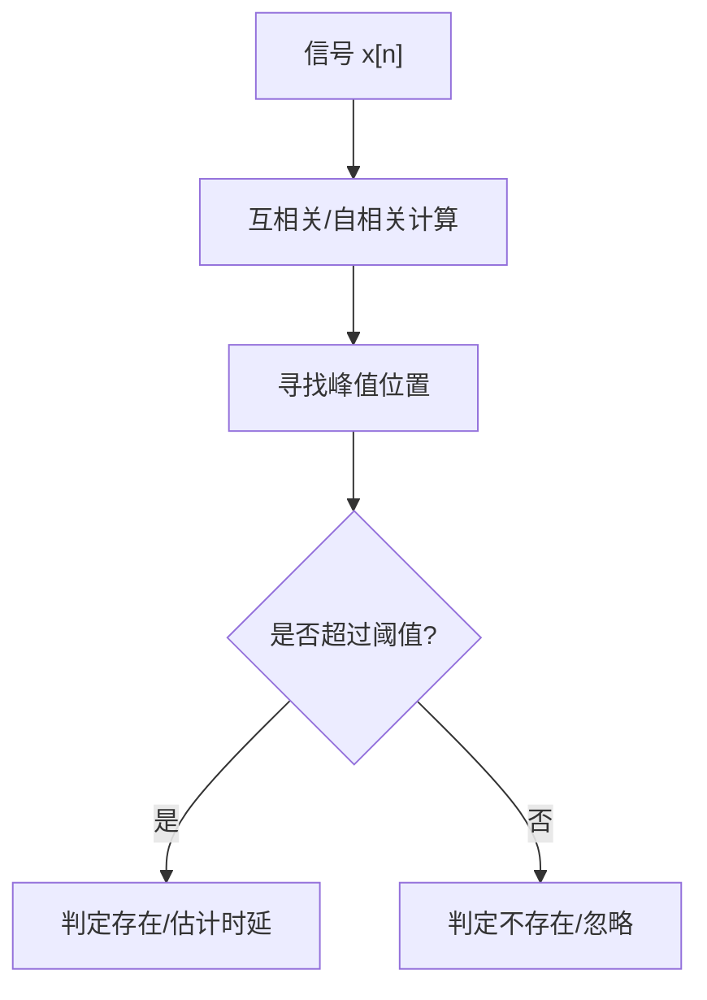
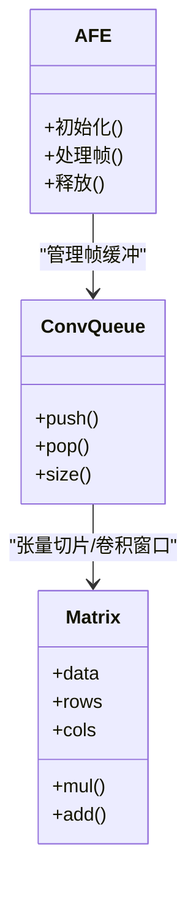
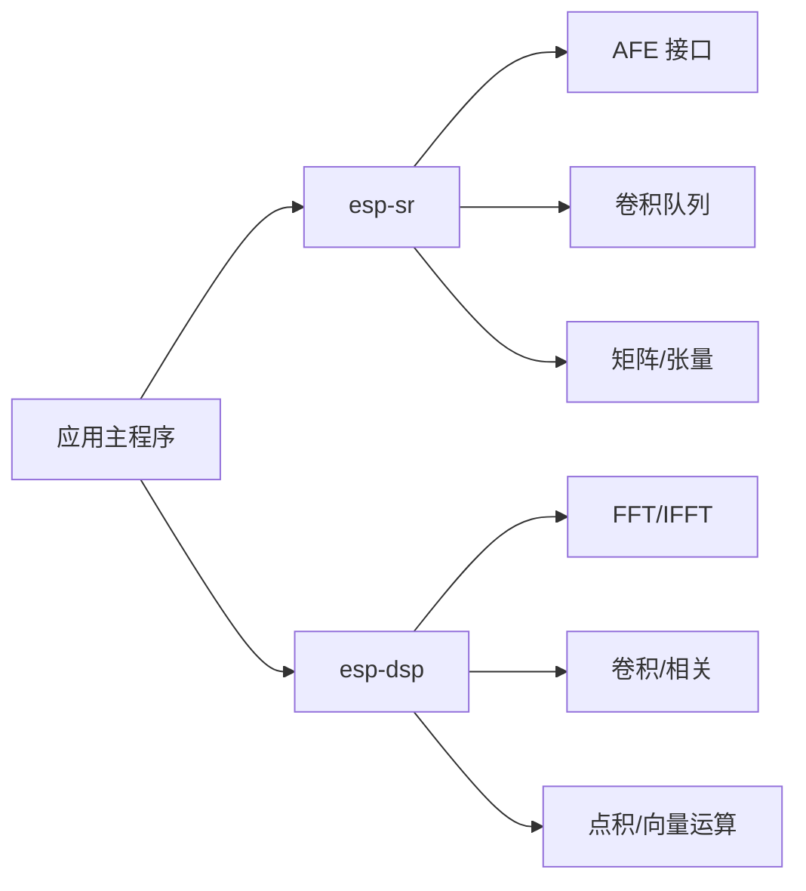

# 卷积与相关算法

<cite>
**本文引用的文件**   
- [README.md](file://README.md)
- [esp32_ai_mirror/README.md](file://Firmware/esp32_ai_mirror/README.md)
- [ai_mirror_main.c](file://Firmware/esp32_ai_mirror/main/ai_mirror_main.c)
- [ai_mirror_config.h](file://Firmware/esp32_ai_mirror/main/ai_mirror_config.h)
- [CMakeLists.txt](file://Firmware/esp32_ai_mirror/CMakeLists.txt)
- [esp-dsp README.md](file://Firmware/esp32_ai_mirror/managed_components/espressif__esp-dsp/README.md)
- [conv2d 示例 CMakeLists.txt](file://Firmware/esp32_ai_mirror/managed_components/espressif__esp-dsp/examples/conv2d/CMakeLists.txt)
- [conv2d 示例 main.c](file://Firmware/esp32_ai_mirror/managed_components/espressif__esp-dsp/examples/conv2d/main/main.c)
- [fft 示例 main.c](file://Firmware/esp32_ai_mirror/managed_components/espressif__esp-dsp/examples/fft/main/main.c)
- [esp-sr 组件 README.md](file://Firmware/esp32_ai_mirror/components/espressif__esp-sr/README.md)
- [esp-sr CMakeLists.txt](file://Firmware/esp32_ai_mirror/components/espressif__esp-sr/CMakeLists.txt)
- [dl_lib_conv_queue.h](file://Firmware/esp32_ai_mirror/components/espressif__esp-sr/include/esp32/dl_lib_conv_queue.h)
- [dl_lib_matrix.h](file://Firmware/esp32_ai_mirror/components/espressif__esp-sr/include/esp32/dl_lib_matrix.h)
- [esp_afe_sr_iface.h](file://Firmware/esp32_ai_mirror/components/espressif__esp-sr/include/esp32/esp_afe_sr_iface.h)
- [esp_mn_speech_commands.c](file://Firmware/esp32_ai_mirror/components/espressif__esp-sr/src/esp_mn_speech_commands.c)
</cite>

## 目录
1. [简介](#简介)
2. [项目结构](#项目结构)
3. [核心组件](#核心组件)
4. [架构总览](#架构总览)
5. [详细组件分析](#详细组件分析)
6. [依赖关系分析](#依赖关系分析)
7. [性能考量](#性能考量)
8. [故障排查指南](#故障排查指南)
9. [结论](#结论)
10. [附录](#附录)

## 简介
本文件围绕“卷积与相关算法”的系统性知识，结合仓库中的 ESP32 AI 镜像工程与 esp-dsp、esp-sr 等组件，给出线性卷积、循环卷积的数学原理与高效实现（含基于 FFT 的快速卷积），并扩展到二维卷积在图像处理中的应用。同时阐述互相关与自相关在信号检测、同步中的作用，并结合语音识别、图像匹配、雷达信号处理给出具体示例。文档还涵盖内存布局对性能的影响以及 SIMD 指令的使用建议，帮助读者在嵌入式平台上实现高性能的信号处理流水线。

## 项目结构
该仓库是一个面向 ESP32 的 AI 镜像应用工程，包含：
- 主应用层：ESP-IDF 应用入口、配置与 UI 初始化
- 语音前端与唤醒/命令识别：esp-sr 组件，提供 AFE、VAD、NS、AGC、唤醒网与多类词识别模型
- DSP 加速库：esp-dsp 提供 FFT、卷积、矩阵运算等底层算子
- 显示与外设：LVGL、LCD、音频编解码器等

图表来源 
- [ai_mirror_main.c](file://Firmware/esp32_ai_mirror/main/ai_mirror_main.c)
- [esp-sr 组件 README.md](file://Firmware/esp32_ai_mirror/components/espressif__esp-sr/README.md)
- [dl_lib_conv_queue.h](file://Firmware/esp32_ai_mirror/components/espressif__esp-sr/include/esp32/dl_lib_conv_queue.h)
- [dl_lib_matrix.h](file://Firmware/esp32_ai_mirror/components/espressif__esp-sr/include/esp32/dl_lib_matrix.h)
- [esp_afe_sr_iface.h](file://Firmware/esp32_ai_mirror/components/espressif__esp-sr/include/esp32/esp_afe_sr_iface.h)
- [esp-dsp README.md](file://Firmware/esp32_ai_mirror/managed_components/espressif__esp-dsp/README.md)

章节来源
- [README.md](file://README.md)
- [esp32_ai_mirror/README.md](file://Firmware/esp32_ai_mirror/README.md)
- [CMakeLists.txt](file://Firmware/esp32_ai_mirror/CMakeLists.txt)

## 核心组件
- 应用主程序：负责系统初始化、外设驱动加载、任务调度与模块间数据流编排
- 语音前端与识别（esp-sr）：提供麦克风采集、AEC/NS/AGC、VAD、唤醒与关键词识别；内部使用卷积队列与矩阵运算
- DSP 库（esp-dsp）：提供 FFT、卷积、点积、矩阵等基础算子，支持浮点与定点优化
- 显示与 UI（LVGL/LCD）：用于结果可视化与交互
- 音频编解码：I2S/Codec 驱动，完成 ADC/DAC 与 PCM 数据交换

章节来源
- [ai_mirror_main.c](file://Firmware/esp32_ai_mirror/main/ai_mirror_main.c)
- [ai_mirror_config.h](file://Firmware/esp32_ai_mirror/main/ai_mirror_config.h)
- [esp-sr 组件 README.md](file://Firmware/esp32_ai_mirror/components/espressif__esp-sr/README.md)
- [esp-dsp README.md](file://Firmware/esp32_ai_mirror/managed_components/espressif__esp-dsp/README.md)

## 架构总览
下图展示从音频采集到特征提取、识别推理的整体数据流，其中卷积与相关是核心算子，贯穿前端处理与识别阶段。

图表来源 
- [esp_afe_sr_iface.h](file://Firmware/esp32_ai_mirror/components/espressif__esp-sr/include/esp32/esp_afe_sr_iface.h)
- [esp_mn_speech_commands.c](file://Firmware/esp32_ai_mirror/components/espressif__esp-sr/src/esp_mn_speech_commands.c)
- [esp-dsp README.md](file://Firmware/esp32_ai_mirror/managed_components/espressif__esp-dsp/README.md)

## 详细组件分析

### 线性卷积与循环卷积：数学原理与高效实现
- 线性卷积
  - 定义：两个有限长序列逐点滑动相乘求和，输出长度为 N+M-1
  - 直接计算复杂度 O(NM)，适合短核或低延迟场景
- 循环卷积
  - 定义：在 DFT 域做逐点相乘再 IDFT，等价于周期延拓后的线性卷积取主值
  - 通过补零至长度 L≥N+M-1，可用 FFT 实现快速卷积
- 快速卷积（基于 FFT）
  - 步骤：对输入分帧→每帧补零至 L=2^k→FFT→与滤波器频域响应逐点相乘→IFFT→重叠相加/保留有效段
  - 复杂度 O(L log L)，L 为帧长，通常选择 2 的幂以适配基-2 FFT
  - 重叠相加法可避免边界效应，保证与线性卷积一致

图表来源 
- [fft 示例 main.c](file://Firmware/esp32_ai_mirror/managed_components/espressif__esp-dsp/examples/fft/main/main.c)
- [conv2d 示例 main.c](file://Firmware/esp32_ai_mirror/managed_components/espressif__esp-dsp/examples/conv2d/main/main.c)

章节来源
- [esp-dsp README.md](file://Firmware/esp32_ai_mirror/managed_components/espressif__esp-dsp/README.md)
- [fft 示例 main.c](file://Firmware/esp32_ai_mirror/managed_components/espressif__esp-dsp/examples/fft/main/main.c)

### 二维卷积在图像处理中的应用
- 基本思想：用卷积核对图像进行局部加权求和，实现平滑、锐化、边缘检测、纹理增强等
- 实现要点
  - 边界处理：零填充、复制边界、对称填充
  - 分块与并行：将图像切分为 tile，按行/列方向向量化
  - 与 FFT 的关系：大核时可用频域卷积（O(WH log WH)），小核时空间域更快
- 工程参考：esp-dsp 的 conv2d 示例展示了 2D 卷积的基本流程与调用方式

图表来源 
- [conv2d 示例 main.c](file://Firmware/esp32_ai_mirror/managed_components/espressif__esp-dsp/examples/conv2d/main/main.c)
- [conv2d 示例 CMakeLists.txt](file://Firmware/esp32_ai_mirror/managed_components/espressif__esp-dsp/examples/conv2d/CMakeLists.txt)

章节来源
- [conv2d 示例 main.c](file://Firmware/esp32_ai_mirror/managed_components/espressif__esp-dsp/examples/conv2d/main/main.c)
- [conv2d 示例 CMakeLists.txt](file://Firmware/esp32_ai_mirror/managed_components/espressif__esp-dsp/examples/conv2d/CMakeLists.txt)

### 互相关与自相关：信号检测与同步
- 互相关
  - 用途：模板匹配、目标检测、延时估计、相位对齐
  - 实现：与线性卷积类似，仅核翻转与否的差异；频域实现同样适用
- 自相关
  - 用途：周期性检测、回波估计、雷达脉冲压缩、语音端点检测
  - 特性：峰值位置对应周期或时延，幅度反映相似度
- 工程实践
  - 短时自相关用于基音周期估计
  - 互相关用于雷达/声呐的匹配滤波与到达时间估计

章节来源
- [esp-dsp README.md](file://Firmware/esp32_ai_mirror/managed_components/espressif__esp-dsp/README.md)

### 语音识别中的卷积与相关
- 前端处理：AEC/NS/AGC/VAD 提升信噪比与稳定性
- 特征提取：STFT→梅尔滤波→对数能量→差分/增量
- 识别网络：CNN/TCN/Transformer 中大量使用卷积与池化
- 关键接口与数据结构：AFE 接口、卷积队列、矩阵/张量操作

图表来源 
- [esp_afe_sr_iface.h](file://Firmware/esp32_ai_mirror/components/espressif__esp-sr/include/esp32/esp_afe_sr_iface.h)
- [dl_lib_conv_queue.h](file://Firmware/esp32_ai_mirror/components/espressif__esp-sr/include/esp32/dl_lib_conv_queue.h)
- [dl_lib_matrix.h](file://Firmware/esp32_ai_mirror/components/espressif__esp-sr/include/esp32/dl_lib_matrix.h)

章节来源
- [esp_mn_speech_commands.c](file://Firmware/esp32_ai_mirror/components/espressif__esp-sr/src/esp_mn_speech_commands.c)
- [esp_afe_sr_iface.h](file://Firmware/esp32_ai_mirror/components/espressif__esp-sr/include/esp32/esp_afe_sr_iface.h)
- [dl_lib_conv_queue.h](file://Firmware/esp32_ai_mirror/components/espressif__esp-sr/include/esp32/dl_lib_conv_queue.h)
- [dl_lib_matrix.h](file://Firmware/esp32_ai_mirror/components/espressif__esp-sr/include/esp32/dl_lib_matrix.h)

### 图像匹配中的卷积与相关
- 模板匹配：互相关最大化位置即最佳匹配点
- 关键点描述符：SIFT/ORB 等特征在匹配阶段常用互相关或汉明距离
- 加速策略：金字塔匹配、区域限制、频域卷积（大模板）

章节来源
- [conv2d 示例 main.c](file://Firmware/esp32_ai_mirror/managed_components/espressif__esp-dsp/examples/conv2d/main/main.c)

### 雷达信号处理中的卷积与相关
- 脉冲压缩：匹配滤波即与已知波形做互相关，提高信噪比与时距分辨率
- 动目标检测：自相关抑制杂波，突出运动目标
- 实现要点：长序列 FFT 分块、窗函数选择、旁瓣抑制

章节来源
- [esp-dsp README.md](file://Firmware/esp32_ai_mirror/managed_components/espressif__esp-dsp/README.md)
- [fft 示例 main.c](file://Firmware/esp32_ai_mirror/managed_components/espressif__esp-dsp/examples/fft/main/main.c)

## 依赖关系分析
- 应用主程序依赖 esp-sr 与 esp-dsp
- esp-sr 依赖 AFE 接口、卷积队列、矩阵/张量操作
- esp-dsp 提供 FFT、卷积、点积、矩阵等基础算子
- CMake 构建脚本组织各组件与示例

图表来源 
- [CMakeLists.txt](file://Firmware/esp32_ai_mirror/CMakeLists.txt)
- [esp-sr CMakeLists.txt](file://Firmware/esp32_ai_mirror/components/espressif__esp-sr/CMakeLists.txt)
- [esp-dsp README.md](file://Firmware/esp32_ai_mirror/managed_components/espressif__esp-dsp/README.md)

章节来源
- [CMakeLists.txt](file://Firmware/esp32_ai_mirror/CMakeLists.txt)
- [esp-sr CMakeLists.txt](file://Firmware/esp32_ai_mirror/components/espressif__esp-sr/CMakeLists.txt)

## 性能考量
- 内存布局
  - 一维信号：连续数组、对齐到 16/32 字节，利于 SIMD 加载
  - 二维图像：行优先存储，tile 分块减少缓存缺失
  - 卷积窗口：预分配环形缓冲，避免频繁分配
- 分帧与批处理
  - 合理帧长（如 256/512/1024）平衡延迟与吞吐
  - 批处理多通道或多样本，提高并行度
- FFT 优化
  - 选择 2 的幂长度，利用基-2 算法
  - 预计算滤波器频域响应，复用窗口函数
- SIMD 指令
  - 使用平台内建函数或编译器优化选项（如 NEON/SIMD）
  - 向量化点积、加法、乘法、归约
- 缓存友好
  - 顺序访问、减少跨步访问
  - 分块卷积（im2col 或 Winograd）降低访存开销

[本节为通用指导，不直接分析具体文件]

## 故障排查指南
- 构建问题
  - 检查 CMake 配置是否正确引入 esp-sr 与 esp-dsp
  - 确认头文件路径与编译选项
- 运行时崩溃
  - 检查缓冲区大小与越界访问
  - 确认 FFT 长度与补零策略一致
- 性能不达预期
  - 验证是否启用 SIMD/优化等级
  - 检查内存对齐与缓存命中
- 语音识别异常
  - 调整 VAD 阈值与噪声门限
  - 检查 AEC/NS/AGC 参数与麦克风配置

章节来源
- [CMakeLists.txt](file://Firmware/esp32_ai_mirror/CMakeLists.txt)
- [esp-sr CMakeLists.txt](file://Firmware/esp32_ai_mirror/components/espressif__esp-sr/CMakeLists.txt)
- [ai_mirror_config.h](file://Firmware/esp32_ai_mirror/main/ai_mirror_config.h)

## 结论
本文件系统梳理了卷积与相关算法的理论基础与工程实现，结合 ESP32 平台的 esp-dsp 与 esp-sr 组件，给出了线性/循环卷积、快速卷积、二维卷积与相关的应用范式。通过合理的分帧、FFT 优化、内存布局与 SIMD 利用，可在资源受限设备上实现高吞吐、低延迟的信号处理流水线。实际工程中需根据应用场景（语音、图像、雷达）权衡精度、延迟与功耗，持续迭代参数与实现细节。

## 附录
- 术语表
  - 线性卷积：两序列滑动相乘求和，输出长度 N+M-1
  - 循环卷积：DFT 域逐点相乘再 IDFT，等价周期延拓的主值
  - 快速卷积：基于 FFT 的分帧卷积，复杂度 O(L log L)
  - 互相关：模板匹配与时延估计的核心算子
  - 自相关：周期性与回波估计的关键工具
- 参考示例
  - esp-dsp 的 fft 与 conv2d 示例可作为学习起点
  - esp-sr 的 AFE 接口与卷积队列/矩阵操作便于集成

[本节为补充信息，不直接分析具体文件]