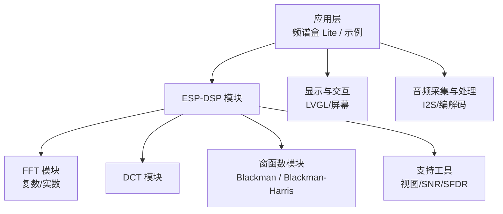
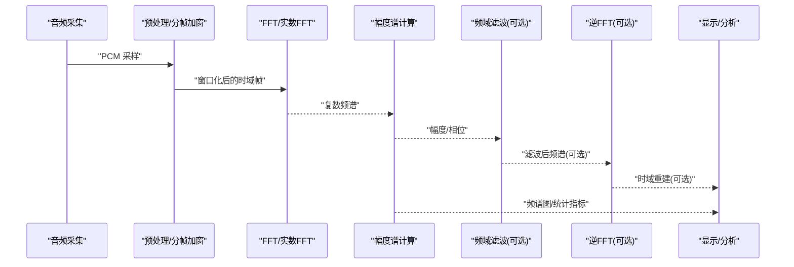
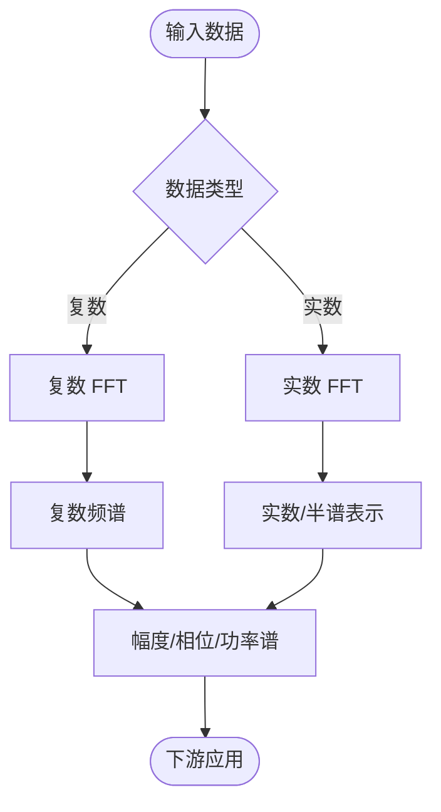
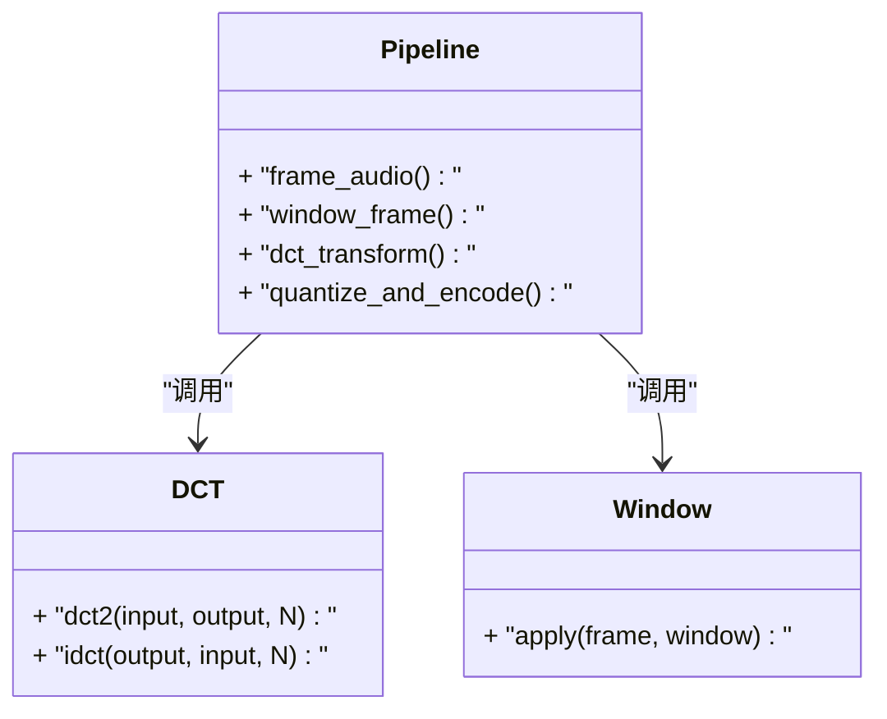
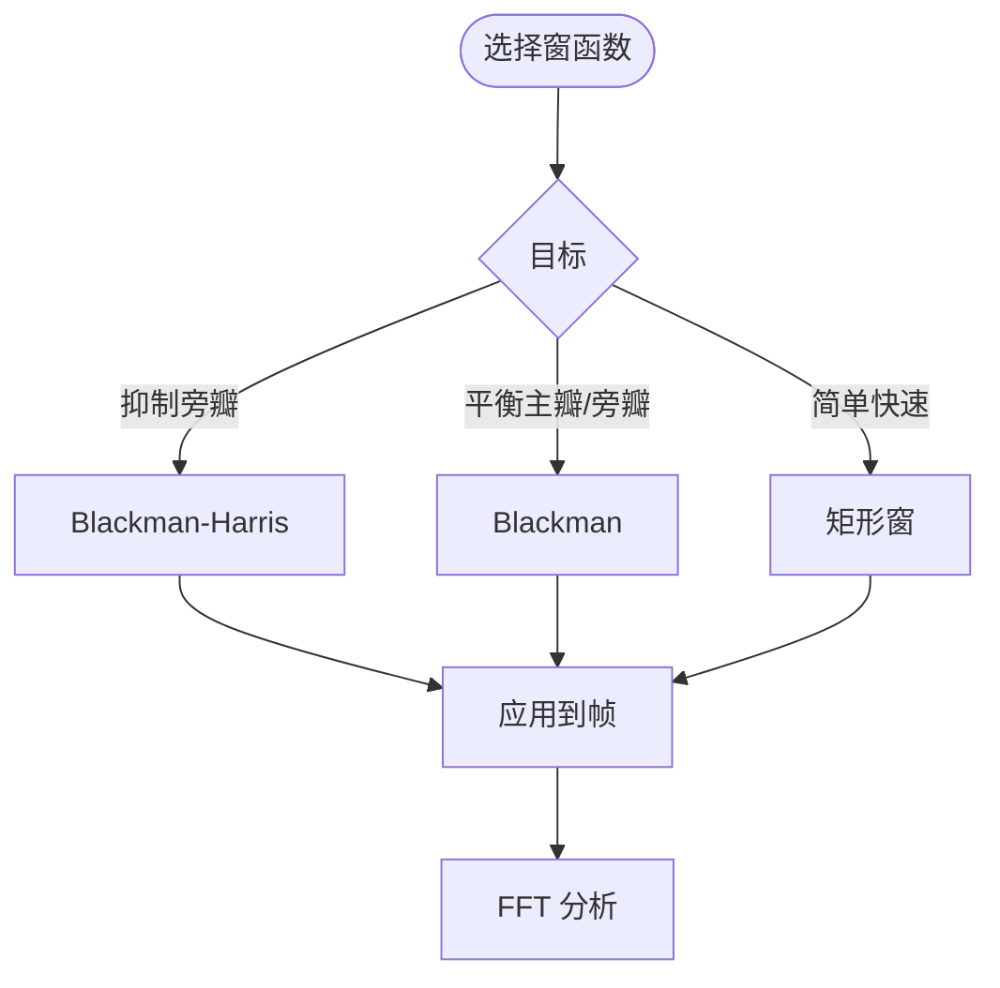
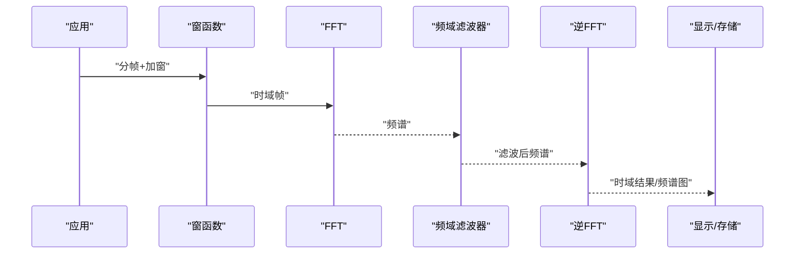
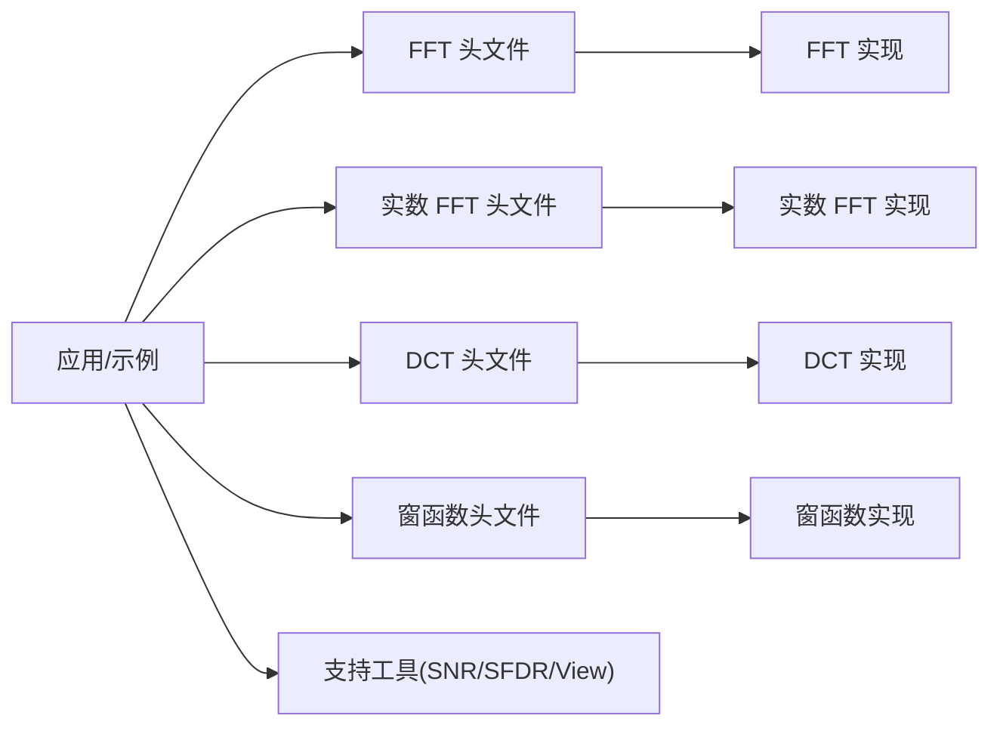

# 变换算法

<cite>
**本文引用的文件**   
- [README.md](file://README.md)
- [esp-dsp README.md](file://Firmware/esp32_ai_mirror/managed_components/espressif__esp-dsp/README.md)
- [FFT 示例主程序](file://Firmware/esp32_ai_mirror/managed_components/espressif__esp-dsp/examples/fft/main/main.c)
- [实数 FFT 示例主程序](file://Firmware/esp32_ai_mirror/managed_components/espressif__esp-dsp/examples/fft4real/main/main.c)
- [窗函数示例主程序](file://Firmware/esp32_ai_mirror/managed_components/espressif__esp-dsp/examples/fft_window/main/main.c)
- [频谱盒 Lite 应用主程序](file://Firmware/esp32_ai_mirror/managed_components/espressif__esp-dsp/applications/spectrum_box_lite/main/main.c)
- [DCT 头文件](file://Firmware/esp32_ai_mirror/managed_components/espressif__esp-dsp/modules/dct/include/esp_dsp_dct.h)
- [DCT 浮点实现](file://Firmware/esp32_ai_mirror/managed_components/espressif__esp-dsp/modules/dct/float/esp_dsp_dct_float.c)
- [FFT 头文件](file://Firmware/esp32_ai_mirror/managed_components/espressif__esp-dsp/modules/fft/include/esp_dsp_fft.h)
- [FFT 浮点实现](file://Firmware/esp32_ai_mirror/managed_components/espressif__esp-dsp/modules/fft/float/esp_dsp_fft_float.c)
- [实数 FFT 头文件](file://Firmware/esp32_ai_mirror/managed_components/espressif__esp-dsp/modules/fft/include/esp_dsp_fft_real.h)
- [实数 FFT 浮点实现](file://Firmware/esp32_ai_mirror/managed_components/espressif__esp-dsp/modules/fft/float/esp_dsp_fft_real_float.c)
- [Blackman 窗头文件](file://Firmware/esp32_ai_mirror/managed_components/espressif__esp-dsp/modules/windows/blackman/include/esp_dsp_win_blackman.h)
- [Blackman 窗实现](file://Firmware/esp32_ai_mirror/managed_components/espressif__esp-dsp/modules/windows/blackman/float/esp_dsp_win_blackman_float.c)
- [Blackman-Harris 窗头文件](file://Firmware/esp32_ai_mirror/managed_components/espressif__esp-dsp/modules/windows/blackman_harris/include/esp_dsp_win_blackman_harris.h)
- [Blackman-Harris 窗实现](file://Firmware/esp32_ai_mirror/managed_components/espressif__esp-dsp/modules/windows/blackman_harris/float/esp_dsp_win_blackman_harris_float.c)
- [支持库：视图工具](file://Firmware/esp32_ai_mirror/managed_components/espressif__esp-dsp/modules/support/view/esp_dsp_view.c)
- [支持库：SNR 计算](file://Firmware/esp32_ai_mirror/managed_components/espressif__esp-dsp/modules/support/snr/esp_dsp_snr.c)
- [支持库：SFDR 计算](file://Firmware/esp32_ai_mirror/managed_components/espressif__esp-dsp/modules/support/sfdr/esp_dsp_sfdr.c)
</cite>

## 目录
1. [简介](#简介)
2. [项目结构](#项目结构)
3. [核心组件](#核心组件)
4. [架构总览](#架构总览)
5. [详细组件分析](#详细组件分析)
6. [依赖关系分析](#依赖关系分析)
7. [性能与复杂度](#性能与复杂度)
8. [故障排查指南](#故障排查指南)
9. [结论](#结论)
10. [附录](#附录)

## 简介
本文件围绕快速傅里叶变换（FFT）、离散余弦变换（DCT）等数学变换的原理、实现与应用进行系统化说明，结合仓库中的 ESP-DSP 模块与示例工程，覆盖复数 FFT、实数 FFT 的变体与适用场景，并给出频谱分析、频率域滤波、压缩编码的应用思路。同时提供音频频谱显示、噪声分析与特征提取的实践指引，解释变换窗函数的选择与影响，并对数值精度与计算复杂度进行分析。

## 项目结构
本项目在 ESP-IDF 框架下集成 ESP-DSP 组件，包含 FFT/DCT/窗函数/支持工具等模块，以及多个示例与应用（如频谱盒 Lite）。关键路径如下：
- 示例与演示：examples/* 与 applications/*
- DSP 核心模块：modules/{fft,dct,windows,support}
- 顶层说明：README.md

图表来源
- [esp-dsp README.md](file://Firmware/esp32_ai_mirror/managed_components/espressif__esp-dsp/README.md)
- [频谱盒 Lite 应用主程序](file://Firmware/esp32_ai_mirror/managed_components/espressif__esp-dsp/applications/spectrum_box_lite/main/main.c)

章节来源
- [README.md](file://README.md)
- [esp-dsp README.md](file://Firmware/esp32_ai_mirror/managed_components/espressif__esp-dsp/README.md)

## 核心组件
- FFT 模块：提供复数与实数 FFT 接口，支持不同点数与数据类型（浮点/定点），用于频谱分析、频域滤波、卷积加速等。
- DCT 模块：提供 DCT-II 等常用形式，常用于图像/语音压缩与特征提取。
- 窗函数模块：提供多种窗（如 Blackman、Blackman-Harris），用于降低频谱泄漏、改善动态范围。
- 支持工具：提供 SNR、SFDR、数据可视化辅助等，便于评估与分析。

章节来源
- [FFT 头文件](file://Firmware/esp32_ai_mirror/managed_components/espressif__esp-dsp/modules/fft/include/esp_dsp_fft.h)
- [FFT 浮点实现](file://Firmware/esp32_ai_mirror/managed_components/espressif__esp-dsp/modules/fft/float/esp_dsp_fft_float.c)
- [实数 FFT 头文件](file://Firmware/esp32_ai_mirror/managed_components/espressif__esp-dsp/modules/fft/include/esp_dsp_fft_real.h)
- [实数 FFT 浮点实现](file://Firmware/esp32_ai_mirror/managed_components/espressif__esp-dsp/modules/fft/float/esp_dsp_fft_real_float.c)
- [DCT 头文件](file://Firmware/esp32_ai_mirror/managed_components/espressif__esp-dsp/modules/dct/include/esp_dsp_dct.h)
- [DCT 浮点实现](file://Firmware/esp32_ai_mirror/managed_components/espressif__esp-dsp/modules/dct/float/esp_dsp_dct_float.c)
- [Blackman 窗头文件](file://Firmware/esp32_ai_mirror/managed_components/espressif__esp-dsp/modules/windows/blackman/include/esp_dsp_win_blackman.h)
- [Blackman 窗实现](file://Firmware/esp32_ai_mirror/managed_components/espressif__esp-dsp/modules/windows/blackman/float/esp_dsp_win_blackman_float.c)
- [Blackman-Harris 窗头文件](file://Firmware/esp32_ai_mirror/managed_components/espressif__esp-dsp/modules/windows/blackman_harris/include/esp_dsp_win_blackman_harris.h)
- [Blackman-Harris 窗实现](file://Firmware/esp32_ai_mirror/managed_components/espressif__esp-dsp/modules/windows/blackman_harris/float/esp_dsp_win_blackman_harris_float.c)

## 架构总览
下图展示从音频采集到频谱显示的典型流程，以及各模块间的调用关系。

图表来源
- [FFT 浮点实现](file://Firmware/esp32_ai_mirror/managed_components/espressif__esp-dsp/modules/fft/float/esp_dsp_fft_float.c)
- [实数 FFT 浮点实现](file://Firmware/esp32_ai_mirror/managed_components/espressif__esp-dsp/modules/fft/float/esp_dsp_fft_real_float.c)
- [窗函数实现](file://Firmware/esp32_ai_mirror/managed_components/espressif__esp-dsp/modules/windows/blackman/float/esp_dsp_win_blackman_float.c)
- [支持库：视图工具](file://Firmware/esp32_ai_mirror/managed_components/espressif__esp-dsp/modules/support/view/esp_dsp_view.c)

## 详细组件分析

### 复数 FFT 与实数 FFT
- 复数 FFT：适用于任意复数输入，广泛用于通用频谱分析、频域滤波、卷积等。
- 实数 FFT：针对实数序列优化，输出对称频谱，计算量约为复数 FFT 的一半，适合音频、传感器信号等实数数据。

图表来源
- [FFT 头文件](file://Firmware/esp32_ai_mirror/managed_components/espressif__esp-dsp/modules/fft/include/esp_dsp_fft.h)
- [FFT 浮点实现](file://Firmware/esp32_ai_mirror/managed_components/espressif__esp-dsp/modules/fft/float/esp_dsp_fft_float.c)
- [实数 FFT 头文件](file://Firmware/esp32_ai_mirror/managed_components/espressif__esp-dsp/modules/fft/include/esp_dsp_fft_real.h)
- [实数 FFT 浮点实现](file://Firmware/esp32_ai_mirror/managed_components/espressif__esp-dsp/modules/fft/float/esp_dsp_fft_real_float.c)

章节来源
- [FFT 示例主程序](file://Firmware/esp32_ai_mirror/managed_components/espressif__esp-dsp/examples/fft/main/main.c)
- [实数 FFT 示例主程序](file://Firmware/esp32_ai_mirror/managed_components/espressif__esp-dsp/examples/fft4real/main/main.c)

### DCT（离散余弦变换）
- DCT-II 是压缩编码（如 JPEG、MP3）的核心变换之一，能量集中特性好，适合特征提取与降维。
- 在语音/图像中常配合分块与量化使用。

图表来源
- [DCT 头文件](file://Firmware/esp32_ai_mirror/managed_components/espressif__esp-dsp/modules/dct/include/esp_dsp_dct.h)
- [DCT 浮点实现](file://Firmware/esp32_ai_mirror/managed_components/espressif__esp-dsp/modules/dct/float/esp_dsp_dct_float.c)

章节来源
- [DCT 头文件](file://Firmware/esp32_ai_mirror/managed_components/espressif__esp-dsp/modules/dct/include/esp_dsp_dct.h)
- [DCT 浮点实现](file://Firmware/esp32_ai_mirror/managed_components/espressif__esp-dsp/modules/dct/float/esp_dsp_dct_float.c)

### 窗函数的选择与影响
- 常见窗：矩形窗（高主瓣、旁瓣大）、汉宁窗、汉明窗、布莱克曼窗、布莱克曼-哈里斯窗（低旁瓣、宽主瓣）。
- 选择原则：
  - 需要高动态范围与抑制旁瓣：优先 Blackman-Harris。
  - 需要较窄主瓣分辨率：考虑汉宁/汉明或较短的布莱克曼。
  - 实时性要求高：权衡主瓣宽度与旁瓣抑制。

图表来源
- [Blackman 窗头文件](file://Firmware/esp32_ai_mirror/managed_components/espressif__esp-dsp/modules/windows/blackman/include/esp_dsp_win_blackman.h)
- [Blackman 窗实现](file://Firmware/esp32_ai_mirror/managed_components/espressif__esp-dsp/modules/windows/blackman/float/esp_dsp_win_blackman_float.c)
- [Blackman-Harris 窗头文件](file://Firmware/esp32_ai_mirror/managed_components/espressif__esp-dsp/modules/windows/blackman_harris/include/esp_dsp_win_blackman_harris.h)
- [Blackman-Harris 窗实现](file://Firmware/esp32_ai_mirror/managed_components/espressif__esp-dsp/modules/windows/blackman_harris/float/esp_dsp_win_blackman_harris_float.c)

章节来源
- [窗函数示例主程序](file://Firmware/esp32_ai_mirror/managed_components/espressif__esp-dsp/examples/fft_window/main/main.c)

### 频谱分析、频率域滤波与压缩编码
- 频谱分析：对音频帧加窗后进行 FFT，得到幅度谱/功率谱，用于可视化与噪声分析。
- 频率域滤波：在频域设计滤波器（低通、高通、带阻等），乘积后逆变换回时域。
- 压缩编码：DCT 将信号能量集中，配合量化与熵编码实现压缩。

图表来源
- [FFT 浮点实现](file://Firmware/esp32_ai_mirror/managed_components/espressif__esp-dsp/modules/fft/float/esp_dsp_fft_float.c)
- [支持库：视图工具](file://Firmware/esp32_ai_mirror/managed_components/espressif__esp-dsp/modules/support/view/esp_dsp_view.c)

章节来源
- [频谱盒 Lite 应用主程序](file://Firmware/esp32_ai_mirror/managed_components/espressif__esp-dsp/applications/spectrum_box_lite/main/main.c)

### 实际代码示例与实践指引
- 音频频谱显示：参考“频谱盒 Lite”应用，完成音频采集、分帧加窗、FFT、幅度谱计算与显示。
- 噪声分析：利用 SNR/SFDR 工具评估信噪比与无杂散动态范围，定位干扰频段。
- 特征提取：使用 DCT 系数作为特征向量，结合阈值或聚类进行分类/识别。

章节来源
- [支持库：SNR 计算](file://Firmware/esp32_ai_mirror/managed_components/espressif__esp-dsp/modules/support/snr/esp_dsp_snr.c)
- [支持库：SFDR 计算](file://Firmware/esp32_ai_mirror/managed_components/espressif__esp-dsp/modules/support/sfdr/esp_dsp_sfdr.c)
- [频谱盒 Lite 应用主程序](file://Firmware/esp32_ai_mirror/managed_components/espressif__esp-dsp/applications/spectrum_box_lite/main/main.c)

## 依赖关系分析
ESP-DSP 模块内部按功能分层组织，上层应用通过统一 API 调用，避免紧耦合。

图表来源
- [FFT 头文件](file://Firmware/esp32_ai_mirror/managed_components/espressif__esp-dsp/modules/fft/include/esp_dsp_fft.h)
- [FFT 浮点实现](file://Firmware/esp32_ai_mirror/managed_components/espressif__esp-dsp/modules/fft/float/esp_dsp_fft_float.c)
- [实数 FFT 头文件](file://Firmware/esp32_ai_mirror/managed_components/espressif__esp-dsp/modules/fft/include/esp_dsp_fft_real.h)
- [实数 FFT 浮点实现](file://Firmware/esp32_ai_mirror/managed_components/espressif__esp-dsp/modules/fft/float/esp_dsp_fft_real_float.c)
- [DCT 头文件](file://Firmware/esp32_ai_mirror/managed_components/espressif__esp-dsp/modules/dct/include/esp_dsp_dct.h)
- [DCT 浮点实现](file://Firmware/esp32_ai_mirror/managed_components/espressif__esp-dsp/modules/dct/float/esp_dsp_dct_float.c)
- [Blackman 窗头文件](file://Firmware/esp32_ai_mirror/managed_components/espressif__esp-dsp/modules/windows/blackman/include/esp_dsp_win_blackman.h)
- [Blackman 窗实现](file://Firmware/esp32_ai_mirror/managed_components/espressif__esp-dsp/modules/windows/blackman/float/esp_dsp_win_blackman_float.c)
- [Blackman-Harris 窗头文件](file://Firmware/esp32_ai_mirror/managed_components/espressif__esp-dsp/modules/windows/blackman_harris/include/esp_dsp_win_blackman_harris.h)
- [Blackman-Harris 窗实现](file://Firmware/esp32_ai_mirror/managed_components/espressif__esp-dsp/modules/windows/blackman_harris/float/esp_dsp_win_blackman_harris_float.c)

章节来源
- [esp-dsp README.md](file://Firmware/esp32_ai_mirror/managed_components/espressif__esp-dsp/README.md)

## 性能与复杂度
- 计算复杂度：
  - 复数 FFT：O(N log N)，N 为点数。
  - 实数 FFT：约 O(N log N)/2，因利用共轭对称性。
  - DCT：O(N log N) 或 O(N^2)（取决于实现），通常采用快速算法接近 O(N log N)。
- 内存占用：
  - 复数 FFT 需存储复数数组；实数 FFT 可复用缓冲区减少开销。
  - 窗函数需额外一帧大小的缓冲。
- 数值精度：
  - 浮点实现精度更高，适合离线分析；定点实现适合资源受限平台，需注意舍入误差与溢出。
- 窗函数影响：
  - 主瓣宽度决定频率分辨率；旁瓣抑制决定动态范围与泄漏抑制能力。
- 实时性建议：
  - 合理选择帧长与重叠率，平衡延迟与分辨率。
  - 使用实数 FFT 与合适的窗函数以降低计算量。

[本节为通用指导，不直接分析具体文件]

## 故障排查指南
- 频谱异常（泄漏/混叠）：
  - 检查是否加窗、采样率与奈奎斯特限制、帧长是否合适。
- 噪声过大/信噪比低：
  - 使用 SNR/SFDR 工具定位问题频段，调整滤波器参数。
- 显示卡顿：
  - 降低 FFT 点数或帧率，优化数据处理流水线。
- 编译链接错误：
  - 确认 ESP-DSP 组件已正确引入，API 头文件路径正确。

章节来源
- [支持库：SNR 计算](file://Firmware/esp32_ai_mirror/managed_components/espressif__esp-dsp/modules/support/snr/esp_dsp_snr.c)
- [支持库：SFDR 计算](file://Firmware/esp32_ai_mirror/managed_components/espressif__esp-dsp/modules/support/sfdr/esp_dsp_sfdr.c)
- [支持库：视图工具](file://Firmware/esp32_ai_mirror/managed_components/espressif__esp-dsp/modules/support/view/esp_dsp_view.c)

## 结论
本仓库基于 ESP-DSP 提供了完整的 FFT/DCT/窗函数与支持工具链，能够支撑音频频谱显示、噪声分析与特征提取等典型应用。通过选择合适的变换与窗函数，并在复数/实数 FFT 之间权衡，可在精度、速度与资源之间取得良好平衡。建议在工程中遵循模块化调用方式，结合 SNR/SFDR 等工具持续评估与优化。

[本节为总结，不直接分析具体文件]

## 附录
- 示例入口参考：
  - 复数 FFT：参见“FFT 示例主程序”。
  - 实数 FFT：参见“实数 FFT 示例主程序”。
  - 窗函数：参见“窗函数示例主程序”。
  - 完整应用：参见“频谱盒 Lite 应用主程序”。

章节来源
- [FFT 示例主程序](file://Firmware/esp32_ai_mirror/managed_components/espressif__esp-dsp/examples/fft/main/main.c)
- [实数 FFT 示例主程序](file://Firmware/esp32_ai_mirror/managed_components/espressif__esp-dsp/examples/fft4real/main/main.c)
- [窗函数示例主程序](file://Firmware/esp32_ai_mirror/managed_components/espressif__esp-dsp/examples/fft_window/main/main.c)
- [频谱盒 Lite 应用主程序](file://Firmware/esp32_ai_mirror/managed_components/espressif__esp-dsp/applications/spectrum_box_lite/main/main.c)