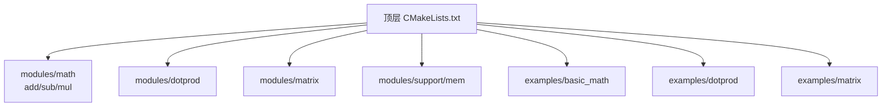
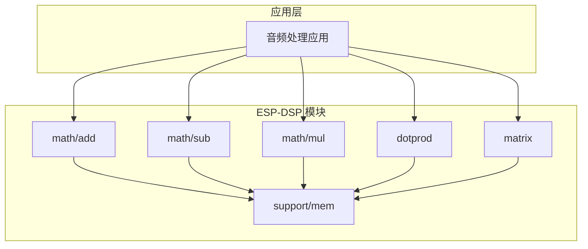
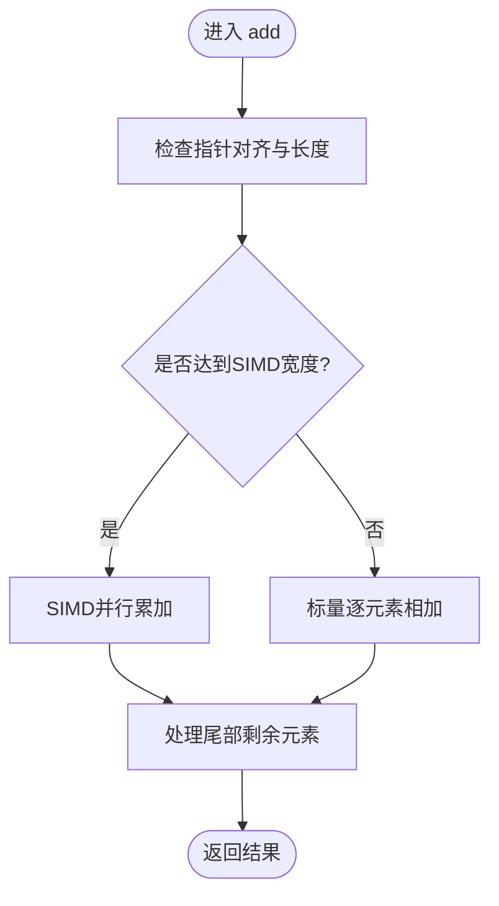
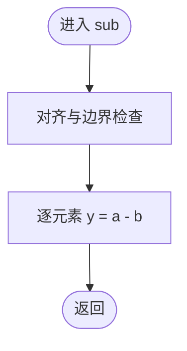
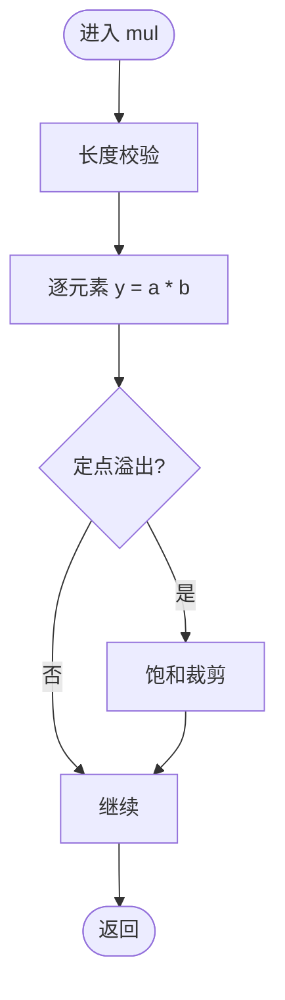
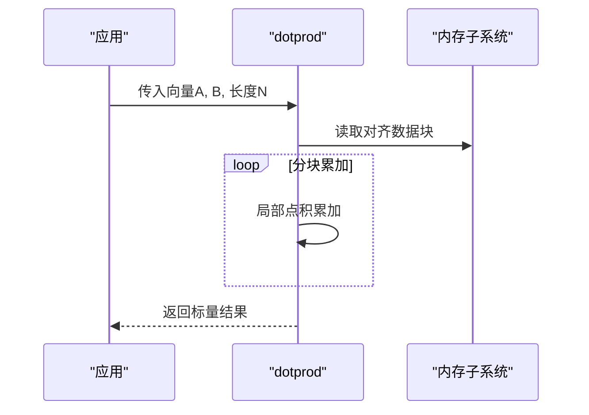
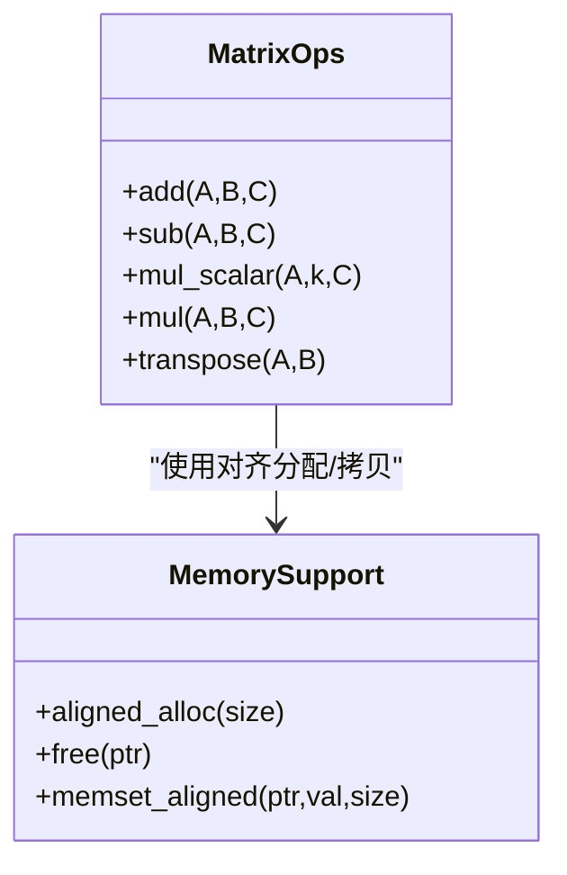
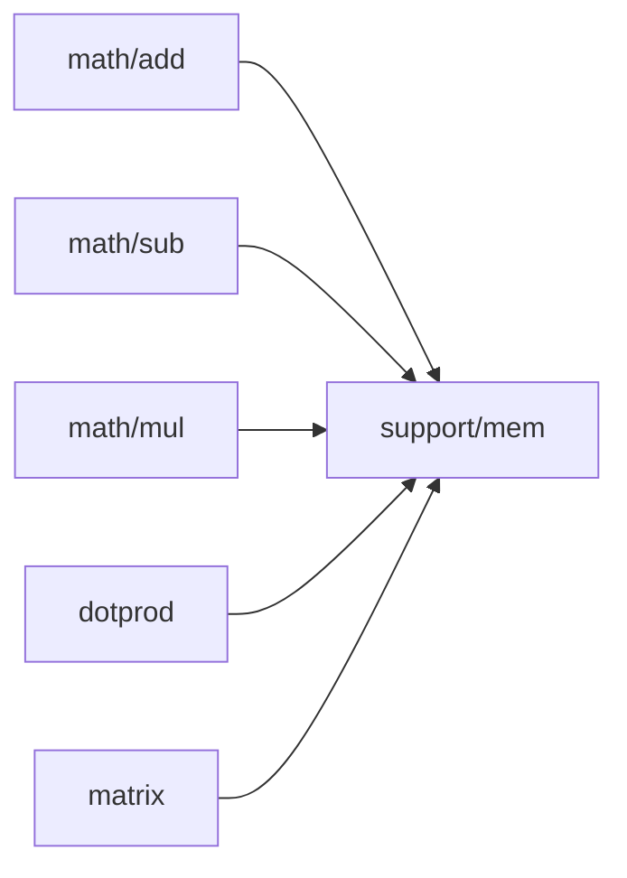

# 核心DSP算法

<cite>
**本文档引用的文件**   
- [esp-dsp CMakeLists.txt](file://Firmware/esp32_ai_mirror/managed_components/espressif__esp-dsp/CMakeLists.txt)
- [esp-dsp README.md](file://Firmware/esp32_ai_mirror/managed_components/espressif__esp-dsp/README.md)
- [basic_math 示例 CMakeLists.txt](file://Firmware/esp32_ai_mirror/managed_components/espressif__esp-dsp/examples/basic_math/CMakeLists.txt)
- [basic_math 示例 main.c](file://Firmware/esp32_ai_mirror/managed_components/espressif__esp-dsp/examples/basic_math/main/main.c)
- [dotprod 示例 CMakeLists.txt](file://Firmware/esp32_ai_mirror/managed_components/espressif__esp-dsp/examples/dotprod/CMakeLists.txt)
- [dotprod 示例 main.c](file://Firmware/esp32_ai_mirror/managed_components/espressif__esp-dsp/examples/dotprod/main/main.c)
- [matrix 示例 CMakeLists.txt](file://Firmware/esp32_ai_mirror/managed_components/espressif__esp-dsp/examples/matrix/CMakeLists.txt)
- [matrix 示例 main.c](file://Firmware/esp32_ai_mirror/managed_components/espressif__esp-dsp/examples/matrix/main/main.c)
- [math add 头文件](file://Firmware/esp32_ai_mirror/managed_components/espressif__esp-dsp/modules/math/add/include/esp_dsp_add.h)
- [math sub 头文件](file://Firmware/esp32_ai_mirror/managed_components/espressif__esp-dsp/modules/math/sub/include/esp_dsp_sub.h)
- [math mul 头文件](file://Firmware/esp32_ai_mirror/managed_components/espressif__esp-dsp/modules/math/mul/include/esp_dsp_mul.h)
- [dotprod 头文件](file://Firmware/esp32_ai_mirror/managed_components/espressif__esp-dsp/modules/dotprod/include/esp_dsp_dotprod.h)
- [matrix 头文件](file://Firmware/esp32_ai_mirror/managed_components/espressif__esp-dsp/modules/matrix/include/esp_dsp_matrix.h)
- [support mem 头文件](file://Firmware/esp32_ai_mirror/managed_components/espressif__esp-dsp/modules/support/mem/include/esp_dsp_mem.h)
</cite>

## 目录
1. [简介](#简介)
2. [项目结构](#项目结构)
3. [核心组件](#核心组件)
4. [架构总览](#架构总览)
5. [详细组件分析](#详细组件分析)
6. [依赖关系分析](#依赖关系分析)
7. [性能考虑](#性能考虑)
8. [故障排查指南](#故障排查指南)
9. [结论](#结论)
10. [附录](#附录)

## 简介
本文件聚焦于 ESP-DSP 库中的核心数字信号处理（DSP）算法，系统阐述基础数学运算（加法、减法、乘法、点积）、矩阵与向量操作的数据类型支持（浮点数与定点数）、精度与数值稳定性考量，以及在音频处理中的应用方式。同时总结内存管理与缓存优化的最佳实践，帮助开发者在资源受限的嵌入式平台上实现高性能 DSP 流水线。

## 项目结构
ESP-DSP 采用模块化组织：按功能域划分 modules（如 math、dotprod、matrix、fir、iir、fft 等），每个模块包含 float/fixed 等不同数据类型的实现与测试；examples 提供可运行的示例工程；applications 展示板级应用集成。构建由顶层 CMakeLists.txt 统一编排，各子模块通过 include 路径暴露 API 头文件。

图表来源
- [esp-dsp CMakeLists.txt](file://Firmware/esp32_ai_mirror/managed_components/espressif__esp-dsp/CMakeLists.txt)
- [basic_math 示例 CMakeLists.txt](file://Firmware/esp32_ai_mirror/managed_components/espressif__esp-dsp/examples/basic_math/CMakeLists.txt)
- [dotprod 示例 CMakeLists.txt](file://Firmware/esp32_ai_mirror/managed_components/espressif__esp-dsp/examples/dotprod/CMakeLists.txt)
- [matrix 示例 CMakeLists.txt](file://Firmware/esp32_ai_mirror/managed_components/espressif__esp-dsp/examples/matrix/CMakeLists.txt)

章节来源
- [esp-dsp README.md](file://Firmware/esp32_ai_mirror/managed_components/espressif__esp-dsp/README.md)
- [esp-dsp CMakeLists.txt](file://Firmware/esp32_ai_mirror/managed_components/espressif__esp-dsp/CMakeLists.txt)

## 核心组件
- 基础数学运算
  - 加法：向量逐元素相加，支持 float 与定点数变体，具备常量加与向量化优化接口。
  - 减法：向量逐元素相减，结构与加法一致，便于滤波器差分与误差计算。
  - 乘法：向量逐元素相乘，常用于增益控制、窗函数加权与卷积核缩放。
- 点积（内积）
  - 两向量对应元素相乘并求和，广泛用于能量估计、相关性与匹配滤波。
- 矩阵运算
  - 矩阵加减、标量乘、矩阵乘、转置等，支撑多通道滤波、状态空间模型与变换。
- 内存与工具
  - 对齐分配、块拷贝、清零等底层支持，保障 SIMD/NEON 或 RISC-V V 扩展的高效访问。

章节来源
- [math add 头文件](file://Firmware/esp32_ai_mirror/managed_components/espressif__esp-dsp/modules/math/add/include/esp_dsp_add.h)
- [math sub 头文件](file://Firmware/esp32_ai_mirror/managed_components/espressif__esp-dsp/modules/math/sub/include/esp_dsp_sub.h)
- [math mul 头文件](file://Firmware/esp32_ai_mirror/managed_components/espressif__esp-dsp/modules/math/mul/include/esp_dsp_mul.h)
- [dotprod 头文件](file://Firmware/esp32_ai_mirror/managed_components/espressif__esp-dsp/modules/dotprod/include/esp_dsp_dotprod.h)
- [matrix 头文件](file://Firmware/esp32_ai_mirror/managed_components/espressif__esp-dsp/modules/matrix/include/esp_dsp_matrix.h)
- [support mem 头文件](file://Firmware/esp32_ai_mirror/managed_components/espressif__esp-dsp/modules/support/mem/include/esp_dsp_mem.h)

## 架构总览
ESP-DSP 以“算法模块 + 数据类型特化”为核心设计。每个数学算子提供 float 与 fixed 两套实现，上层通过统一命名约定选择目标版本。示例工程演示了如何在音频采集/播放链路中调用这些算子完成实时处理。

图表来源
- [basic_math 示例 main.c](file://Firmware/esp32_ai_mirror/managed_components/espressif__esp-dsp/examples/basic_math/main/main.c)
- [dotprod 示例 main.c](file://Firmware/esp32_ai_mirror/managed_components/espressif__esp-dsp/examples/dotprod/main/main.c)
- [matrix 示例 main.c](file://Firmware/esp32_ai_mirror/managed_components/espressif__esp-dsp/examples/matrix/main/main.c)
- [support mem 头文件](file://Firmware/esp32_ai_mirror/managed_components/espressif__esp-dsp/modules/support/mem/include/esp_dsp_mem.h)

## 详细组件分析

### 加法（add）
- 功能要点
  - 向量逐元素相加，支持 float 与定点数（Q格式）。
  - 通常提供常量加与向量化内核，编译器自动展开循环以提升吞吐。
- 数据类型与精度
  - float：IEEE 754 单精度，适合高精度场景但占用更多 RAM/Flash。
  - fixed：使用 Qm.f 表示法，需关注溢出与舍入策略（饱和/截断）。
- 典型用法
  - 音频叠加（多路麦克风合成）、IIR/FIR 中间结果累加、误差反馈路径。
- 性能建议
  - 保证输入输出指针按平台对齐（如 16/32 字节），启用 SIMD/NEON/V 扩展。
  - 批量处理帧长（如 128/256 采样）以降低函数调用开销。

章节来源
- [math add 头文件](file://Firmware/esp32_ai_mirror/managed_components/espressif__esp-dsp/modules/math/add/include/esp_dsp_add.h)
- [basic_math 示例 main.c](file://Firmware/esp32_ai_mirror/managed_components/espressif__esp-dsp/examples/basic_math/main/main.c)

### 减法（sub）
- 功能要点
  - 向量逐元素相减，常用于差分滤波、回声消除残差计算。
- 数据类型与精度
  - 与 add 类似，fixed 实现需注意负数表示与溢出保护。
- 典型用法
  - 自适应滤波器的误差更新、去直流分量、波形差分。

章节来源
- [math sub 头文件](file://Firmware/esp32_ai_mirror/managed_components/espressif__esp-dsp/modules/math/sub/include/esp_dsp_sub.h)
- [basic_math 示例 main.c](file://Firmware/esp32_ai_mirror/managed_components/espressif__esp-dsp/examples/basic_math/main/main.c)

### 乘法（mul）
- 功能要点
  - 向量逐元素相乘，用于增益、包络检测、窗函数加权。
- 数据类型与精度
  - float：直接硬件乘法；fixed：需移位与饱和，避免中间溢出。
- 典型用法
  - 幅度调制、频域系数缩放、归一化预处理。

章节来源
- [math mul 头文件](file://Firmware/esp32_ai_mirror/managed_components/espressif__esp-dsp/modules/math/mul/include/esp_dsp_mul.h)
- [basic_math 示例 main.c](file://Firmware/esp32_ai_mirror/managed_components/espressif__esp-dsp/examples/basic_math/main/main.c)

### 点积（dotprod）
- 功能要点
  - 计算两个向量的内积，常用于能量估计、相关性与匹配滤波。
- 数据类型与精度
  - float 直接累加；fixed 需要累加器位宽扩展与最终缩放。
- 典型用法
  - 语音活动检测（VAD）能量阈值、MFCC 特征能量、卷积核滑动点积。

章节来源
- [dotprod 头文件](file://Firmware/esp32_ai_mirror/managed_components/espressif__esp-dsp/modules/dotprod/include/esp_dsp_dotprod.h)
- [dotprod 示例 main.c](file://Firmware/esp32_ai_mirror/managed_components/espressif__esp-dsp/examples/dotprod/main/main.c)

### 矩阵运算（matrix）
- 功能要点
  - 提供矩阵加减、标量乘、矩阵乘、转置等常用操作。
- 数据类型与精度
  - float 矩阵运算精度高；fixed 矩阵乘需 careful 缩放与溢出管理。
- 典型用法
  - 多通道滤波器状态更新、线性变换、协方差矩阵计算。

章节来源
- [matrix 头文件](file://Firmware/esp32_ai_mirror/managed_components/espressif__esp-dsp/modules/matrix/include/esp_dsp_matrix.h)
- [matrix 示例 main.c](file://Firmware/esp32_ai_mirror/managed_components/espressif__esp-dsp/examples/matrix/main/main.c)
- [support mem 头文件](file://Firmware/esp32_ai_mirror/managed_components/espressif__esp-dsp/modules/support/mem/include/esp_dsp_mem.h)

### 音频处理中的基础算法应用
- 加法/减法
  - 多麦克风混合与噪声抑制残差更新。
- 乘法
  - 动态范围压缩前的增益预提升、窗函数加权（汉明/汉宁）。
- 点积
  - 短时能量估计用于 VAD 触发；匹配滤波用于关键词检测。
- 矩阵
  - 多通道 FIR/IIR 的状态更新与系数矩阵乘法。

章节来源
- [basic_math 示例 main.c](file://Firmware/esp32_ai_mirror/managed_components/espressif__esp-dsp/examples/basic_math/main/main.c)
- [dotprod 示例 main.c](file://Firmware/esp32_ai_mirror/managed_components/espressif__esp-dsp/examples/dotprod/main/main.c)
- [matrix 示例 main.c](file://Firmware/esp32_ai_mirror/managed_components/espressif__esp-dsp/examples/matrix/main/main.c)

## 依赖关系分析
- 模块耦合
  - math/* 与 dotprod、matrix 相互独立，均依赖 support/mem 进行内存管理。
- 外部依赖
  - 构建系统（CMake）负责将不同数据类型的实现链接到目标平台（ESP32/ESP32-S3）。
- 潜在循环依赖
  - 模块间无直接循环依赖，API 通过头文件解耦。

图表来源
- [support mem 头文件](file://Firmware/esp32_ai_mirror/managed_components/espressif__esp-dsp/modules/support/mem/include/esp_dsp_mem.h)
- [esp-dsp CMakeLists.txt](file://Firmware/esp32_ai_mirror/managed_components/espressif__esp-dsp/CMakeLists.txt)

章节来源
- [esp-dsp CMakeLists.txt](file://Firmware/esp32_ai_mirror/managed_components/espressif__esp-dsp/CMakeLists.txt)

## 性能考虑
- 数据类型选择
  - float：精度优先，适合离线或高算力设备；fixed：资源受限场景首选，注意缩放与饱和。
- 内存对齐与缓存
  - 使用对齐分配（如 16/32 字节），减少 cache miss；大块连续内存优于分散分配。
- 向量化与并行
  - 利用 NEON/Vector 扩展，批量处理帧（128/256）；避免分支与条件判断。
- 数值稳定性
  - fixed 累加器使用更高位宽（如 32-bit 累加 16-bit 输入）；必要时引入限幅与归一化。
- I/O 与流水线
  - 双缓冲/乒乓缓冲降低延迟；DMA 传输与 DSP 计算重叠。

[本节为通用指导，不直接分析具体文件]

## 故障排查指南
- 常见错误
  - 未对齐指针导致 SIMD 异常或性能骤降。
  - fixed 点积溢出：累加器位宽不足或未正确缩放。
  - 矩阵维度不匹配：行/列顺序混淆导致结果错误。
- 诊断方法
  - 打印关键中间值（能量、范数、最大绝对值）定位数值问题。
  - 使用最小可复现用例隔离模块问题。
- 修复建议
  - 统一使用库提供的对齐分配接口；固定点路径增加饱和与缩放检查。
  - 对矩阵操作添加维度校验与边界检查。

章节来源
- [support mem 头文件](file://Firmware/esp32_ai_mirror/managed_components/espressif__esp-dsp/modules/support/mem/include/esp_dsp_mem.h)
- [dotprod 头文件](file://Firmware/esp32_ai_mirror/managed_components/espressif__esp-dsp/modules/dotprod/include/esp_dsp_dotprod.h)
- [matrix 头文件](file://Firmware/esp32_ai_mirror/managed_components/espressif__esp-dsp/modules/matrix/include/esp_dsp_matrix.h)

## 结论
ESP-DSP 通过清晰的模块化设计与 float/fixed 双实现，为嵌入式音频与信号处理提供了高效、易用的基础算子。合理选择数据类型、确保内存对齐与缓存友好布局、结合向量化与流水线技术，可在资源受限平台上获得稳定且高性能的 DSP 处理能力。

[本节为总结性内容，不直接分析具体文件]

## 附录
- 快速上手
  - 参考 examples/basic_math、examples/dotprod、examples/matrix 的工程结构与调用方式，快速集成加法、点积与矩阵运算。
- 进一步阅读
  - esp-dsp README 了解模块清单与构建说明；CMakeLists 查看目标平台配置。

章节来源
- [esp-dsp README.md](file://Firmware/esp32_ai_mirror/managed_components/espressif__esp-dsp/README.md)
- [basic_math 示例 CMakeLists.txt](file://Firmware/esp32_ai_mirror/managed_components/espressif__esp-dsp/examples/basic_math/CMakeLists.txt)
- [dotprod 示例 CMakeLists.txt](file://Firmware/esp32_ai_mirror/managed_components/espressif__esp-dsp/examples/dotprod/CMakeLists.txt)
- [matrix 示例 CMakeLists.txt](file://Firmware/esp32_ai_mirror/managed_components/espressif__esp-dsp/examples/matrix/CMakeLists.txt)