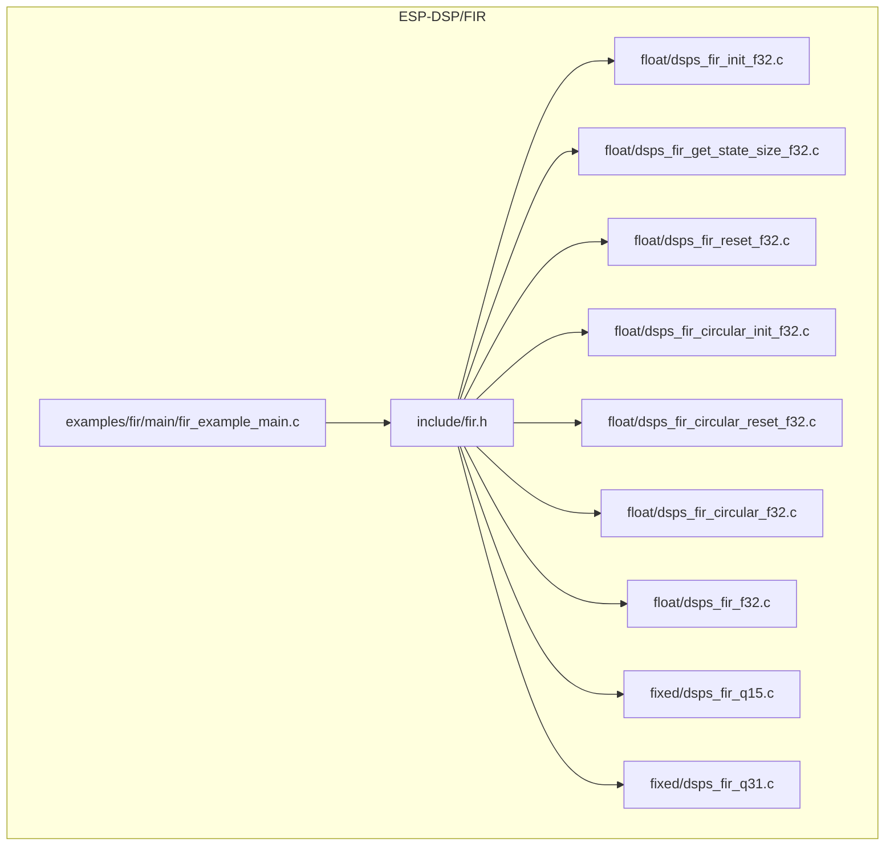
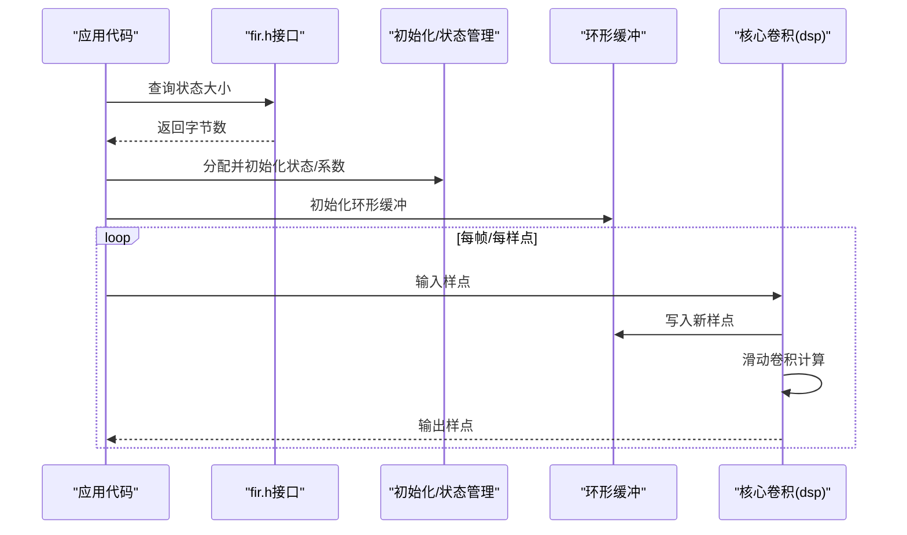
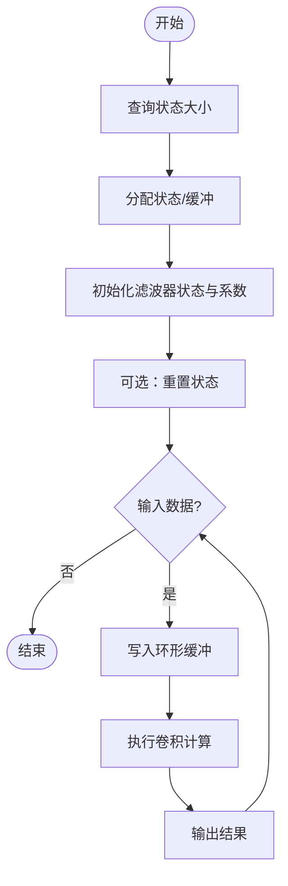
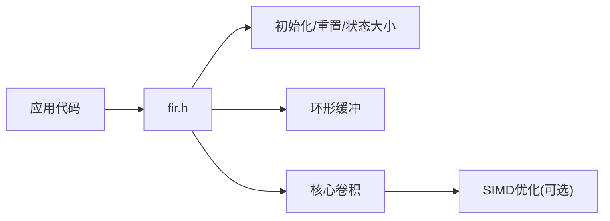

# FIR滤波器

<cite>
**本文引用的文件**
- [README.md](file://Firmware/esp32_ai_mirror/managed_components/espressif__esp-dsp/README.md)
- [fir.h](file://Firmware/esp32_ai_mirror/managed_components/espressif__esp-dsp/modules/fir/include/fir.h)
- [dsps_fir_init_f32.c](file://Firmware/esp32_ai_mirror/managed_components/espressif__esp-dsp/modules/fir/float/dsps_fir_init_f32.c)
- [dsps_fir_get_state_size_f32.c](file://Firmware/esp32_ai_mirror/managed_components/espressif__esp-dsp/modules/fir/float/dsps_fir_get_state_size_f32.c)
- [dsps_fir_reset_f32.c](file://Firmware/esp32_ai_mirror/managed_components/espressif__esp-dsp/modules/fir/float/dsps_fir_reset_f32.c)
- [dsps_fir_circular_init_f32.c](file://Firmware/esp32_ai_mirror/managed_components/espressif__esp-dsp/modules/fir/float/dsps_fir_circular_init_f32.c)
- [dsps_fir_circular_reset_f32.c](file://Firmware/esp32_ai_mirror/managed_components/espressif__esp-dsp/modules/fir/float/dsps_fir_circular_reset_f32.c)
- [dsps_fir_circular_f32.c](file://Firmware/esp32_ai_mirror/managed_components/espressif__esp-dsp/modules/fir/float/dsps_fir_circular_f32.c)
- [dsps_fir_f32.c](file://Firmware/esp32_ai_mirror/managed_components/espressif__esp-dsp/modules/fir/float/dsps_fir_f32.c)
- [dsps_fir_q15.c](file://Firmware/esp32_ai_mirror/managed_components/espressif__esp-dsp/modules/fir/fixed/dsps_fir_q15.c)
- [dsps_fir_q31.c](file://Firmware/esp32_ai_mirror/managed_components/espressif__esp-dsp/modules/fir/fixed/dsps_fir_q31.c)
- [fir_example_main.c](file://Firmware/esp32_ai_mirror/managed_components/espressif__esp-dsp/examples/fir/main/fir_example_main.c)
- [CMakeLists.txt](file://Firmware/esp32_ai_mirror/managed_components/espressif__esp-dsp/examples/fir/CMakeLists.txt)
</cite>

## 目录
1. [简介](#简介)
2. [项目结构](#项目结构)
3. [核心组件](#核心组件)
4. [架构总览](#架构总览)
5. [详细组件分析](#详细组件分析)
6. [依赖关系分析](#依赖关系分析)
7. [性能考量](#性能考量)
8. [故障排查指南](#故障排查指南)
9. [结论](#结论)
10. [附录](#附录)

## 简介
本文件面向在ESP32平台上使用ESP-DSP库实现有限脉冲响应（FIR）滤波器的工程师与开发者，系统阐述FIR滤波器的数学基础、设计方法、窗口函数选择策略，以及ESP-DSP中dsps_fir_*系列函数的使用方法（浮点型与定点型）。文档同时给出低通、高通、带通滤波器的设计示例思路，并针对实时音频处理中的延迟优化、内存管理以及在ESP32平台上的性能调优技巧提供实践建议。

## 项目结构
ESP-DSP的FIR模块位于modules/fir目录下，包含：
- include头文件：对外API声明
- float浮点实现：f32类型的高效实现与环形缓冲支持
- fixed定点实现：q15/q31类型，适合无FPU或追求确定性的场景
- resampler重采样子模块（可选）
- test测试用例与test_sim仿真
- examples/fir示例工程，演示如何初始化、配置与调用FIR

图表来源
- [fir.h](file://Firmware/esp32_ai_mirror/managed_components/espressif__esp-dsp/modules/fir/include/fir.h)
- [dsps_fir_init_f32.c](file://Firmware/esp32_ai_mirror/managed_components/espressif__esp-dsp/modules/fir/float/dsps_fir_init_f32.c)
- [dsps_fir_get_state_size_f32.c](file://Firmware/esp32_ai_mirror/managed_components/espressif__esp-dsp/modules/fir/float/dsps_fir_get_state_size_f32.c)
- [dsps_fir_reset_f32.c](file://Firmware/esp32_ai_mirror/managed_components/espressif__esp-dsp/modules/fir/float/dsps_fir_reset_f32.c)
- [dsps_fir_circular_init_f32.c](file://Firmware/esp32_ai_mirror/managed_components/espressif__esp-dsp/modules/fir/float/dsps_fir_circular_init_f32.c)
- [dsps_fir_circular_reset_f32.c](file://Firmware/esp32_ai_mirror/managed_components/espressif__esp-dsp/modules/fir/float/dsps_fir_circular_reset_f32.c)
- [dsps_fir_circular_f32.c](file://Firmware/esp32_ai_mirror/managed_components/espressif__esp-dsp/modules/fir/float/dsps_fir_circular_f32.c)
- [dsps_fir_f32.c](file://Firmware/esp32_ai_mirror/managed_components/espressif__esp-dsp/modules/fir/float/dsps_fir_f32.c)
- [dsps_fir_q15.c](file://Firmware/esp32_ai_mirror/managed_components/espressif__esp-dsp/modules/fir/fixed/dsps_fir_q15.c)
- [dsps_fir_q31.c](file://Firmware/esp32_ai_mirror/managed_components/espressif__esp-dsp/modules/fir/fixed/dsps_fir_q31.c)
- [fir_example_main.c](file://Firmware/esp32_ai_mirror/managed_components/espressif__esp-dsp/examples/fir/main/fir_example_main.c)

章节来源
- [README.md](file://Firmware/esp32_ai_mirror/managed_components/espressif__esp-dsp/README.md)

## 核心组件
- 头文件与API入口
  - fir.h：定义dsps_fir_*系列函数原型、状态结构体、常量与宏，是应用层唯一需要直接包含的头文件。
- 浮点实现（f32）
  - 初始化与状态大小查询：用于分配状态缓冲区、设置系数与长度。
  - 重置：清空内部状态，保证连续处理的稳定性。
  - 环形缓冲：为流式处理提供O(1)更新的历史样本存储，避免拷贝开销。
  - 核心卷积：按块或逐样点执行线性卷积，利用环形缓冲与SIMD优化。
- 定点实现（q15/q31）
  - 适用于无FPU或需确定性时延的场景，注意饱和与溢出保护。
- 示例工程
  - examples/fir：展示完整流程，包括系数生成、初始化、数据流处理与结果验证。

章节来源
- [fir.h](file://Firmware/esp32_ai_mirror/managed_components/espressif__esp-dsp/modules/fir/include/fir.h)
- [dsps_fir_init_f32.c](file://Firmware/esp32_ai_mirror/managed_components/espressif__esp-dsp/modules/fir/float/dsps_fir_init_f32.c)
- [dsps_fir_get_state_size_f32.c](file://Firmware/esp32_ai_mirror/managed_components/espressif__esp-dsp/modules/fir/float/dsps_fir_get_state_size_f32.c)
- [dsps_fir_reset_f32.c](file://Firmware/esp32_ai_mirror/managed_components/espressif__esp-dsp/modules/fir/float/dsps_fir_reset_f32.c)
- [dsps_fir_circular_init_f32.c](file://Firmware/esp32_ai_mirror/managed_components/espressif__esp-dsp/modules/fir/float/dsps_fir_circular_init_f32.c)
- [dsps_fir_circular_reset_f32.c](file://Firmware/esp32_ai_mirror/managed_components/espressif__esp-dsp/modules/fir/float/dsps_fir_circular_reset_f32.c)
- [dsps_fir_circular_f32.c](file://Firmware/esp32_ai_mirror/managed_components/espressif__esp-dsp/modules/fir/float/dsps_fir_circular_f32.c)
- [dsps_fir_f32.c](file://Firmware/esp32_ai_mirror/managed_components/espressif__esp-dsp/modules/fir/float/dsps_fir_f32.c)
- [dsps_fir_q15.c](file://Firmware/esp32_ai_mirror/managed_components/espressif__esp-dsp/modules/fir/fixed/dsps_fir_q15.c)
- [dsps_fir_q31.c](file://Firmware/esp32_ai_mirror/managed_components/espressif__esp-dsp/modules/fir/fixed/dsps_fir_q31.c)
- [fir_example_main.c](file://Firmware/esp32_ai_mirror/managed_components/espressif__esp-dsp/examples/fir/main/fir_example_main.c)

## 架构总览
下图展示了从应用层到DSP内核的调用路径与数据流向，涵盖初始化、状态管理、环形缓冲与核心卷积。

图表来源
- [fir.h](file://Firmware/esp32_ai_mirror/managed_components/espressif__esp-dsp/modules/fir/include/fir.h)
- [dsps_fir_get_state_size_f32.c](file://Firmware/esp32_ai_mirror/managed_components/espressif__esp-dsp/modules/fir/float/dsps_fir_get_state_size_f32.c)
- [dsps_fir_init_f32.c](file://Firmware/esp32_ai_mirror/managed_components/espressif__esp-dsp/modules/fir/float/dsps_fir_init_f32.c)
- [dsps_fir_circular_init_f32.c](file://Firmware/esp32_ai_mirror/managed_components/espressif__esp-dsp/modules/fir/float/dsps_fir_circular_init_f32.c)
- [dsps_fir_circular_f32.c](file://Firmware/esp32_ai_mirror/managed_components/espressif__esp-dsp/modules/fir/float/dsps_fir_circular_f32.c)
- [dsps_fir_f32.c](file://Firmware/esp32_ai_mirror/managed_components/espressif__esp-dsp/modules/fir/float/dsps_fir_f32.c)

## 详细组件分析

### FIR数学基础与设计要点
- 离散时间卷积：y[n] = Σ h[k]·x[n−k]，h为滤波器系数，长度为N。
- 频域特性：通过窗函数法设计理想频率响应，再加窗抑制吉布斯效应，获得稳定系数。
- 线性相位：对称系数可实现严格线性相位，避免群延时失真，适合音频。
- 延迟：FIR引入固定群延时(N−1)/2样点，需在系统级对齐。

章节来源
- [fir.h](file://Firmware/esp32_ai_mirror/managed_components/espressif__esp-dsp/modules/fir/include/fir.h)

### 窗口函数与系数生成
- 常用窗函数：汉宁窗、汉明窗、布莱克曼窗、凯泽窗等。不同窗权衡主瓣宽度与旁瓣衰减。
- 设计步骤：
  1) 确定截止频率与采样率，计算归一化角频率；
  2) 选择窗函数与阶数N，估计过渡带宽与阻带衰减；
  3) 生成理想冲激响应并加窗得到h[n]；
  4) 归一化增益，确保通带幅度接近1。
- 工具建议：MATLAB/Python scipy.signal.firwin可快速生成系数，导出为C数组供嵌入式使用。

章节来源
- [README.md](file://Firmware/esp32_ai_mirror/managed_components/espressif__esp-dsp/README.md)

### 低通/高通/带通滤波器设计示例
- 低通：设定截止频率fc，使用窗函数法生成h[n]，保证通带平坦、阻带衰减足够。
- 高通：对低通系数进行频谱搬移（h_hp[n] = (−1)^n·h_lp[n]），或重新设计。
- 带通：两个截止频率fc1, fc2，可由低通差分或独立设计。
- 验证：绘制幅频响应，检查通带纹波、阻带衰减与线性相位。

章节来源
- [fir_example_main.c](file://Firmware/esp32_ai_mirror/managed_components/espressif__esp-dsp/examples/fir/main/fir_example_main.c)

### dsps_fir_* 浮点实现（f32）
- 关键流程
  - 查询状态大小：根据滤波器长度计算所需内存。
  - 初始化：设置系数指针、长度、状态指针与初始值。
  - 重置：清空历史样本，便于切换滤波器或重启。
  - 环形缓冲：初始化循环队列，避免每次移动历史数据。
  - 核心卷积：按块或逐样点计算，内部使用SIMD优化。
- 适用场景：有FPU、追求精度与易用性。

图表来源
- [dsps_fir_get_state_size_f32.c](file://Firmware/esp32_ai_mirror/managed_components/espressif__esp-dsp/modules/fir/float/dsps_fir_get_state_size_f32.c)
- [dsps_fir_init_f32.c](file://Firmware/esp32_ai_mirror/managed_components/espressif__esp-dsp/modules/fir/float/dsps_fir_init_f32.c)
- [dsps_fir_reset_f32.c](file://Firmware/esp32_ai_mirror/managed_components/espressif__esp-dsp/modules/fir/float/dsps_fir_reset_f32.c)
- [dsps_fir_circular_init_f32.c](file://Firmware/esp32_ai_mirror/managed_components/espressif__esp-dsp/modules/fir/float/dsps_fir_circular_init_f32.c)
- [dsps_fir_circular_f32.c](file://Firmware/esp32_ai_mirror/managed_components/espressif__esp-dsp/modules/fir/float/dsps_fir_circular_f32.c)
- [dsps_fir_f32.c](file://Firmware/esp32_ai_mirror/managed_components/espressif__esp-dsp/modules/fir/float/dsps_fir_f32.c)

章节来源
- [dsps_fir_init_f32.c](file://Firmware/esp32_ai_mirror/managed_components/espressif__esp-dsp/modules/fir/float/dsps_fir_init_f32.c)
- [dsps_fir_get_state_size_f32.c](file://Firmware/esp32_ai_mirror/managed_components/espressif__esp-dsp/modules/fir/float/dsps_fir_get_state_size_f32.c)
- [dsps_fir_reset_f32.c](file://Firmware/esp32_ai_mirror/managed_components/espressif__esp-dsp/modules/fir/float/dsps_fir_reset_f32.c)
- [dsps_fir_circular_init_f32.c](file://Firmware/esp32_ai_mirror/managed_components/espressif__esp-dsp/modules/fir/float/dsps_fir_circular_init_f32.c)
- [dsps_fir_circular_reset_f32.c](file://Firmware/esp32_ai_mirror/managed_components/espressif__esp-dsp/modules/fir/float/dsps_fir_circular_reset_f32.c)
- [dsps_fir_circular_f32.c](file://Firmware/esp32_ai_mirror/managed_components/espressif__esp-dsp/modules/fir/float/dsps_fir_circular_f32.c)
- [dsps_fir_f32.c](file://Firmware/esp32_ai_mirror/managed_components/espressif__esp-dsp/modules/fir/float/dsps_fir_f32.c)

### dsps_fir_* 定点实现（q15/q31）
- 数据类型：q15适合资源受限MCU，q31提高动态范围但增加运算量。
- 注意事项：
  - 乘积累加需饱和处理，防止溢出；
  - 系数缩放与输入量化需一致，避免信号削波；
  - 复位与初始化顺序与浮点类似，但关注Q格式转换。
- 适用场景：无FPU、需确定性时延与更低功耗。

章节来源
- [dsps_fir_q15.c](file://Firmware/esp32_ai_mirror/managed_components/espressif__esp-dsp/modules/fir/fixed/dsps_fir_q15.c)
- [dsps_fir_q31.c](file://Firmware/esp32_ai_mirror/managed_components/espressif__esp-dsp/modules/fir/fixed/dsps_fir_q31.c)

### 示例工程与构建
- 示例位置：examples/fir
- 构建方式：使用ESP-IDF CMake，编译目标为fir_example，链接ESP-DSP库。
- 典型流程：加载系数→初始化→循环读取音频/传感器数据→调用FIR→输出或可视化。

章节来源
- [CMakeLists.txt](file://Firmware/esp32_ai_mirror/managed_components/espressif__esp-dsp/examples/fir/CMakeLists.txt)
- [fir_example_main.c](file://Firmware/esp32_ai_mirror/managed_components/espressif__esp-dsp/examples/fir/main/fir_example_main.c)

## 依赖关系分析
- 头文件依赖：应用仅依赖fir.h，屏蔽底层实现差异。
- 模块内依赖：
  - 初始化/重置/状态大小查询为公共基础设施；
  - 环形缓冲为流式处理的关键数据结构；
  - 核心卷积依赖SIMD指令集（如NEON）以提升吞吐。
- 外部依赖：ESP-IDF运行时、可选的音频I/O与显示/串口调试。

图表来源
- [fir.h](file://Firmware/esp32_ai_mirror/managed_components/espressif__esp-dsp/modules/fir/include/fir.h)
- [dsps_fir_init_f32.c](file://Firmware/esp32_ai_mirror/managed_components/espressif__esp-dsp/modules/fir/float/dsps_fir_init_f32.c)
- [dsps_fir_circular_f32.c](file://Firmware/esp32_ai_mirror/managed_components/espressif__esp-dsp/modules/fir/float/dsps_fir_circular_f32.c)
- [dsps_fir_f32.c](file://Firmware/esp32_ai_mirror/managed_components/espressif__esp-dsp/modules/fir/float/dsps_fir_f32.c)

章节来源
- [fir.h](file://Firmware/esp32_ai_mirror/managed_components/espressif__esp-dsp/modules/fir/include/fir.h)

## 性能考量
- 延迟优化
  - 使用环形缓冲避免历史数据移动，降低CPU占用；
  - 分块处理：将长序列切分为块，减少边界判断与缓存未命中；
  - 合理选择滤波器阶数N：N越大延迟越高，需权衡频响与实时性。
- 内存管理
  - 预分配状态与缓冲，避免运行时malloc；
  - 将系数置于Flash或常量区，减少RAM占用；
  - 对齐内存地址以充分利用SIMD与DMA。
- ESP32平台调优
  - 启用FPU与NEON加速（若可用）；
  - 将关键数据放入IRAM/DMA友好区域；
  - 使用空闲核或任务优先级隔离音频路径；
  - 关闭不必要的日志与中断抖动，保证音频周期稳定。
- 定点vs浮点
  - 无FPU时优先q15/q31，注意缩放与饱和；
  - 有FPU时f32更简单且精度高，但功耗略高。

[本节为通用指导，不直接分析具体文件]

## 故障排查指南
- 初始化失败或崩溃
  - 检查状态大小是否正确计算；
  - 确认系数数组长度与初始化参数一致；
  - 确保环形缓冲容量≥滤波器长度。
- 输出异常或噪声
  - 检查系数是否归一化，避免过增益；
  - 定点模式下检查Q格式与饱和设置；
  - 验证输入采样率与截止频率匹配。
- 实时卡顿
  - 评估N与分块大小，必要时降低阶数；
  - 检查I/O阻塞与中断冲突；
  - 使用性能计数器定位热点函数。

章节来源
- [dsps_fir_get_state_size_f32.c](file://Firmware/esp32_ai_mirror/managed_components/espressif__esp-dsp/modules/fir/float/dsps_fir_get_state_size_f32.c)
- [dsps_fir_init_f32.c](file://Firmware/esp32_ai_mirror/managed_components/espressif__esp-dsp/modules/fir/float/dsps_fir_init_f32.c)
- [dsps_fir_circular_init_f32.c](file://Firmware/esp32_ai_mirror/managed_components/espressif__esp-dsp/modules/fir/float/dsps_fir_circular_init_f32.c)
- [dsps_fir_f32.c](file://Firmware/esp32_ai_mirror/managed_components/espressif__esp-dsp/modules/fir/float/dsps_fir_f32.c)
- [dsps_fir_q15.c](file://Firmware/esp32_ai_mirror/managed_components/espressif__esp-dsp/modules/fir/fixed/dsps_fir_q15.c)
- [dsps_fir_q31.c](file://Firmware/esp32_ai_mirror/managed_components/espressif__esp-dsp/modules/fir/fixed/dsps_fir_q31.c)

## 结论
通过在ESP32上采用ESP-DSP的dsps_fir_*系列函数，可以高效实现FIR滤波器。结合合理的窗函数设计与系数生成流程，能够灵活构造低通、高通、带通滤波器。在实时音频场景中，通过环形缓冲、分块处理与内存对齐等手段，可有效降低延迟与CPU占用。根据平台能力选择浮点或定点实现，并在ESP-IDF环境下进行针对性优化，可获得稳定、低延迟、高质量的滤波效果。

[本节为总结性内容，不直接分析具体文件]

## 附录
- 参考与示例
  - ESP-DSP README：了解模块概览与构建方式
  - examples/fir：端到端示例，便于快速上手
- 实用建议
  - 先用Python/MATLAB验证频响，再移植到嵌入式；
  - 在真实硬件上测量端到端延迟与抖动；
  - 建立回归测试，覆盖边界条件与极端输入。

章节来源
- [README.md](file://Firmware/esp32_ai_mirror/managed_components/espressif__esp-dsp/README.md)
- [CMakeLists.txt](file://Firmware/esp32_ai_mirror/managed_components/espressif__esp-dsp/examples/fir/CMakeLists.txt)
- [fir_example_main.c](file://Firmware/esp32_ai_mirror/managed_components/espressif__esp-dsp/examples/fir/main/fir_example_main.c)