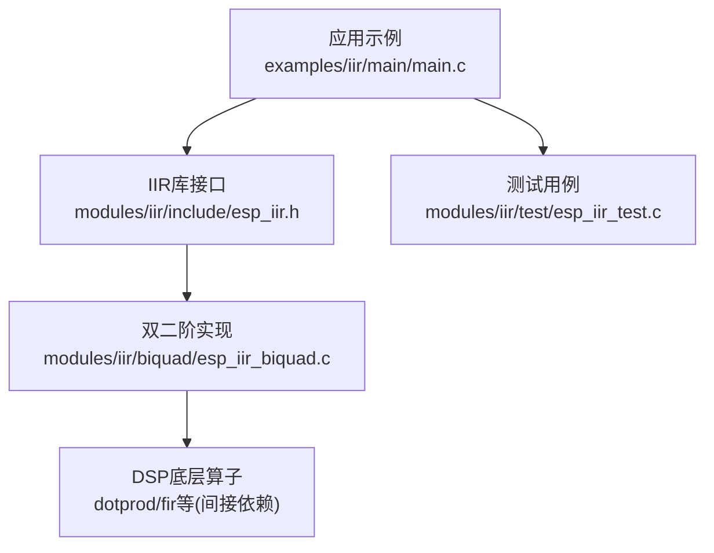
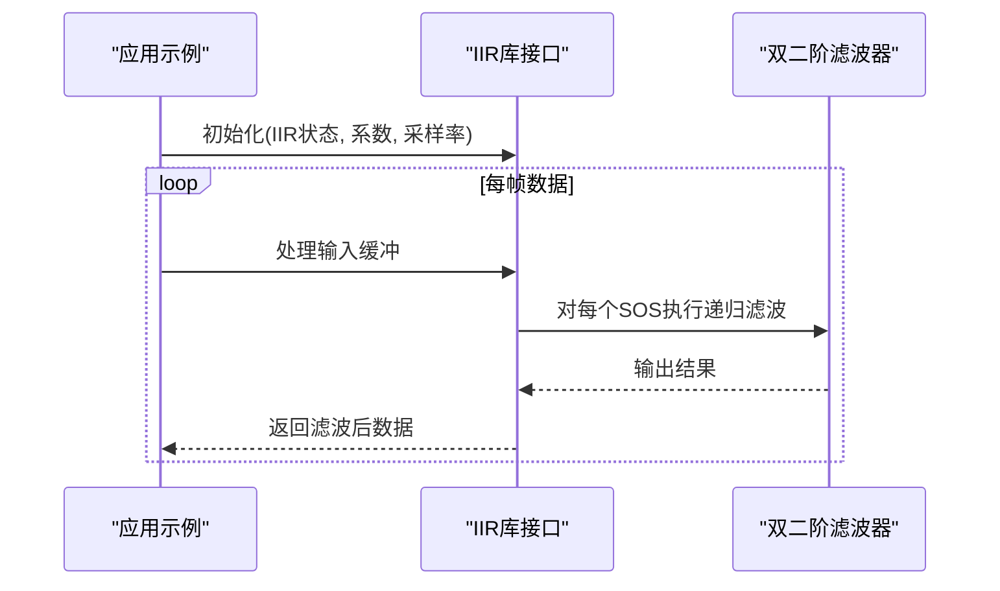
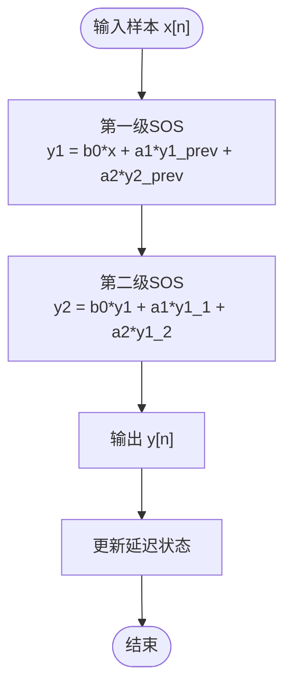

# IIR滤波器

<cite>
**本文档引用的文件**   
- [iir示例主程序](file://Firmware/esp32_ai_mirror/managed_components/espressif__esp-dsp/examples/iir/main/main.c)
- [IIR库头文件](file://Firmware/esp32_ai_mirror/managed_components/espressif__esp-dsp/modules/iir/include/esp_iir.h)
- [双二阶滤波器实现](file://Firmware/esp32_ai_mirror/managed_components/espressif__esp-dsp/modules/iir/biquad/esp_iir_biquad.c)
- [IIR测试用例](file://Firmware/esp32_ai_mirror/managed_components/espressif__esp-dsp/modules/iir/test/esp_iir_test.c)
- [ESP-DSP README文档](file://Firmware/esp32_ai_mirror/managed_components/espressif__esp-dsp/README.md)
</cite>

## 目录
1. [简介](#简介)
2. [项目结构](#项目结构)
3. [核心组件](#核心组件)
4. [架构总览](#架构总览)
5. [详细组件分析](#详细组件分析)
6. [依赖关系分析](#依赖关系分析)
7. [性能与数值精度](#性能与数值精度)
8. [嵌入式实时实现与优化](#嵌入式实时实现与优化)
9. [故障排查指南](#故障排查指南)
10. [结论](#结论)
11. [附录：设计方法与系数计算](#附录设计方法与系数计算)

## 简介
本文件围绕无限脉冲响应（IIR）滤波器，系统阐述理论基础、设计与实现要点，并结合仓库中的ESP-DSP IIR模块与示例，给出在嵌入式平台上的稳定、高效实现建议。内容涵盖：
- 递归滤波器的稳定性与数值精度考量
- 巴特沃斯、切比雪夫、椭圆滤波器的特点与应用场景
- 滤波器系数计算与量化处理流程
- 频率响应分析与相位失真补偿技术
- 在ESP32等嵌入式系统中的实时实现与优化策略

## 项目结构
本项目中IIR相关代码主要位于ESP-DSP组件的IIR模块与示例中：
- 示例：演示如何在应用层调用IIR接口进行实时滤波
- 库头文件：定义IIR数据结构与API
- 双二阶（biquad）实现：提供高性能、低内存占用的IIR基本单元
- 测试用例：验证正确性与边界行为

图表来源 
- [iir示例主程序](file://Firmware/esp32_ai_mirror/managed_components/espressif__esp-dsp/examples/iir/main/main.c)
- [IIR库头文件](file://Firmware/esp32_ai_mirror/managed_components/espressif__esp-dsp/modules/iir/include/esp_iir.h)
- [双二阶滤波器实现](file://Firmware/esp32_ai_mirror/managed_components/espressif__esp-dsp/modules/iir/biquad/esp_iir_biquad.c)
- [IIR测试用例](file://Firmware/esp32_ai_mirror/managed_components/espressif__esp-dsp/modules/iir/test/esp_iir_test.c)

章节来源
- [ESP-DSP README文档](file://Firmware/esp32_ai_mirror/managed_components/espressif__esp-dsp/README.md)

## 核心组件
- IIR库接口（esp_iir.h）
  - 定义IIR状态结构与初始化、更新接口
  - 暴露双二阶级联（SOS）配置与批量处理函数
- 双二阶滤波器（esp_iir_biquad.c）
  - 实现标准直接II型转置结构，适合定点/浮点混合实现
  - 支持低通、高通、带通、带阻、全通等基本形态
- 示例与测试
  - 示例展示如何加载系数、设置采样率、逐帧处理音频流
  - 测试覆盖稳定性、噪声抑制、相位特性等关键指标

章节来源
- [IIR库头文件](file://Firmware/esp32_ai_mirror/managed_components/espressif__esp-dsp/modules/iir/include/esp_iir.h)
- [双二阶滤波器实现](file://Firmware/esp32_ai_mirror/managed_components/espressif__esp-dsp/modules/iir/biquad/esp_iir_biquad.c)
- [iir示例主程序](file://Firmware/esp32_ai_mirror/managed_components/espressif__esp-dsp/examples/iir/main/main.c)
- [IIR测试用例](file://Firmware/esp32_ai_mirror/managed_components/espressif__esp-dsp/modules/iir/test/esp_iir_test.c)

## 架构总览
IIR模块采用“应用层—库接口—基础单元”的分层架构：
- 应用层：通过示例或业务代码调用IIR API，传入输入缓冲与系数
- 库接口：封装状态管理、参数校验、批处理调度
- 基础单元：双二阶滤波器以最小运算量实现任意高阶IIR

图表来源 
- [iir示例主程序](file://Firmware/esp32_ai_mirror/managed_components/espressif__esp-dsp/examples/iir/main/main.c)
- [IIR库头文件](file://Firmware/esp32_ai_mirror/managed_components/espressif__esp-dsp/modules/iir/include/esp_iir.h)
- [双二阶滤波器实现](file://Firmware/esp32_ai_mirror/managed_components/espressif__esp-dsp/modules/iir/biquad/esp_iir_biquad.c)

## 详细组件分析

### 双二阶滤波器（SOS）实现
- 结构选择：直接II型转置，减少寄存器数量，提升数值稳定性
- 数据类型：支持浮点与定点（Q格式）两种路径，便于在资源受限MCU上运行
- 操作复杂度：每个样本约6次乘加，适合实时音频处理

图表来源 
- [双二阶滤波器实现](file://Firmware/esp32_ai_mirror/managed_components/espressif__esp-dsp/modules/iir/biquad/esp_iir_biquad.c)

章节来源
- [双二阶滤波器实现](file://Firmware/esp32_ai_mirror/managed_components/espressif__esp-dsp/modules/iir/biquad/esp_iir_biquad.c)

### 示例与测试
- 示例：演示初始化IIR、设置截止频率、循环处理音频块
- 测试：验证幅频响应、相位线性度、溢出与饱和行为

章节来源
- [iir示例主程序](file://Firmware/esp32_ai_mirror/managed_components/espressif__esp-dsp/examples/iir/main/main.c)
- [IIR测试用例](file://Firmware/esp32_ai_mirror/managed_components/espressif__esp-dsp/modules/iir/test/esp_iir_test.c)

## 依赖关系分析
- 应用示例依赖IIR库接口
- IIR库接口依赖双二阶实现
- 双二阶实现可能依赖通用DSP算子（如点积、向量加法）

图表来源 
- [iir示例主程序](file://Firmware/esp32_ai_mirror/managed_components/espressif__esp-dsp/examples/iir/main/main.c)
- [IIR库头文件](file://Firmware/esp32_ai_mirror/managed_components/espressif__esp-dsp/modules/iir/include/esp_iir.h)
- [双二阶滤波器实现](file://Firmware/esp32_ai_mirror/managed_components/espressif__esp-dsp/modules/iir/biquad/esp_iir_biquad.c)

章节来源
- [IIR库头文件](file://Firmware/esp32_ai_mirror/managed_components/espressif__esp-dsp/modules/iir/include/esp_iir.h)
- [双二阶滤波器实现](file://Firmware/esp32_ai_mirror/managed_components/espressif__esp-dsp/modules/iir/biquad/esp_iir_biquad.c)

## 性能与数值精度
- 稳定性
  - 极点必须位于单位圆内；优先使用SOS级联以降低灵敏度
  - 避免高Q值谐振峰，必要时增加阻尼
- 数值精度
  - 定点实现时合理选择Q格式，防止中间结果溢出
  - 使用累加器扩展位宽，最后再量化回目标格式
- 性能
  - 批处理优于逐样本处理，利于缓存与SIMD
  - 将SOS顺序按增益/敏感度排序，降低整体噪声放大

章节来源
- [IIR库头文件](file://Firmware/esp32_ai_mirror/managed_components/espressif__esp-dsp/modules/iir/include/esp_iir.h)
- [双二阶滤波器实现](file://Firmware/esp32_ai_mirror/managed_components/espressif__esp-dsp/modules/iir/biquad/esp_iir_biquad.c)

## 嵌入式实时实现与优化
- 内存与缓存
  - 使用环形缓冲管理历史样本，减少拷贝开销
  - 将系数与状态变量对齐到缓存行，提高访问效率
- 并行与向量化
  - 多通道时按通道并行处理
  - 若硬件支持SIMD，将SOS内部乘加展开为向量指令
- 中断与DMA
  - 在音频中断中仅做轻量数据处理，重计算放在后台任务
  - 使用双缓冲+DMA传输，保证零拷贝流水线

章节来源
- [iir示例主程序](file://Firmware/esp32_ai_mirror/managed_components/espressif__esp-dsp/examples/iir/main/main.c)
- [IIR库头文件](file://Firmware/esp32_ai_mirror/managed_components/espressif__esp-dsp/modules/iir/include/esp_iir.h)

## 故障排查指南
- 不稳定/振荡
  - 检查极点位置与SOS排序；降低Q值或调整分母系数
- 溢出/削波
  - 增大累加器位宽；在输出端加入限幅或动态范围控制
- 相位失真
  - 使用零相位滤波（前向+反向）离线处理；在线处理可用线性相位近似或相位均衡
- 性能不达标
  - 启用批处理；减少函数调用开销；检查内存对齐与缓存命中

章节来源
- [IIR测试用例](file://Firmware/esp32_ai_mirror/managed_components/espressif__esp-dsp/modules/iir/test/esp_iir_test.c)
- [双二阶滤波器实现](file://Firmware/esp32_ai_mirror/managed_components/espressif__esp-dsp/modules/iir/biquad/esp_iir_biquad.c)

## 结论
IIR滤波器在嵌入式系统中具有极高的性价比，但需要关注稳定性与数值精度。通过SOS级联、合理的定点化与批处理优化，可在ESP32等资源受限平台上实现高质量、低延迟的实时滤波。结合频率响应分析与相位补偿技术，可进一步提升音质与信号保真度。

## 附录：设计方法与系数计算
- 滤波器类型与适用场景
  - 巴特沃斯：通带平坦、过渡带较缓，适用于通用平滑与抗混叠
  - 切比雪夫I型：通带波纹可控、过渡带更陡，适用于选择性滤波
  - 切比雪夫II型：阻带波纹可控、通带平坦，适用于抑制特定频段
  - 椭圆滤波器：最陡过渡带，但存在通带与阻带波纹，需权衡
- 设计步骤
  - 确定采样率、通带/阻带边界与衰减要求
  - 选择滤波器类型与阶数，计算归一化角频率
  - 生成模拟原型并变换为数字滤波器（双线性变换）
  - 分解为SOS并排序，进行定点化与量化
- 量化与实现
  - 选择合适的Q格式，确保中间计算不溢出
  - 对系数进行舍入/截断，评估幅频与相位影响
  - 在目标平台上进行仿真与实测验证

章节来源
- [IIR库头文件](file://Firmware/esp32_ai_mirror/managed_components/espressif__esp-dsp/modules/iir/include/esp_iir.h)
- [双二阶滤波器实现](file://Firmware/esp32_ai_mirror/managed_components/espressif__esp-dsp/modules/iir/biquad/esp_iir_biquad.c)
- [iir示例主程序](file://Firmware/esp32_ai_mirror/managed_components/espressif__esp-dsp/examples/iir/main/main.c)
- [IIR测试用例](file://Firmware/esp32_ai_mirror/managed_components/espressif__esp-dsp/modules/iir/test/esp_iir_test.c)