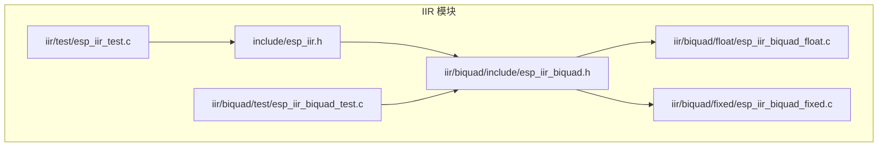
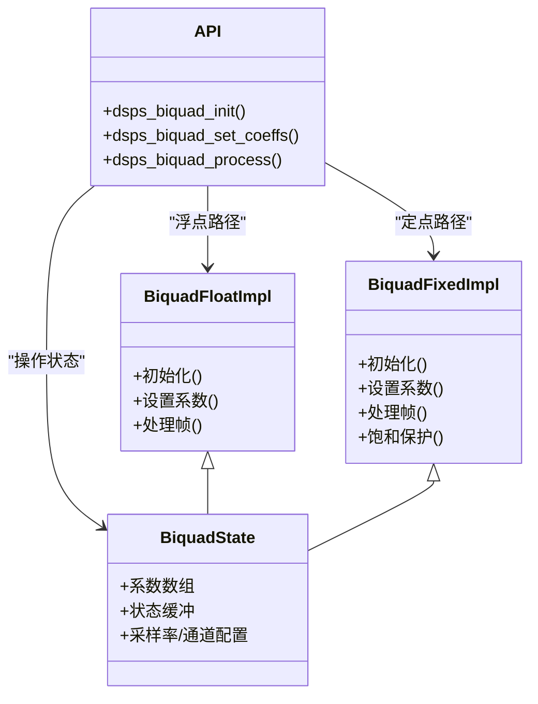
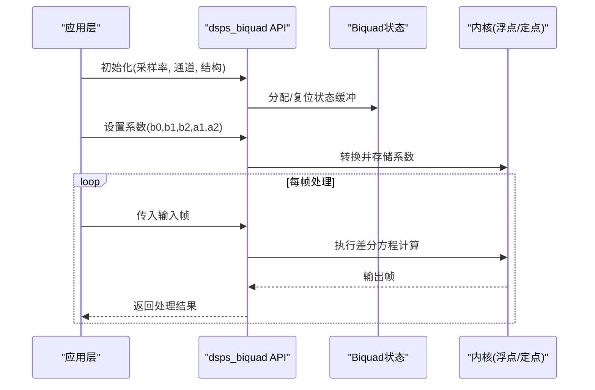
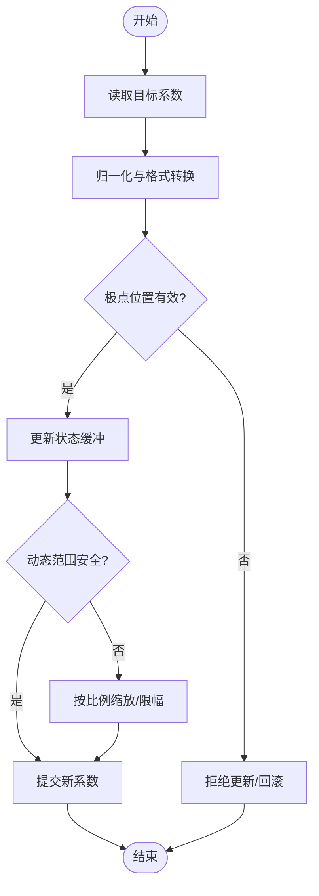
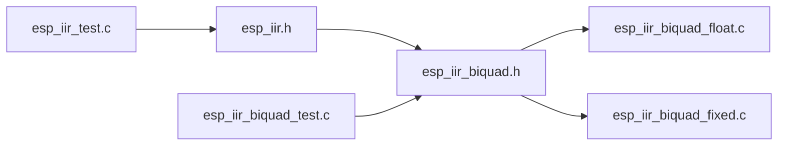

# 双二阶滤波器

<cite>
**本文引用的文件**   
- [esp-dsp/iir/biquad/include/esp_iir_biquad.h](file://Firmware/esp32_ai_mirror/managed_components/espressif__esp-dsp/modules/iir/biquad/include/esp_iir_biquad.h)
- [esp-dsp/iir/biquad/float/esp_iir_biquad_float.c](file://Firmware/esp32_ai_mirror/managed_components/espressif__esp-dsp/modules/iir/biquad/float/esp_iir_biquad_float.c)
- [esp-dsp/iir/biquad/fixed/esp_iir_biquad_fixed.c](file://Firmware/esp32_ai_mirror/managed_components/espressif__esp-dsp/modules/iir/biquad/fixed/esp_iir_biquad_fixed.c)
- [esp-dsp/iir/biquad/test/esp_iir_biquad_test.c](file://Firmware/esp32_ai_mirror/managed_components/espressif__esp-dsp/modules/iir/biquad/test/esp_iir_biquad_test.c)
- [esp-dsp/iir/include/esp_iir.h](file://Firmware/esp32_ai_mirror/managed_components/espressif__esp-dsp/modules/iir/include/esp_iir.h)
- [esp-dsp/iir/test/esp_iir_test.c](file://Firmware/esp32_ai_mirror/managed_components/espressif__esp-dsp/modules/iir/test/esp_iir_test.c)
</cite>

## 目录
1. [简介](#简介)
2. [项目结构](#项目结构)
3. [核心组件](#核心组件)
4. [架构总览](#架构总览)
5. [详细组件分析](#详细组件分析)
6. [依赖关系分析](#依赖关系分析)
7. [性能考量](#性能考量)
8. [故障排查指南](#故障排查指南)
9. [结论](#结论)
10. [附录](#附录)

## 简介
本文件面向在ESP32平台上使用ESP-DSP库进行音频信号处理的工程师，系统讲解双二阶（Biquad）滤波器的理论、实现与工程实践。重点包括：
- 双二阶结构的数学模型与优势
- ESP-DSP中dsps_biquad_*系列函数的接口与参数说明
- 从传递函数到差分方程的系数计算方法
- 均衡器、分频器、噪声抑制等典型应用
- 数值精度处理与溢出保护要点
- 在ESP32 DSP库中的高效实现方式

## 项目结构
ESP-DSP库将IIR滤波器模块按数据类型与功能分层组织，biquad子模块提供浮点与定点两种实现，并通过统一头文件暴露API。测试用例覆盖基本流程与边界条件。

图表来源
- [esp-dsp/iir/include/esp_iir.h](file://Firmware/esp32_ai_mirror/managed_components/espressif__esp-dsp/modules/iir/include/esp_iir.h)
- [esp-dsp/iir/biquad/include/esp_iir_biquad.h](file://Firmware/esp32_ai_mirror/managed_components/espressif__esp-dsp/modules/iir/biquad/include/esp_iir_biquad.h)
- [esp-dsp/iir/biquad/float/esp_iir_biquad_float.c](file://Firmware/esp32_ai_mirror/managed_components/espressif__esp-dsp/modules/iir/biquad/float/esp_iir_biquad_float.c)
- [esp-dsp/iir/biquad/fixed/esp_iir_biquad_fixed.c](file://Firmware/esp32_ai_mirror/managed_components/espressif__esp-dsp/modules/iir/biquad/fixed/esp_iir_biquad_fixed.c)
- [esp-dsp/iir/biquad/test/esp_iir_biquad_test.c](file://Firmware/esp32_ai_mirror/managed_components/espressif__esp-dsp/modules/iir/biquad/test/esp_iir_biquad_test.c)
- [esp-dsp/iir/test/esp_iir_test.c](file://Firmware/esp32_ai_mirror/managed_components/espressif__esp-dsp/modules/iir/test/esp_iir_test.c)

章节来源
- [esp-dsp/iir/include/esp_iir.h](file://Firmware/esp32_ai_mirror/managed_components/espressif__esp-dsp/modules/iir/include/esp_iir.h)
- [esp-dsp/iir/biquad/include/esp_iir_biquad.h](file://Firmware/esp32_ai_mirror/managed_components/espressif__esp-dsp/modules/iir/biquad/include/esp_iir_biquad.h)

## 核心组件
- 公共头文件与类型定义：集中声明biquad状态结构、系数格式与API原型，保证浮点与定点实现的一致性。
- 浮点实现：以单精度浮点运算为核心，适合快速原型与对精度要求较高的场景。
- 定点实现：基于整数运算与缩放策略，适合资源受限的嵌入式环境，强调数值稳定性与溢出防护。
- 测试套件：验证初始化、系数更新、流式处理与边界条件。

章节来源
- [esp-dsp/iir/biquad/include/esp_iir_biquad.h](file://Firmware/esp32_ai_mirror/managed_components/espressif__esp-dsp/modules/iir/biquad/include/esp_iir_biquad.h)
- [esp-dsp/iir/biquad/float/esp_iir_biquad_float.c](file://Firmware/esp32_ai_mirror/managed_components/espressif__esp-dsp/modules/iir/biquad/float/esp_iir_biquad_float.c)
- [esp-dsp/iir/biquad/fixed/esp_iir_biquad_fixed.c](file://Firmware/esp32_ai_mirror/managed_components/espressif__esp-dsp/modules/iir/biquad/fixed/esp_iir_biquad_fixed.c)
- [esp-dsp/iir/biquad/test/esp_iir_biquad_test.c](file://Firmware/esp32_ai_mirror/managed_components/espressif__esp-dsp/modules/iir/biquad/test/esp_iir_biquad_test.c)

## 架构总览
双二阶滤波器在ESP-DSP中以“头文件抽象 + 多后端实现”的方式组织。上层通过统一API调用，底层根据数据类型选择浮点或定点内核。

图表来源
- [esp-dsp/iir/biquad/include/esp_iir_biquad.h](file://Firmware/esp32_ai_mirror/managed_components/espressif__esp-dsp/modules/iir/biquad/include/esp_iir_biquad.h)
- [esp-dsp/iir/biquad/float/esp_iir_biquad_float.c](file://Firmware/esp32_ai_mirror/managed_components/espressif__esp-dsp/modules/iir/biquad/float/esp_iir_biquad_float.c)
- [esp-dsp/iir/biquad/fixed/esp_iir_biquad_fixed.c](file://Firmware/esp32_ai_mirror/managed_components/espressif__esp-dsp/modules/iir/biquad/fixed/esp_iir_biquad_fixed.c)

## 详细组件分析

### 双二阶结构与数学基础
- 传递函数形式：H(z)=(b0+b1z^-1+b2z^-2)/(1+a1z^-1+a2z^-2)
- 差分方程：y[n]=b0x[n]+b1x[n-1]+b2x[n-2]-a1y[n-1]-a2y[n-2]
- 直接II型转置结构：状态变量最少、数值稳定、易于流水线化
- 优势：任意有理传递函数均可分解为级联的二阶节；低阶节便于调参与稳定控制；适合实时流处理

章节来源
- [esp-dsp/iir/biquad/include/esp_iir_biquad.h](file://Firmware/esp32_ai_mirror/managed_components/espressif__esp-dsp/modules/iir/biquad/include/esp_iir_biquad.h)

### dsps_biquad_* 系列函数与参数
- 初始化：分配/复位状态缓冲，设置采样率、通道数、结构类型
- 系数设置：输入b0,b1,b2,a1,a2（可能包含归一化因子），内部完成格式转换
- 数据处理：按帧或逐样点处理，支持多通道并行
- 关键参数：
  - 系数向量顺序与归一化约定
  - 状态缓冲长度与对齐要求
  - 数据格式（浮点/定点Q格式）
  - 块大小与缓存友好性

章节来源
- [esp-dsp/iir/biquad/include/esp_iir_biquad.h](file://Firmware/esp32_ai_mirror/managed_components/espressif__esp-dsp/modules/iir/biquad/include/esp_iir_biquad.h)
- [esp-dsp/iir/biquad/float/esp_iir_biquad_float.c](file://Firmware/esp32_ai_mirror/managed_components/espressif__esp-dsp/modules/iir/biquad/float/esp_iir_biquad_float.c)
- [esp-dsp/iir/biquad/fixed/esp_iir_biquad_fixed.c](file://Firmware/esp32_ai_mirror/managed_components/espressif__esp-dsp/modules/iir/biquad/fixed/esp_iir_biquad_fixed.c)

### 系数计算：从传递函数到差分方程
- 设计步骤：
  1) 确定目标频率响应（截止、中心频率、Q值、增益）
  2) 选择标准模板（低通/高通/带通/带阻/峰值/ shelving）
  3) 计算模拟原型或数字域系数（常用双线性变换）
  4) 归一化并转换为b0,b1,b2,a1,a2
- 注意事项：
  - 避免单位圆极点过近导致不稳定
  - Q值过大时量化误差放大，需检查舍入与饱和
  - 级联时注意每节的动态范围与整体增益预算

章节来源
- [esp-dsp/iir/biquad/include/esp_iir_biquad.h](file://Firmware/esp32_ai_mirror/managed_components/espressif__esp-dsp/modules/iir/biquad/include/esp_iir_biquad.h)

### 数值精度与溢出保护
- 浮点实现：
  - 利用IEEE 754特性，关注NaN/Inf传播
  - 中间累加建议采用更高精度累加器（若可用）
- 定点实现：
  - 合理选择Q格式，确保系数与状态不越界
  - 使用饱和算术与比例缩放，防止中间结果溢出
  - 对反馈路径做限幅与抖动注入（可选）
- 通用策略：
  - 先乘后加的顺序优化
  - 状态清零与冷启动处理
  - 批量处理时的内存对齐与缓存命中

章节来源
- [esp-dsp/iir/biquad/fixed/esp_iir_biquad_fixed.c](file://Firmware/esp32_ai_mirror/managed_components/espressif__esp-dsp/modules/iir/biquad/fixed/esp_iir_biquad_fixed.c)
- [esp-dsp/iir/biquad/float/esp_iir_biquad_float.c](file://Firmware/esp32_ai_mirror/managed_components/espressif__esp-dsp/modules/iir/biquad/float/esp_iir_biquad_float.c)

### 典型应用示例
- 均衡器（PEQ/Shelving）：
  - 使用峰值与搁架滤波器级联，调节频段增益
  - 注意相邻节之间的增益预算与相位影响
- 分频器（Crossover）：
  - 低通+高通组合，Linkwitz-Riley或Butterworth拓扑
  - 确保全通叠加与平滑过渡
- 噪声抑制：
  - 带阻滤除特定干扰（如工频）
  - 结合自适应算法时需考虑系数更新速率与稳定性

章节来源
- [esp-dsp/iir/biquad/test/esp_iir_biquad_test.c](file://Firmware/esp32_ai_mirror/managed_components/espressif__esp-dsp/modules/iir/biquad/test/esp_iir_biquad_test.c)

### 序列图：一次处理流程

图表来源
- [esp-dsp/iir/biquad/include/esp_iir_biquad.h](file://Firmware/esp32_ai_mirror/managed_components/espressif__esp-dsp/modules/iir/biquad/include/esp_iir_biquad.h)
- [esp-dsp/iir/biquad/float/esp_iir_biquad_float.c](file://Firmware/esp32_ai_mirror/managed_components/espressif__esp-dsp/modules/iir/biquad/float/esp_iir_biquad_float.c)
- [esp-dsp/iir/biquad/fixed/esp_iir_biquad_fixed.c](file://Firmware/esp32_ai_mirror/managed_components/espressif__esp-dsp/modules/iir/biquad/fixed/esp_iir_biquad_fixed.c)

### 流程图：系数更新与稳定性检查

图表来源
- [esp-dsp/iir/biquad/include/esp_iir_biquad.h](file://Firmware/esp32_ai_mirror/managed_components/espressif__esp-dsp/modules/iir/biquad/include/esp_iir_biquad.h)
- [esp-dsp/iir/biquad/fixed/esp_iir_biquad_fixed.c](file://Firmware/esp32_ai_mirror/managed_components/espressif__esp-dsp/modules/iir/biquad/fixed/esp_iir_biquad_fixed.c)

## 依赖关系分析
- 头文件依赖：biquad头文件依赖IIR公共类型与宏定义
- 实现依赖：浮点/定点内核分别实现相同接口，由上层选择
- 测试依赖：测试用例依赖头文件与具体实现，覆盖初始化、系数更新与处理路径

图表来源
- [esp-dsp/iir/include/esp_iir.h](file://Firmware/esp32_ai_mirror/managed_components/espressif__esp-dsp/modules/iir/include/esp_iir.h)
- [esp-dsp/iir/biquad/include/esp_iir_biquad.h](file://Firmware/esp32_ai_mirror/managed_components/espressif__esp-dsp/modules/iir/biquad/include/esp_iir_biquad.h)
- [esp-dsp/iir/biquad/float/esp_iir_biquad_float.c](file://Firmware/esp32_ai_mirror/managed_components/espressif__esp-dsp/modules/iir/biquad/float/esp_iir_biquad_float.c)
- [esp-dsp/iir/biquad/fixed/esp_iir_biquad_fixed.c](file://Firmware/esp32_ai_mirror/managed_components/espressif__esp-dsp/modules/iir/biquad/fixed/esp_iir_biquad_fixed.c)
- [esp-dsp/iir/biquad/test/esp_iir_biquad_test.c](file://Firmware/esp32_ai_mirror/managed_components/espressif__esp-dsp/modules/iir/biquad/test/esp_iir_biquad_test.c)
- [esp-dsp/iir/test/esp_iir_test.c](file://Firmware/esp32_ai_mirror/managed_components/espressif__esp-dsp/modules/iir/test/esp_iir_test.c)

章节来源
- [esp-dsp/iir/include/esp_iir.h](file://Firmware/esp32_ai_mirror/managed_components/espressif__esp-dsp/modules/iir/include/esp_iir.h)
- [esp-dsp/iir/biquad/include/esp_iir_biquad.h](file://Firmware/esp32_ai_mirror/managed_components/espressif__esp-dsp/modules/iir/biquad/include/esp_iir_biquad.h)

## 性能考量
- 数据结构与内存：
  - 状态缓冲连续存放，提升缓存命中率
  - 多通道交错/平面布局需与硬件DMA对齐
- 计算复杂度：
  - 每样点约5次乘法+4次加法（直接II型转置）
  - 级联N节则线性增长，注意批处理减少函数调用开销
- 平台优化：
  - 浮点路径可利用NEON/SIMD加速（若可用）
  - 定点路径优先使用饱和指令与移位优化
- 实时性：
  - 固定块大小处理，避免动态分配
  - 预热阶段状态清零，避免瞬态冲击

[本节为通用指导，不直接分析具体文件]

## 故障排查指南
- 现象：输出饱和或削波
  - 排查：检查系数归一化、输入幅度与级联增益
  - 解决：增加前置衰减或降低Q值
- 现象：不稳定或振荡
  - 排查：极点接近单位圆、Q值过大
  - 解决：重新设计系数，限制最大Q
- 现象：高频噪声或量化失真
  - 排查：定点Q格式不足、舍入误差累积
  - 解决：提高字长或引入抖动
- 现象：延迟或卡顿
  - 排查：块大小过大、内存拷贝频繁
  - 解决：减小块大小、优化内存布局

章节来源
- [esp-dsp/iir/biquad/test/esp_iir_biquad_test.c](file://Firmware/esp32_ai_mirror/managed_components/espressif__esp-dsp/modules/iir/biquad/test/esp_iir_biquad_test.c)
- [esp-dsp/iir/biquad/fixed/esp_iir_biquad_fixed.c](file://Firmware/esp32_ai_mirror/managed_components/espressif__esp-dsp/modules/iir/biquad/fixed/esp_iir_biquad_fixed.c)

## 结论
双二阶滤波器以其模块化、稳定且高效的特性成为音频DSP的核心构件。在ESP32平台上，借助ESP-DSP提供的统一API与多后端实现，开发者可在浮点与定点之间灵活权衡，兼顾精度与性能。通过合理的系数设计与数值策略，可实现均衡器、分频器、噪声抑制等多种应用，并在资源受限环境中保持良好实时性与鲁棒性。

[本节为总结性内容，不直接分析具体文件]

## 附录
- 术语表：
  - 双二阶（Biquad）：二阶IIR滤波器节
  - 直接II型转置：状态最少的经典实现结构
  - Q值：谐振峰尖锐程度与带宽的度量
- 参考路径：
  - 头文件与API定义：[esp_iir_biquad.h](file://Firmware/esp32_ai_mirror/managed_components/espressif__esp-dsp/modules/iir/biquad/include/esp_iir_biquad.h)
  - 浮点实现：[esp_iir_biquad_float.c](file://Firmware/esp32_ai_mirror/managed_components/espressif__esp-dsp/modules/iir/biquad/float/esp_iir_biquad_float.c)
  - 定点实现：[esp_iir_biquad_fixed.c](file://Firmware/esp32_ai_mirror/managed_components/espressif__esp-dsp/modules/iir/biquad/fixed/esp_iir_biquad_fixed.c)
  - 测试用例：[esp_iir_biquad_test.c](file://Firmware/esp32_ai_mirror/managed_components/espressif__esp-dsp/modules/iir/biquad/test/esp_iir_biquad_test.c)

[本节为补充信息，不直接分析具体文件]