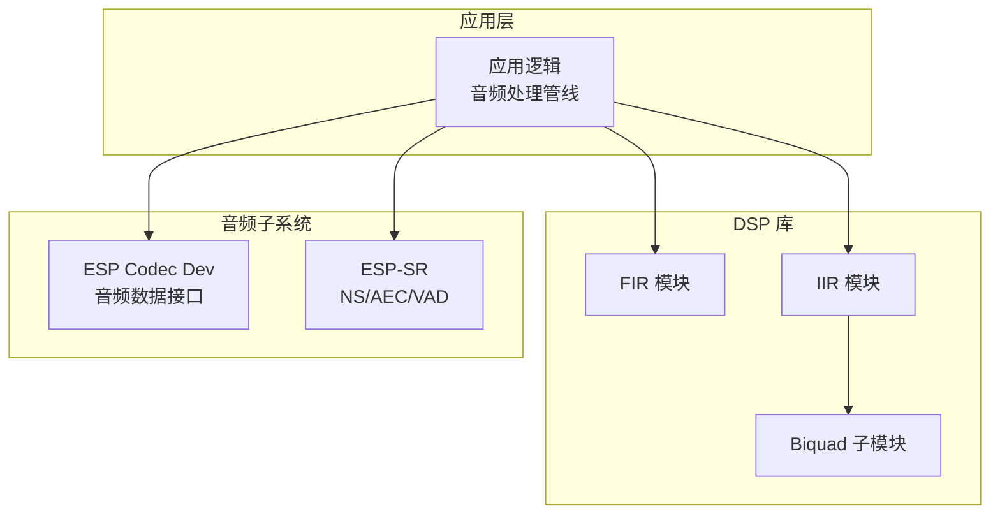
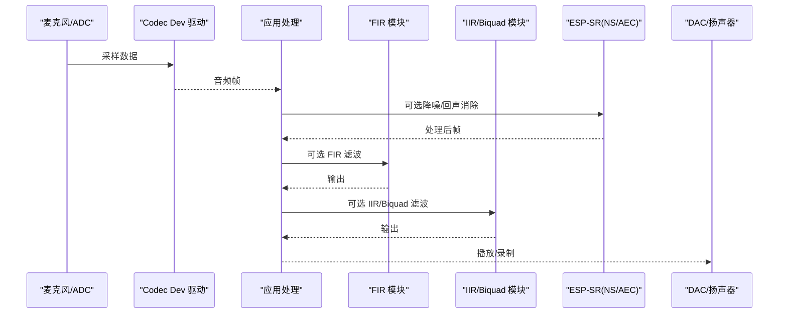
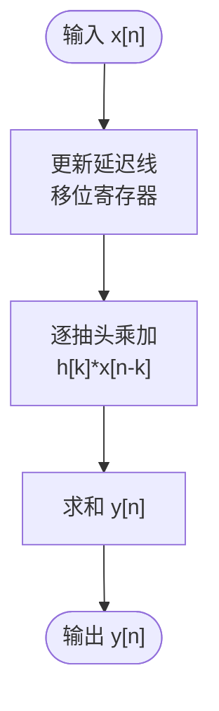
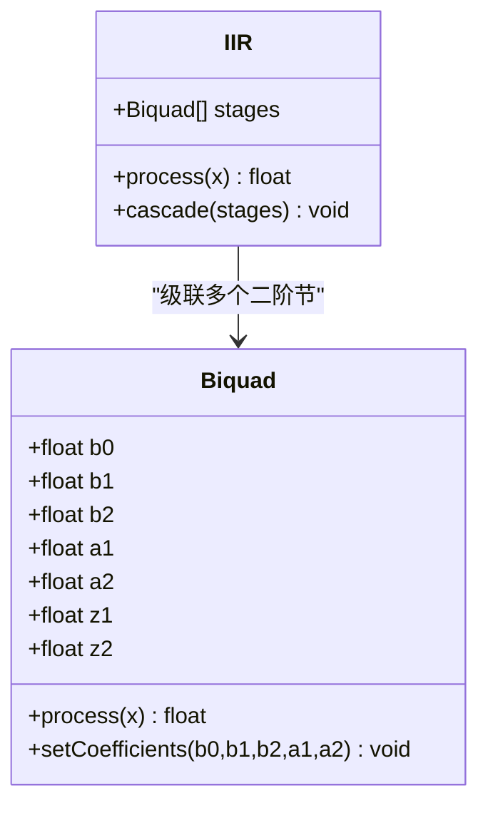
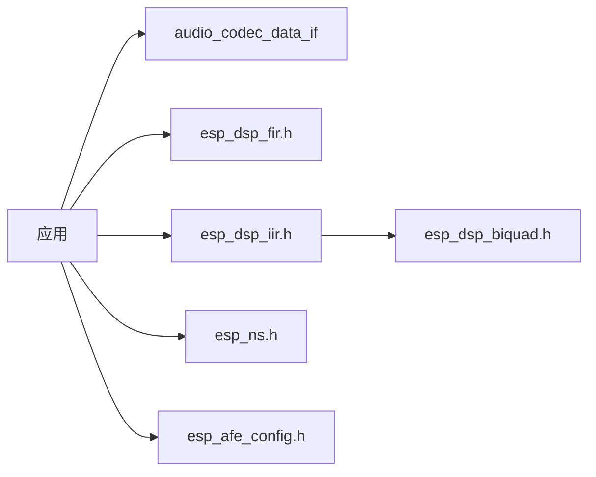

# 滤波器算法

<cite>
**本文引用的文件**   
- [esp-dsp README.md](file://Firmware/esp32_ai_mirror/managed_components/espressif__esp-dsp/README.md)
- [FIR 示例主程序](file://Firmware/esp32_ai_mirror/managed_components/espressif__esp-dsp/examples/fir/main/main.c)
- [IIR 示例主程序](file://Firmware/esp32_ai_mirror/managed_components/espressif__esp-dsp/examples/iir/main/main.c)
- [FIR 模块头文件](file://Firmware/esp32_ai_mirror/managed_components/espressif__esp-dsp/modules/fir/include/esp_dsp_fir.h)
- [IIR 模块头文件](file://Firmware/esp32_ai_mirror/managed_components/espressif__esp-dsp/modules/iir/include/esp_dsp_iir.h)
- [Biquad 模块头文件](file://Firmware/esp32_ai_mirror/managed_components/espressif__esp-dsp/modules/iir/biquad/esp_dsp_biquad.h)
- [音频编解码设备接口](file://Firmware/esp32_ai_mirror/managed_components/espressif__esp_codec_dev/interface/audio_codec_data_if.h)
- [音频音量控制头文件](file://Firmware/esp32_ai_mirror/managed_components/espressif__esp_codec_dev/audio_codec_vol.h)
- [ESP-SR 语音前端配置](file://Firmware/esp32_ai_mirror/managed_components/espressif__esp-sr/include/esp_afe_config.h)
- [ESP-SR 噪声抑制接口](file://Firmware/esp32_ai_mirror/managed_components/espressif__esp-sr/include/esp_ns.h)
- [ESP-SR 回声消除接口](file://Firmware/esp32_ai_mirror/managed_components/espressif__esp-sr/include/esp_aec.h)
</cite>

## 目录
1. [简介](#简介)
2. [项目结构](#项目结构)
3. [核心组件](#核心组件)
4. [架构总览](#架构总览)
5. [详细组件分析](#详细组件分析)
6. [依赖关系分析](#依赖关系分析)
7. [性能考虑](#性能考虑)
8. [故障排查指南](#故障排查指南)
9. [结论](#结论)
10. [附录](#附录)

## 简介
本文件面向在嵌入式与实时音频场景中实现数字滤波器的工程师，系统梳理 FIR、IIR（含双二阶 Biquad）的设计原理、系数计算与应用方法，并结合仓库中的 ESP-DSP 与 ESP-SR 组件，给出低通、高通、带通、带阻等典型滤波器的设计要点与参数配置建议。文档还涵盖稳定性与相位响应分析、音频降噪/均衡器/分频器等实际应用场景，以及实时处理中的延迟优化技巧。

## 项目结构
本项目围绕 ESP-IDF 生态，关键 DSP 能力由 esp-dsp 提供，音频 I/O 与编解码通过 esp_codec_dev 暴露统一接口，语音前端（降噪、回声消除等）由 esp-sr 提供。滤波器相关代码主要分布在：
- modules/fir：FIR 滤波器实现与示例
- modules/iir：IIR 滤波器实现与示例，包含 biquad 子模块
- examples/fir、examples/iir：可运行的最小示例
- esp_codec_dev：音频数据流接口与音量控制
- esp-sr：语音前端（NS/AEC/VAD 等）

图表来源
- [esp-dsp README.md](file://Firmware/esp32_ai_mirror/managed_components/espressif__esp-dsp/README.md)
- [FIR 模块头文件](file://Firmware/esp32_ai_mirror/managed_components/espressif__esp-dsp/modules/fir/include/esp_dsp_fir.h)
- [IIR 模块头文件](file://Firmware/esp32_ai_mirror/managed_components/espressif__esp-dsp/modules/iir/include/esp_dsp_iir.h)
- [Biquad 模块头文件](file://Firmware/esp32_ai_mirror/managed_components/espressif__esp-dsp/modules/iir/biquad/esp_dsp_biquad.h)
- [音频编解码设备接口](file://Firmware/esp32_ai_mirror/managed_components/espressif__esp_codec_dev/interface/audio_codec_data_if.h)
- [ESP-SR 语音前端配置](file://Firmware/esp32_ai_mirror/managed_components/espressif__esp-sr/include/esp_afe_config.h)

章节来源
- [esp-dsp README.md](file://Firmware/esp32_ai_mirror/managed_components/espressif__esp-dsp/README.md)
- [FIR 示例主程序](file://Firmware/esp32_ai_mirror/managed_components/espressif__esp-dsp/examples/fir/main/main.c)
- [IIR 示例主程序](file://Firmware/esp32_ai_mirror/managed_components/espressif__esp-dsp/examples/iir/main/main.c)

## 核心组件
- FIR 滤波器
  - 非递归有限冲激响应结构，线性相位易实现，稳定性无条件稳定
  - 适合多速率、等波纹设计、精确相位控制场景
  - 复杂度 O(N)，N 为抽头数；可通过 FFT 卷积或 SIMD/NEON 加速
- IIR 滤波器
  - 递归无限冲激响应结构，可用较少阶数获得陡峭过渡带
  - 需注意稳定性与数值精度，常用级联二阶节（Biquad）实现
  - 复杂度 O(1) 每样本（每个二阶节），整体随节数线性增长
- Biquad（双二阶）
  - 标准形式 H(z)=(b0+b1z^-1+b2z^-2)/(1+a1z^-1+a2z^-2)
  - 可直接映射到直接型 II 转置结构，利于定点化与溢出保护
  - 低通/高通/带通/带阻均可用一组系数表达，便于动态切换

章节来源
- [FIR 模块头文件](file://Firmware/esp32_ai_mirror/managed_components/espressif__esp-dsp/modules/fir/include/esp_dsp_fir.h)
- [IIR 模块头文件](file://Firmware/esp32_ai_mirror/managed_components/espressif__esp-dsp/modules/iir/include/esp_dsp_iir.h)
- [Biquad 模块头文件](file://Firmware/esp32_ai_mirror/managed_components/espressif__esp-dsp/modules/iir/biquad/esp_dsp_biquad.h)

## 架构总览
下图展示从音频采集到滤波处理的典型数据流，以及可选的语音前端（降噪/回声消除）集成点。

图表来源
- [音频编解码设备接口](file://Firmware/esp32_ai_mirror/managed_components/espressif__esp_codec_dev/interface/audio_codec_data_if.h)
- [FIR 模块头文件](file://Firmware/esp32_ai_mirror/managed_components/espressif__esp-dsp/modules/fir/include/esp_dsp_fir.h)
- [IIR 模块头文件](file://Firmware/esp32_ai_mirror/managed_components/espressif__esp-dsp/modules/iir/include/esp_dsp_iir.h)
- [Biquad 模块头文件](file://Firmware/esp32_ai_mirror/managed_components/espressif__esp-dsp/modules/iir/biquad/esp_dsp_biquad.h)
- [ESP-SR 语音前端配置](file://Firmware/esp32_ai_mirror/managed_components/espressif__esp-sr/include/esp_afe_config.h)

## 详细组件分析

### FIR 滤波器设计与实现
- 设计要点
  - 窗函数法：矩形、汉明、汉宁、布莱克曼等，权衡主瓣宽度与旁瓣衰减
  - 频率采样法：直接在频域指定幅度响应，再 IDFT 得到系数
  - 等波纹（Parks-McClellan）：在给定约束下最小化最大误差
- 实现要点
  - 直接型卷积：y[n]=Σ h[k]·x[n-k]
  - 多相分解：用于上/下采样，降低运算量
  - 重叠保存/相加法：长序列 FFT 卷积
- 稳定性与相位
  - 无条件稳定；对称系数可实现严格线性相位
- 复杂度
  - 线性 O(N)；SIMD/NEON/FFT 可显著加速

图表来源
- [FIR 模块头文件](file://Firmware/esp32_ai_mirror/managed_components/espressif__esp-dsp/modules/fir/include/esp_dsp_fir.h)
- [FIR 示例主程序](file://Firmware/esp32_ai_mirror/managed_components/espressif__esp-dsp/examples/fir/main/main.c)

章节来源
- [FIR 模块头文件](file://Firmware/esp32_ai_mirror/managed_components/espressif__esp-dsp/modules/fir/include/esp_dsp_fir.h)
- [FIR 示例主程序](file://Firmware/esp32_ai_mirror/managed_components/espressif__esp-dsp/examples/fir/main/main.c)

### IIR 滤波器与 Biquad 实现
- 设计要点
  - 模拟原型：巴特沃斯（平坦幅频）、切比雪夫（等纹波）、椭圆（最陡过渡）
  - 数字化：双线性变换（预畸变校正截止频率）
  - 结构选择：直接型 I/II、转置直接型 II（数值稳定、适合定点）
- Biquad 标准形式
  - H(z)=(b0+b1z^-1+b2z^-2)/(1+a1z^-1+a2z^-2)
  - 常见类型：低通、高通、带通、带阻、峰值/陷波、全通（相位校正）
- 稳定性与量化
  - 极点需位于单位圆内；对 a1,a2 敏感，注意舍入与缩放
  - 级联多段 Biquad 提高选择性，避免单节高阶带来的数值问题
- 复杂度
  - 每样本约 5 次乘加（每节）；极适合实时与低功耗

图表来源
- [Biquad 模块头文件](file://Firmware/esp32_ai_mirror/managed_components/espressif__esp-dsp/modules/iir/biquad/esp_dsp_biquad.h)
- [IIR 模块头文件](file://Firmware/esp32_ai_mirror/managed_components/espressif__esp-dsp/modules/iir/include/esp_dsp_iir.h)

章节来源
- [IIR 模块头文件](file://Firmware/esp32_ai_mirror/managed_components/espressif__esp-dsp/modules/iir/include/esp_dsp_iir.h)
- [Biquad 模块头文件](file://Firmware/esp32_ai_mirror/managed_components/espressif__esp-dsp/modules/iir/biquad/esp_dsp_biquad.h)
- [IIR 示例主程序](file://Firmware/esp32_ai_mirror/managed_components/espressif__esp-dsp/examples/iir/main/main.c)

### 典型滤波器类型与参数配置
- 低通（LPF）
  - 用途：抗混叠、平滑、去高频噪声
  - 关键参数：截止频率 fc、采样率 Fs、品质因数 Q（或带宽）
- 高通（HPF）
  - 用途：去除直流/低频漂移、风噪抑制
  - 关键参数：fc、Fs、Q
- 带通（BPF）
  - 用途：语音频段提取、特定信号检测
  - 关键参数：中心频率 f0、带宽 BW 或 Q
- 带阻（Notch）
  - 用途：工频干扰抑制（50/60Hz）
  - 关键参数：f0、BW/Q
- 峰值/陷波/全通
  - 用途：均衡、相位补偿、群延时校正

章节来源
- [Biquad 模块头文件](file://Firmware/esp32_ai_mirror/managed_components/espressif__esp-dsp/modules/iir/biquad/esp_dsp_biquad.h)
- [IIR 模块头文件](file://Firmware/esp32_ai_mirror/managed_components/espressif__esp-dsp/modules/iir/include/esp_dsp_iir.h)

### 实际应用示例与用法指引
- 音频降噪
  - 思路：先 NS（自适应谱减/维纳滤波），再用 IIR 做低频噪声抑制与高频平滑
  - 集成点：ESP-SR 的 NS 模块作为预处理，后接 Biquad 低通/高通组合
  - 参考接口：[ESP-SR 噪声抑制接口](file://Firmware/esp32_ai_mirror/managed_components/espressif__esp-sr/include/esp_ns.h)、[ESP-SR 语音前端配置](file://Firmware/esp32_ai_mirror/managed_components/espressif__esp-sr/include/esp_afe_config.h)
- 均衡器（EQ）
  - 思路：多段 Biquad 级联，分别设置中心频率与增益，形成目标频响曲线
  - 参考实现：使用 Biquad 峰值/陷波节构建参量 EQ
  - 参考接口：[Biquad 模块头文件](file://Firmware/esp32_ai_mirror/managed_components/espressif__esp-dsp/modules/iir/biquad/esp_dsp_biquad.h)
- 分频器（Crossover）
  - 思路：将全频信号拆分为低/中/高三路，各路由不同截止频率的 Biquad/LPF/HPF
  - 参考实现：三段 Biquad 级联，确保交叉区域平滑衔接
  - 参考接口：[IIR 模块头文件](file://Firmware/esp32_ai_mirror/managed_components/espressif__esp-dsp/modules/iir/include/esp_dsp_iir.h)

章节来源
- [ESP-SR 噪声抑制接口](file://Firmware/esp32_ai_mirror/managed_components/espressif__esp-sr/include/esp_ns.h)
- [ESP-SR 语音前端配置](file://Firmware/esp32_ai_mirror/managed_components/espressif__esp-sr/include/esp_afe_config.h)
- [Biquad 模块头文件](file://Firmware/esp32_ai_mirror/managed_components/espressif__esp-dsp/modules/iir/biquad/esp_dsp_biquad.h)
- [IIR 模块头文件](file://Firmware/esp32_ai_mirror/managed_components/espressif__esp-dsp/modules/iir/include/esp_dsp_iir.h)

### 稳定性分析与相位响应特性
- 稳定性
  - IIR：极点必须在单位圆内；检查 |a1|+|a2|<1 等充分条件；对量化误差敏感
  - FIR：无条件稳定；关注数值溢出与累加位宽
- 相位与群延时
  - FIR：对称系数可得线性相位，群延时恒定；适合时域对齐
  - IIR：非线性相位；可用全通节进行相位均衡或补偿
- 设计验证
  - 绘制幅频/相频响应、极点-零点图；仿真瞬态与稳态响应

章节来源
- [IIR 模块头文件](file://Firmware/esp32_ai_mirror/managed_components/espressif__esp-dsp/modules/iir/include/esp_dsp_iir.h)
- [Biquad 模块头文件](file://Firmware/esp32_ai_mirror/managed_components/espressif__esp-dsp/modules/iir/biquad/esp_dsp_biquad.h)
- [FIR 模块头文件](file://Firmware/esp32_ai_mirror/managed_components/espressif__esp-dsp/modules/fir/include/esp_dsp_fir.h)

### 实时音频处理中的延迟优化技巧
- 块处理与流水线
  - 按固定块大小（如 64/128/256 样本）处理，减少调度开销
  - 将 NS/AEC→FIR→IIR 串联成流水线，最大化吞吐
- 内存与缓存友好
  - 使用环形缓冲与连续数组，减少碎片与拷贝
  - 对齐数据以利用 SIMD/NEON
- 定点化与缩放
  - 合理选择 Q 格式，避免中间溢出；必要时引入饱和算术
- 并行与向量化
  - FIR 抽头乘加、Biquad 多节并行执行
  - 利用 ESP-DSP 提供的优化路径（若可用）

章节来源
- [音频编解码设备接口](file://Firmware/esp32_ai_mirror/managed_components/espressif__esp_codec_dev/interface/audio_codec_data_if.h)
- [FIR 模块头文件](file://Firmware/esp32_ai_mirror/managed_components/espressif__esp-dsp/modules/fir/include/esp_dsp_fir.h)
- [IIR 模块头文件](file://Firmware/esp32_ai_mirror/managed_components/espressif__esp-dsp/modules/iir/include/esp_dsp_iir.h)

## 依赖关系分析
- 组件耦合
  - 应用层依赖 audio_codec_data_if 获取/推送音频帧
  - 处理链依赖 FIR/IIR/Biquad 模块进行频域整形
  - 语音前端依赖 ESP-SR 的 NS/AEC/VAD 接口
- 外部依赖
  - ESP-DSP：提供 FIR/IIR/Biquad 基础算子
  - ESP-SR：提供语音前端算法与配置
  - ESP Codec Dev：统一编解码硬件抽象

图表来源
- [音频编解码设备接口](file://Firmware/esp32_ai_mirror/managed_components/espressif__esp_codec_dev/interface/audio_codec_data_if.h)
- [FIR 模块头文件](file://Firmware/esp32_ai_mirror/managed_components/espressif__esp-dsp/modules/fir/include/esp_dsp_fir.h)
- [IIR 模块头文件](file://Firmware/esp32_ai_mirror/managed_components/espressif__esp-dsp/modules/iir/include/esp_dsp_iir.h)
- [Biquad 模块头文件](file://Firmware/esp32_ai_mirror/managed_components/espressif__esp-dsp/modules/iir/biquad/esp_dsp_biquad.h)
- [ESP-SR 噪声抑制接口](file://Firmware/esp32_ai_mirror/managed_components/espressif__esp-sr/include/esp_ns.h)
- [ESP-SR 语音前端配置](file://Firmware/esp32_ai_mirror/managed_components/espressif__esp-sr/include/esp_afe_config.h)

章节来源
- [音频编解码设备接口](file://Firmware/esp32_ai_mirror/managed_components/espressif__esp_codec_dev/interface/audio_codec_data_if.h)
- [FIR 模块头文件](file://Firmware/esp32_ai_mirror/managed_components/espressif__esp-dsp/modules/fir/include/esp_dsp_fir.h)
- [IIR 模块头文件](file://Firmware/esp32_ai_mirror/managed_components/espressif__esp-dsp/modules/iir/include/esp_dsp_iir.h)
- [Biquad 模块头文件](file://Firmware/esp32_ai_mirror/managed_components/espressif__esp-dsp/modules/iir/biquad/esp_dsp_biquad.h)
- [ESP-SR 噪声抑制接口](file://Firmware/esp32_ai_mirror/managed_components/espressif__esp-sr/include/esp_ns.h)
- [ESP-SR 语音前端配置](file://Firmware/esp32_ai_mirror/managed_components/espressif__esp-sr/include/esp_afe_config.h)

## 性能考虑
- 复杂度与资源
  - FIR：抽头数 N 越大越耗 CPU/内存；优先使用 SIMD/FFT 加速
  - IIR/Biquad：每样本常数开销，适合高通道数与低延迟
- 数值精度
  - 浮点 vs 定点：定点需仔细缩放与饱和；浮点更稳健但功耗更高
- 缓存与内存
  - 数据局部性、对齐、零拷贝策略对吞吐影响显著
- 功耗
  - 降低采样率、减少通道数、关闭不必要的前端模块

[本节为通用指导，不直接分析具体文件]

## 故障排查指南
- 失真/削波
  - 检查增益链路与限幅阈值；适当压缩或限制峰值
- 不稳定/振荡
  - IIR 极点接近单位圆导致发散；重新设计或降低 Q
- 相位异常
  - 非线性相位导致声像偏移；必要时加入全通补偿
- 延迟过大
  - 增大块大小会提升吞吐但增加延迟；寻找平衡点
- 噪声未抑制
  - 调整 NS 参数与后级滤波器截止频率；检查麦克风位置与环境

章节来源
- [音频音量控制头文件](file://Firmware/esp32_ai_mirror/managed_components/espressif__esp_codec_dev/audio_codec_vol.h)
- [ESP-SR 噪声抑制接口](file://Firmware/esp32_ai_mirror/managed_components/espressif__esp-sr/include/esp_ns.h)
- [ESP-SR 回声消除接口](file://Firmware/esp32_ai_mirror/managed_components/espressif__esp-sr/include/esp_aec.h)

## 结论
在本项目中，FIR 与 IIR（Biquad）构成了音频信号处理的核心。FIR 适用于线性相位与高精度场景，IIR/Biquad 则以低复杂度与强选择性见长。结合 ESP-SR 的语音前端与 ESP Codec Dev 的统一接口，可在嵌入式平台上高效实现降噪、均衡、分频等应用。设计时应重视稳定性、相位与延迟的权衡，并通过块处理、向量化与定点化等手段优化实时性能。

[本节为总结性内容，不直接分析具体文件]

## 附录
- 快速上手
  - 参考示例：FIR 示例、IIR 示例，理解初始化与调用流程
  - 接口参考：FIR/IIR/Biquad 头文件，确认 API 与数据结构
- 设计工具
  - 使用 MATLAB/Python 生成系数，验证幅频/相频与稳定性
- 调试手段
  - 注入测试音（正弦扫频/白噪声），测量响应与延迟

章节来源
- [FIR 示例主程序](file://Firmware/esp32_ai_mirror/managed_components/espressif__esp-dsp/examples/fir/main/main.c)
- [IIR 示例主程序](file://Firmware/esp32_ai_mirror/managed_components/espressif__esp-dsp/examples/iir/main/main.c)
- [FIR 模块头文件](file://Firmware/esp32_ai_mirror/managed_components/espressif__esp-dsp/modules/fir/include/esp_dsp_fir.h)
- [IIR 模块头文件](file://Firmware/esp32_ai_mirror/managed_components/espressif__esp-dsp/modules/iir/include/esp_dsp_iir.h)
- [Biquad 模块头文件](file://Firmware/esp32_ai_mirror/managed_components/espressif__esp-dsp/modules/iir/biquad/esp_dsp_biquad.h)