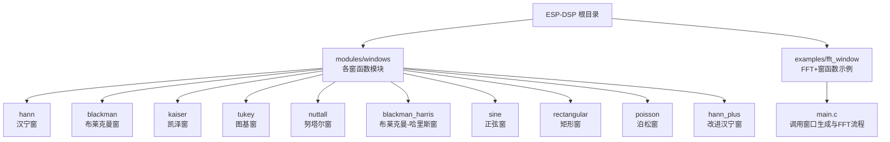
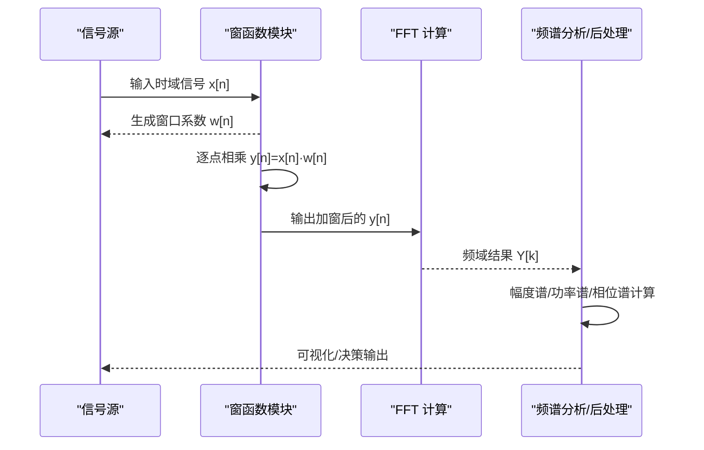
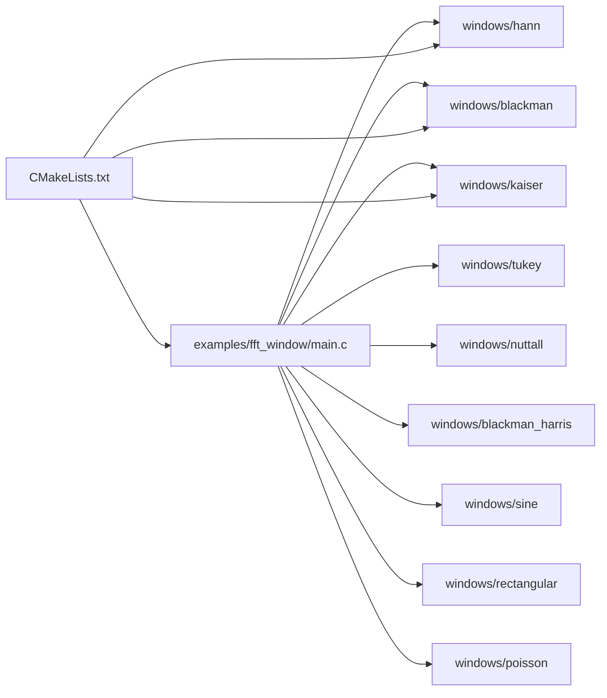

# 窗函数算法

<cite>
**本文引用的文件**   
- [esp-dsp/README.md](file://Firmware/esp32_ai_mirror/components/espressif__esp-dsp/README.md)
- [esp-dsp/CMakeLists.txt](file://Firmware/esp32_ai_mirror/components/espressif__esp-dsp/CMakeLists.txt)
- [esp-dsp/modules/windows/blackman/include/esp_dsp_windows_blackman.h](file://Firmware/esp32_ai_mirror/components/espressif__esp-dsp/modules/windows/blackman/include/esp_dsp_windows_blackman.h)
- [esp-dsp/modules/windows/blackman_harris/include/esp_dsp_windows_blackman_harris.h](file://Firmware/esp32_ai_mirror/components/espressif__esp-dsp/modules/windows/blackman_harris/include/esp_dsp_windows_blackman_harris.h)
- [esp-dsp/modules/windows/hann/include/esp_dsp_windows_hann.h](file://Firmware/esp32_ai_mirror/components/espressif__esp-dsp/modules/windows/hann/include/esp_dsp_windows_hann.h)
- [esp-dsp/modules/windows/hann_plus/include/esp_dsp_windows_hann_plus.h](file://Firmware/esp32_ai_mirror/components/espressif__esp-dsp/modules/windows/hann_plus/include/esp_dsp_windows_hann_plus.h)
- [esp-dsp/modules/windows/kaiser/include/esp_dsp_windows_kaiser.h](file://Firmware/esp32_ai_mirror/components/espressif__esp-dsp/modules/windows/kaiser/include/esp_dsp_windows_kaiser.h)
- [esp-dsp/modules/windows/nuttall/include/esp_dsp_windows_nuttall.h](file://Firmware/esp32_ai_mirror/components/espressif__esp-dsp/modules/windows/nuttall/include/esp_dsp_windows_nuttall.h)
- [esp-dsp/modules/windows/poisson/include/esp_dsp_windows_poisson.h](file://Firmware/esp32_ai_mirror/components/espressif__esp-dsp/modules/windows/poisson/include/esp_dsp_windows_poisson.h)
- [esp-dsp/modules/windows/rectangular/include/esp_dsp_windows_rectangular.h](file://Firmware/esp32_ai_mirror/components/espressif__esp-dsp/modules/windows/rectangular/include/esp_dsp_windows_rectangular.h)
- [esp-dsp/modules/windows/sine/include/esp_dsp_windows_sine.h](file://Firmware/esp32_ai_mirror/components/espressif__esp-dsp/modules/windows/sine/include/esp_dsp_windows_sine.h)
- [esp-dsp/modules/windows/tukey/include/esp_dsp_windows_tukey.h](file://Firmware/esp32_ai_mirror/components/espressif__esp-dsp/modules/windows/tukey/include/esp_dsp_windows_tukey.h)
- [esp-dsp/examples/fft_window/main/main.c](file://Firmware/esp32_ai_mirror/components/espressif__esp-dsp/examples/fft_window/main/main.c)
- [esp-dsp/examples/fft_window/README.md](file://Firmware/esp32_ai_mirror/components/espressif__esp-dsp/examples/fft_window/README.md)
</cite>

## 目录
1. [简介](#简介)
2. [项目结构](#项目结构)
3. [核心组件](#核心组件)
4. [架构总览](#架构总览)
5. [详细组件分析](#详细组件分析)
6. [依赖关系分析](#依赖关系分析)
7. [性能考量](#性能考量)
8. [故障排查指南](#故障排查指南)
9. [结论](#结论)
10. [附录](#附录)

## 简介
本文件围绕“窗函数算法”展开，系统阐述常见窗函数（汉宁窗、汉明窗、布莱克曼窗等）的数学定义与特性比较，解释其在频谱分析与滤波器设计中的应用原理，并给出主瓣宽度、旁瓣衰减等关键参数的选择原则。同时提供音频分析、谱估计、脉冲响应等实际应用场景，说明不同窗函数对频率分辨率与动态范围的影响，并给出自定义窗函数的设计与验证方法。

## 项目结构
在 ESP-DSP 组件中，窗函数以模块化方式组织：每个窗类型位于 modules/windows/<window_name> 目录下，包含头文件与实现；示例工程 examples/fft_window 演示了如何在 FFT 前应用窗函数进行频谱分析。

图表来源 
- [esp-dsp/README.md](file://Firmware/esp32_ai_mirror/components/espressif__esp-dsp/README.md)
- [esp-dsp/CMakeLists.txt](file://Firmware/esp32_ai_mirror/components/espressif__esp-dsp/CMakeLists.txt)
- [esp-dsp/examples/fft_window/main/main.c](file://Firmware/esp32_ai_mirror/components/espressif__esp-dsp/examples/fft_window/main/main.c)

章节来源
- [esp-dsp/README.md](file://Firmware/esp32_ai_mirror/components/espressif__esp-dsp/README.md)
- [esp-dsp/CMakeLists.txt](file://Firmware/esp32_ai_mirror/components/espressif__esp-dsp/CMakeLists.txt)

## 核心组件
ESP-DSP 将窗函数封装为独立模块，典型接口包括：
- 窗口系数生成：根据长度 N 和可选参数（如 Kaiser 的 β、Tukey 的 α）生成时域窗口序列 w[n]
- 数据加窗：将输入信号 x[n] 与 w[n] 逐点相乘得到 y[n]=x[n]·w[n]
- 后续处理：通常接 FFT 做频谱分析或 FIR/IIR 滤波器的设计

常用窗函数模块及用途概览：
- 汉宁窗（Hann）：平衡主瓣宽度与旁瓣抑制，适合通用频谱分析
- 汉明窗（Hamming）：旁瓣抑制优于汉宁窗，常用于功率谱估计
- 布莱克曼窗（Blackman）：更强的旁瓣抑制，主瓣更宽，适合强干扰环境
- 布莱克曼-哈里斯窗（Blackman-Harris）：极佳的旁瓣抑制，用于高精度幅度测量
- 凯泽窗（Kaiser）：可调 β 控制主瓣/旁瓣权衡，灵活性强
- 图基窗（Tukey）：两端平滑过渡，适合短时平稳段
- 努塔尔窗（Nuttall）、正弦窗、矩形窗、泊松窗等：特定场景优化

章节来源
- [esp-dsp/modules/windows/hann/include/esp_dsp_windows_hann.h](file://Firmware/esp32_ai_mirror/components/espressif__esp-dsp/modules/windows/hann/include/esp_dsp_windows_hann.h)
- [esp-dsp/modules/windows/blackman/include/esp_dsp_windows_blackman.h](file://Firmware/esp32_ai_mirror/components/espressif__esp-dsp/modules/windows/blackman/include/esp_dsp_windows_blackman.h)
- [esp-dsp/modules/windows/kaiser/include/esp_dsp_windows_kaiser.h](file://Firmware/esp32_ai_mirror/components/espressif__esp-dsp/modules/windows/kaiser/include/esp_dsp_windows_kaiser.h)
- [esp-dsp/modules/windows/tukey/include/esp_dsp_windows_tukey.h](file://Firmware/esp32_ai_mirror/components/espressif__esp-dsp/modules/windows/tukey/include/esp_dsp_windows_tukey.h)
- [esp-dsp/modules/windows/nuttall/include/esp_dsp_windows_nuttall.h](file://Firmware/esp32_ai_mirror/components/espressif__esp-dsp/modules/windows/nuttall/include/esp_dsp_windows_nuttall.h)
- [esp-dsp/modules/windows/blackman_harris/include/esp_dsp_windows_blackman_harris.h](file://Firmware/esp32_ai_mirror/components/espressif__esp-dsp/modules/windows/blackman_harris/include/esp_dsp_windows_blackman_harris.h)
- [esp-dsp/modules/windows/sine/include/esp_dsp_windows_sine.h](file://Firmware/esp32_ai_mirror/components/espressif__esp-dsp/modules/windows/sine/include/esp_dsp_windows_sine.h)
- [esp-dsp/modules/windows/rectangular/include/esp_dsp_windows_rectangular.h](file://Firmware/esp32_ai_mirror/components/espressif__esp-dsp/modules/windows/rectangular/include/esp_dsp_windows_rectangular.h)
- [esp-dsp/modules/windows/poisson/include/esp_dsp_windows_poisson.h](file://Firmware/esp32_ai_mirror/components/espressif__esp-dsp/modules/windows/poisson/include/esp_dsp_windows_poisson.h)

## 架构总览
下图展示“信号采集 → 加窗 → FFT → 频谱分析”的典型流程，以及窗函数模块在其中的位置。

图表来源 
- [esp-dsp/examples/fft_window/main/main.c](file://Firmware/esp32_ai_mirror/components/espressif__esp-dsp/examples/fft_window/main/main.c)

章节来源
- [esp-dsp/examples/fft_window/main/main.c](file://Firmware/esp32_ai_mirror/components/espressif__esp-dsp/examples/fft_window/main/main.c)

## 详细组件分析

### 汉宁窗（Hann）
- 数学定义：w[n]=0.5(1−cos(2πn/(N−1)))，n=0..N−1
- 特性：主瓣较窄，旁瓣衰减约 −31.5 dB；泄漏抑制良好，适合一般频谱分析
- 适用场景：音频分析、振动信号频谱、通用功率谱估计

章节来源
- [esp-dsp/modules/windows/hann/include/esp_dsp_windows_hann.h](file://Firmware/esp32_ai_mirror/components/espressif__esp-dsp/modules/windows/hann/include/esp_dsp_windows_hann.h)

### 汉明窗（Hamming）
- 数学定义：w[n]=0.54−0.46cos(2πn/(N−1))
- 特性：旁瓣峰值约 −43 dB，主瓣略宽于矩形窗；对弱信号检测友好
- 适用场景：语音频谱、噪声背景下的谐波检测

章节来源
- [esp-dsp/modules/windows/hann/include/esp_dsp_windows_hann.h](file://Firmware/esp32_ai_mirror/components/espressif__esp-dsp/modules/windows/hann/include/esp_dsp_windows_hann.h)

### 布莱克曼窗（Blackman）
- 数学定义：w[n]=a0−a1cos(2πn/(N−1))+a2cos(4πn/(N−1))
- 特性：旁瓣抑制更强（约 −58 dB），主瓣更宽；适合强干扰环境
- 适用场景：雷达/通信信号分析、高动态范围测量

章节来源
- [esp-dsp/modules/windows/blackman/include/esp_dsp_windows_blackman.h](file://Firmware/esp32_ai_mirror/components/espressif__esp-dsp/modules/windows/blackman/include/esp_dsp_windows_blackman.h)

### 布莱克曼-哈里斯窗（Blackman-Harris）
- 数学定义：多余弦组合，参数针对最小旁瓣优化
- 特性：极低旁瓣（可达 −90 dB 量级），主瓣最宽之一；幅度测量精度高
- 适用场景：精密频谱分析、校准与计量

章节来源
- [esp-dsp/modules/windows/blackman_harris/include/esp_dsp_windows_blackman_harris.h](file://Firmware/esp32_ai_mirror/components/espressif__esp-dsp/modules/windows/blackman_harris/include/esp_dsp_windows_blackman_harris.h)

### 凯泽窗（Kaiser）
- 数学定义：基于第一类修正贝塞尔函数 I0，由 β 控制形状
- 特性：β 越大旁瓣越低但主瓣越宽；可灵活权衡分辨率与泄漏
- 适用场景：自适应频谱分析、滤波器设计中的窗化法

章节来源
- [esp-dsp/modules/windows/kaiser/include/esp_dsp_windows_kaiser.h](file://Firmware/esp32_ai_mirror/components/espressif__esp-dsp/modules/windows/kaiser/include/esp_dsp_windows_kaiser.h)

### 图基窗（Tukey）
- 数学定义：中间矩形 + 两端余弦过渡，α 控制过渡比例
- 特性：兼顾主瓣与旁瓣，适合短时段平稳信号
- 适用场景：语音分帧、瞬态信号局部分析

章节来源
- [esp-dsp/modules/windows/tukey/include/esp_dsp_windows_tukey.h](file://Firmware/esp32_ai_mirror/components/espressif__esp-dsp/modules/windows/tukey/include/esp_dsp_windows_tukey.h)

### 其他窗函数
- 努塔尔窗（Nuttall）：低旁瓣、较好幅度精度
- 正弦窗（Sine）：简单平滑，适用于某些特殊谱估计
- 矩形窗（Rectangular）：无平滑，主瓣最窄但旁瓣最高，易泄漏
- 泊松窗（Poisson）：指数衰减型，适合非对称或指数衰减信号

章节来源
- [esp-dsp/modules/windows/nuttall/include/esp_dsp_windows_nuttall.h](file://Firmware/esp32_ai_mirror/components/espressif__esp-dsp/modules/windows/nuttall/include/esp_dsp_windows_nuttall.h)
- [esp-dsp/modules/windows/sine/include/esp_dsp_windows_sine.h](file://Firmware/esp32_ai_mirror/components/espressif__esp-dsp/modules/windows/sine/include/esp_dsp_windows_sine.h)
- [esp-dsp/modules/windows/rectangular/include/esp_dsp_windows_rectangular.h](file://Firmware/esp32_ai_mirror/components/espressif__esp-dsp/modules/windows/rectangular/include/esp_dsp_windows_rectangular.h)
- [esp-dsp/modules/windows/poisson/include/esp_dsp_windows_poisson.h](file://Firmware/esp32_ai_mirror/components/espressif__esp-dsp/modules/windows/poisson/include/esp_dsp_windows_poisson.h)

### 窗函数选择原则（主瓣宽度与旁瓣衰减）
- 主瓣宽度决定频率分辨率：越窄越好分辨邻近频率
- 旁瓣衰减决定动态范围：越高越能抑制泄漏与干扰
- 权衡建议：
  - 需要高分辨率：矩形窗、汉宁窗
  - 需要高动态范围：布莱克曼-哈里斯、凯泽（大 β）
  - 折中方案：汉明、布莱克曼、图基（α≈0.25~0.5）

[本节为概念性内容，不直接分析具体文件]

### 在频谱分析与滤波器设计中的应用
- 频谱分析：加窗减少截断效应引起的频谱泄漏，提高幅值与相位估计精度
- 滤波器设计（窗化法）：理想滤波器冲激响应无限长，乘以窗函数截断并平滑边缘，得到可实现 FIR 滤波器
- 参数影响：
  - 主瓣宽度影响通带/阻带过渡带宽
  - 旁瓣衰减影响阻带抑制与纹波

[本节为概念性内容，不直接分析具体文件]

### 实际应用示例
- 音频分析：使用汉宁/汉明窗进行语音频谱显示与谐波检测
- 谱估计：采用布莱克曼-哈里斯窗提升弱信号检测能力
- 脉冲响应：用凯泽窗设计 FIR 滤波器，调节 β 满足阻带要求

章节来源
- [esp-dsp/examples/fft_window/README.md](file://Firmware/esp32_ai_mirror/components/espressif__esp-dsp/examples/fft_window/README.md)
- [esp-dsp/examples/fft_window/main/main.c](file://Firmware/esp32_ai_mirror/components/espressif__esp-dsp/examples/fft_window/main/main.c)

### 自定义窗函数的设计与验证
- 设计步骤：
  1) 确定目标特性（主瓣宽度、旁瓣衰减、滚降速度）
  2) 选择基础形式（余弦叠加、贝塞尔函数、指数衰减等）
  3) 调整参数（如 Kaiser 的 β、Tukey 的 α）
  4) 归一化能量或峰值，保证增益一致性
- 验证方法：
  - 计算频率响应（DFT/FFT）观察主瓣与旁瓣
  - 对比标准窗（汉宁、布莱克曼）评估性能
  - 在真实信号上测试（语音、音乐、噪声）验证鲁棒性

[本节为概念性内容，不直接分析具体文件]

## 依赖关系分析
ESP-DSP 的窗函数模块彼此独立，通过统一头文件暴露接口；示例工程依赖这些模块完成“加窗→FFT”的流程。CMakeLists 负责构建配置，确保模块被正确编译链接。

图表来源 
- [esp-dsp/CMakeLists.txt](file://Firmware/esp32_ai_mirror/components/espressif__esp-dsp/CMakeLists.txt)
- [esp-dsp/examples/fft_window/main/main.c](file://Firmware/esp32_ai_mirror/components/espressif__esp-dsp/examples/fft_window/main/main.c)

章节来源
- [esp-dsp/CMakeLists.txt](file://Firmware/esp32_ai_mirror/components/espressif__esp-dsp/CMakeLists.txt)

## 性能考量
- 计算复杂度：窗函数生成 O(N)，逐点相乘 O(N)，整体线性复杂度
- 内存占用：需存储窗口系数数组，长度 N 越大占用越多
- 数值稳定性：避免溢出与下溢，必要时对系数归一化
- 实时性：嵌入式平台应优先选择计算简单的窗（如汉宁、汉明），或使用查表法预生成系数

[本节为通用指导，不直接分析具体文件]

## 故障排查指南
- 频谱泄漏异常：检查是否忘记加窗或使用了矩形窗；确认窗口长度与 FFT 点数匹配
- 幅度失真：确认窗口归一化是否正确；检查 FFT 缩放因子
- 动态范围不足：尝试更高旁瓣抑制的窗（布莱克曼-哈里斯、凯泽大 β）
- 分辨率不够：增加 N 或使用主瓣更窄的窗（矩形、汉宁）

[本节为通用指导，不直接分析具体文件]

## 结论
窗函数是频谱分析与滤波器设计中不可或缺的工具。选择合适的窗函数需要在主瓣宽度（频率分辨率）与旁瓣衰减（动态范围）之间权衡。ESP-DSP 提供了丰富的窗函数模块与示例，便于快速集成与验证。对于特殊需求，可通过自定义窗函数设计与仿真验证获得最优性能。

[本节为总结性内容，不直接分析具体文件]

## 附录
- 参考资源：ESP-DSP 文档与示例工程
- 实践建议：先以汉宁/汉明窗起步，再根据指标逐步优化至布莱克曼-哈里斯或凯泽窗

[本节为补充信息，不直接分析具体文件]