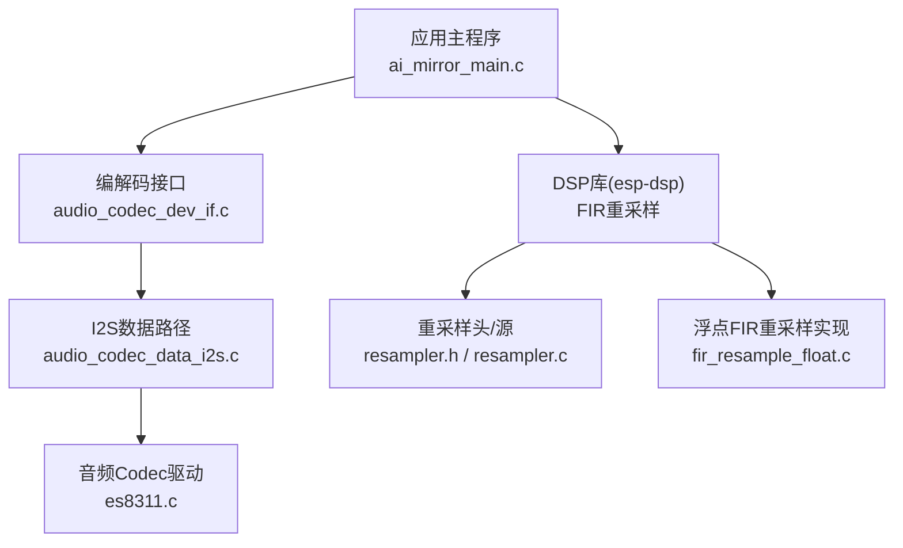
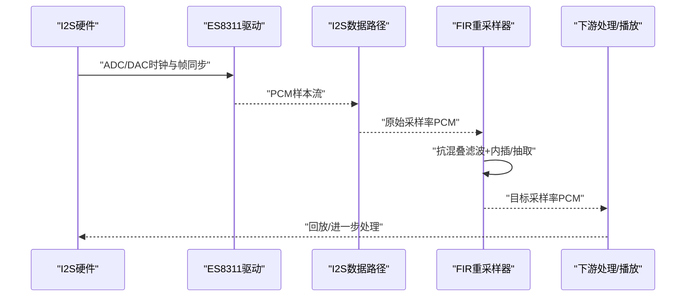
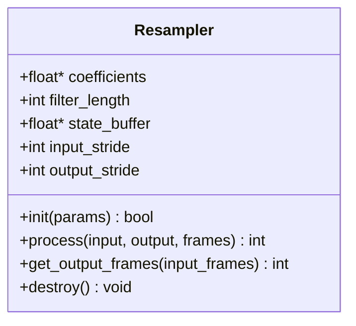
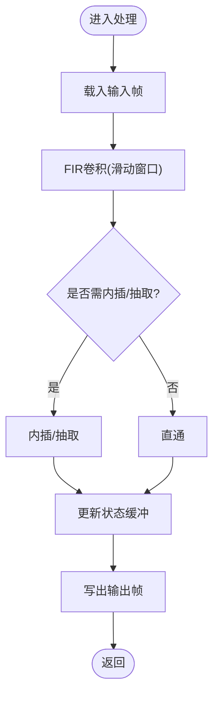
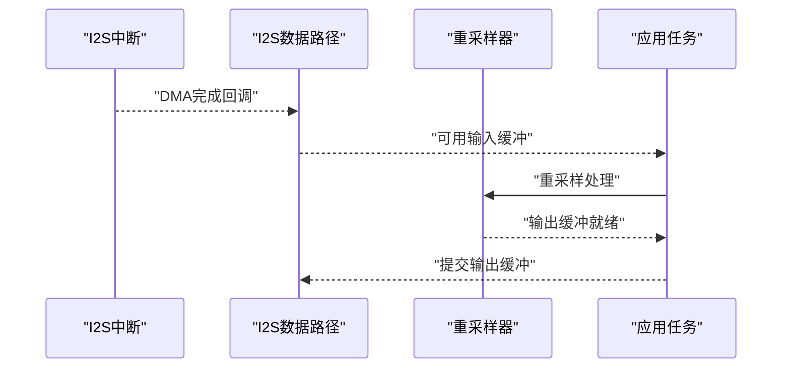
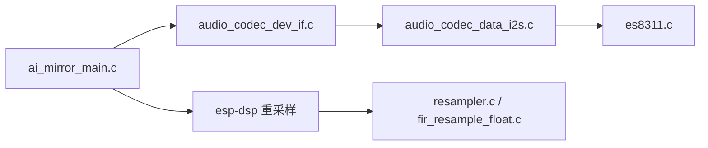

# 重采样算法

<cite>
**本文引用的文件**   
- [README.md](file://README.md)
- [esp-dsp/README.md](file://Firmware/esp32_ai_mirror/managed_components/espressif__esp-dsp/README.md)
- [resampler.h](file://Firmware/esp32_ai_mirror/managed_components/espressif__esp-dsp/modules/fir/resampler/include/resampler.h)
- [resampler.c](file://Firmware/esp32_ai_mirror/managed_components/espressif__esp-dsp/modules/fir/resampler/src/resampler.c)
- [fir_resample_float.c](file://Firmware/esp32_ai_mirror/managed_components/espressif__esp-dsp/modules/fir/resampler/src/fir_resample_float.c)
- [audio_codec_dev_if.c](file://Firmware/esp32_ai_mirror/managed_components/espressif__esp_codec_dev/audio_codec_dev_if.c)
- [audio_codec_data_i2s.c](file://Firmware/esp32_ai_mirror/managed_components/espressif__esp_codec_dev/platform/audio_codec_data_i2s.c)
- [es8311.c](file://Firmware/esp32_ai_mirror/managed_components/espressif__esp_codec_dev/device/es8311/es8311.c)
- [ai_mirror_main.c](file://Firmware/esp32_ai_mirror/main/ai_mirror_main.c)
</cite>

## 目录
1. [简介](#简介)
2. [项目结构](#项目结构)
3. [核心组件](#核心组件)
4. [架构总览](#架构总览)
5. [详细组件分析](#详细组件分析)
6. [依赖关系分析](#依赖关系分析)
7. [性能考量](#性能考量)
8. [故障排查指南](#故障排查指南)
9. [结论](#结论)
10. [附录](#附录)

## 简介
本文件围绕音频重采样算法，系统阐述多速率信号处理的理论基础、插值方法与工程实现策略。重点覆盖：
- 数学原理与插值方法（线性、三次样条等）的精度与复杂度权衡
- 抗混叠滤波与上/下采样的正确流程
- 在ESP32平台上的重采样实现与集成点（esp-dsp FIR重采样、编解码器I2S数据流）
- 实时处理中的延迟控制、缓冲区管理与质量评估指标

## 项目结构
本项目为ESP32 AI镜像应用，包含语音识别、TTS、显示交互与音频链路。重采样相关能力主要位于：
- esp-dsp模块的FIR重采样实现（C语言，面向嵌入式优化）
- esp_codec_dev编解码驱动层（I2S数据路径、设备配置）
- 主程序入口（任务调度与音频链路组织）

图表来源 
- [ai_mirror_main.c](file://Firmware/esp32_ai_mirror/main/ai_mirror_main.c)
- [audio_codec_dev_if.c](file://Firmware/esp32_ai_mirror/managed_components/espressif__esp_codec_dev/audio_codec_dev_if.c)
- [audio_codec_data_i2s.c](file://Firmware/esp32_ai_mirror/managed_components/espressif__esp_codec_dev/platform/audio_codec_data_i2s.c)
- [es8311.c](file://Firmware/esp32_ai_mirror/managed_components/espressif__esp_codec_dev/device/es8311/es8311.c)
- [resampler.h](file://Firmware/esp32_ai_mirror/managed_components/espressif__esp-dsp/modules/fir/resampler/include/resampler.h)
- [resampler.c](file://Firmware/esp32_ai_mirror/managed_components/espressif__esp-dsp/modules/fir/resampler/src/resampler.c)
- [fir_resample_float.c](file://Firmware/esp32_ai_mirror/managed_components/espressif__esp-dsp/modules/fir/resampler/src/fir_resample_float.c)

章节来源
- [README.md](file://README.md)
- [esp-dsp/README.md](file://Firmware/esp32_ai_mirror/managed_components/espressif__esp-dsp/README.md)

## 核心组件
- FIR重采样器（esp-dsp）
  - 提供基于FIR滤波器的有理数倍率重采样接口，支持上采样、下采样与复合倍率
  - 典型流程：抗混叠低通滤波 + 内插/抽取
- I2S音频数据路径（esp_codec_dev）
  - 负责从硬件I2S读取/写入PCM样本，作为重采样输入输出载体
- 音频Codec驱动（ES8311等）
  - 配置采样率、位宽、通道数，确保与上游/下游一致或经重采样对齐

章节来源
- [resampler.h](file://Firmware/esp32_ai_mirror/managed_components/espressif__esp-dsp/modules/fir/resampler/include/resampler.h)
- [resampler.c](file://Firmware/esp32_ai_mirror/managed_components/espressif__esp-dsp/modules/fir/resampler/src/resampler.c)
- [fir_resample_float.c](file://Firmware/esp32_ai_mirror/managed_components/espressif__esp-dsp/modules/fir/resampler/src/fir_resample_float.c)
- [audio_codec_dev_if.c](file://Firmware/esp32_ai_mirror/managed_components/espressif__esp_codec_dev/audio_codec_dev_if.c)
- [audio_codec_data_i2s.c](file://Firmware/esp32_ai_mirror/managed_components/espressif__esp_codec_dev/platform/audio_codec_data_i2s.c)
- [es8311.c](file://Firmware/esp32_ai_mirror/managed_components/espressif__esp_codec_dev/device/es8311/es8311.c)

## 架构总览
下图展示从I2S采集到重采样再到输出的整体数据流，强调抗混叠与插值环节的位置。

图表来源 
- [audio_codec_data_i2s.c](file://Firmware/esp32_ai_mirror/managed_components/espressif__esp_codec_dev/platform/audio_codec_data_i2s.c)
- [es8311.c](file://Firmware/esp32_ai_mirror/managed_components/espressif__esp_codec_dev/device/es8311/es8311.c)
- [resampler.c](file://Firmware/esp32_ai_mirror/managed_components/espressif__esp-dsp/modules/fir/resampler/src/resampler.c)

## 详细组件分析

### 重采样器API与数据结构（esp-dsp）
- 设计要点
  - 通过结构体封装滤波器系数、状态缓冲、输入输出指针与步长
  - 提供初始化、销毁、单次处理与批量处理接口
  - 内部按有理数倍率分解为“先内插后抽取”或“先抽取后内插”的组合，保证数值稳定
- 关键接口职责
  - 初始化：计算并加载FIR系数，分配状态缓冲
  - 处理：对输入块执行卷积与抽取/内插，更新状态
  - 查询：获取输出长度、所需输入长度、延迟估计

图表来源 
- [resampler.h](file://Firmware/esp32_ai_mirror/managed_components/espressif__esp-dsp/modules/fir/resampler/include/resampler.h)
- [resampler.c](file://Firmware/esp32_ai_mirror/managed_components/espressif__esp-dsp/modules/fir/resampler/src/resampler.c)

章节来源
- [resampler.h](file://Firmware/esp32_ai_mirror/managed_components/espressif__esp-dsp/modules/fir/resampler/include/resampler.h)
- [resampler.c](file://Firmware/esp32_ai_mirror/managed_components/espressif__esp-dsp/modules/fir/resampler/src/resampler.c)

### 浮点FIR重采样实现
- 算法流程
  - 将输入分帧，维护环形状态缓冲
  - 使用预计算的FIR系数进行滑动卷积
  - 根据目标倍率进行抽取或内插，必要时级联抗混叠滤波
- 性能特征
  - 浮点运算精度高，适合离线或高性能场景
  - 可通过SIMD/循环展开进一步优化（取决于目标CPU）

图表来源 
- [fir_resample_float.c](file://Firmware/esp32_ai_mirror/managed_components/espressif__esp-dsp/modules/fir/resampler/src/fir_resample_float.c)

章节来源
- [fir_resample_float.c](file://Firmware/esp32_ai_mirror/managed_components/espressif__esp-dsp/modules/fir/resampler/src/fir_resample_float.c)

### I2S数据路径与编解码器集成
- 数据路径
  - I2S DMA/中断驱动周期性填充/消费PCM缓冲
  - 编解码器驱动负责寄存器配置（采样率、位宽、通道）
- 重采样集成点
  - 在I2S读回调中插入重采样，或将重采样置于独立任务中异步处理
  - 注意输入/输出缓冲大小与延迟预算匹配

图表来源 
- [audio_codec_data_i2s.c](file://Firmware/esp32_ai_mirror/managed_components/espressif__esp_codec_dev/platform/audio_codec_data_i2s.c)
- [audio_codec_dev_if.c](file://Firmware/esp32_ai_mirror/managed_components/espressif__esp_codec_dev/audio_codec_dev_if.c)

章节来源
- [audio_codec_data_i2s.c](file://Firmware/esp32_ai_mirror/managed_components/espressif__esp_codec_dev/platform/audio_codec_data_i2s.c)
- [audio_codec_dev_if.c](file://Firmware/esp32_ai_mirror/managed_components/espressif__esp_codec_dev/audio_codec_dev_if.c)
- [es8311.c](file://Firmware/esp32_ai_mirror/managed_components/espressif__esp_codec_dev/device/es8311/es8311.c)

### 多速率信号处理理论要点
- 上采样（内插）
  - 零值插入后低通滤波，截止频率为较低采样率的奈奎斯特频率
- 下采样（抽取）
  - 先低通抗混叠滤波，再按整数比抽取
- 任意有理数倍率
  - 分解为L/M两步：先内插L倍，再抽取M倍；或反之，需兼顾稳定性与复杂度
- 插值方法对比
  - 线性插值：计算量小，高频滚降较快，适合低质量需求
  - 三次样条/多项式插值：平滑性更好，但计算量更高
  - FIR低通滤波：可精确控制频响与阻带衰减，重采样常用方案

[本节为概念性说明，不直接分析具体文件]

## 依赖关系分析
- 模块耦合
  - 应用主程序依赖编解码接口与DSP库
  - 编解码接口依赖I2S数据路径与具体Codec驱动
  - 重采样器依赖FIR系数生成与状态管理
- 外部依赖
  - ESP-IDF I2S驱动与内存管理
  - esp-dsp提供的FIR重采样实现

图表来源 
- [ai_mirror_main.c](file://Firmware/esp32_ai_mirror/main/ai_mirror_main.c)
- [audio_codec_dev_if.c](file://Firmware/esp32_ai_mirror/managed_components/espressif__esp_codec_dev/audio_codec_dev_if.c)
- [audio_codec_data_i2s.c](file://Firmware/esp32_ai_mirror/managed_components/espressif__esp_codec_dev/platform/audio_codec_data_i2s.c)
- [es8311.c](file://Firmware/esp32_ai_mirror/managed_components/espressif__esp_codec_dev/device/es8311/es8311.c)
- [resampler.c](file://Firmware/esp32_ai_mirror/managed_components/espressif__esp-dsp/modules/fir/resampler/src/resampler.c)
- [fir_resample_float.c](file://Firmware/esp32_ai_mirror/managed_components/espressif__esp-dsp/modules/fir/resampler/src/fir_resample_float.c)

章节来源
- [ai_mirror_main.c](file://Firmware/esp32_ai_mirror/main/ai_mirror_main.c)
- [audio_codec_dev_if.c](file://Firmware/esp32_ai_mirror/managed_components/espressif__esp_codec_dev/audio_codec_dev_if.c)
- [audio_codec_data_i2s.c](file://Firmware/esp32_ai_mirror/managed_components/espressif__esp_codec_dev/platform/audio_codec_data_i2s.c)
- [es8311.c](file://Firmware/esp32_ai_mirror/managed_components/espressif__esp_codec_dev/device/es8311/es8311.c)
- [resampler.c](file://Firmware/esp32_ai_mirror/managed_components/espressif__esp-dsp/modules/fir/resampler/src/resampler.c)
- [fir_resample_float.c](file://Firmware/esp32_ai_mirror/managed_components/espressif__esp-dsp/modules/fir/resampler/src/fir_resample_float.c)

## 性能考量
- 复杂度与精度权衡
  - FIR阶数越高，阻带衰减越好，但计算量与延迟增加
  - 浮点实现精度高但功耗较高；定点化可提升能效但需量化误差控制
- 实时性
  - 合理设置缓冲大小与任务优先级，避免XRun（欠载/溢出）
  - 采用双缓冲/环形缓冲降低抖动
- 内存占用
  - 状态缓冲与系数表大小与滤波器长度成正比
- 建议
  - 优先选择最小满足指标的滤波器长度
  - 批处理与流水线并行化（如多核/向量指令）

[本节为通用指导，不直接分析具体文件]

## 故障排查指南
- 常见问题
  - 爆音/削波：检查输入幅度与动态范围，确认抗混叠滤波参数
  - 延迟过大：减小缓冲尺寸或滤波器阶数，优化任务调度
  - 采样率不一致：核对I2S与Codec配置，确保重采样前后一致
- 定位手段
  - 打印各阶段缓冲大小与耗时
  - 使用频谱分析工具观察混叠与谐波失真
  - 逐步替换路径（直通/重采样）隔离问题

章节来源
- [audio_codec_data_i2s.c](file://Firmware/esp32_ai_mirror/managed_components/espressif__esp_codec_dev/platform/audio_codec_data_i2s.c)
- [resampler.c](file://Firmware/esp32_ai_mirror/managed_components/espressif__esp-dsp/modules/fir/resampler/src/resampler.c)

## 结论
- 在ESP32平台上，esp-dsp的FIR重采样提供了高精度、可配置的解决方案
- 结合I2S数据路径与Codec驱动，可实现端到端的稳定音频链路
- 工程实践中需在精度、延迟、功耗与内存之间取得平衡，并通过系统化测试验证质量

[本节为总结性内容，不直接分析具体文件]

## 附录
- 质量评估指标
  - 信噪比(SNR)、总谐波失真(THD)、邻道泄漏比(ACLR)、群延迟
- 失真分析方法
  - 时域波形对比、频域谱分析、相位响应测量
- 实用建议
  - 针对语音：适度滤波器长度即可满足听感
  - 针对音乐：提高阻带衰减与线性相位要求

[本节为概念性说明，不直接分析具体文件]