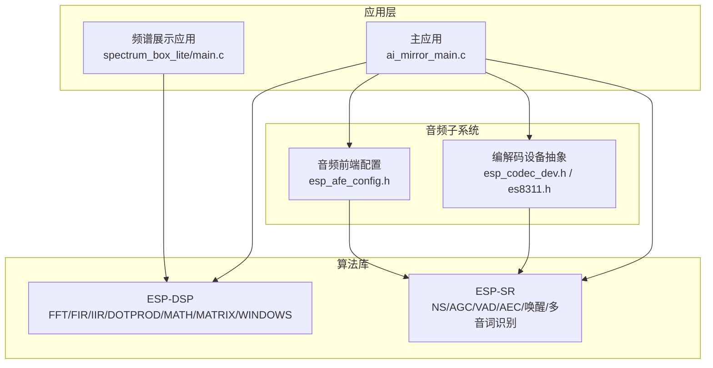
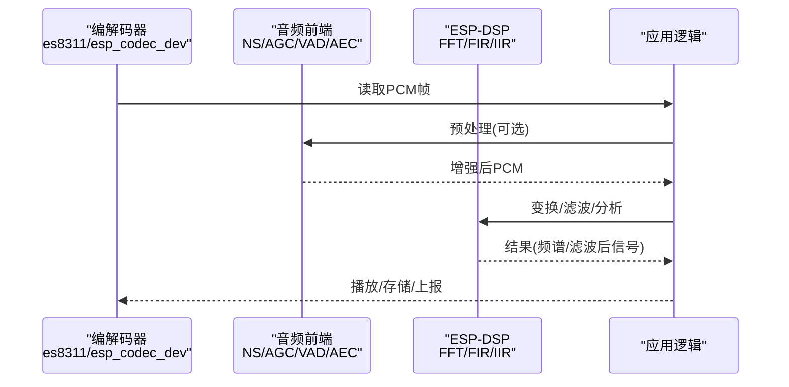
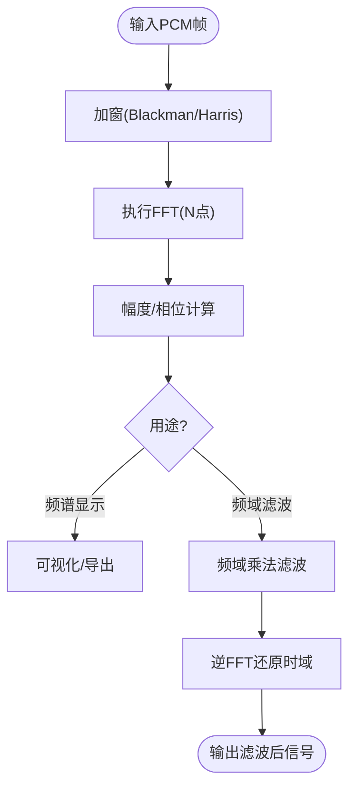
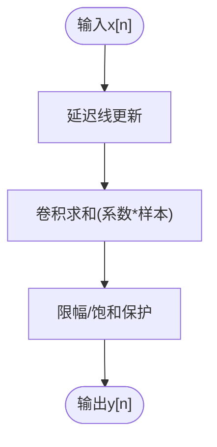
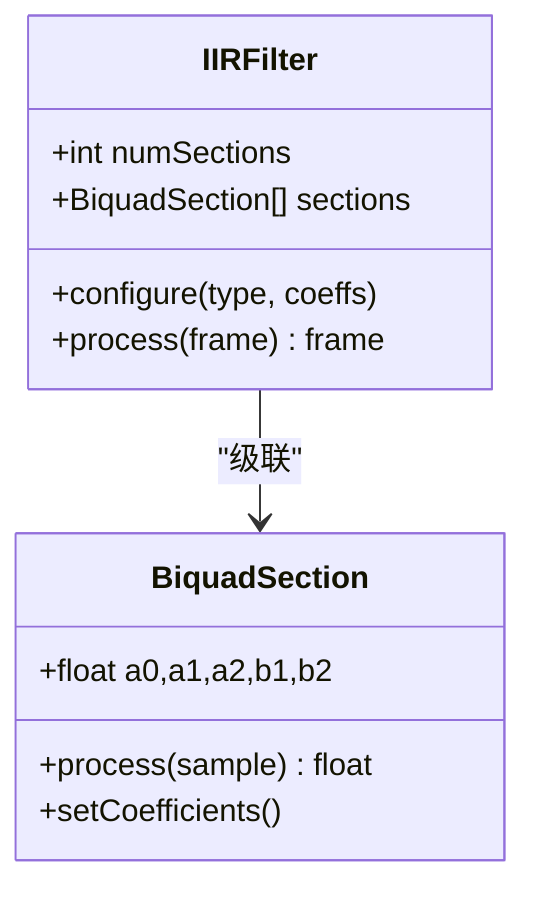
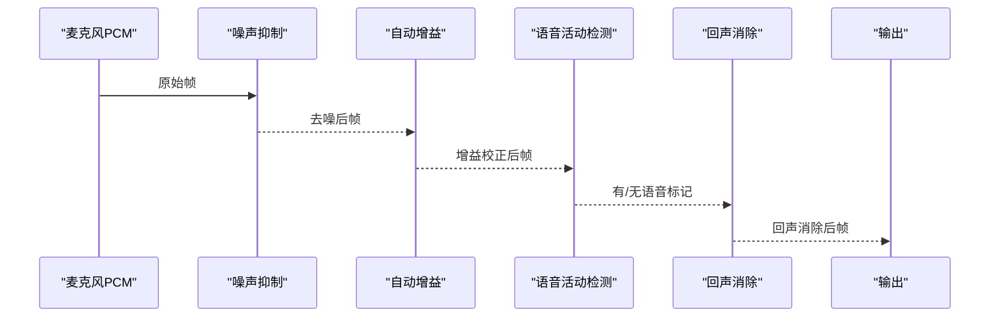
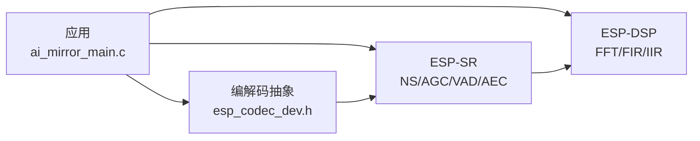

# 音频算法库

<cite>
**本文引用的文件**   
- [README.md](file://Firmware/esp32_ai_mirror/components/espressif__esp-dsp/README.md)
- [CMakeLists.txt](file://Firmware/esp32_ai_mirror/components/espressif__esp-dsp/CMakeLists.txt)
- [idf_component.yml](file://Firmware/esp32_ai_mirror/components/espressif__esp-dsp/idf_component.yml)
- [fft.h](file://Firmware/esp32_ai_mirror/components/espressif__esp-dsp/modules/fft/include/esp_dsp_fft.h)
- [fir.h](file://Firmware/esp32_ai_mirror/components/espressif__esp-dsp/modules/fir/include/esp_dsp_fir.h)
- [iir.h](file://Firmware/esp32_ai_mirror/components/espressif__esp-dsp/modules/iir/include/esp_dsp_iir.h)
- [dotprod.h](file://Firmware/esp32_ai_mirror/components/espressif__esp-dsp/modules/dotprod/include/esp_dsp_dotprod.h)
- [math_add.h](file://Firmware/esp32_ai_mirror/components/espressif__esp-dsp/modules/math/add/include/esp_dsp_math_add.h)
- [matrix.h](file://Firmware/esp32_ai_mirror/components/espressif__esp-dsp/modules/matrix/include/esp_dsp_matrix.h)
- [windows_blackman.h](file://Firmware/esp32_ai_mirror/components/espressif__esp-dsp/modules/windows/blackman/include/esp_dsp_windows_blackman.h)
- [basic_math_main.c](file://Firmware/esp32_ai_mirror/components/espressif__esp-dsp/examples/basic_math/main/main.c)
- [fft_main.c](file://Firmware/esp32_ai_mirror/components/espressif__esp-dsp/examples/fft/main/main.c)
- [fir_main.c](file://Firmware/esp32_ai_mirror/components/espressif__esp-dsp/examples/fir/main/main.c)
- [iir_main.c](file://Firmware/esp32_ai_mirror/components/espressif__esp-dsp/examples/iir/main/main.c)
- [spectrum_box_lite_main.c](file://Firmware/esp32_ai_mirror/components/espressif__esp-dsp/applications/spectrum_box_lite/main/main.c)
- [esp_afe_config.h](file://Firmware/esp32_ai_mirror/components/espressif__esp-sr/include/esp_afe_config.h)
- [esp_ns.h](file://Firmware/esp32_ai_mirror/components/espressif__esp-sr/include/esp_ns.h)
- [esp_agc.h](file://Firmware/esp32_ai_mirror/components/espressif__esp-sr/include/esp_agc.h)
- [esp_vad.h](file://Firmware/esp32_ai_mirror/components/espressif__esp-sr/include/esp_vad.h)
- [esp_aec.h](file://Firmware/esp32_ai_mirror/components/espressif__esp-sr/include/esp_aec.h)
- [esp_mn_iface.h](file://Firmware/esp32_ai_mirror/components/espressif__esp-sr/include/esp_mn_iface.h)
- [esp_wn_iface.h](file://Firmware/esp32_ai_mirror/components/espressif__esp-sr/include/esp_wn_iface.h)
- [esp_codec_dev.h](file://Firmware/esp32_ai_mirror/components/espressif__esp_codec_dev/include/esp_codec_dev.h)
- [es8311.h](file://Firmware/esp32_ai_mirror/components/espressif__esp_codec_dev/device/es8311/es8311.h)
- [ai_mirror_main.c](file://Firmware/esp32_ai_mirror/main/ai_mirror_main.c)
</cite>

## 目录
1. [简介](#简介)
2. [项目结构](#项目结构)
3. [核心组件](#核心组件)
4. [架构总览](#架构总览)
5. [详细组件分析](#详细组件分析)
6. [依赖关系分析](#依赖关系分析)
7. [性能与基准](#性能与基准)
8. [故障排查指南](#故障排查指南)
9. [结论](#结论)
10. [附录：常用场景模板与最佳实践](#附录常用场景模板与最佳实践)

## 简介
本文件面向ESP-DSP与ESP-SR（语音识别）在嵌入式音频处理中的综合使用，覆盖FFT、滤波器（FIR/IIR）、降噪、自动增益控制、语音活动检测、回声消除等关键能力。文档从系统架构、模块接口、数据流、数值精度与稳定性、性能优化到扩展机制进行系统化说明，并提供可复用的代码模板路径，帮助开发者快速集成与调优。

## 项目结构
本项目以ESP-IDF组件方式组织，核心DSP库位于components/espressif__esp-dsp，语音前端与模型位于components/espressif__esp-sr，编解码设备驱动位于components/espressif__esp_codec_dev，应用入口位于main。示例与应用位于examples与applications子目录。

图表来源
- [CMakeLists.txt](file://Firmware/esp32_ai_mirror/components/espressif__esp-dsp/CMakeLists.txt)
- [idf_component.yml](file://Firmware/esp32_ai_mirror/components/espressif__esp-dsp/idf_component.yml)
- [esp_codec_dev.h](file://Firmware/esp32_ai_mirror/components/espressif__esp_codec_dev/include/esp_codec_dev.h)
- [es8311.h](file://Firmware/esp32_ai_mirror/components/espressif__esp_codec_dev/device/es8311/es8311.h)
- [esp_afe_config.h](file://Firmware/esp32_ai_mirror/components/espressif__esp-sr/include/esp_afe_config.h)
- [ai_mirror_main.c](file://Firmware/esp32_ai_mirror/main/ai_mirror_main.c)
- [spectrum_box_lite_main.c](file://Firmware/esp32_ai_mirror/components/espressif__esp-dsp/applications/spectrum_box_lite/main/main.c)

章节来源
- [README.md](file://Firmware/esp32_ai_mirror/components/espressif__esp-dsp/README.md)
- [CMakeLists.txt](file://Firmware/esp32_ai_mirror/components/espressif__esp-dsp/CMakeLists.txt)
- [idf_component.yml](file://Firmware/esp32_ai_mirror/components/espressif__esp-dsp/idf_component.yml)

## 核心组件
- ESP-DSP基础算子
  - FFT：复数/实数FFT、窗函数支持，适用于频谱分析与频域滤波
  - FIR/IIR：线性相位与高效IIR实现，用于音频均衡、去噪、分频
  - 点积与数学运算：向量加/减/乘、平方根、矩阵运算，支撑更高层算法
  - 窗口函数：Blackman/Harris等，降低频谱泄漏
- ESP-SR音频前端
  - 噪声抑制（NS）、自动增益控制（AGC）、语音活动检测（VAD）、回声消除（AEC）
  - 唤醒词引擎与多音词识别接口
- 编解码设备抽象
  - 统一API访问ES8311等Codec，提供ADC/DAC、音量、采样率配置

章节来源
- [fft.h](file://Firmware/esp32_ai_mirror/components/espressif__esp-dsp/modules/fft/include/esp_dsp_fft.h)
- [fir.h](file://Firmware/esp32_ai_mirror/components/espressif__esp-dsp/modules/fir/include/esp_dsp_fir.h)
- [iir.h](file://Firmware/esp32_ai_mirror/components/espressif__esp-dsp/modules/iir/include/esp_dsp_iir.h)
- [dotprod.h](file://Firmware/esp32_ai_mirror/components/espressif__esp-dsp/modules/dotprod/include/esp_dsp_dotprod.h)
- [math_add.h](file://Firmware/esp32_ai_mirror/components/espressif__esp-dsp/modules/math/add/include/esp_dsp_math_add.h)
- [matrix.h](file://Firmware/esp32_ai_mirror/components/espressif__esp-dsp/modules/matrix/include/esp_dsp_matrix.h)
- [windows_blackman.h](file://Firmware/esp32_ai_mirror/components/espressif__esp-dsp/modules/windows/blackman/include/esp_dsp_windows_blackman.h)
- [esp_ns.h](file://Firmware/esp32_ai_mirror/components/espressif__esp-sr/include/esp_ns.h)
- [esp_agc.h](file://Firmware/esp32_ai_mirror/components/espressif__esp-sr/include/esp_agc.h)
- [esp_vad.h](file://Firmware/esp32_ai_mirror/components/espressif__esp-sr/include/esp_vad.h)
- [esp_aec.h](file://Firmware/esp32_ai_mirror/components/espressif__esp-sr/include/esp_aec.h)
- [esp_mn_iface.h](file://Firmware/esp32_ai_mirror/components/espressif__esp-sr/include/esp_mn_iface.h)
- [esp_wn_iface.h](file://Firmware/esp32_ai_mirror/components/espressif__esp-sr/include/esp_wn_iface.h)
- [esp_codec_dev.h](file://Firmware/esp32_ai_mirror/components/espressif__esp_codec_dev/include/esp_codec_dev.h)
- [es8311.h](file://Firmware/esp32_ai_mirror/components/espressif__esp_codec_dev/device/es8311/es8311.h)

## 架构总览
下图展示了从音频采集到DSP处理与SR前端的典型数据流：Codec采集PCM帧，送入AFE（可选NS/AGC/VAD/AEC），再进入用户自定义DSP链（如FFT+窗函数+FIR/IIR），最终输出或上传。

图表来源
- [esp_codec_dev.h](file://Firmware/esp32_ai_mirror/components/espressif__esp_codec_dev/include/esp_codec_dev.h)
- [es8311.h](file://Firmware/esp32_ai_mirror/components/espressif__esp_codec_dev/device/es8311/es8311.h)
- [esp_afe_config.h](file://Firmware/esp32_ai_mirror/components/espressif__esp-sr/include/esp_afe_config.h)
- [esp_ns.h](file://Firmware/esp32_ai_mirror/components/espressif__esp-sr/include/esp_ns.h)
- [esp_agc.h](file://Firmware/esp32_ai_mirror/components/espressif__esp-sr/include/esp_agc.h)
- [esp_vad.h](file://Firmware/esp32_ai_mirror/components/espressif__esp-sr/include/esp_vad.h)
- [esp_aec.h](file://Firmware/esp32_ai_mirror/components/espressif__esp-sr/include/esp_aec.h)
- [fft.h](file://Firmware/esp32_ai_mirror/components/espressif__esp-dsp/modules/fft/include/esp_dsp_fft.h)
- [fir.h](file://Firmware/esp32_ai_mirror/components/espressif__esp-dsp/modules/fir/include/esp_dsp_fir.h)
- [iir.h](file://Firmware/esp32_ai_mirror/components/espressif__esp-dsp/modules/iir/include/esp_dsp_iir.h)

## 详细组件分析

### FFT与窗函数
- 功能要点
  - 支持复数/实数FFT，配合窗函数减少频谱泄漏
  - 常用于频谱分析、频域滤波、共振峰提取
- 参数与配置
  - 点数N（2的幂次）、数据类型（float/fixed）、是否原位计算
  - 窗函数选择（Blackman/Harris等）
- 数值稳定性
  - 浮点优于定点；定点需关注缩放因子与溢出保护
- 参考实现与示例
  - 头文件定义与接口：[fft.h](file://Firmware/esp32_ai_mirror/components/espressif__esp-dsp/modules/fft/include/esp_dsp_fft.h)
  - 窗函数：[windows_blackman.h](file://Firmware/esp32_ai_mirror/components/espressif__esp-dsp/modules/windows/blackman/include/esp_dsp_windows_blackman.h)
  - 示例：[fft_main.c](file://Firmware/esp32_ai_mirror/components/espressif__esp-dsp/examples/fft/main/main.c)

图表来源
- [fft.h](file://Firmware/esp32_ai_mirror/components/espressif__esp-dsp/modules/fft/include/esp_dsp_fft.h)
- [windows_blackman.h](file://Firmware/esp32_ai_mirror/components/espressif__esp-dsp/modules/windows/blackman/include/esp_dsp_windows_blackman.h)
- [fft_main.c](file://Firmware/esp32_ai_mirror/components/espressif__esp-dsp/examples/fft/main/main.c)

章节来源
- [fft.h](file://Firmware/esp32_ai_mirror/components/espressif__esp-dsp/modules/fft/include/esp_dsp_fft.h)
- [windows_blackman.h](file://Firmware/esp32_ai_mirror/components/espressif__esp-dsp/modules/windows/blackman/include/esp_dsp_windows_blackman.h)
- [fft_main.c](file://Firmware/esp32_ai_mirror/components/espressif__esp-dsp/examples/fft/main/main.c)

### FIR滤波器
- 功能要点
  - 线性相位、稳定易实现，适合低通/高通/带通/带阻
- 参数与配置
  - 阶数M、系数设计（切比雪夫/巴特沃斯/窗函数法）
  - 块处理长度与延迟权衡
- 数值稳定性
  - 系数归一化，避免饱和；定点需Q格式规划
- 参考实现与示例
  - 头文件：[fir.h](file://Firmware/esp32_ai_mirror/components/espressif__esp-dsp/modules/fir/include/esp_dsp_fir.h)
  - 示例：[fir_main.c](file://Firmware/esp32_ai_mirror/components/espressif__esp-dsp/examples/fir/main/main.c)

图表来源
- [fir.h](file://Firmware/esp32_ai_mirror/components/espressif__esp-dsp/modules/fir/include/esp_dsp_fir.h)
- [fir_main.c](file://Firmware/esp32_ai_mirror/components/espressif__esp-dsp/examples/fir/main/main.c)

章节来源
- [fir.h](file://Firmware/esp32_ai_mirror/components/espressif__esp-dsp/modules/fir/include/esp_dsp_fir.h)
- [fir_main.c](file://Firmware/esp32_ai_mirror/components/espressif__esp-dsp/examples/fir/main/main.c)

### IIR滤波器（Biquad）
- 功能要点
  - 高阶响应可用级联二阶节实现，计算效率高
- 参数与配置
  - 每节系数a/b，级联顺序与Q值控制
- 数值稳定性
  - 极点位置决定稳定性；定点需量化误差管理
- 参考实现与示例
  - 头文件：[iir.h](file://Firmware/esp32_ai_mirror/components/espressif__esp-dsp/modules/iir/include/esp_dsp_iir.h)
  - 示例：[iir_main.c](file://Firmware/esp32_ai_mirror/components/espressif__esp-dsp/examples/iir/main/main.c)

图表来源
- [iir.h](file://Firmware/esp32_ai_mirror/components/espressif__esp-dsp/modules/iir/include/esp_dsp_iir.h)
- [iir_main.c](file://Firmware/esp32_ai_mirror/components/espressif__esp-dsp/examples/iir/main/main.c)

章节来源
- [iir.h](file://Firmware/esp32_ai_mirror/components/espressif__esp-dsp/modules/iir/include/esp_dsp_iir.h)
- [iir_main.c](file://Firmware/esp32_ai_mirror/components/espressif__esp-dsp/examples/iir/main/main.c)

### 点积与基础数学
- 功能要点
  - 向量点积、加减乘、平方根、矩阵运算，支撑能量估计、相关分析、特征提取
- 参考实现与示例
  - 点积：[dotprod.h](file://Firmware/esp32_ai_mirror/components/espressif__esp-dsp/modules/dotprod/include/esp_dsp_dotprod.h)
  - 加法：[math_add.h](file://Firmware/esp32_ai_mirror/components/espressif__esp-dsp/modules/math/add/include/esp_dsp_math_add.h)
  - 矩阵：[matrix.h](file://Firmware/esp32_ai_mirror/components/espressif__esp-dsp/modules/matrix/include/esp_dsp_matrix.h)
  - 基础示例：[basic_math_main.c](file://Firmware/esp32_ai_mirror/components/espressif__esp-dsp/examples/basic_math/main/main.c)

章节来源
- [dotprod.h](file://Firmware/esp32_ai_mirror/components/espressif__esp-dsp/modules/dotprod/include/esp_dsp_dotprod.h)
- [math_add.h](file://Firmware/esp32_ai_mirror/components/espressif__esp-dsp/modules/math/add/include/esp_dsp_math_add.h)
- [matrix.h](file://Firmware/esp32_ai_mirror/components/espressif__esp-dsp/modules/matrix/include/esp_dsp_matrix.h)
- [basic_math_main.c](file://Firmware/esp32_ai_mirror/components/espressif__esp-dsp/examples/basic_math/main/main.c)

### 音频前端（NS/AGC/VAD/AEC）
- 功能要点
  - NS：背景噪声抑制
  - AGC：自动增益控制，保持语音响度稳定
  - VAD：语音活动检测，节省算力与带宽
  - AEC：回声消除，提升通话质量
- 参考接口
  - 配置：[esp_afe_config.h](file://Firmware/esp32_ai_mirror/components/espressif__esp-sr/include/esp_afe_config.h)
  - NS：[esp_ns.h](file://Firmware/esp32_ai_mirror/components/espressif__esp-sr/include/esp_ns.h)
  - AGC：[esp_agc.h](file://Firmware/esp32_ai_mirror/components/espressif__esp-sr/include/esp_agc.h)
  - VAD：[esp_vad.h](file://Firmware/esp32_ai_mirror/components/espressif__esp-sr/include/esp_vad.h)
  - AEC：[esp_aec.h](file://Firmware/esp32_ai_mirror/components/espressif__esp-sr/include/esp_aec.h)

图表来源
- [esp_afe_config.h](file://Firmware/esp32_ai_mirror/components/espressif__esp-sr/include/esp_afe_config.h)
- [esp_ns.h](file://Firmware/esp32_ai_mirror/components/espressif__esp-sr/include/esp_ns.h)
- [esp_agc.h](file://Firmware/esp32_ai_mirror/components/espressif__esp-sr/include/esp_agc.h)
- [esp_vad.h](file://Firmware/esp32_ai_mirror/components/espressif__esp-sr/include/esp_vad.h)
- [esp_aec.h](file://Firmware/esp32_ai_mirror/components/espressif__esp-sr/include/esp_aec.h)

章节来源
- [esp_afe_config.h](file://Firmware/esp32_ai_mirror/components/espressif__esp-sr/include/esp_afe_config.h)
- [esp_ns.h](file://Firmware/esp32_ai_mirror/components/espressif__esp-sr/include/esp_ns.h)
- [esp_agc.h](file://Firmware/esp32_ai_mirror/components/espressif__esp-sr/include/esp_agc.h)
- [esp_vad.h](file://Firmware/esp32_ai_mirror/components/espressif__esp-sr/include/esp_vad.h)
- [esp_aec.h](file://Firmware/esp32_ai_mirror/components/espressif__esp-sr/include/esp_aec.h)

### 编解码设备抽象（ESP-Codec-Dev）
- 功能要点
  - 统一封装不同Codec（如ES8311），提供ADC/DAC、音量、采样率、通道配置
- 参考接口
  - 通用接口：[esp_codec_dev.h](file://Firmware/esp32_ai_mirror/components/espressif__esp_codec_dev/include/esp_codec_dev.h)
  - ES8311驱动：[es8311.h](file://Firmware/esp32_ai_mirror/components/espressif__esp_codec_dev/device/es8311/es8311.h)

章节来源
- [esp_codec_dev.h](file://Firmware/esp32_ai_mirror/components/espressif__esp_codec_dev/include/esp_codec_dev.h)
- [es8311.h](file://Firmware/esp32_ai_mirror/components/espressif__esp_codec_dev/device/es8311/es8311.h)

## 依赖关系分析
- 组件耦合
  - 应用层依赖ESP-DSP与ESP-SR，通过ESP-Codec-Dev接入硬件
  - ESP-SR的AFE依赖底层PCM数据源（由Codec提供）
- 外部依赖
  - ESP-IDF工具链与构建系统（CMake/Component Manager）
- 潜在循环依赖
  - 建议将DSP与SR解耦，通过明确的数据缓冲区与回调接口通信

图表来源
- [ai_mirror_main.c](file://Firmware/esp32_ai_mirror/main/ai_mirror_main.c)
- [esp_codec_dev.h](file://Firmware/esp32_ai_mirror/components/espressif__esp_codec_dev/include/esp_codec_dev.h)
- [esp_afe_config.h](file://Firmware/esp32_ai_mirror/components/espressif__esp-sr/include/esp_afe_config.h)
- [idf_component.yml](file://Firmware/esp32_ai_mirror/components/espressif__esp-dsp/idf_component.yml)

章节来源
- [idf_component.yml](file://Firmware/esp32_ai_mirror/components/espressif__esp-dsp/idf_component.yml)
- [CMakeLists.txt](file://Firmware/esp32_ai_mirror/components/espressif__esp-dsp/CMakeLists.txt)

## 性能与基准
- 算法复杂度
  - FFT：O(N log N)，N为点数；实数FFT可减少一半计算量
  - FIR：O(M·L)，M为阶数，L为块长；可通过重叠-保存/相加法加速
  - IIR：O(L)，常数计算量，适合实时
- 内存占用
  - 窗函数表、延迟线、状态变量需合理分配；优先静态/堆外缓存
- 精度与稳定性
  - 浮点优先；定点需严格Q格式与溢出检查
  - IIR级联节排序：先高Q节，再低Q节，降低量化噪声放大
- 基准测试建议
  - 使用examples/fft与examples/fir、examples/iir作为基线
  - 统计CPU周期、内存峰值、端到端延迟
  - 对比不同N、M、采样率下的吞吐与功耗

章节来源
- [fft_main.c](file://Firmware/esp32_ai_mirror/components/espressif__esp-dsp/examples/fft/main/main.c)
- [fir_main.c](file://Firmware/esp32_ai_mirror/components/espressif__esp-dsp/examples/fir/main/main.c)
- [iir_main.c](file://Firmware/esp32_ai_mirror/components/espressif__esp-dsp/examples/iir/main/main.c)

## 故障排查指南
- 常见问题
  - 爆音/削波：检查AGC增益上限与输出限幅
  - 噪声未抑制：调整NS参数与VAD阈值
  - 回声残留：检查AEC参考声道与步长
  - 频谱异常：确认窗函数与FFT点数对齐
- 调试手段
  - 打印中间状态（帧能量、VAD标志、AGC增益）
  - 使用频谱可视化应用定位问题频段
  - 逐步关闭模块（NS/AGC/VAD/AEC）隔离问题

章节来源
- [spectrum_box_lite_main.c](file://Firmware/esp32_ai_mirror/components/espressif__esp-dsp/applications/spectrum_box_lite/main/main.c)
- [esp_ns.h](file://Firmware/esp32_ai_mirror/components/espressif__esp-sr/include/esp_ns.h)
- [esp_agc.h](file://Firmware/esp32_ai_mirror/components/espressif__esp-sr/include/esp_agc.h)
- [esp_vad.h](file://Firmware/esp32_ai_mirror/components/espressif__esp-sr/include/esp_vad.h)
- [esp_aec.h](file://Firmware/esp32_ai_mirror/components/espressif__esp-sr/include/esp_aec.h)

## 结论
ESP-DSP与ESP-SR共同构成完整的嵌入式音频处理栈：从Codec采集、前端增强（NS/AGC/VAD/AEC）到DSP变换与滤波，再到上层应用。通过合理的参数配置、数值策略与性能优化，可在资源受限平台上实现高质量、低延迟的音频处理。

## 附录：常用场景模板与最佳实践
- 频谱显示
  - 流程：采集→加窗→FFT→幅度谱→显示
  - 参考：[spectrum_box_lite_main.c](file://Firmware/esp32_ai_mirror/components/espressif__esp-dsp/applications/spectrum_box_lite/main/main.c)
- 实时降噪
  - 流程：采集→NS→AGC→VAD→可选FIR平滑→输出
  - 参考：[esp_ns.h](file://Firmware/esp32_ai_mirror/components/espressif__esp-sr/include/esp_ns.h)、[esp_agc.h](file://Firmware/esp32_ai_mirror/components/espressif__esp-sr/include/esp_agc.h)、[esp_vad.h](file://Firmware/esp32_ai_mirror/components/espressif__esp-sr/include/esp_vad.h)
- 频域滤波
  - 流程：采集→加窗→FFT→频域掩蔽→IFFT→输出
  - 参考：[fft.h](file://Firmware/esp32_ai_mirror/components/espressif__esp-dsp/modules/fft/include/esp_dsp_fft.h)、[windows_blackman.h](file://Firmware/esp32_ai_mirror/components/espressif__esp-dsp/modules/windows/blackman/include/esp_dsp_windows_blackman.h)
- 均衡与分频
  - 流程：采集→IIR级联（低通/高通/带通）→混音/路由
  - 参考：[iir.h](file://Firmware/esp32_ai_mirror/components/espressif__esp-dsp/modules/iir/include/esp_dsp_iir.h)
- 回声消除
  - 流程：采集主声道→参考回放声道→AEC→输出
  - 参考：[esp_aec.h](file://Firmware/esp32_ai_mirror/components/espressif__esp-sr/include/esp_aec.h)
- 自定义算法集成
  - 步骤：定义输入/输出缓冲区→实现单帧处理函数→注册到处理链→与AFE/DSP协同
  - 建议：保持固定块长、避免动态分配、使用SIMD/内联优化

章节来源
- [spectrum_box_lite_main.c](file://Firmware/esp32_ai_mirror/components/espressif__esp-dsp/applications/spectrum_box_lite/main/main.c)
- [esp_ns.h](file://Firmware/esp32_ai_mirror/components/espressif__esp-sr/include/esp_ns.h)
- [esp_agc.h](file://Firmware/esp32_ai_mirror/components/espressif__esp-sr/include/esp_agc.h)
- [esp_vad.h](file://Firmware/esp32_ai_mirror/components/espressif__esp-sr/include/esp_vad.h)
- [esp_aec.h](file://Firmware/esp32_ai_mirror/components/espressif__esp-sr/include/esp_aec.h)
- [fft.h](file://Firmware/esp32_ai_mirror/components/espressif__esp-dsp/modules/fft/include/esp_dsp_fft.h)
- [windows_blackman.h](file://Firmware/esp32_ai_mirror/components/espressif__esp-dsp/modules/windows/blackman/include/esp_dsp_windows_blackman.h)
- [iir.h](file://Firmware/esp32_ai_mirror/components/espressif__esp-dsp/modules/iir/include/esp_dsp_iir.h)