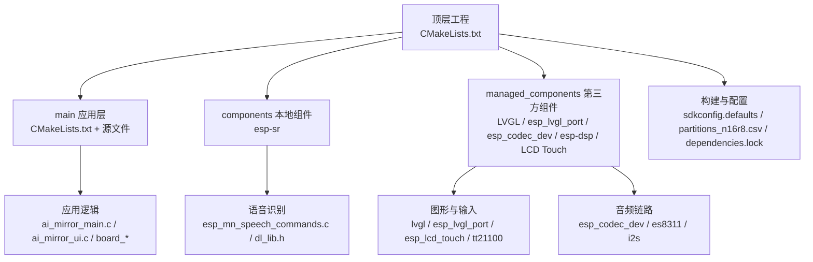
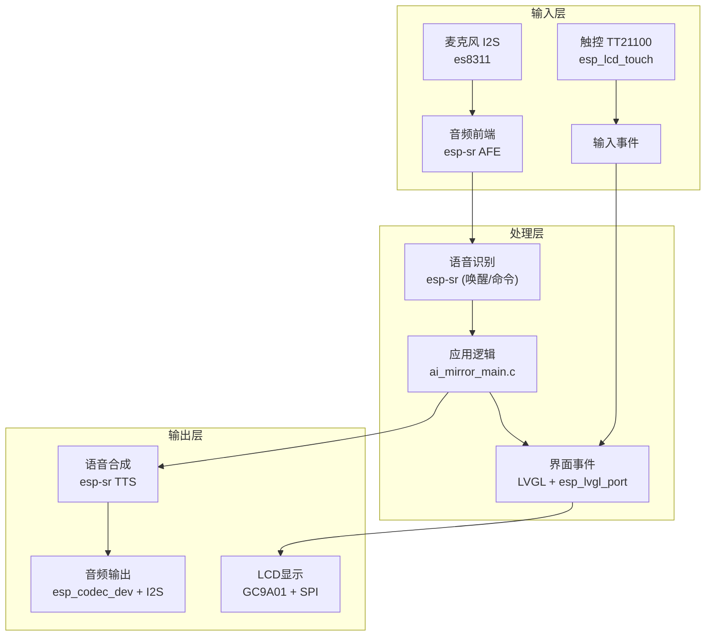
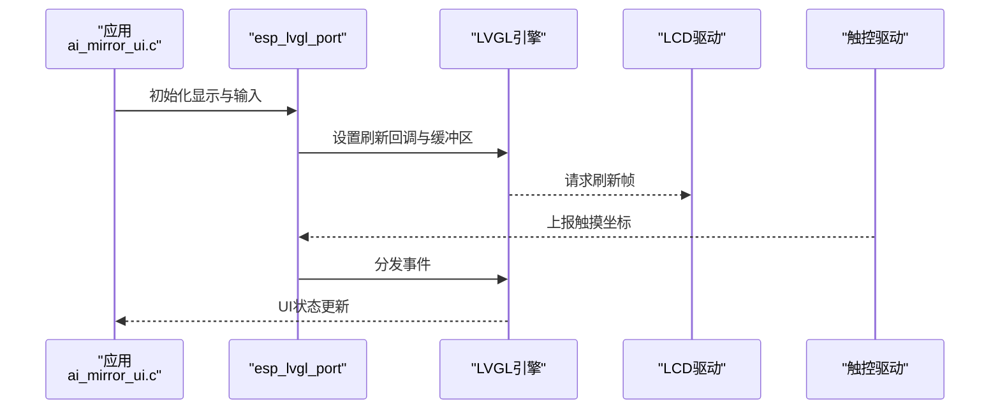
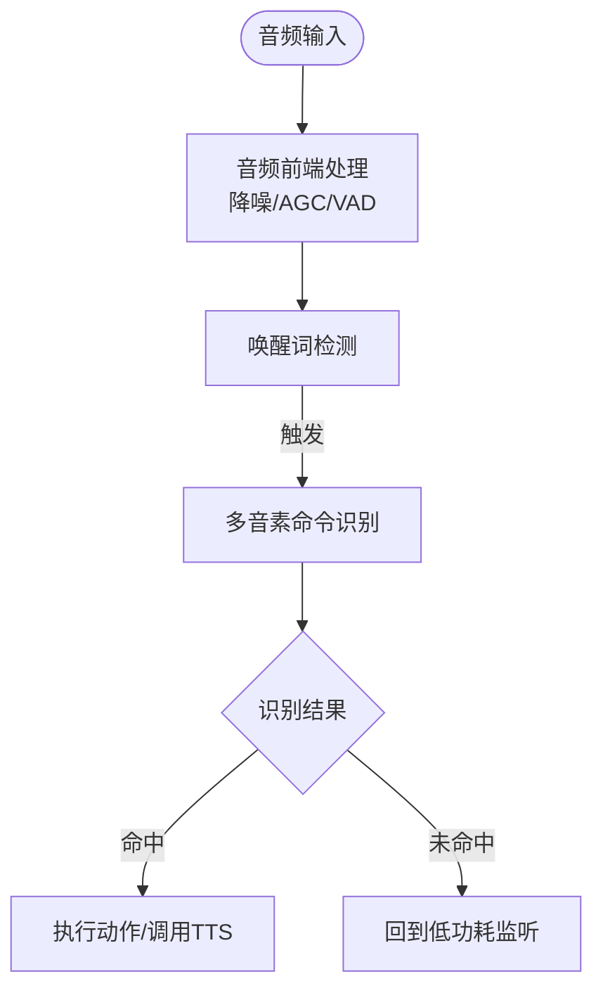
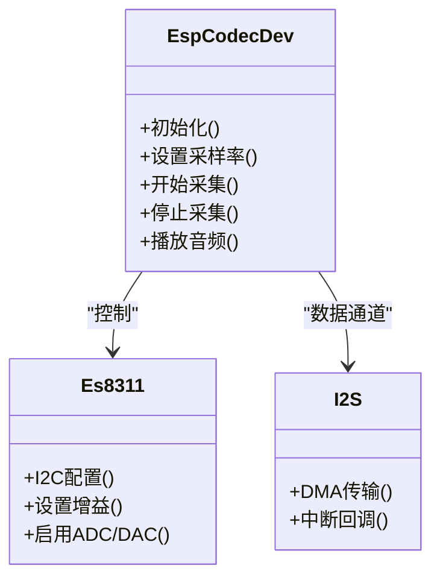
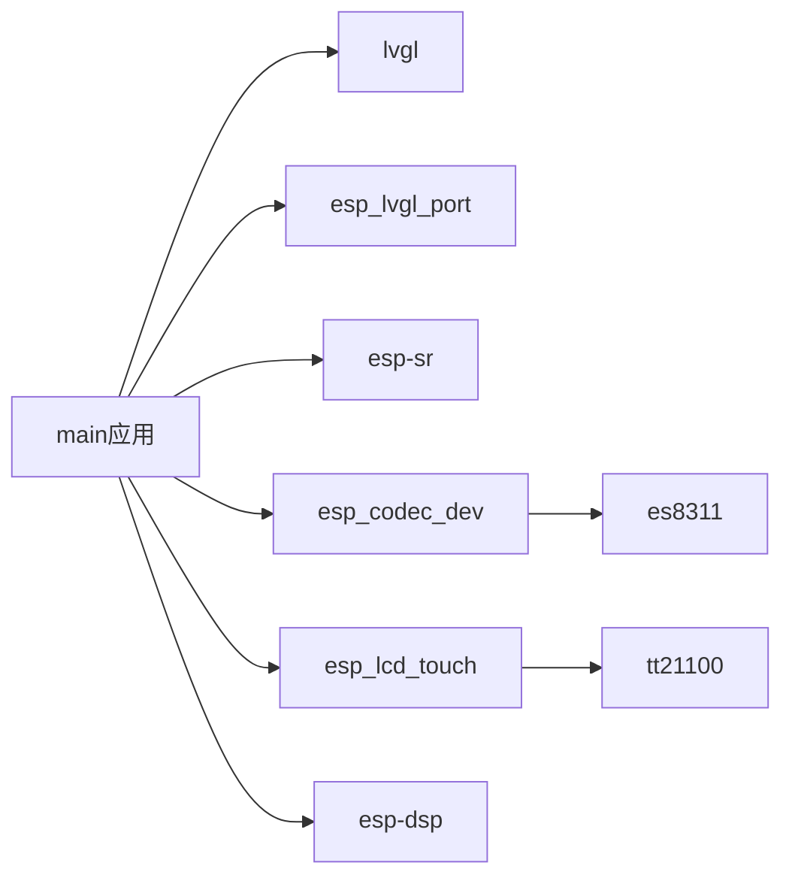

# 技术栈

<cite>
**本文引用的文件**   
- [Firmware/esp32_ai_mirror/CMakeLists.txt](file://Firmware/esp32_ai_mirror/CMakeLists.txt)
- [Firmware/esp32_ai_mirror/main/CMakeLists.txt](file://Firmware/esp32_ai_mirror/main/CMakeLists.txt)
- [Firmware/esp32_ai_mirror/main/idf_component.yml](file://Firmware/esp32_ai_mirror/main/idf_component.yml)
- [Firmware/esp32_ai_mirror/main/ai_mirror_main.c](file://Firmware/esp32_ai_mirror/main/ai_mirror_main.c)
- [Firmware/esp32_ai_mirror/main/ai_mirror_ui.c](file://Firmware/esp32_ai_mirror/main/ai_mirror_ui.c)
- [Firmware/esp32_ai_mirror/main/ai_mirror_config.h](file://Firmware/esp32_ai_mirror/main/ai_mirror_config.h)
- [Firmware/esp32_ai_mirror/main/board_buttons.c](file://Firmware/esp32_ai_mirror/main/board_buttons.c)
- [Firmware/esp32_ai_mirror/main/board_buttons.h](file://Firmware/esp32_ai_mirror/main/board_buttons.h)
- [Firmware/esp32_ai_mirror/main/board_rgb.c](file://Firmware/esp32_ai_mirror/main/board_rgb.c)
- [Firmware/esp32_ai_mirror/main/board_rgb.h](file://Firmware/esp32_ai_mirror/main/board_rgb.h)
- [Firmware/esp32_ai_mirror/main/board_wifi_prov.c](file://Firmware/esp32_ai_mirror/main/board_wifi_prov.c)
- [Firmware/esp32_ai_mirror/main/board_wifi_prov.h](file://Firmware/esp32_ai_mirror/main/board_wifi_prov.h)
- [Firmware/esp32_ai_mirror/partitions_n16r8.csv](file://Firmware/esp32_ai_mirror/partitions_n16r8.csv)
- [Firmware/esp32_ai_mirror/sdkconfig.defaults](file://Firmware/esp32_ai_mirror/sdkconfig.defaults)
- [Firmware/esp32_ai_mirror/dependencies.lock](file://Firmware/esp32_ai_mirror/dependencies.lock)
- [Firmware/esp32_ai_mirror/components/espressif__esp-sr/CMakeLists.txt](file://Firmware/esp32_ai_mirror/components/espressif__esp-sr/CMakeLists.txt)
- [Firmware/esp32_ai_mirror/components/espressif__esp-sr/idf_component.yml](file://Firmware/esp32_ai_mirror/components/espressif__esp-sr/idf_component.yml)
- [Firmware/esp32_ai_mirror/components/espressif__esp-sr/include/esp32s3/dl_lib.h](file://Firmware/esp32_ai_mirror/components/espressif__esp-sr/include/esp32s3/dl_lib.h)
- [Firmware/esp32_ai_mirror/components/espressif__esp-sr/src/esp_mn_speech_commands.c](file://Firmware/esp32_ai_mirror/components/espressif__esp-sr/src/esp_mn_speech_commands.c)
- [Firmware/esp32_ai_mirror/components/espressif__esp-sr/model/CMakeLists.txt](file://Firmware/esp32_ai_mirror/components/espressif__esp-sr/model/CMakeLists.txt)
- [Firmware/esp32_ai_mirror/managed_components/espressif__esp_codec_dev/CMakeLists.txt](file://Firmware/esp32_ai_mirror/managed_components/espressif__esp_codec_dev/CMakeLists.txt)
- [Firmware/esp32_ai_mirror/managed_components/espressif__esp_codec_dev/include/esp_codec_dev.h](file://Firmware/esp32_ai_mirror/managed_components/espressif__esp_codec_dev/include/esp_codec_dev.h)
- [Firmware/esp32_ai_mirror/managed_components/espressif__esp_codec_dev/platform/audio_codec_data_i2s.c](file://Firmware/esp32_ai_mirror/managed_components/espressif__esp_codec_dev/platform/audio_codec_data_i2s.c)
- [Firmware/esp32_ai_mirror/managed_components/espressif__es8311/CMakeLists.txt](file://Firmware/esp32_ai_mirror/managed_components/espressif__es8311/CMakeLists.txt)
- [Firmware/esp32_ai_mirror/managed_components/espressif__es8311/es8311.c](file://Firmware/esp32_ai_mirror/managed_components/espressif__es8311/es8311.c)
- [Firmware/esp32_ai_mirror/managed_components/espressif__esp_lvgl_port/CMakeLists.txt](file://Firmware/esp32_ai_mirror/managed_components/espressif__esp_lvgl_port/CMakeLists.txt)
- [Firmware/esp32_ai_mirror/managed_components/espressif__esp_lvgl_port/include/esp_lvgl_port.h](file://Firmware/esp32_ai_mirror/managed_components/espressif__esp_lvgl_port/include/esp_lvgl_port.h)
- [Firmware/esp32_ai_mirror/managed_components/lvgl__lvgl/CMakeLists.txt](file://Firmware/esp32_ai_mirror/managed_components/lvgl__lvgl/CMakeLists.txt)
- [Firmware/esp32_ai_mirror/managed_components/lvgl__lvgl/lvgl.h](file://Firmware/esp32_ai_mirror/managed_components/lvgl__lvgl/lvgl.h)
- [Firmware/esp32_ai_mirror/managed_components/espressif__esp_lcd_touch/CMakeLists.txt](file://Firmware/esp32_ai_mirror/managed_components/espressif__esp_lcd_touch/CMakeLists.txt)
- [Firmware/esp32_ai_mirror/managed_components/espressif__esp_lcd_touch/esp_lcd_touch.c](file://Firmware/esp32_ai_mirror/managed_components/espressif__esp_lcd_touch/esp_lcd_touch.c)
- [Firmware/esp32_ai_mirror/managed_components/espressif__esp_lcd_touch_tt21100/CMakeLists.txt](file://Firmware/esp32_ai_mirror/managed_components/espressif__esp_lcd_touch_tt21100/CMakeLists.txt)
- [Firmware/esp32_ai_mirror/managed_components/espressif__esp_lcd_touch_tt21100/esp_lcd_touch_tt21100.c](file://Firmware/esp32_ai_mirror/managed_components/espressif__esp_lcd_touch_tt21100/esp_lcd_touch_tt21100.c)
- [Firmware/esp32_ai_mirror/managed_components/espressif__esp-dsp/CMakeLists.txt](file://Firmware/esp32_ai_mirror/managed_components/espressif__esp-dsp/CMakeLists.txt)
</cite>

## 目录
1. [简介](#简介)
2. [项目结构](#项目结构)
3. [核心组件](#核心组件)
4. [架构总览](#架构总览)
5. [详细组件分析](#详细组件分析)
6. [依赖关系分析](#依赖关系分析)
7. [性能考量](#性能考量)
8. [故障排查指南](#故障排查指南)
9. [结论](#结论)
10. [附录](#附录)

## 简介
本技术栈文档面向AI镜子项目，系统梳理硬件平台、软件框架、关键组件库与构建部署流程。重点覆盖：
- 核心硬件平台：ESP32-S3芯片的规格、性能与特性
- 软件框架：ESP-IDF开发环境与FreeRTOS操作系统
- 关键组件库：LVGL图形界面、espressif__esp-sr语音识别、esp_codec_dev音频处理
- 第三方依赖：esp_lvgl_port、esp_lcd_touch等组件的作用与版本要求
- 构建系统：CMake配置、编译选项与部署流程
- 技术选型原因与兼容性考虑
- 开发环境搭建与工具链配置
- 性能优化相关技术选型说明

## 项目结构
项目采用ESP-IDF标准工程组织方式，主程序位于main目录，组件通过components与managed_components管理，构建脚本与分区表位于根目录。关键目录与职责如下：
- main：应用入口、UI初始化、板级外设（按键、RGB、WiFi配网）等
- components：本地组件（如esp-sr语音识别）
- managed_components：由ESP-IDF Component Manager自动管理的第三方组件（LVGL、LCD触摸、Codec Dev、DSP等）
- CMakeLists.txt与sdkconfig.defaults：顶层构建配置与默认SDK配置
- partitions_n16r8.csv：Flash分区表（OTA、文件系统、模型数据等）
- dependencies.lock：锁定依赖版本，保证可重复构建

图表来源
- [Firmware/esp32_ai_mirror/CMakeLists.txt](file://Firmware/esp32_ai_mirror/CMakeLists.txt)
- [Firmware/esp32_ai_mirror/main/CMakeLists.txt](file://Firmware/esp32_ai_mirror/main/CMakeLists.txt)
- [Firmware/esp32_ai_mirror/components/espressif__esp-sr/CMakeLists.txt](file://Firmware/esp32_ai_mirror/components/espressif__esp-sr/CMakeLists.txt)
- [Firmware/esp32_ai_mirror/managed_components/espressif__esp_lvgl_port/CMakeLists.txt](file://Firmware/esp32_ai_mirror/managed_components/espressif__esp_lvgl_port/CMakeLists.txt)
- [Firmware/esp32_ai_mirror/managed_components/espressif__esp_codec_dev/CMakeLists.txt](file://Firmware/esp32_ai_mirror/managed_components/espressif__esp_codec_dev/CMakeLists.txt)

章节来源
- [Firmware/esp32_ai_mirror/CMakeLists.txt](file://Firmware/esp32_ai_mirror/CMakeLists.txt)
- [Firmware/esp32_ai_mirror/main/CMakeLists.txt](file://Firmware/esp32_ai_mirror/main/CMakeLists.txt)
- [Firmware/esp32_ai_mirror/partitions_n16r8.csv](file://Firmware/esp32_ai_mirror/partitions_n16r8.csv)
- [Firmware/esp32_ai_mirror/sdkconfig.defaults](file://Firmware/esp32_ai_mirror/sdkconfig.defaults)

## 核心组件
- ESP32-S3芯片
  - 双核Xtensa LX7，支持NEON SIMD与矢量指令加速，适合语音与图像渲染
  - 丰富的外设：I2S、SPI、I2C、USB OTG、PSRAM接口，满足音频采集、LCD驱动与触控需求
  - 低功耗与高算力平衡，适合边缘AI推理与实时交互
- ESP-IDF与FreeRTOS
  - ESP-IDF提供统一的组件管理与构建系统（CMake），FreeRTOS提供任务调度、队列与信号量
  - 通过idf_component.yml与CMakeLists.txt声明依赖，确保跨平台一致构建
- LVGL图形界面库
  - 轻量高效的GUI引擎，配合esp_lvgl_port实现与ESP-IDF的集成（显示刷新、输入事件）
- espressif__esp-sr语音识别
  - 提供唤醒词检测、多音素命令识别与TTS集成，内置多种模型与工具链
- esp_codec_dev音频处理
  - 统一音频编解码设备抽象，适配I2S与多种Codec芯片（如ES8311），简化音频链路开发

章节来源
- [Firmware/esp32_ai_mirror/main/ai_mirror_main.c](file://Firmware/esp32_ai_mirror/main/ai_mirror_main.c)
- [Firmware/esp32_ai_mirror/main/ai_mirror_ui.c](file://Firmware/esp32_ai_mirror/main/ai_mirror_ui.c)
- [Firmware/esp32_ai_mirror/components/espressif__esp-sr/CMakeLists.txt](file://Firmware/esp32_ai_mirror/components/espressif__esp-sr/CMakeLists.txt)
- [Firmware/esp32_ai_mirror/managed_components/espressif__esp_codec_dev/CMakeLists.txt](file://Firmware/esp32_ai_mirror/managed_components/espressif__esp_codec_dev/CMakeLists.txt)
- [Firmware/esp32_ai_mirror/managed_components/espressif__esp_lvgl_port/CMakeLists.txt](file://Firmware/esp32_ai_mirror/managed_components/espressif__esp_lvgl_port/CMakeLists.txt)

## 架构总览
整体架构围绕“输入（麦克风/触控）—处理（语音识别/AI推理）—输出（LCD/TTS）”闭环设计，FreeRTOS任务划分清晰，组件间通过标准接口通信。

图表来源
- [Firmware/esp32_ai_mirror/main/ai_mirror_main.c](file://Firmware/esp32_ai_mirror/main/ai_mirror_main.c)
- [Firmware/esp32_ai_mirror/main/ai_mirror_ui.c](file://Firmware/esp32_ai_mirror/main/ai_mirror_ui.c)
- [Firmware/esp32_ai_mirror/components/espressif__esp-sr/src/esp_mn_speech_commands.c](file://Firmware/esp32_ai_mirror/components/espressif__esp-sr/src/esp_mn_speech_commands.c)
- [Firmware/esp32_ai_mirror/managed_components/espressif__esp_codec_dev/platform/audio_codec_data_i2s.c](file://Firmware/esp32_ai_mirror/managed_components/espressif__esp_codec_dev/platform/audio_codec_data_i2s.c)
- [Firmware/esp32_ai_mirror/managed_components/espressif__esp_lcd_touch_tt21100/esp_lcd_touch_tt21100.c](file://Firmware/esp32_ai_mirror/managed_components/espressif__esp_lcd_touch_tt21100/esp_lcd_touch_tt21100.c)

## 详细组件分析

### 硬件平台：ESP32-S3
- 处理器：双核Xtensa LX7，支持向量扩展，提升语音与图像处理效率
- 内存：支持外部PSRAM，为LVGL帧缓冲与语音模型加载提供空间
- 外设：I2S用于音频采集/播放；SPI用于LCD驱动；I2C用于触控与Codec控制；USB OTG可用于调试或升级
- 功耗：支持深度睡眠与动态频率调节，适合电池供电场景

章节来源
- [Firmware/esp32_ai_mirror/main/ai_mirror_main.c](file://Firmware/esp32_ai_mirror/main/ai_mirror_main.c)
- [Firmware/esp32_ai_mirror/main/ai_mirror_config.h](file://Firmware/esp32_ai_mirror/main/ai_mirror_config.h)

### 软件框架：ESP-IDF与FreeRTOS
- 构建系统：CMake为主，结合idf_component.yml进行依赖声明与管理
- 运行时：FreeRTOS任务隔离（音频采集、语音识别、UI刷新、网络通信），使用队列与信号量同步
- 配置：sdkconfig.defaults集中管理编译选项与功能开关

章节来源
- [Firmware/esp32_ai_mirror/CMakeLists.txt](file://Firmware/esp32_ai_mirror/CMakeLists.txt)
- [Firmware/esp32_ai_mirror/main/CMakeLists.txt](file://Firmware/esp32_ai_mirror/main/CMakeLists.txt)
- [Firmware/esp32_ai_mirror/sdkconfig.defaults](file://Firmware/esp32_ai_mirror/sdkconfig.defaults)

### 图形界面：LVGL与esp_lvgl_port
- LVGL负责UI绘制与事件循环，esp_lvgl_port桥接ESP-IDF的显示与输入驱动
- 典型流程：初始化显示与触控 -> 创建LVGL显示缓冲区 -> 注册刷新回调 -> 处理触控事件

图表来源
- [Firmware/esp32_ai_mirror/managed_components/espressif__esp_lvgl_port/include/esp_lvgl_port.h](file://Firmware/esp32_ai_mirror/managed_components/espressif__esp_lvgl_port/include/esp_lvgl_port.h)
- [Firmware/esp32_ai_mirror/managed_components/lvgl__lvgl/lvgl.h](file://Firmware/esp32_ai_mirror/managed_components/lvgl__lvgl/lvgl.h)
- [Firmware/esp32_ai_mirror/main/ai_mirror_ui.c](file://Firmware/esp32_ai_mirror/main/ai_mirror_ui.c)

章节来源
- [Firmware/esp32_ai_mirror/main/ai_mirror_ui.c](file://Firmware/esp32_ai_mirror/main/ai_mirror_ui.c)
- [Firmware/esp32_ai_mirror/managed_components/espressif__esp_lvgl_port/CMakeLists.txt](file://Firmware/esp32_ai_mirror/managed_components/espressif__esp_lvgl_port/CMakeLists.txt)
- [Firmware/esp32_ai_mirror/managed_components/lvgl__lvgl/CMakeLists.txt](file://Firmware/esp32_ai_mirror/managed_components/lvgl__lvgl/CMakeLists.txt)

### 语音识别：espressif__esp-sr
- 能力：唤醒词检测、多音素命令识别、TTS集成，支持多种模型与量化格式
- 集成：通过CMakeLists.txt与idf_component.yml引入，dl_lib提供底层加速接口
- 模型：model目录包含预训练模型打包脚本与目标平台适配

图表来源
- [Firmware/esp32_ai_mirror/components/espressif__esp-sr/src/esp_mn_speech_commands.c](file://Firmware/esp32_ai_mirror/components/espressif__esp-sr/src/esp_mn_speech_commands.c)
- [Firmware/esp32_ai_mirror/components/espressif__esp-sr/include/esp32s3/dl_lib.h](file://Firmware/esp32_ai_mirror/components/espressif__esp-sr/include/esp32s3/dl_lib.h)
- [Firmware/esp32_ai_mirror/components/espressif__esp-sr/model/CMakeLists.txt](file://Firmware/esp32_ai_mirror/components/espressif__esp-sr/model/CMakeLists.txt)

章节来源
- [Firmware/esp32_ai_mirror/components/espressif__esp-sr/CMakeLists.txt](file://Firmware/esp32_ai_mirror/components/espressif__esp-sr/CMakeLists.txt)
- [Firmware/esp32_ai_mirror/components/espressif__esp-sr/idf_component.yml](file://Firmware/esp32_ai_mirror/components/espressif__esp-sr/idf_component.yml)
- [Firmware/esp32_ai_mirror/components/espressif__esp-sr/src/esp_mn_speech_commands.c](file://Firmware/esp32_ai_mirror/components/espressif__esp-sr/src/esp_mn_speech_commands.c)

### 音频处理：esp_codec_dev与es8311
- esp_codec_dev提供统一的音频设备抽象，支持ADC/DAC、音量控制、采样率切换
- es8311作为Codec驱动，通过I2C配置寄存器，I2S传输PCM数据
- 典型链路：I2S采集 -> 预处理 -> 语音识别 -> TTS -> I2S播放

图表来源
- [Firmware/esp32_ai_mirror/managed_components/espressif__esp_codec_dev/include/esp_codec_dev.h](file://Firmware/esp32_ai_mirror/managed_components/espressif__esp_codec_dev/include/esp_codec_dev.h)
- [Firmware/esp32_ai_mirror/managed_components/espressif__es8311/es8311.c](file://Firmware/esp32_ai_mirror/managed_components/espressif__es8311/es8311.c)
- [Firmware/esp32_ai_mirror/managed_components/espressif__esp_codec_dev/platform/audio_codec_data_i2s.c](file://Firmware/esp32_ai_mirror/managed_components/espressif__esp_codec_dev/platform/audio_codec_data_i2s.c)

章节来源
- [Firmware/esp32_ai_mirror/managed_components/espressif__esp_codec_dev/CMakeLists.txt](file://Firmware/esp32_ai_mirror/managed_components/espressif__esp_codec_dev/CMakeLists.txt)
- [Firmware/esp32_ai_mirror/managed_components/espressif__es8311/CMakeLists.txt](file://Firmware/esp32_ai_mirror/managed_components/espressif__es8311/CMakeLists.txt)

### 触控输入：esp_lcd_touch与TT21100
- esp_lcd_touch提供通用触控抽象，tt21100为具体驱动实现
- 事件上报：坐标、压力、多点触控，经esp_lvgl_port转交LVGL

章节来源
- [Firmware/esp32_ai_mirror/managed_components/espressif__esp_lcd_touch/CMakeLists.txt](file://Firmware/esp32_ai_mirror/managed_components/espressif__esp_lcd_touch/CMakeLists.txt)
- [Firmware/esp32_ai_mirror/managed_components/espressif__esp_lcd_touch/esp_lcd_touch.c](file://Firmware/esp32_ai_mirror/managed_components/espressif__esp_lcd_touch/esp_lcd_touch.c)
- [Firmware/esp32_ai_mirror/managed_components/espressif__esp_lcd_touch_tt21100/CMakeLists.txt](file://Firmware/esp32_ai_mirror/managed_components/espressif__esp_lcd_touch_tt21100/CMakeLists.txt)
- [Firmware/esp32_ai_mirror/managed_components/espressif__esp_lcd_touch_tt21100/esp_lcd_touch_tt21100.c](file://Firmware/esp32_ai_mirror/managed_components/espressif__esp_lcd_touch_tt21100/esp_lcd_touch_tt21100.c)

### 板级外设：按键、RGB、WiFi配网
- 按键：GPIO扫描或中断，触发UI或功能切换
- RGB：状态指示与交互反馈
- WiFi配网：通过board_wifi_prov实现快速配网与连接

章节来源
- [Firmware/esp32_ai_mirror/main/board_buttons.c](file://Firmware/esp32_ai_mirror/main/board_buttons.c)
- [Firmware/esp32_ai_mirror/main/board_buttons.h](file://Firmware/esp32_ai_mirror/main/board_buttons.h)
- [Firmware/esp32_ai_mirror/main/board_rgb.c](file://Firmware/esp32_ai_mirror/main/board_rgb.c)
- [Firmware/esp32_ai_mirror/main/board_rgb.h](file://Firmware/esp32_ai_mirror/main/board_rgb.h)
- [Firmware/esp32_ai_mirror/main/board_wifi_prov.c](file://Firmware/esp32_ai_mirror/main/board_wifi_prov.c)
- [Firmware/esp32_ai_mirror/main/board_wifi_prov.h](file://Firmware/esp32_ai_mirror/main/board_wifi_prov.h)

## 依赖关系分析
依赖管理通过idf_component.yml与CMakeLists.txt协同完成，dependencies.lock锁定版本以确保可重复构建。

图表来源
- [Firmware/esp32_ai_mirror/main/idf_component.yml](file://Firmware/esp32_ai_mirror/main/idf_component.yml)
- [Firmware/esp32_ai_mirror/dependencies.lock](file://Firmware/esp32_ai_mirror/dependencies.lock)
- [Firmware/esp32_ai_mirror/main/CMakeLists.txt](file://Firmware/esp32_ai_mirror/main/CMakeLists.txt)

章节来源
- [Firmware/esp32_ai_mirror/main/idf_component.yml](file://Firmware/esp32_ai_mirror/main/idf_component.yml)
- [Firmware/esp32_ai_mirror/dependencies.lock](file://Firmware/esp32_ai_mirror/dependencies.lock)

## 性能考量
- 语音识别
  - 使用esp-sr的量化模型与DL加速（dl_lib），降低CPU占用
  - 合理设置VAD阈值与采样率，减少误触发与计算开销
- 图形界面
  - 调整LVGL帧缓冲大小与刷新策略，避免频繁全刷
  - 使用半屏刷新与增量更新，降低SPI带宽压力
- 音频链路
  - 选择合适采样率与位宽，平衡音质与内存占用
  - 利用DMA与中断批处理，降低CPU负载
- 内存与存储
  - 合理划分Flash分区，模型与资源存放于专用分区
  - 使用PSRAM缓存UI与音频缓冲，避免频繁分配

章节来源
- [Firmware/esp32_ai_mirror/partitions_n16r8.csv](file://Firmware/esp32_ai_mirror/partitions_n16r8.csv)
- [Firmware/esp32_ai_mirror/sdkconfig.defaults](file://Firmware/esp32_ai_mirror/sdkconfig.defaults)

## 故障排查指南
- 构建失败
  - 检查idf_component.yml依赖声明与版本冲突
  - 清理build目录后重新生成配置
- 语音识别无响应
  - 确认麦克风I2S链路正常，es8311寄存器配置正确
  - 检查唤醒词模型是否加载成功
- UI卡顿或黑屏
  - 调整LVGL刷新频率与缓冲区大小
  - 检查LCD SPI时序与引脚配置
- 触控不灵敏
  - 校准触控坐标映射
  - 检查I2C总线与中断优先级

章节来源
- [Firmware/esp32_ai_mirror/main/ai_mirror_main.c](file://Firmware/esp32_ai_mirror/main/ai_mirror_main.c)
- [Firmware/esp32_ai_mirror/main/ai_mirror_ui.c](file://Firmware/esp32_ai_mirror/main/ai_mirror_ui.c)
- [Firmware/esp32_ai_mirror/managed_components/espressif__es8311/es8311.c](file://Firmware/esp32_ai_mirror/managed_components/espressif__es8311/es8311.c)

## 结论
本项目以ESP32-S3为核心，结合ESP-IDF与FreeRTOS构建稳定可靠的嵌入式平台。通过LVGL、esp-sr与esp_codec_dev等组件，实现了流畅的UI交互与高质量的语音处理能力。合理的依赖管理与构建配置确保了可重复性与可维护性。未来可在模型量化、内存优化与功耗管理方面持续改进。

## 附录
- 开发环境搭建
  - 安装ESP-IDF工具链与VS Code插件
  - 配置Python与CMake环境，拉取依赖组件
- 工具链配置
  - 使用idf.py进行构建与烧录
  - 通过串口日志与Wi-Fi配网进行调试
- 版本兼容性
  - 参考dependencies.lock与idf_component.yml中的版本约束
  - 升级组件前验证API兼容性与行为差异