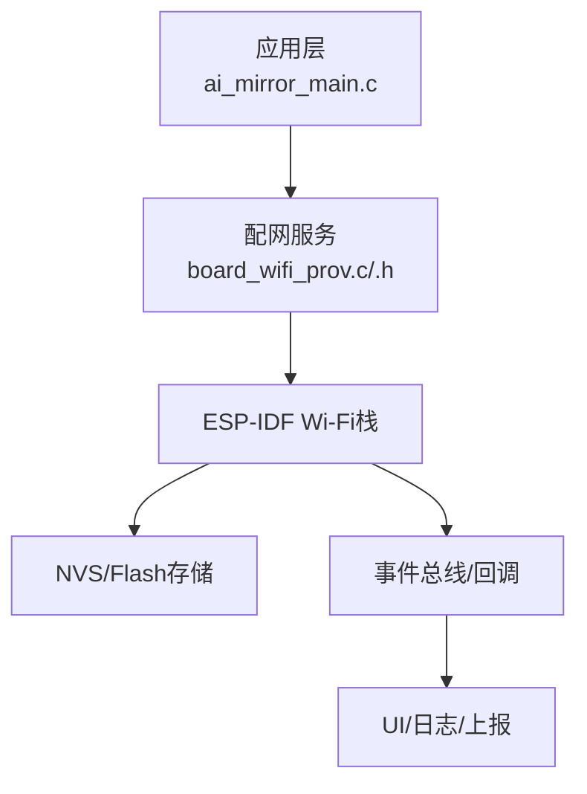
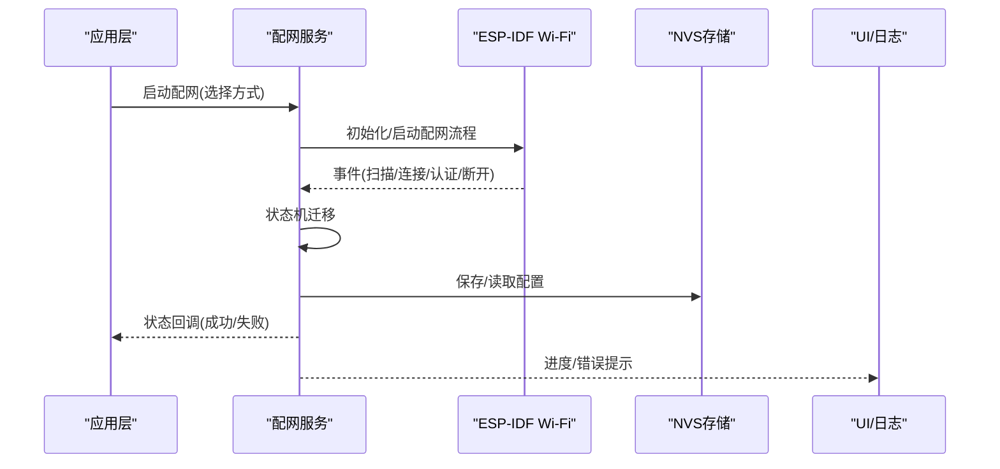
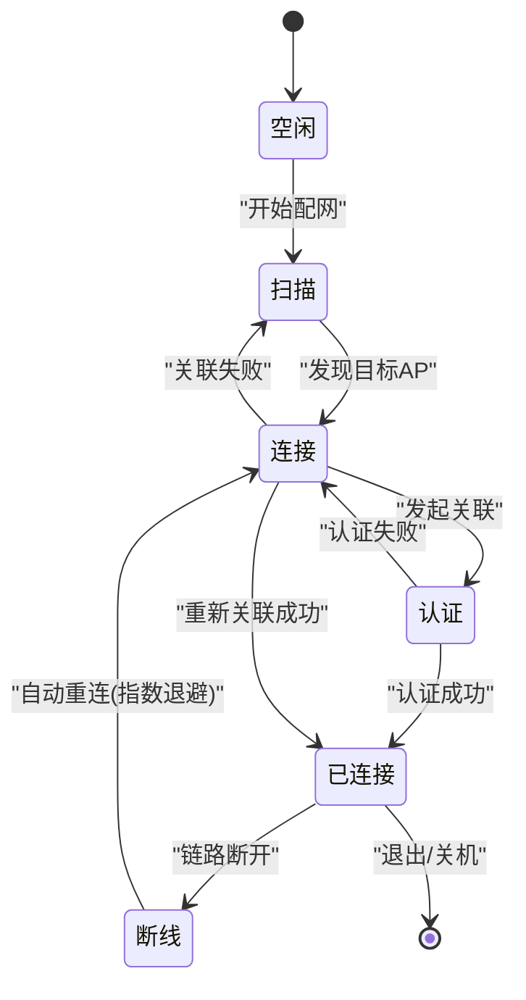
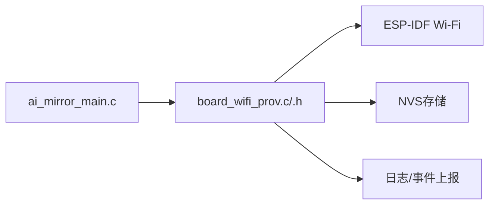

# WiFi连接管理

<cite>
**本文引用的文件**   
- [Firmware/esp32_ai_mirror/main/board_wifi_prov.c](file://Firmware/esp32_ai_mirror/main/board_wifi_prov.c)
- [Firmware/esp32_ai_mirror/main/board_wifi_prov.h](file://Firmware/esp32_ai_mirror/main/board_wifi_prov.h)
- [Firmware/esp32_ai_mirror/main/ai_mirror_main.c](file://Firmware/esp32_ai_mirror/main/ai_mirror_main.c)
- [Firmware/esp32_ai_mirror/WiFi配网功能计划书.md](file://Firmware/esp32_ai_mirror/WiFi配网功能计划书.md)
</cite>

## 目录
1. [简介](#简介)
2. [项目结构](#项目结构)
3. [核心组件](#核心组件)
4. [架构总览](#架构总览)
5. [详细组件分析](#详细组件分析)
6. [依赖关系分析](#依赖关系分析)
7. [性能考虑](#性能考虑)
8. [故障排查指南](#故障排查指南)
9. [结论](#结论)
10. [附录](#附录)

## 简介
本文件面向AI镜子的WiFi连接管理系统，系统性阐述WiFi配网与连接管理的实现思路、状态机设计、配置持久化、监控与恢复机制、安全特性、性能优化策略以及调试方法。文档同时提供扩展接口与自定义配网方式的指导，帮助开发者快速集成与二次开发。

## 项目结构
本项目为ESP32平台上的AI镜子固件，WiFi相关能力集中在main模块的配网组件中，并通过主程序进行事件驱动集成。关键文件包括：
- board_wifi_prov.c/.h：封装配网流程（SmartConfig、AP模式、蓝牙辅助等）与网络事件处理
- ai_mirror_main.c：系统初始化、任务调度与WiFi事件回调注册
- WiFi配网功能计划书.md：配网方案设计与演进规划

图表来源
- [Firmware/esp32_ai_mirror/main/ai_mirror_main.c](file://Firmware/esp32_ai_mirror/main/ai_mirror_main.c)
- [Firmware/esp32_ai_mirror/main/board_wifi_prov.c](file://Firmware/esp32_ai_mirror/main/board_wifi_prov.c)
- [Firmware/esp32_ai_mirror/main/board_wifi_prov.h](file://Firmware/esp32_ai_mirror/main/board_wifi_prov.h)

章节来源
- [Firmware/esp32_ai_mirror/main/board_wifi_prov.c](file://Firmware/esp32_ai_mirror/main/board_wifi_prov.c)
- [Firmware/esp32_ai_mirror/main/board_wifi_prov.h](file://Firmware/esp32_ai_mirror/main/board_wifi_prov.h)
- [Firmware/esp32_ai_mirror/main/ai_mirror_main.c](file://Firmware/esp32_ai_mirror/main/ai_mirror_main.c)
- [Firmware/esp32_ai_mirror/WiFi配网功能计划书.md](file://Firmware/esp32_ai_mirror/WiFi配网功能计划书.md)

## 核心组件
- 配网服务（board_wifi_prov）
  - 负责启动/停止配网流程，支持多种配网方式（SmartConfig、AP模式、蓝牙辅助），并对外暴露统一API
  - 监听Wi-Fi事件（扫描、连接、认证、断开、重连），维护内部状态机
  - 与NVS交互，持久化SSID、密码、服务器地址等配置
- 主程序（ai_mirror_main）
  - 初始化Wi-Fi、事件组、定时器、NVS等子系统
  - 注册Wi-Fi事件回调，协调配网服务与业务逻辑
- 配置文件与计划
  - 通过sdkconfig与Kconfig控制编译选项
  - 使用“WiFi配网功能计划书”定义需求、里程碑与验收标准

章节来源
- [Firmware/esp32_ai_mirror/main/board_wifi_prov.c](file://Firmware/esp32_ai_mirror/main/board_wifi_prov.c)
- [Firmware/esp32_ai_mirror/main/board_wifi_prov.h](file://Firmware/esp32_ai_mirror/main/board_wifi_prov.h)
- [Firmware/esp32_ai_mirror/main/ai_mirror_main.c](file://Firmware/esp32_ai_mirror/main/ai_mirror_main.c)
- [Firmware/esp32_ai_mirror/WiFi配网功能计划书.md](file://Firmware/esp32_ai_mirror/WiFi配网功能计划书.md)

## 架构总览
整体采用“事件驱动 + 状态机”的架构：
- 上层通过统一API触发配网或查询状态
- 底层基于ESP-IDF Wi-Fi事件回调驱动状态机迁移
- 配置读写通过NVS完成，保证断电不丢失
- UI/日志/上报由事件总线分发

图表来源
- [Firmware/esp32_ai_mirror/main/board_wifi_prov.c](file://Firmware/esp32_ai_mirror/main/board_wifi_prov.c)
- [Firmware/esp32_ai_mirror/main/ai_mirror_main.c](file://Firmware/esp32_ai_mirror/main/ai_mirror_main.c)

## 详细组件分析

### 配网服务（board_wifi_prov）
- 职责
  - 提供统一的配网入口与状态查询接口
  - 管理多配网方式的切换与生命周期
  - 维护Wi-Fi连接状态机（空闲、扫描、连接、认证、已连接、断线、重试）
  - 与NVS交互，持久化网络配置
- 关键流程
  - SmartConfig：接收手机APP广播的SSID/密码，自动连接
  - AP模式：设备开启热点，引导用户通过Web或小程序输入SSID/密码
  - 蓝牙辅助：通过BLE通道下发SSID/密码，提升配网成功率
- 状态机设计
  - 事件驱动迁移，包含超时与退避重试
  - 断线检测与自动重连，支持最大重试次数与指数退避
- 配置管理
  - 持久化字段：SSID、密码、服务器地址、端口、证书标志位等
  - 写入前校验，失败回滚，避免脏数据

图表来源
- [Firmware/esp32_ai_mirror/main/board_wifi_prov.c](file://Firmware/esp32_ai_mirror/main/board_wifi_prov.c)
- [Firmware/esp32_ai_mirror/main/board_wifi_prov.h](file://Firmware/esp32_ai_mirror/main/board_wifi_prov.h)

章节来源
- [Firmware/esp32_ai_mirror/main/board_wifi_prov.c](file://Firmware/esp32_ai_mirror/main/board_wifi_prov.c)
- [Firmware/esp32_ai_mirror/main/board_wifi_prov.h](file://Firmware/esp32_ai_mirror/main/board_wifi_prov.h)

### 主程序集成（ai_mirror_main）
- 初始化顺序
  - 初始化NVS、事件组、定时器、日志
  - 初始化Wi-Fi基础能力
  - 初始化配网服务并注册事件回调
- 事件处理
  - 将Wi-Fi事件转发给配网服务
  - 根据状态变更更新UI与业务逻辑
- 资源管理
  - 合理分配内存与任务优先级，避免阻塞
  - 异常路径清理资源，确保可恢复

章节来源
- [Firmware/esp32_ai_mirror/main/ai_mirror_main.c](file://Firmware/esp32_ai_mirror/main/ai_mirror_main.c)

### 配网方式详解
- SmartConfig
  - 适用场景：无屏幕或弱交互设备
  - 优点：无需手动输入，体验简洁
  - 风险：易受干扰，需配合AP模式兜底
- AP模式
  - 适用场景：强交互环境，便于用户确认
  - 优点：可控性强，成功率稳定
  - 注意：热点名称与页面安全性
- 蓝牙辅助
  - 适用场景：手机与设备近距离配对
  - 优点：传输可靠，抗干扰强
  - 注意：BLE栈占用与功耗平衡

章节来源
- [Firmware/esp32_ai_mirror/WiFi配网功能计划书.md](file://Firmware/esp32_ai_mirror/WiFi配网功能计划书.md)

## 依赖关系分析
- 外部依赖
  - ESP-IDF Wi-Fi与事件系统
  - NVS分区用于配置持久化
- 内部耦合
  - 配网服务与主程序通过事件回调解耦
  - 配置读写抽象到独立模块，便于替换存储后端

图表来源
- [Firmware/esp32_ai_mirror/main/ai_mirror_main.c](file://Firmware/esp32_ai_mirror/main/ai_mirror_main.c)
- [Firmware/esp32_ai_mirror/main/board_wifi_prov.c](file://Firmware/esp32_ai_mirror/main/board_wifi_prov.c)
- [Firmware/esp32_ai_mirror/main/board_wifi_prov.h](file://Firmware/esp32_ai_mirror/main/board_wifi_prov.h)

章节来源
- [Firmware/esp32_ai_mirror/main/board_wifi_prov.c](file://Firmware/esp32_ai_mirror/main/board_wifi_prov.c)
- [Firmware/esp32_ai_mirror/main/board_wifi_prov.h](file://Firmware/esp32_ai_mirror/main/board_wifi_prov.h)
- [Firmware/esp32_ai_mirror/main/ai_mirror_main.c](file://Firmware/esp32_ai_mirror/main/ai_mirror_main.c)

## 性能考虑
- 连接速度
  - 优先尝试最近成功连接的AP，减少扫描时间
  - 合理设置扫描间隔与超时阈值
- 数据传输效率
  - 启用TCP/UDP缓冲与拥塞控制
  - 批量发送与合并小包，降低协议开销
- 功耗管理
  - 空闲时进入低功耗模式
  - 动态调整Wi-Fi功率与扫描频率
- 稳定性
  - 指数退避重连，避免雪崩效应
  - 心跳保活与快速断线检测

[本节为通用建议，不直接分析具体文件]

## 故障排查指南
- 常见问题
  - 配网失败：检查信号强度、密码正确性、路由器兼容性
  - 频繁断线：查看信道干扰、DHCP租期、路由表变化
  - 无法获取IP：确认DHCP服务、防火墙规则、MTU设置
- 诊断步骤
  - 抓取Wi-Fi事件日志与NVS配置快照
  - 使用抓包工具定位握手失败阶段
  - 逐步关闭功能（如TLS、MIMO）验证问题范围
- 修复建议
  - 调整重连参数与超时阈值
  - 增加备用AP列表与自动切换
  - 升级固件以适配新路由器特性

章节来源
- [Firmware/esp32_ai_mirror/WiFi配网功能计划书.md](file://Firmware/esp32_ai_mirror/WiFi配网功能计划书.md)

## 结论
本系统以事件驱动与状态机为核心，结合多配网方式与稳健的重连机制，满足AI镜子在复杂网络环境下的稳定连接需求。通过合理的性能优化与安全加固，可在保证用户体验的同时提升可靠性与能效。

[本节为总结性内容，不直接分析具体文件]

## 附录
- 扩展接口建议
  - 新增配网方式：实现统一接口，注册到配网服务管理器
  - 自定义存储后端：替换NVS读写函数，保持接口一致
  - 监控与上报：接入统一遥测框架，输出关键指标
- 安全特性说明
  - WPA2加密：强制启用，禁用不安全协议
  - 证书验证：服务端证书校验，防止中间人攻击
  - 安全启动：固件签名校验，保障启动链可信

[本节为补充信息，不直接分析具体文件]