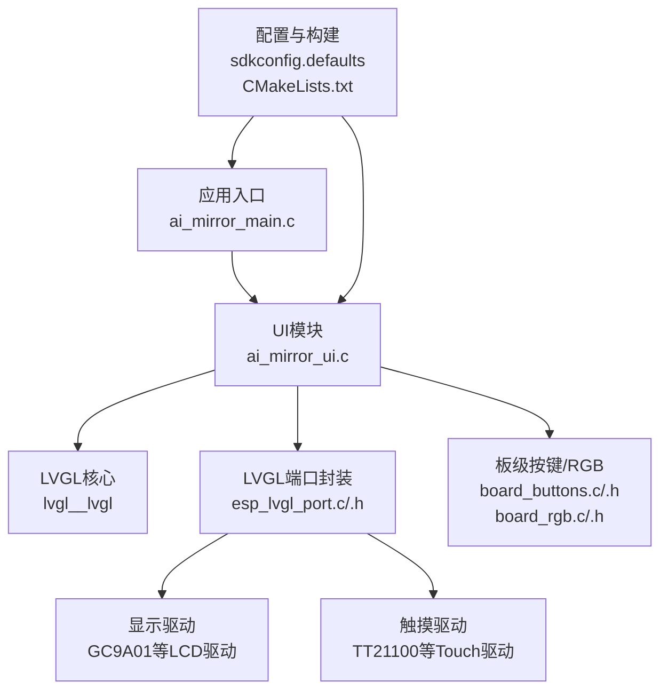
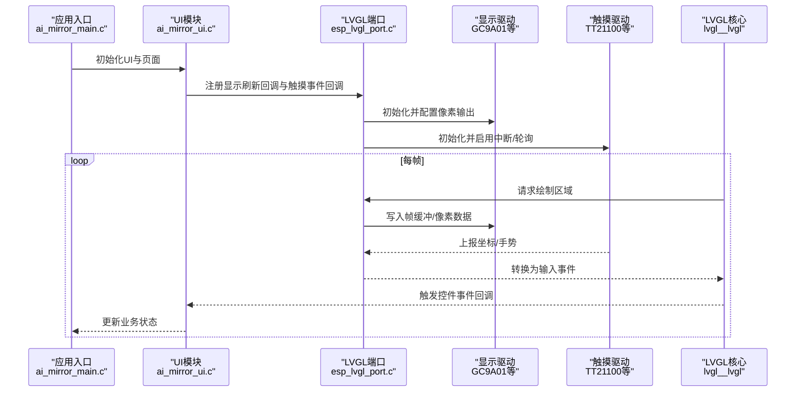
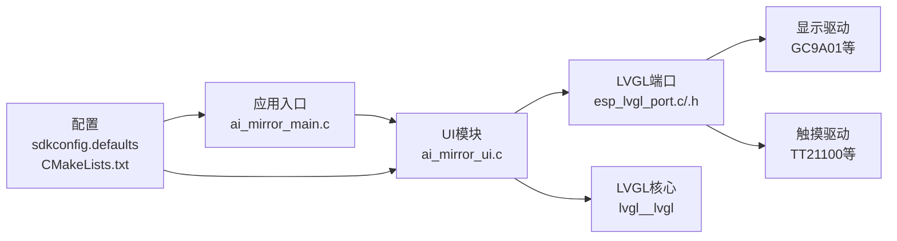

# 图形用户界面

<cite>
**本文引用的文件**   
- [ai_mirror_main.c](file://Firmware/esp32_ai_mirror/main/ai_mirror_main.c)
- [ai_mirror_ui.c](file://Firmware/esp32_ai_mirror/main/ai_mirror_ui.c)
- [board_buttons.c](file://Firmware/esp32_ai_mirror/main/board_buttons.c)
- [board_buttons.h](file://Firmware/esp32_ai_mirror/main/board_buttons.h)
- [board_rgb.c](file://Firmware/esp32_ai_mirror/main/board_rgb.c)
- [board_rgb.h](file://Firmware/esp32_ai_mirror/main/board_rgb.h)
- [esp_lvgl_port.c](file://Firmware/esp32_ai_mirror/managed_components/espressif__esp_lvgl_port/esp_lvgl_port.c)
- [esp_lvgl_port.h](file://Firmware/esp32_ai_mirror/managed_components/espressif__esp_lvgl_port/include/esp_lvgl_port.h)
- [lv_conf_template.h](file://Firmware/esp32_ai_mirror/managed_components/lvgl__lvgl/lv_conf_template.h)
- [sdkconfig.defaults](file://Firmware/esp32_ai_mirror/sdkconfig.defaults)
- [CMakeLists.txt](file://Firmware/esp32_ai_mirror/CMakeLists.txt)
- [README.md](file://README.md)
</cite>

## 目录
1. [简介](#简介)
2. [项目结构](#项目结构)
3. [核心组件](#核心组件)
4. [架构总览](#架构总览)
5. [详细组件分析](#详细组件分析)
6. [依赖关系分析](#依赖关系分析)
7. [性能考虑](#性能考虑)
8. [故障排查指南](#故障排查指南)
9. [结论](#结论)
10. [附录](#附录)

## 简介
本文件面向AI镜子的图形用户界面系统，围绕基于LVGL的UI框架实现进行系统化说明。内容涵盖显示驱动、触摸输入、动画效果、界面布局（主界面、设置页、状态显示）、UI组件定制与事件处理、屏幕旋转与分辨率适配、色彩深度优化、主题系统与样式管理、UI与业务逻辑解耦的事件驱动架构，以及开发最佳实践、性能优化建议、测试调试方法与扩展指导。目标是帮助开发者快速理解并高效扩展该项目的UI子系统。

## 项目结构
本项目采用ESP-IDF工程组织方式，UI相关代码集中在main目录下，LVGL及其端口封装位于managed_components中。关键入口与UI初始化由应用层主控与UI模块负责，底层显示与触摸通过ESP-LVGL-Port桥接至LVGL。

图表来源
- [ai_mirror_main.c](file://Firmware/esp32_ai_mirror/main/ai_mirror_main.c)
- [ai_mirror_ui.c](file://Firmware/esp32_ai_mirror/main/ai_mirror_ui.c)
- [esp_lvgl_port.c](file://Firmware/esp32_ai_mirror/managed_components/espressif__esp_lvgl_port/esp_lvgl_port.c)
- [esp_lvgl_port.h](file://Firmware/esp32_ai_mirror/managed_components/espressif__esp_lvgl_port/include/esp_lvgl_port.h)
- [lv_conf_template.h](file://Firmware/esp32_ai_mirror/managed_components/lvgl__lvgl/lv_conf_template.h)
- [sdkconfig.defaults](file://Firmware/esp32_ai_mirror/sdkconfig.defaults)
- [CMakeLists.txt](file://Firmware/esp32_ai_mirror/CMakeLists.txt)

章节来源
- [README.md](file://README.md)
- [CMakeLists.txt](file://Firmware/esp32_ai_mirror/CMakeLists.txt)
- [sdkconfig.defaults](file://Firmware/esp32_ai_mirror/sdkconfig.defaults)

## 核心组件
- UI主控与页面管理：负责创建和管理主界面、设置页、状态显示等页面，协调事件与动画。
- LVGL端口集成：将ESP-IDF的显示与触摸抽象为LVGL所需的刷新回调与输入事件。
- 显示驱动：对接具体LCD控制器（如GC9A01），完成像素写入与帧缓冲管理。
- 触摸输入：对接触控IC（如TT21100），上报坐标与手势事件。
- 板级外设交互：按键与RGB指示灯用于辅助交互与状态反馈。
- 配置与构建：通过sdkconfig与CMake控制LVGL特性、颜色深度、缓冲区大小、任务栈等。

章节来源
- [ai_mirror_ui.c](file://Firmware/esp32_ai_mirror/main/ai_mirror_ui.c)
- [esp_lvgl_port.c](file://Firmware/esp32_ai_mirror/managed_components/espressif__esp_lvgl_port/esp_lvgl_port.c)
- [esp_lvgl_port.h](file://Firmware/esp32_ai_mirror/managed_components/espressif__esp_lvgl_port/include/esp_lvgl_port.h)
- [board_buttons.c](file://Firmware/esp32_ai_mirror/main/board_buttons.c)
- [board_rgb.c](file://Firmware/esp32_ai_mirror/main/board_rgb.c)

## 架构总览
下图展示从应用入口到LVGL渲染与输入事件的完整链路，强调UI与业务逻辑的解耦及事件驱动模式。

图表来源
- [ai_mirror_main.c](file://Firmware/esp32_ai_mirror/main/ai_mirror_main.c)
- [ai_mirror_ui.c](file://Firmware/esp32_ai_mirror/main/ai_mirror_ui.c)
- [esp_lvgl_port.c](file://Firmware/esp32_ai_mirror/managed_components/espressif__esp_lvgl_port/esp_lvgl_port.c)
- [esp_lvgl_port.h](file://Firmware/esp32_ai_mirror/managed_components/espressif__esp_lvgl_port/include/esp_lvgl_port.h)

## 详细组件分析

### UI模块与页面管理（ai_mirror_ui.c）
- 职责：创建与管理主界面、设置页、状态显示；维护页面切换逻辑；绑定按钮、标签、进度条、图像等控件事件；驱动动画与过渡效果。
- 设计要点：
  - 页面作为独立对象或组，便于复用与切换。
  - 事件回调统一派发，避免在回调中执行耗时操作。
  - 使用LVGL动画API实现平滑过渡与动态反馈。
- 扩展建议：新增页面时遵循“创建-注册-切换”流程，保持事件处理函数单一职责。

章节来源
- [ai_mirror_ui.c](file://Firmware/esp32_ai_mirror/main/ai_mirror_ui.c)

### LVGL端口集成（esp_lvgl_port.c/.h）
- 职责：封装ESP-IDF显示与触摸接口，提供LVGL所需的刷新回调与输入事件上报；管理帧缓冲与DMA传输（若可用）。
- 关键点：
  - 刷新回调需保证线程安全与最小化拷贝。
  - 触摸事件应去抖与坐标映射，支持旋转后的坐标变换。
  - 合理配置缓冲区数量与大小以平衡内存与刷新性能。
- 优化方向：
  - 使用部分刷新与脏矩形减少带宽。
  - 启用硬件加速或DMA路径以降低CPU占用。

章节来源
- [esp_lvgl_port.c](file://Firmware/esp32_ai_mirror/managed_components/espressif__esp_lvgl_port/esp_lvgl_port.c)
- [esp_lvgl_port.h](file://Firmware/esp32_ai_mirror/managed_components/espressif__esp_lvgl_port/include/esp_lvgl_port.h)

### 显示驱动与配置（GC9A01等）
- 职责：初始化LCD控制器、设置分辨率、色彩深度、扫描方向、内存访问顺序等。
- 适配要点：
  - 根据屏幕规格调整初始化序列与参数。
  - 确保帧缓冲格式与LVGL一致（如RGB565/RGB888）。
  - 处理屏幕旋转时的坐标与行序变化。
- 常见问题：花屏、错位、闪烁通常源于初始化参数或刷新回调时序不当。

章节来源
- [lv_conf_template.h](file://Firmware/esp32_ai_mirror/managed_components/lvgl__lvgl/lv_conf_template.h)
- [sdkconfig.defaults](file://Firmware/esp32_ai_mirror/sdkconfig.defaults)

### 触摸输入（TT21100等）
- 职责：读取触控坐标、多点触控、手势识别；上报至LVGL输入子系统。
- 注意事项：
  - 坐标映射需考虑屏幕旋转与镜像。
  - 过滤抖动与误触，提升交互稳定性。
  - 与UI事件循环解耦，避免阻塞。

章节来源
- [esp_lvgl_port.c](file://Firmware/esp32_ai_mirror/managed_components/espressif__esp_lvgl_port/esp_lvgl_port.c)

### 板级按键与RGB（board_buttons.c/.h, board_rgb.c/.h）
- 按键：用于快捷操作（如返回、确认、音量调节），可映射为LVGL输入事件或直接触发业务逻辑。
- RGB：用于状态指示（连接、运行、错误），与UI状态同步，增强用户体验。

章节来源
- [board_buttons.c](file://Firmware/esp32_ai_mirror/main/board_buttons.c)
- [board_buttons.h](file://Firmware/esp32_ai_mirror/main/board_buttons.h)
- [board_rgb.c](file://Firmware/esp32_ai_mirror/main/board_rgb.c)
- [board_rgb.h](file://Firmware/esp32_ai_mirror/main/board_rgb.h)

### 应用入口与生命周期（ai_mirror_main.c）
- 职责：系统初始化、任务创建、UI启动、事件循环调度。
- 关键点：
  - 先初始化显示与触摸，再启动LVGL与UI。
  - 将UI事件与业务逻辑分离，通过消息队列或回调传递。
  - 合理分配任务优先级与栈大小，避免卡顿与溢出。

章节来源
- [ai_mirror_main.c](file://Firmware/esp32_ai_mirror/main/ai_mirror_main.c)

### 界面布局与交互逻辑
- 主界面：展示核心信息（时间、天气、对话状态），包含导航按钮与状态指示。
- 设置页：参数配置（亮度、音量、网络），保存后即时生效。
- 状态显示：加载、错误、提示等临时状态，支持自动消失与手动关闭。
- 交互原则：
  - 控件层次清晰，焦点与Tab顺序合理。
  - 动画时长与缓动曲线一致，提升一致性体验。
  - 错误提示明确，提供回退路径。

章节来源
- [ai_mirror_ui.c](file://Firmware/esp32_ai_mirror/main/ai_mirror_ui.c)

### 主题系统与样式定制
- 字体：集中管理字体资源，按需加载，避免重复加载。
- 颜色：定义主题色板，统一全局配色，支持明暗主题切换。
- 边框与阴影：通过LVGL样式API统一设置，保持视觉一致性。
- 最佳实践：
  - 使用样式继承与覆盖机制，减少重复代码。
  - 将样式与页面逻辑解耦，便于替换与扩展。

章节来源
- [lv_conf_template.h](file://Firmware/esp32_ai_mirror/managed_components/lvgl__lvgl/lv_conf_template.h)
- [ai_mirror_ui.c](file://Firmware/esp32_ai_mirror/main/ai_mirror_ui.c)

### 屏幕旋转与分辨率适配
- 旋转：通过LVGL与显示驱动协同设置旋转角度，确保坐标映射正确。
- 分辨率：根据屏幕实际分辨率配置LVGL画布尺寸与缩放比例。
- 色彩深度：选择合适色彩深度（如RGB565）以平衡画质与内存。

章节来源
- [lv_conf_template.h](file://Firmware/esp32_ai_mirror/managed_components/lvgl__lvgl/lv_conf_template.h)
- [sdkconfig.defaults](file://Firmware/esp32_ai_mirror/sdkconfig.defaults)

### UI与业务逻辑解耦与事件驱动
- 事件模型：UI事件（点击、滑动、长按）经端口转发至LVGL，再由UI模块分发到业务回调。
- 解耦策略：
  - 业务逻辑不直接操作UI，仅响应事件或订阅状态变更。
  - 使用消息队列或信号量同步异步任务。
- 优势：提高可测试性与可维护性，降低耦合度。

章节来源
- [ai_mirror_main.c](file://Firmware/esp32_ai_mirror/main/ai_mirror_main.c)
- [ai_mirror_ui.c](file://Firmware/esp32_ai_mirror/main/ai_mirror_ui.c)
- [esp_lvgl_port.c](file://Firmware/esp32_ai_mirror/managed_components/espressif__esp_lvgl_port/esp_lvgl_port.c)

### 动画效果与过渡
- 类型：淡入淡出、滑入滑出、缩放、旋转等。
- 实现：使用LVGL动画API，结合缓动曲线与时长控制。
- 建议：动画不应阻塞事件循环，必要时拆分任务或使用定时器。

章节来源
- [ai_mirror_ui.c](file://Firmware/esp32_ai_mirror/main/ai_mirror_ui.c)

### UI组件定制与事件处理
- 常用控件：按钮、标签、进度条、图像、列表、开关等。
- 定制方法：通过LVGL样式API修改外观，或通过派生控件扩展行为。
- 事件处理：注册回调函数，处理点击、释放、滚动、聚焦等事件。

章节来源
- [ai_mirror_ui.c](file://Firmware/esp32_ai_mirror/main/ai_mirror_ui.c)

### 开发最佳实践
- 模块化：按功能划分UI模块，保持高内聚低耦合。
- 资源管理：集中管理图片、字体等资源，避免重复加载。
- 性能优先：减少重绘区域，使用缓存与懒加载。
- 可测试性：为UI事件编写单元测试与集成测试用例。

[本节为通用指导，无需特定文件来源]

### 性能优化建议
- 刷新优化：启用部分刷新、脏矩形、双缓冲。
- 内存优化：减小帧缓冲、压缩图片、按需加载字体。
- CPU优化：避免在回调中执行耗时操作，使用后台任务。
- 功耗优化：在无交互时降低刷新频率与亮度。

[本节为通用指导，无需特定文件来源]

### 界面测试方法与调试技巧
- 自动化测试：模拟触摸事件，验证页面跳转与状态更新。
- 日志调试：在关键路径添加日志，定位问题。
- 性能分析：使用ESP-IDF性能工具监控CPU与内存。
- 可视化调试：开启LVGL调试选项，观察绘制区域与事件流。

章节来源
- [ai_mirror_main.c](file://Firmware/esp32_ai_mirror/main/ai_mirror_main.c)
- [ai_mirror_ui.c](file://Firmware/esp32_ai_mirror/main/ai_mirror_ui.c)

### UI扩展与自定义界面指导
- 新增页面：复制现有页面模板，修改内容与事件。
- 自定义控件：基于LVGL基础控件派生，封装业务逻辑。
- 主题扩展：在主题文件中新增样式，保持命名规范。
- 版本兼容：注意LVGL API版本差异，做好条件编译。

章节来源
- [ai_mirror_ui.c](file://Firmware/esp32_ai_mirror/main/ai_mirror_ui.c)
- [lv_conf_template.h](file://Firmware/esp32_ai_mirror/managed_components/lvgl__lvgl/lv_conf_template.h)

## 依赖关系分析
下图展示UI模块与LVGL端口、显示/触摸驱动之间的依赖关系。

图表来源
- [ai_mirror_main.c](file://Firmware/esp32_ai_mirror/main/ai_mirror_main.c)
- [ai_mirror_ui.c](file://Firmware/esp32_ai_mirror/main/ai_mirror_ui.c)
- [esp_lvgl_port.c](file://Firmware/esp32_ai_mirror/managed_components/espressif__esp_lvgl_port/esp_lvgl_port.c)
- [esp_lvgl_port.h](file://Firmware/esp32_ai_mirror/managed_components/espressif__esp_lvgl_port/include/esp_lvgl_port.h)
- [sdkconfig.defaults](file://Firmware/esp32_ai_mirror/sdkconfig.defaults)
- [CMakeLists.txt](file://Firmware/esp32_ai_mirror/CMakeLists.txt)

章节来源
- [CMakeLists.txt](file://Firmware/esp32_ai_mirror/CMakeLists.txt)
- [sdkconfig.defaults](file://Firmware/esp32_ai_mirror/sdkconfig.defaults)

## 性能考虑
- 刷新策略：优先使用部分刷新与脏矩形，减少总线负载。
- 内存管理：合理配置帧缓冲数量与大小，避免频繁分配。
- 动画与事件：避免阻塞式动画，使用非阻塞定时器与任务。
- 资源优化：压缩图片、按需加载字体，减少Flash与RAM占用。
- 功耗管理：在无交互时降低刷新率与背光亮度。

[本节为通用指导，无需特定文件来源]

## 故障排查指南
- 显示异常：检查LCD初始化序列、色彩深度、刷新回调是否正确。
- 触摸失灵：确认触摸驱动初始化、坐标映射、事件上报是否有效。
- 卡顿掉帧：分析刷新区域大小、动画复杂度、回调耗时。
- 内存不足：检查帧缓冲、图片资源、字体加载策略。
- 调试手段：启用LVGL调试选项、添加关键日志、使用性能分析工具。

章节来源
- [ai_mirror_main.c](file://Firmware/esp32_ai_mirror/main/ai_mirror_main.c)
- [ai_mirror_ui.c](file://Firmware/esp32_ai_mirror/main/ai_mirror_ui.c)
- [esp_lvgl_port.c](file://Firmware/esp32_ai_mirror/managed_components/espressif__esp_lvgl_port/esp_lvgl_port.c)

## 结论
本文件系统性地梳理了AI镜子UI子系统的架构、组件与实现细节，强调了UI与业务逻辑解耦、事件驱动与性能优化的重要性。通过合理的配置与良好的开发实践，可在有限资源下实现流畅、美观且易扩展的用户界面。

[本节为总结性内容，无需特定文件来源]

## 附录
- 术语表：LVGL、ESP-IDF、GC9A01、TT21100等。
- 参考链接：LVGL官方文档、ESP-LVGL-Port文档、ESP-IDF显示与触摸驱动指南。
- 示例工程：LVGL demos与ESP-LVGL-Port示例，便于学习与对比。

[本节为补充信息，无需特定文件来源]