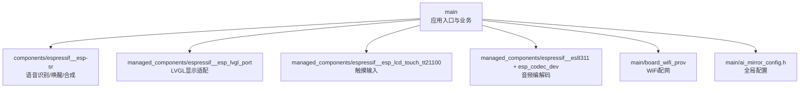
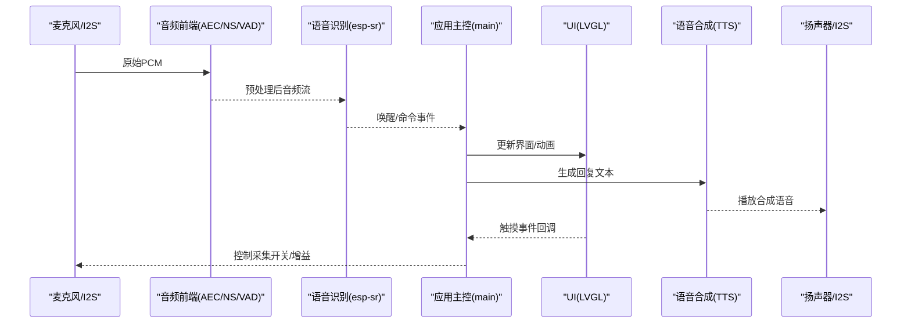
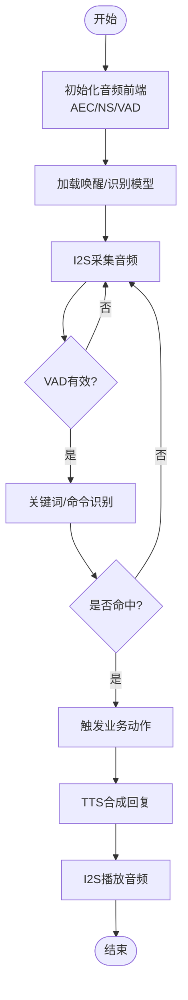
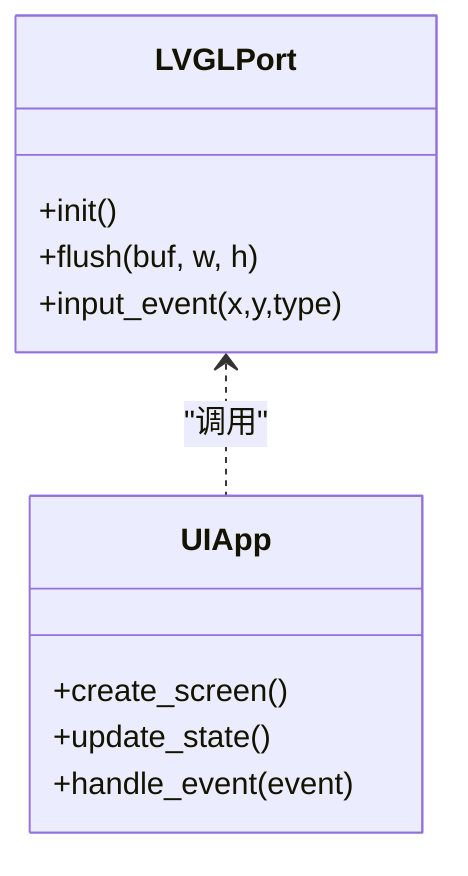
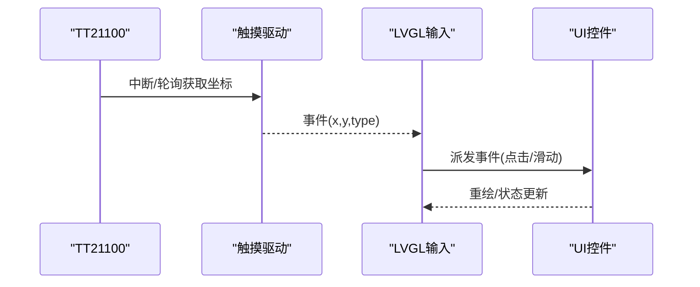
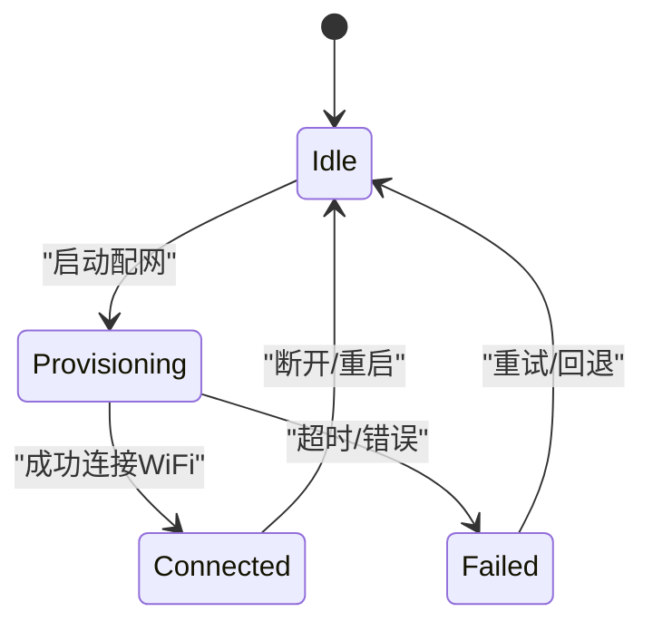
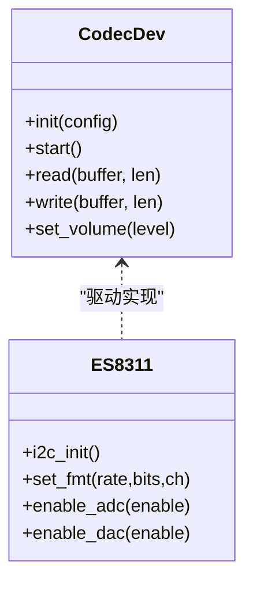
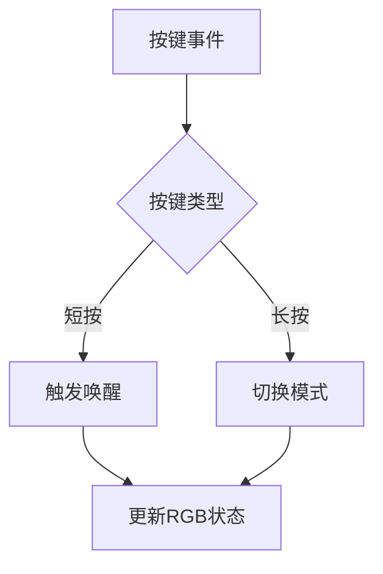
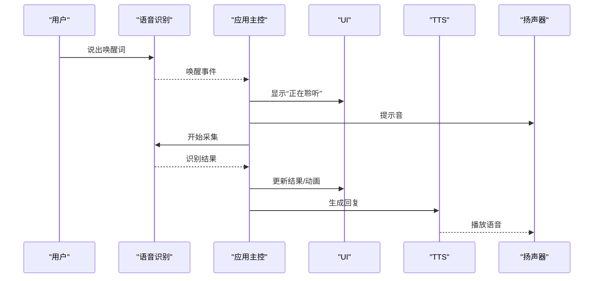
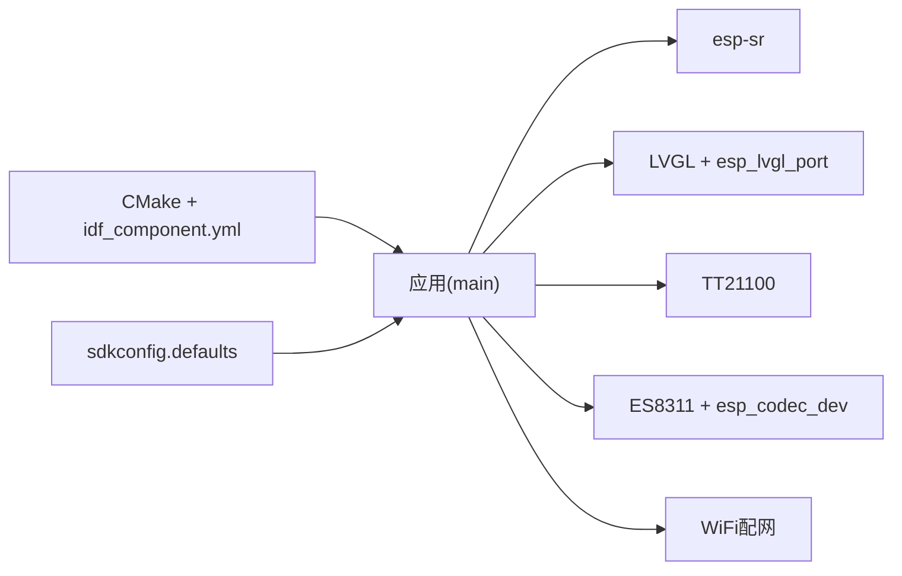

# 核心功能

<cite>
**本文引用的文件**   
- [ai_mirror_main.c](file://Firmware/esp32_ai_mirror/main/ai_mirror_main.c)
- [ai_mirror_ui.c](file://Firmware/esp32_ai_mirror/main/ai_mirror_ui.c)
- [board_buttons.c](file://Firmware/esp32_ai_mirror/main/board_buttons.c)
- [board_buttons.h](file://Firmware/esp32_ai_mirror/main/board_buttons.h)
- [board_rgb.c](file://Firmware/esp32_ai_mirror/main/board_rgb.c)
- [board_rgb.h](file://Firmware/esp32_ai_mirror/main/board_rgb.h)
- [board_wifi_prov.c](file://Firmware/esp32_ai_mirror/main/board_wifi_prov.c)
- [board_wifi_prov.h](file://Firmware/esp32_ai_mirror/main/board_wifi_prov.h)
- [ai_mirror_config.h](file://Firmware/esp32_ai_mirror/main/ai_mirror_config.h)
- [CMakeLists.txt](file://Firmware/esp32_ai_mirror/CMakeLists.txt)
- [sdkconfig.defaults](file://Firmware/esp32_ai_mirror/sdkconfig.defaults)
- [README.md](file://Firmware/esp32_ai_mirror/README.md)
- [idf_component.yml](file://Firmware/esp32_ai_mirror/main/idf_component.yml)
- [esp_lvgl_port.c](file://Firmware/esp32_ai_mirror/managed_components/espressif__esp_lvgl_port/esp_lvgl_port.c)
- [esp_lcd_touch_tt21100.c](file://Firmware/esp32_ai_mirror/managed_components/espressif__esp_lcd_touch_tt21100/esp_lcd_touch_tt21100.c)
- [es8311.c](file://Firmware/esp32_ai_mirror/managed_components/espressif__es8311/es8311.c)
- [esp_codec_dev.c](file://Firmware/esp32_ai_mirror/managed_components/espressif__esp_codec_dev/esp_codec_dev.c)
- [esp_afe_sr_1mic.ref](file://Firmware/esp32_ai_mirror/components/espressif__esp-sr/src/esp_afe_sr_1mic.ref)
- [esp_mn_speech_commands.c](file://Firmware/esp32_ai_mirror/components/espressif__esp-sr/src/esp_mn_speech_commands.c)
- [movemodel.py](file://Firmware/esp32_ai_mirror/components/espressif__esp-sr/model/movemodel.py)
- [pack_model.py](file://Firmware/esp32_ai_mirror/components/espressif__esp-sr/model/pack_model.py)
</cite>

## 目录
1. [简介](#简介)
2. [项目结构](#项目结构)
3. [核心组件](#核心组件)
4. [架构总览](#架构总览)
5. [详细组件分析](#详细组件分析)
6. [依赖关系分析](#依赖关系分析)
7. [性能考量](#性能考量)
8. [故障排查指南](#故障排查指南)
9. [结论](#结论)
10. [附录](#附录)

## 简介
本文件为AI镜子项目的“核心功能”文档，聚焦以下关键能力：语音识别与合成、图形用户界面（LVGL）、触摸交互、WiFi配网管理、音频处理与前端增强。文档从系统架构、数据流与控制流、状态管理与事件机制、配置与扩展点、性能优化与用户体验策略等方面展开，帮助开发者快速理解并集成调试。

## 项目结构
本项目基于ESP-IDF构建，采用分层组织：
- main：应用层逻辑（主循环、UI、按键、RGB、WiFi配网、配置）
- components：第三方或自研组件（esp-sr语音套件、LCD驱动等）
- managed_components：ESP官方组件（LVGL端口、触摸、编解码器、DSP等）
- 构建与配置：CMakeLists、sdkconfig.defaults、分区表等

图表来源
- [CMakeLists.txt:1-200](file://Firmware/esp32_ai_mirror/CMakeLists.txt#L1-L200)
- [idf_component.yml:1-200](file://Firmware/esp32_ai_mirror/main/idf_component.yml#L1-L200)

章节来源
- [CMakeLists.txt:1-200](file://Firmware/esp32_ai_mirror/CMakeLists.txt#L1-L200)
- [idf_component.yml:1-200](file://Firmware/esp32_ai_mirror/main/idf_component.yml#L1-L200)

## 核心组件
- 语音识别与合成（esp-sr）
  - 关键词唤醒、命令识别、TTS合成
  - 通过AEC/NS/VAD等前端增强提升鲁棒性
- 图形用户界面（LVGL）
  - 基于LVGL的UI框架，配合esp_lvgl_port进行底层适配
- 触摸交互（TT21100）
  - I2C驱动的电容屏触摸，提供坐标与手势事件
- WiFi配网（SmartConfig/SoftAP+Web）
  - 板级封装，提供便捷配网流程
- 音频处理（ES8311 + esp_codec_dev）
  - I2S音频采集/播放，音量控制，采样率/位深配置

章节来源
- [esp_mn_speech_commands.c:1-200](file://Firmware/esp32_ai_mirror/components/espressif__esp-sr/src/esp_mn_speech_commands.c#L1-L200)
- [esp_afe_sr_1mic.ref:1-200](file://Firmware/esp32_ai_mirror/components/espressif__esp-sr/src/esp_afe_sr_1mic.ref#L1-L200)
- [esp_lvgl_port.c:1-200](file://Firmware/esp32_ai_mirror/managed_components/espressif__esp_lvgl_port/esp_lvgl_port.c#L1-L200)
- [esp_lcd_touch_tt21100.c:1-200](file://Firmware/esp32_ai_mirror/managed_components/espressif__esp_lcd_touch_tt21100/esp_lcd_touch_tt21100.c#L1-L200)
- [es8311.c:1-200](file://Firmware/esp32_ai_mirror/managed_components/espressif__es8311/es8311.c#L1-L200)
- [esp_codec_dev.c:1-200](file://Firmware/esp32_ai_mirror/managed_components/espressif__esp_codec_dev/esp_codec_dev.c#L1-L200)

## 架构总览
整体采用“事件驱动 + 任务并行”的嵌入式架构：
- 音频采集线程：I2S读取麦克风数据，经AEC/NS/VAD处理后送入语音识别
- 语音处理线程：关键词检测与命令识别，触发业务动作
- UI渲染线程：LVGL刷新显示，响应触摸事件
- WiFi配网任务：后台连接网络，提供热点/二维码等方式
- 主控调度：主循环协调各模块状态机与事件分发

图表来源
- [ai_mirror_main.c:1-300](file://Firmware/esp32_ai_mirror/main/ai_mirror_main.c#L1-L300)
- [esp_mn_speech_commands.c:1-200](file://Firmware/esp32_ai_mirror/components/espressif__esp-sr/src/esp_mn_speech_commands.c#L1-L200)
- [esp_lvgl_port.c:1-200](file://Firmware/esp32_ai_mirror/managed_components/espressif__esp_lvgl_port/esp_lvgl_port.c#L1-L200)
- [es8311.c:1-200](file://Firmware/esp32_ai_mirror/managed_components/espressif__es8311/es8311.c#L1-L200)

## 详细组件分析

### 语音识别与合成（esp-sr）
- 关键词唤醒：加载Wakenet模型，实时检测唤醒词，输出唤醒事件
- 命令识别：Multinet模型将语音转为文本命令，支持多语言
- TTS合成：中文语音合成库，按文本生成PCM流播放
- 音频前端：AEC回声消除、NS噪声抑制、VAD静音检测，降低误触

图表来源
- [esp_mn_speech_commands.c:1-200](file://Firmware/esp32_ai_mirror/components/espressif__esp-sr/src/esp_mn_speech_commands.c#L1-L200)
- [esp_afe_sr_1mic.ref:1-200](file://Firmware/esp32_ai_mirror/components/espressif__esp-sr/src/esp_afe_sr_1mic.ref#L1-L200)
- [movemodel.py:1-200](file://Firmware/esp32_ai_mirror/components/espressif__esp-sr/model/movemodel.py#L1-L200)
- [pack_model.py:1-200](file://Firmware/esp32_ai_mirror/components/espressif__esp-sr/model/pack_model.py#L1-L200)

章节来源
- [esp_mn_speech_commands.c:1-200](file://Firmware/esp32_ai_mirror/components/espressif__esp-sr/src/esp_mn_speech_commands.c#L1-L200)
- [esp_afe_sr_1mic.ref:1-200](file://Firmware/esp32_ai_mirror/components/espressif__esp-sr/src/esp_afe_sr_1mic.ref#L1-L200)
- [movemodel.py:1-200](file://Firmware/esp32_ai_mirror/components/espressif__esp-sr/model/movemodel.py#L1-L200)
- [pack_model.py:1-200](file://Firmware/esp32_ai_mirror/components/espressif__esp-sr/model/pack_model.py#L1-L200)

### 图形用户界面（LVGL）
- 使用LVGL作为UI框架，esp_lvgl_port负责与底层显示驱动对接
- 支持页面切换、控件绘制、动画效果
- 与触摸事件联动，实现点击、滑动等交互

图表来源
- [esp_lvgl_port.c:1-200](file://Firmware/esp32_ai_mirror/managed_components/espressif__esp_lvgl_port/esp_lvgl_port.c#L1-L200)
- [ai_mirror_ui.c:1-200](file://Firmware/esp32_ai_mirror/main/ai_mirror_ui.c#L1-L200)

章节来源
- [esp_lvgl_port.c:1-200](file://Firmware/esp32_ai_mirror/managed_components/espressif__esp_lvgl_port/esp_lvgl_port.c#L1-L200)
- [ai_mirror_ui.c:1-200](file://Firmware/esp32_ai_mirror/main/ai_mirror_ui.c#L1-L200)

### 触摸交互（TT21100）
- 通过I2C与MCU通信，上报触摸坐标与事件类型
- 与LVGL输入层集成，将触摸转换为UI事件

图表来源
- [esp_lcd_touch_tt21100.c:1-200](file://Firmware/esp32_ai_mirror/managed_components/espressif__esp_lcd_touch_tt21100/esp_lcd_touch_tt21100.c#L1-L200)
- [esp_lvgl_port.c:1-200](file://Firmware/esp32_ai_mirror/managed_components/espressif__esp_lvgl_port/esp_lvgl_port.c#L1-L200)

章节来源
- [esp_lcd_touch_tt21100.c:1-200](file://Firmware/esp32_ai_mirror/managed_components/espressif__esp_lcd_touch_tt21100/esp_lcd_touch_tt21100.c#L1-L200)
- [esp_lvgl_port.c:1-200](file://Firmware/esp32_ai_mirror/managed_components/espressif__esp_lvgl_port/esp_lvgl_port.c#L1-L200)

### WiFi连接管理
- 提供SmartConfig/SoftAP+Web等多种配网方式
- 与系统状态机联动，在联网成功后执行云端交互或OTA

图表来源
- [board_wifi_prov.c:1-200](file://Firmware/esp32_ai_mirror/main/board_wifi_prov.c#L1-L200)
- [board_wifi_prov.h:1-200](file://Firmware/esp32_ai_mirror/main/board_wifi_prov.h#L1-L200)

章节来源
- [board_wifi_prov.c:1-200](file://Firmware/esp32_ai_mirror/main/board_wifi_prov.c#L1-L200)
- [board_wifi_prov.h:1-200](file://Firmware/esp32_ai_mirror/main/board_wifi_prov.h#L1-L200)

### 音频处理（ES8311 + esp_codec_dev）
- ES8311作为Codec芯片，通过I2S传输PCM数据
- esp_codec_dev统一接口管理ADC/DAC、音量、采样率等

图表来源
- [esp_codec_dev.c:1-200](file://Firmware/esp32_ai_mirror/managed_components/espressif__esp_codec_dev/esp_codec_dev.c#L1-L200)
- [es8311.c:1-200](file://Firmware/esp32_ai_mirror/managed_components/espressif__es8311/es8311.c#L1-L200)

章节来源
- [esp_codec_dev.c:1-200](file://Firmware/esp32_ai_mirror/managed_components/espressif__esp_codec_dev/esp_codec_dev.c#L1-L200)
- [es8311.c:1-200](file://Firmware/esp32_ai_mirror/managed_components/espressif__es8311/es8311.c#L1-L200)

### 按键与RGB指示
- 板载按键用于快捷操作（如唤醒、确认）
- RGB指示灯反馈系统状态（待机、识别中、播放中、错误）

图表来源
- [board_buttons.c:1-200](file://Firmware/esp32_ai_mirror/main/board_buttons.c#L1-L200)
- [board_buttons.h:1-200](file://Firmware/esp32_ai_mirror/main/board_buttons.h#L1-L200)
- [board_rgb.c:1-200](file://Firmware/esp32_ai_mirror/main/board_rgb.c#L1-L200)
- [board_rgb.h:1-200](file://Firmware/esp32_ai_mirror/main/board_rgb.h#L1-L200)

章节来源
- [board_buttons.c:1-200](file://Firmware/esp32_ai_mirror/main/board_buttons.c#L1-L200)
- [board_buttons.h:1-200](file://Firmware/esp32_ai_mirror/main/board_buttons.h#L1-L200)
- [board_rgb.c:1-200](file://Firmware/esp32_ai_mirror/main/board_rgb.c#L1-L200)
- [board_rgb.h:1-200](file://Firmware/esp32_ai_mirror/main/board_rgb.h#L1-L200)

### 用户交互流程（从语音唤醒到响应反馈）
- 唤醒：关键词检测成功，进入对话状态
- 采集：开启I2S采集，VAD判断有效语音段
- 识别：命令识别返回意图，触发对应业务
- 反馈：UI更新状态，TTS播放回复，RGB指示变化

图表来源
- [ai_mirror_main.c:1-300](file://Firmware/esp32_ai_mirror/main/ai_mirror_main.c#L1-L300)
- [esp_mn_speech_commands.c:1-200](file://Firmware/esp32_ai_mirror/components/espressif__esp-sr/src/esp_mn_speech_commands.c#L1-L200)
- [esp_lvgl_port.c:1-200](file://Firmware/esp32_ai_mirror/managed_components/espressif__esp_lvgl_port/esp_lvgl_port.c#L1-L200)
- [es8311.c:1-200](file://Firmware/esp32_ai_mirror/managed_components/espressif__es8311/es8311.c#L1-L200)

章节来源
- [ai_mirror_main.c:1-300](file://Firmware/esp32_ai_mirror/main/ai_mirror_main.c#L1-L300)
- [esp_mn_speech_commands.c:1-200](file://Firmware/esp32_ai_mirror/components/espressif__esp-sr/src/esp_mn_speech_commands.c#L1-L200)
- [esp_lvgl_port.c:1-200](file://Firmware/esp32_ai_mirror/managed_components/espressif__esp_lvgl_port/esp_lvgl_port.c#L1-L200)
- [es8311.c:1-200](file://Firmware/esp32_ai_mirror/managed_components/espressif__es8311/es8311.c#L1-L200)

## 依赖关系分析
- 应用层依赖：
  - esp-sr（语音识别/合成）
  - LVGL与esp_lvgl_port（UI）
  - TT21100触摸驱动（输入）
  - ES8311与esp_codec_dev（音频）
  - WiFi配网模块（网络）
- 构建依赖：
  - CMakeLists与idf_component.yml声明组件与版本
  - sdkconfig.defaults提供默认配置项

图表来源
- [CMakeLists.txt:1-200](file://Firmware/esp32_ai_mirror/CMakeLists.txt#L1-L200)
- [idf_component.yml:1-200](file://Firmware/esp32_ai_mirror/main/idf_component.yml#L1-L200)
- [sdkconfig.defaults:1-200](file://Firmware/esp32_ai_mirror/sdkconfig.defaults#L1-L200)

章节来源
- [CMakeLists.txt:1-200](file://Firmware/esp32_ai_mirror/CMakeLists.txt#L1-L200)
- [idf_component.yml:1-200](file://Firmware/esp32_ai_mirror/main/idf_component.yml#L1-L200)
- [sdkconfig.defaults:1-200](file://Firmware/esp32_ai_mirror/sdkconfig.defaults#L1-L200)

## 性能考量
- 音频路径
  - 合理设置采样率与缓冲区大小，平衡延迟与CPU占用
  - 启用VAD减少无效识别，降低功耗
  - AEC/NS参数调优以改善嘈杂环境表现
- UI渲染
  - 使用LVGL双缓冲与增量刷新，减少闪烁
  - 避免频繁创建销毁对象，复用控件与图片资源
- 内存与存储
  - 模型文件打包与分区布局优化，减少Flash占用
  - 动态分配谨慎，避免碎片化
- 功耗管理
  - 空闲时关闭非必要外设（屏幕背光、音频DMA）
  - 使用低功耗模式与定时器唤醒

[本节为通用指导，不直接分析具体文件]

## 故障排查指南
- 无声音/无声
  - 检查I2S时钟与引脚配置，确认ES8311初始化成功
  - 验证音量设置与DAC使能
- 识别失败/误唤醒
  - 调整VAD阈值与AEC/NS参数
  - 检查模型加载与内存是否充足
- UI卡顿/触摸不灵敏
  - 查看LVGL刷新频率与帧率设置
  - 确认触摸中断/轮询是否正常
- WiFi无法配网
  - 检查SSID/PASS是否正确，路由器兼容性
  - 查看配网日志与超时重试逻辑

章节来源
- [es8311.c:1-200](file://Firmware/esp32_ai_mirror/managed_components/espressif__es8311/es8311.c#L1-L200)
- [esp_codec_dev.c:1-200](file://Firmware/esp32_ai_mirror/managed_components/espressif__esp_codec_dev/esp_codec_dev.c#L1-L200)
- [esp_mn_speech_commands.c:1-200](file://Firmware/esp32_ai_mirror/components/espressif__esp-sr/src/esp_mn_speech_commands.c#L1-L200)
- [esp_lvgl_port.c:1-200](file://Firmware/esp32_ai_mirror/managed_components/espressif__esp_lvgl_port/esp_lvgl_port.c#L1-L200)
- [esp_lcd_touch_tt21100.c:1-200](file://Firmware/esp32_ai_mirror/managed_components/espressif__esp_lcd_touch_tt21100/esp_lcd_touch_tt21100.c#L1-L200)
- [board_wifi_prov.c:1-200](file://Firmware/esp32_ai_mirror/main/board_wifi_prov.c#L1-L200)

## 结论
AI镜子项目通过模块化设计与事件驱动架构，实现了语音交互、UI展示、触摸输入、WiFi配网与音频处理的完整闭环。开发者可基于现有接口进行功能扩展与定制，结合性能调优与故障排查方法，快速交付稳定产品。

[本节为总结，不直接分析具体文件]

## 附录
- 配置选项与自定义
  - ai_mirror_config.h：集中定义硬件引脚、功能开关、默认参数
  - sdkconfig.defaults：ESP-IDF默认配置（I2S、LVGL、WiFi等）
  - CMakeLists与idf_component.yml：组件依赖与版本锁定
- 二次开发接口
  - 语音：注册新的唤醒词/命令，接入TTS文本转语音
  - UI：新增页面与控件，绑定事件回调
  - 触摸：扩展手势识别与多点触控
  - 音频：替换Codec或增加音效处理链
- 调试建议
  - 使用串口日志定位问题
  - 分模块单元测试（音频、UI、触摸、WiFi）
  - 性能剖析（CPU占用、内存峰值、帧率）

章节来源
- [ai_mirror_config.h:1-200](file://Firmware/esp32_ai_mirror/main/ai_mirror_config.h#L1-L200)
- [sdkconfig.defaults:1-200](file://Firmware/esp32_ai_mirror/sdkconfig.defaults#L1-L200)
- [CMakeLists.txt:1-200](file://Firmware/esp32_ai_mirror/CMakeLists.txt#L1-L200)
- [idf_component.yml:1-200](file://Firmware/esp32_ai_mirror/main/idf_component.yml#L1-L200)
- [README.md:1-200](file://Firmware/esp32_ai_mirror/README.md#L1-L200)