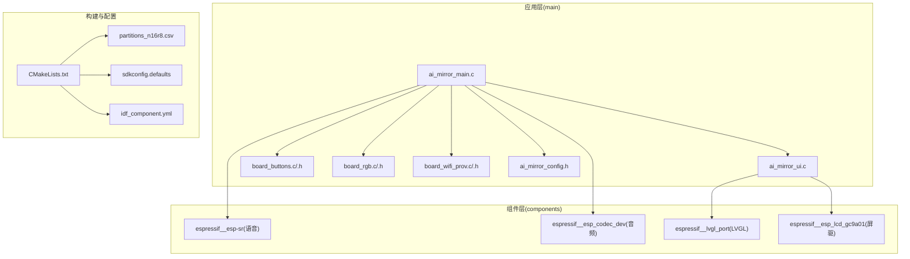
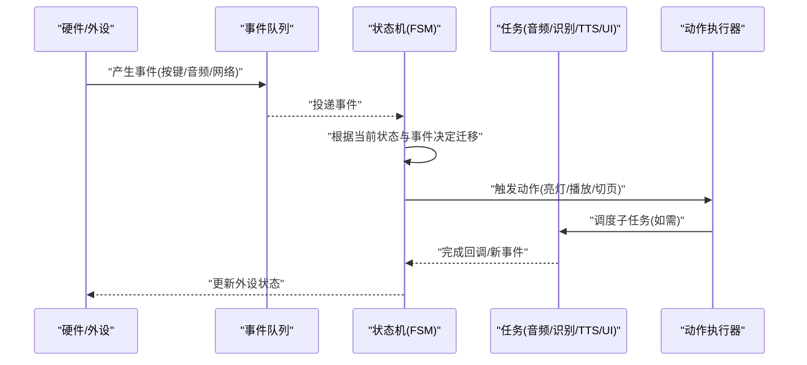
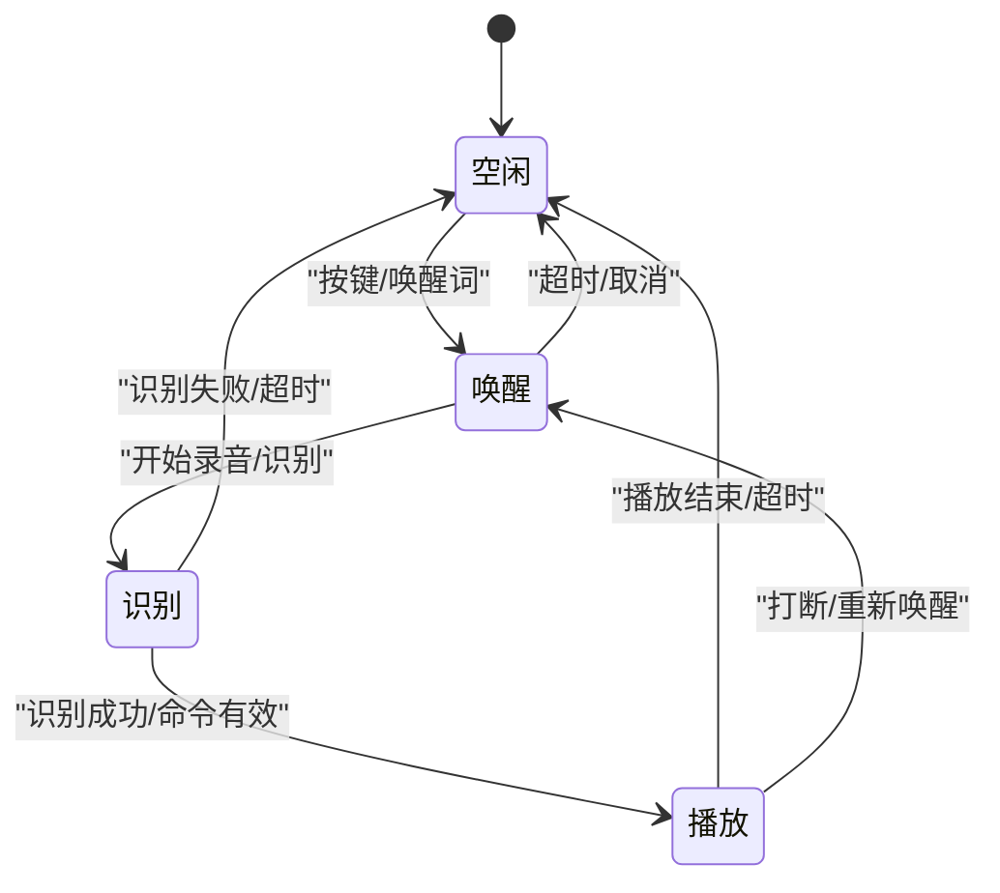
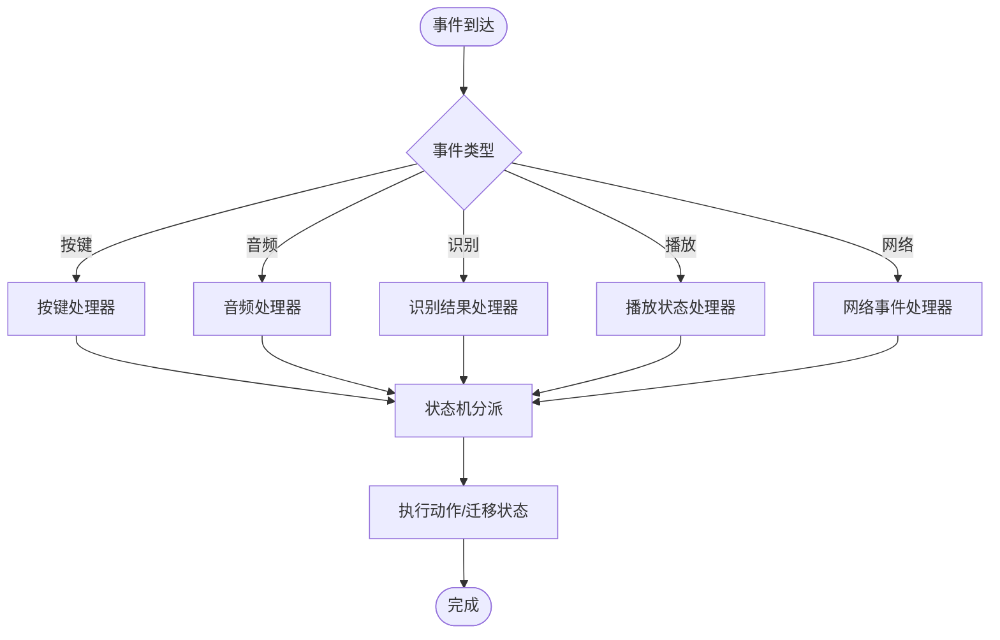
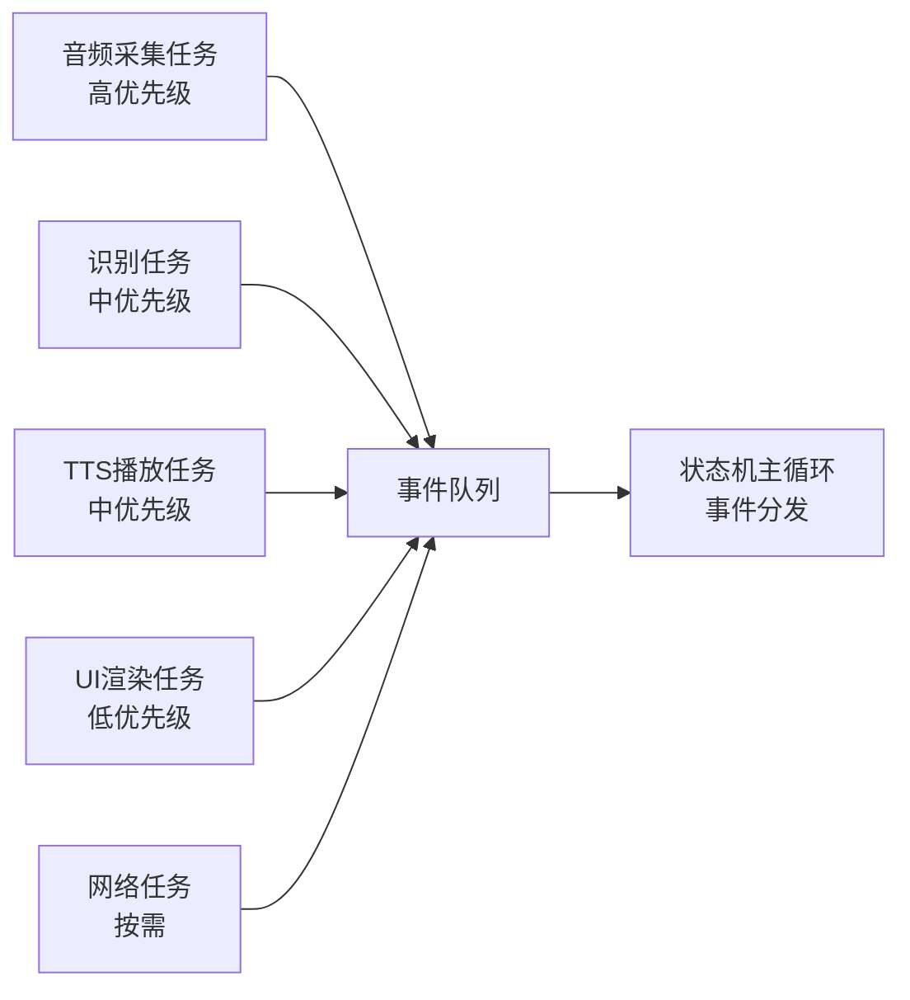
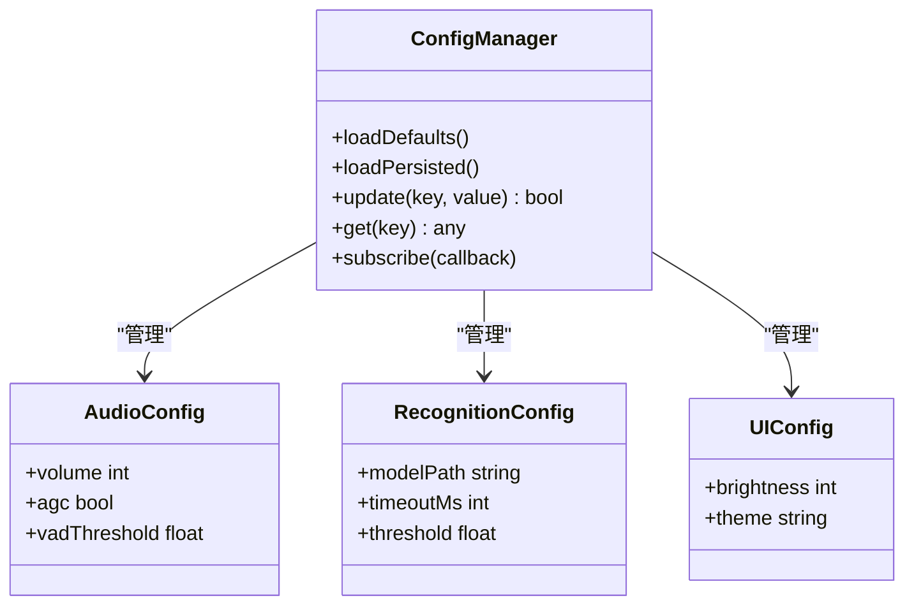
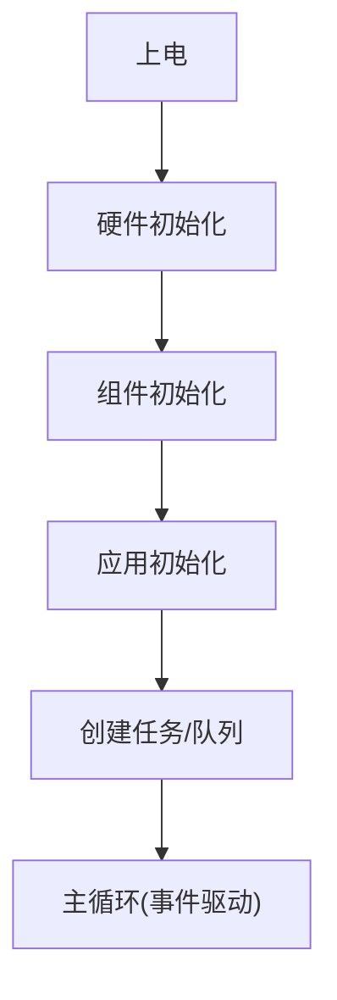
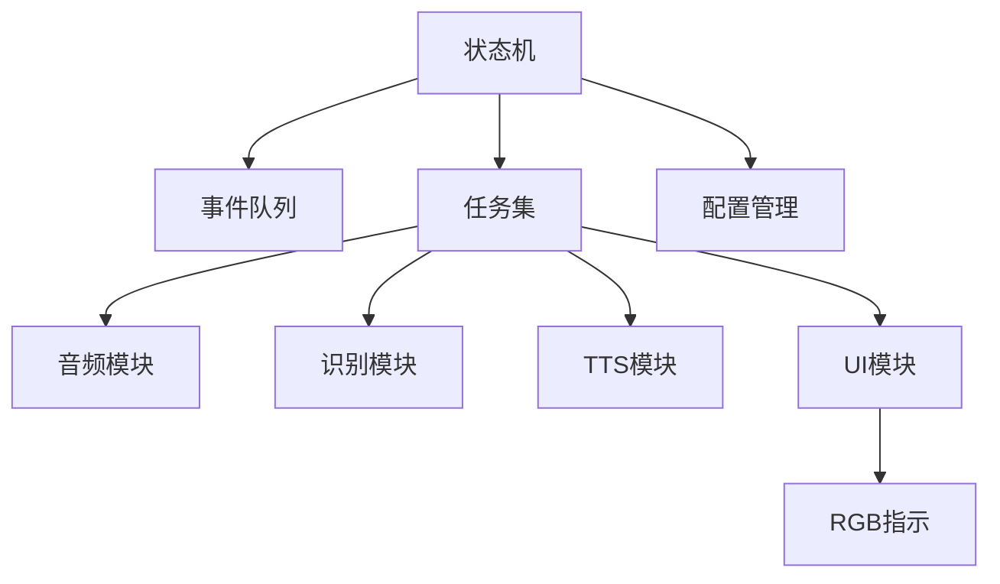

# 系统状态管理

<cite>
**本文档引用的文件**   
- [ai_mirror_main.c](file://Firmware/esp32_ai_mirror/main/ai_mirror_main.c)
- [ai_mirror_config.h](file://Firmware/esp32_ai_mirror/main/ai_mirror_config.h)
- [ai_mirror_ui.c](file://Firmware/esp32_ai_mirror/main/ai_mirror_ui.c)
- [board_buttons.c](file://Firmware/esp32_ai_mirror/main/board_buttons.c)
- [board_buttons.h](file://Firmware/esp32_ai_mirror/main/board_buttons.h)
- [board_rgb.c](file://Firmware/esp32_ai_mirror/main/board_rgb.c)
- [board_rgb.h](file://Firmware/esp32_ai_mirror/main/board_rgb.h)
- [board_wifi_prov.c](file://Firmware/esp32_ai_mirror/main/board_wifi_prov.c)
- [board_wifi_prov.h](file://Firmware/esp32_ai_mirror/main/board_wifi_prov.h)
- [CMakeLists.txt](file://Firmware/esp32_ai_mirror/CMakeLists.txt)
- [partitions_n16r8.csv](file://Firmware/esp32_ai_mirror/partitions_n16r8.csv)
- [sdkconfig.defaults](file://Firmware/esp32_ai_mirror/sdkconfig.defaults)
- [idf_component.yml](file://Firmware/esp32_ai_mirror/main/idf_component.yml)
</cite>

## 目录
1. [简介](#简介)
2. [项目结构](#项目结构)
3. [核心组件](#核心组件)
4. [架构总览](#架构总览)
5. [详细组件分析](#详细组件分析)
6. [依赖关系分析](#依赖关系分析)
7. [性能考虑](#性能考虑)
8. [故障排查指南](#故障排查指南)
9. [结论](#结论)
10. [附录](#附录)

## 简介
本文件面向AI镜子的“系统状态管理”，围绕事件驱动的状态机、任务调度（FreeRTOS）、配置管理、内存与资源监控、初始化流程、调试与监控接口，以及稳定性与异常处理进行系统化说明。目标是帮助开发者快速理解并扩展系统的状态行为，确保在语音唤醒、识别、播放等关键路径上的稳定运行。

## 项目结构
本项目基于ESP-IDF构建，应用代码位于 main 目录，包含入口、UI、板级外设（按键、RGB、WiFi配网）与配置头文件；组件层集成语音、显示、音频编解码等第三方库。构建产物与分区表由 CMake 与 partitions 文件管理。

图表来源
- [CMakeLists.txt](file://Firmware/esp32_ai_mirror/CMakeLists.txt)
- [idf_component.yml](file://Firmware/esp32_ai_mirror/main/idf_component.yml)

章节来源
- [CMakeLists.txt](file://Firmware/esp32_ai_mirror/CMakeLists.txt)
- [idf_component.yml](file://Firmware/esp32_ai_mirror/main/idf_component.yml)

## 核心组件
- 状态机与事件总线：定义系统主要状态（空闲、唤醒、识别、播放等），通过事件队列分发到处理器，驱动状态迁移与动作执行。
- 任务调度（FreeRTOS）：为音频采集、语音识别、TTS合成、UI渲染、网络交互等分配独立任务与优先级，保障实时性与吞吐。
- 配置管理：运行时参数与持久化配置分离，支持动态调整（如音量、阈值、超时）。
- 资源与内存：堆栈使用统计、泄漏检测、性能计数器，配合日志输出定位问题。
- 初始化流程：按依赖顺序启动硬件、组件与应用模块，确保资源可用后再进入主循环。

章节来源
- [ai_mirror_main.c](file://Firmware/esp32_ai_mirror/main/ai_mirror_main.c)
- [ai_mirror_config.h](file://Firmware/esp32_ai_mirror/main/ai_mirror_config.h)

## 架构总览
下图展示事件驱动状态机的整体架构：输入事件来自按键、音频中断、网络消息等，经事件队列路由至状态处理器，处理器更新状态并触发动作（如点亮指示灯、开始播放、切换页面）。

图表来源
- [ai_mirror_main.c](file://Firmware/esp32_ai_mirror/main/ai_mirror_main.c)
- [board_buttons.c](file://Firmware/esp32_ai_mirror/main/board_buttons.c)
- [board_rgb.c](file://Firmware/esp32_ai_mirror/main/board_rgb.c)
- [ai_mirror_ui.c](file://Firmware/esp32_ai_mirror/main/ai_mirror_ui.c)

## 详细组件分析

### 状态机设计（空闲/唤醒/识别/播放）
- 状态定义
  - 空闲：低功耗监听唤醒词，等待用户交互或语音指令。
  - 唤醒：检测到唤醒词，提升灵敏度，准备接收命令。
  - 识别：执行语音识别，解析意图，生成控制命令。
  - 播放：根据命令执行媒体播放或TTS播报，同时维持UI反馈。
- 转换逻辑
  - 空闲→唤醒：按键按下或唤醒词命中。
  - 唤醒→识别：开始录音并送入识别引擎。
  - 识别→播放：识别成功且命令可执行。
  - 播放→空闲：播放结束或超时返回。
  - 任意状态→空闲：紧急复位或看门狗恢复。
- 事件与处理器
  - 事件类型：按键、音频帧就绪、识别结果、播放状态、网络事件。
  - 处理器：每个状态维护一组事件→动作映射，保证幂等与可重入。

图表来源
- [ai_mirror_main.c](file://Firmware/esp32_ai_mirror/main/ai_mirror_main.c)
- [board_buttons.c](file://Firmware/esp32_ai_mirror/main/board_buttons.c)
- [ai_mirror_ui.c](file://Firmware/esp32_ai_mirror/main/ai_mirror_ui.c)

章节来源
- [ai_mirror_main.c](file://Firmware/esp32_ai_mirror/main/ai_mirror_main.c)
- [board_buttons.c](file://Firmware/esp32_ai_mirror/main/board_buttons.c)
- [ai_mirror_ui.c](file://Firmware/esp32_ai_mirror/main/ai_mirror_ui.c)

### 事件驱动架构（事件定义/队列/处理器）
- 事件定义：统一的事件结构体包含类型、数据指针、长度、时间戳等字段，便于跨任务传递。
- 事件队列：采用环形队列或消息队列实现，支持多生产者（ISR/任务）与单消费者（FSM主循环）。
- 处理器：状态处理器按事件类型分派，执行原子操作，避免竞态；对耗时操作派发子任务。
- 背压与丢弃策略：队列满时丢弃低优先级事件或阻塞生产者，防止雪崩。

图表来源
- [ai_mirror_main.c](file://Firmware/esp32_ai_mirror/main/ai_mirror_main.c)
- [board_buttons.c](file://Firmware/esp32_ai_mirror/main/board_buttons.c)

章节来源
- [ai_mirror_main.c](file://Firmware/esp32_ai_mirror/main/ai_mirror_main.c)
- [board_buttons.c](file://Firmware/esp32_ai_mirror/main/board_buttons.c)

### 任务调度机制（FreeRTOS）
- 任务划分
  - 音频采集任务：高优先级，周期性采集PCM，推送事件。
  - 语音识别任务：中优先级，消费音频事件，输出识别结果。
  - TTS播放任务：中优先级，消费文本事件，驱动音频输出。
  - UI渲染任务：低优先级，响应页面切换与动画。
  - 网络任务：按需调度，处理配网与云端交互。
- 优先级与同步
  - 使用信号量/互斥锁保护共享资源（如音频缓冲区、模型上下文）。
  - 事件队列作为任务间通信主干，减少轮询。
- 资源分配
  - 为关键任务预留足够堆栈，避免溢出；非关键任务限制最大堆栈。
  - 定时器用于周期采样与超时控制。

图表来源
- [ai_mirror_main.c](file://Firmware/esp32_ai_mirror/main/ai_mirror_main.c)

章节来源
- [ai_mirror_main.c](file://Firmware/esp32_ai_mirror/main/ai_mirror_main.c)

### 配置管理系统（运行时/配置文件/动态参数）
- 运行时配置：集中式配置对象，提供读写接口，支持热更新（如音量、降噪阈值、超时）。
- 配置文件管理：默认配置与用户覆盖分离，持久化存储于分区表中的NVS或文件系统。
- 动态参数调整：通过事件或API更新，触发相关模块重载（如音频链路、识别模型参数）。
- 安全校验：参数范围检查、兼容性校验，失败回滚并记录日志。

图表来源
- [ai_mirror_config.h](file://Firmware/esp32_ai_mirror/main/ai_mirror_config.h)
- [sdkconfig.defaults](file://Firmware/esp32_ai_mirror/sdkconfig.defaults)
- [partitions_n16r8.csv](file://Firmware/esp32_ai_mirror/partitions_n16r8.csv)

章节来源
- [ai_mirror_config.h](file://Firmware/esp32_ai_mirror/main/ai_mirror_config.h)
- [sdkconfig.defaults](file://Firmware/esp32_ai_mirror/sdkconfig.defaults)
- [partitions_n16r8.csv](file://Firmware/esp32_ai_mirror/partitions_n16r8.csv)

### 内存管理与资源监控
- 堆栈使用：为各任务设置最小堆栈并启用溢出检测，定期打印堆栈水位。
- 内存泄漏检测：启用调试宏与工具链选项，结合日志定位未释放资源。
- 性能分析：统计关键路径耗时、队列长度、CPU占用，辅助调优。
- 资源回收：在状态迁移或错误分支显式释放缓冲区、关闭句柄。

章节来源
- [ai_mirror_main.c](file://Firmware/esp32_ai_mirror/main/ai_mirror_main.c)
- [sdkconfig.defaults](file://Firmware/esp32_ai_mirror/sdkconfig.defaults)

### 系统初始化流程与各模块启动顺序
- 硬件初始化：时钟、GPIO、I2S、SPI、屏幕、音频Codec。
- 组件初始化：LVGL、语音SDK、编解码库、网络栈。
- 应用初始化：加载配置、创建事件队列与任务、注册回调。
- 启动顺序：先底层后上层，确保依赖就绪；最后进入主循环等待事件。

图表来源
- [CMakeLists.txt](file://Firmware/esp32_ai_mirror/CMakeLists.txt)
- [idf_component.yml](file://Firmware/esp32_ai_mirror/main/idf_component.yml)
- [ai_mirror_main.c](file://Firmware/esp32_ai_mirror/main/ai_mirror_main.c)

章节来源
- [CMakeLists.txt](file://Firmware/esp32_ai_mirror/CMakeLists.txt)
- [idf_component.yml](file://Firmware/esp32_ai_mirror/main/idf_component.yml)
- [ai_mirror_main.c](file://Firmware/esp32_ai_mirror/main/ai_mirror_main.c)

### 调试与监控接口
- 日志输出：分级日志（调试/信息/警告/错误），支持过滤与格式化。
- 状态查询：提供API获取当前状态、队列长度、任务堆栈水位。
- 性能统计：关键指标上报（识别延迟、播放时长、CPU负载）。
- 远程诊断：通过串口或网络导出日志与指标，便于离线分析。

章节来源
- [ai_mirror_main.c](file://Firmware/esp32_ai_mirror/main/ai_mirror_main.c)
- [ai_mirror_ui.c](file://Firmware/esp32_ai_mirror/main/ai_mirror_ui.c)

### 稳定性保障与异常处理
- 看门狗：全局与任务级看门狗，超时复位并记录崩溃前状态。
- 异常恢复：关键路径捕获异常，降级模式运行（如禁用UI、降低采样率）。
- 资源保护：临界区保护共享资源，避免死锁与竞争。
- 安全边界：输入校验、越界检查、缓冲区大小限制。

章节来源
- [ai_mirror_main.c](file://Firmware/esp32_ai_mirror/main/ai_mirror_main.c)

### 扩展接口与自定义状态机指导
- 事件扩展：新增事件类型需在事件定义与处理器注册处同步扩展。
- 状态扩展：新增状态需定义迁移规则与默认动作，保持幂等。
- 任务扩展：遵循优先级规范，避免抢占关键路径；使用事件队列解耦。
- 配置扩展：在配置管理器中注册新键，并提供默认值与校验。

章节来源
- [ai_mirror_main.c](file://Firmware/esp32_ai_mirror/main/ai_mirror_main.c)
- [ai_mirror_config.h](file://Firmware/esp32_ai_mirror/main/ai_mirror_config.h)

## 依赖关系分析
- 模块耦合
  - 状态机依赖事件队列与任务调度；UI与RGB受状态机驱动。
  - 音频与识别模块通过事件与配置联动。
- 外部依赖
  - ESP-IDF内核、LVGL、语音SDK、编解码库。
- 潜在环路
  - 避免UI直接调用音频底层，应通过事件与任务间接通信。

图表来源
- [ai_mirror_main.c](file://Firmware/esp32_ai_mirror/main/ai_mirror_main.c)
- [ai_mirror_ui.c](file://Firmware/esp32_ai_mirror/main/ai_mirror_ui.c)
- [board_rgb.c](file://Firmware/esp32_ai_mirror/main/board_rgb.c)
- [ai_mirror_config.h](file://Firmware/esp32_ai_mirror/main/ai_mirror_config.h)

章节来源
- [ai_mirror_main.c](file://Firmware/esp32_ai_mirror/main/ai_mirror_main.c)
- [ai_mirror_ui.c](file://Firmware/esp32_ai_mirror/main/ai_mirror_ui.c)
- [board_rgb.c](file://Firmware/esp32_ai_mirror/main/board_rgb.c)
- [ai_mirror_config.h](file://Firmware/esp32_ai_mirror/main/ai_mirror_config.h)

## 性能考虑
- 任务优先级：音频与识别优先于UI，避免卡顿。
- 事件批处理：合并高频事件，降低队列压力。
- 内存池：复用音频缓冲与识别中间结果，减少分配开销。
- 功耗优化：空闲态降低采样率与关闭非必要外设。

[本节为通用建议，不直接分析具体文件]

## 故障排查指南
- 常见问题
  - 队列溢出：增加队列容量或降低生产者速率。
  - 任务堆栈溢出：增大堆栈或优化递归/大对象。
  - 识别延迟高：检查音频链路、模型加载与CPU占用。
  - UI卡顿：降低刷新频率或拆分渲染任务。
- 定位方法
  - 查看日志级别与关键字，过滤噪声。
  - 使用性能统计接口导出指标，对比基线。
  - 临时降级功能以隔离问题。

章节来源
- [ai_mirror_main.c](file://Firmware/esp32_ai_mirror/main/ai_mirror_main.c)
- [sdkconfig.defaults](file://Firmware/esp32_ai_mirror/sdkconfig.defaults)

## 结论
本系统采用事件驱动的状态机与FreeRTOS任务调度，实现了从唤醒、识别到播放的完整闭环。通过统一的配置管理与资源监控，保障了运行稳定性与可维护性。开发者可基于本文档的扩展接口与安全边界，平滑添加新功能与状态，持续提升用户体验。

[本节为总结，不直接分析具体文件]

## 附录
- 构建与分区
  - CMakeLists 指定组件与源文件组织。
  - partitions_n16r8.csv 定义NVS/OTA/文件系统分区。
  - sdkconfig.defaults 提供默认编译选项与特性开关。
- 组件清单
  - idf_component.yml 声明第三方组件版本与依赖。

章节来源
- [CMakeLists.txt](file://Firmware/esp32_ai_mirror/CMakeLists.txt)
- [partitions_n16r8.csv](file://Firmware/esp32_ai_mirror/partitions_n16r8.csv)
- [sdkconfig.defaults](file://Firmware/esp32_ai_mirror/sdkconfig.defaults)
- [idf_component.yml](file://Firmware/esp32_ai_mirror/main/idf_component.yml)