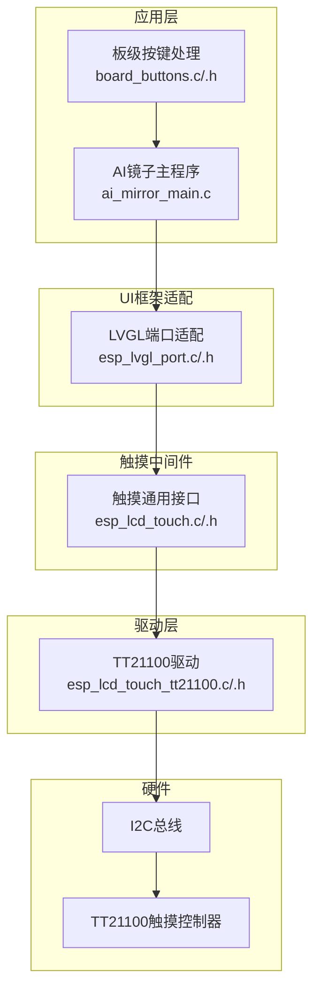
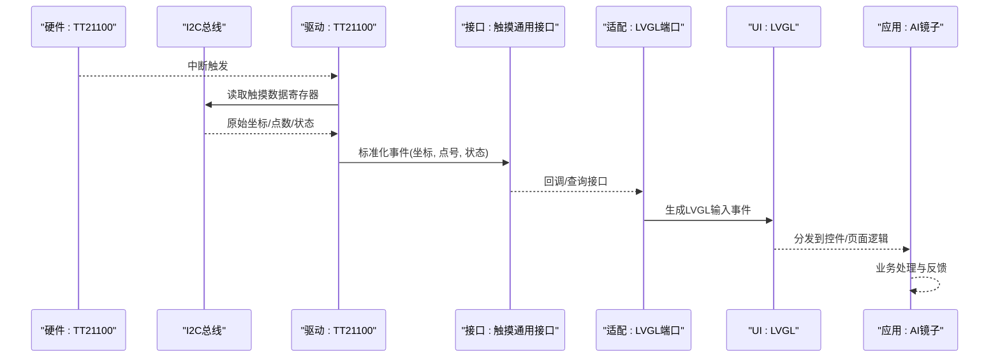
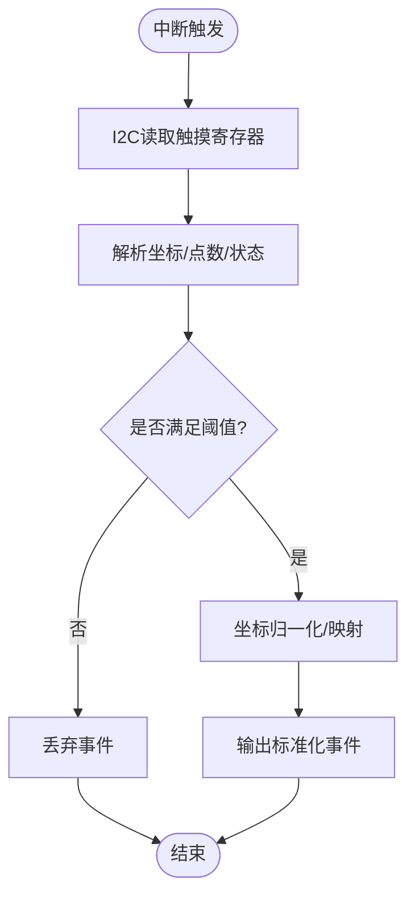
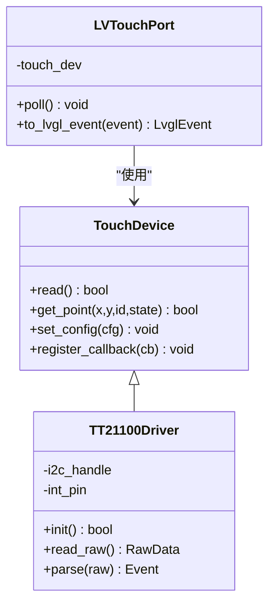
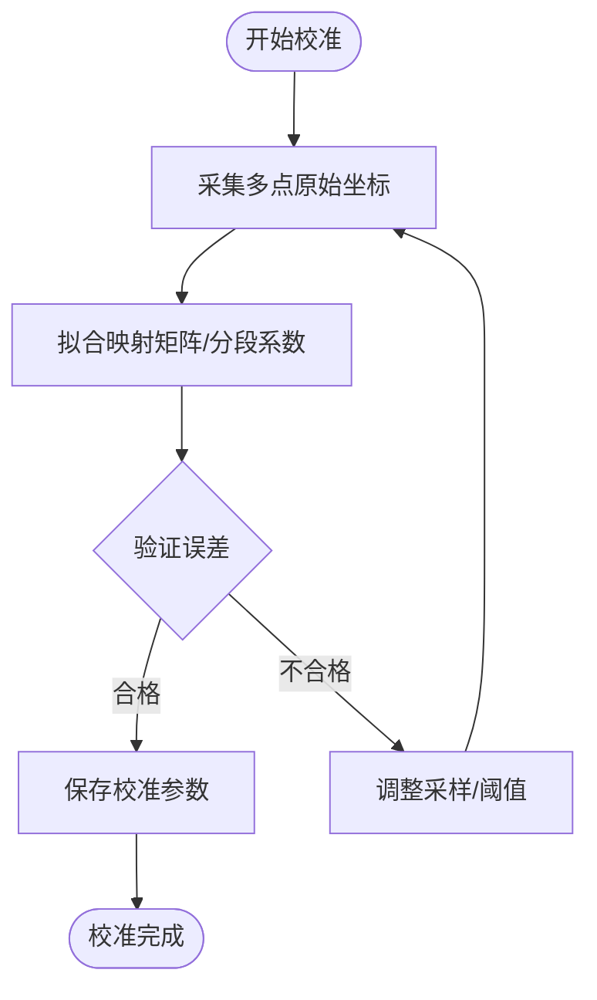
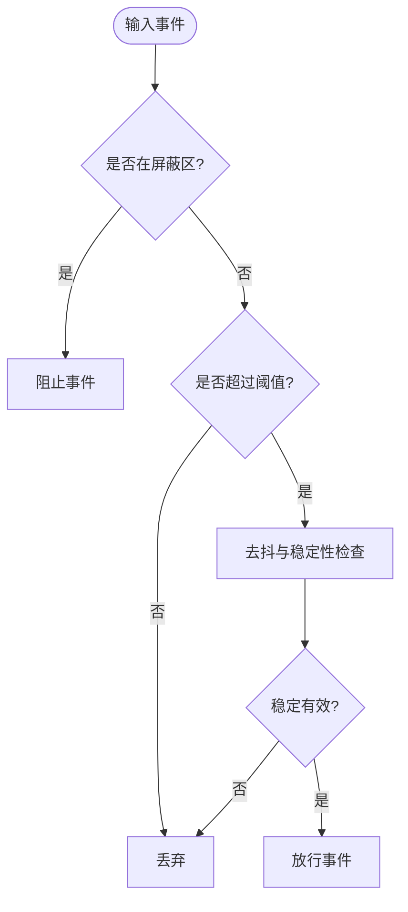
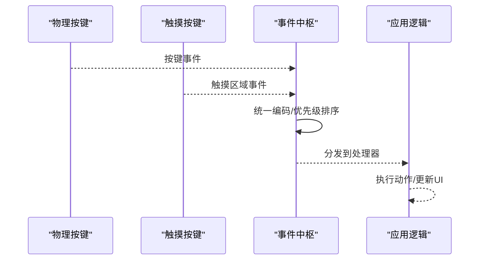
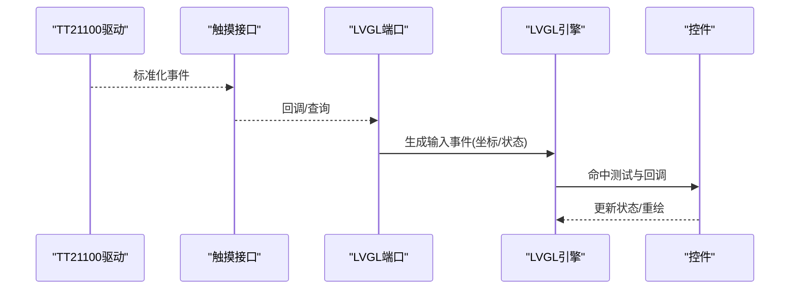
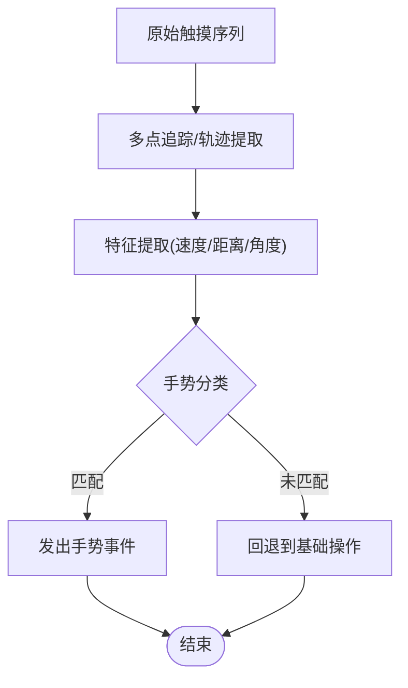
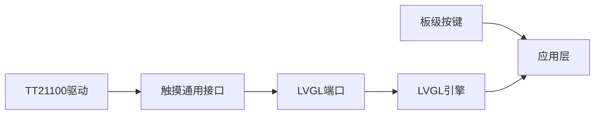

# 触摸交互系统

<cite>
**本文档引用的文件**   
- [esp_lcd_touch_tt21100.c](file://Firmware/esp32_ai_mirror/managed_components/espressif__esp_lcd_touch_tt21100/esp_lcd_touch_tt21100.c)
- [esp_lcd_touch_tt21100.h](file://Firmware/esp32_ai_mirror/managed_components/espressif__esp_lcd_touch_tt21100/include/esp_lcd_touch_tt21100.h)
- [esp_lcd_touch.c](file://Firmware/esp32_ai_mirror/managed_components/espressif__esp_lcd_touch/esp_lcd_touch.c)
- [esp_lcd_touch.h](file://Firmware/esp32_ai_mirror/managed_components/espressif__esp_lcd_touch/include/esp_lcd_touch.h)
- [esp_lvgl_port.c](file://Firmware/esp32_ai_mirror/managed_components/espressif__esp_lvgl_port/esp_lvgl_port.c)
- [esp_lvgl_port.h](file://Firmware/esp32_ai_mirror/managed_components/espressif__esp_lvgl_port/include/esp_lvgl_port.h)
- [ai_mirror_main.c](file://Firmware/esp32_ai_mirror/main/ai_mirror_main.c)
- [board_buttons.c](file://Firmware/esp32_ai_mirror/main/board_buttons.c)
- [board_buttons.h](file://Firmware/esp32_ai_mirror/main/board_buttons.h)
- [sdkconfig.defaults](file://Firmware/esp32_ai_mirror/sdkconfig.defaults)
</cite>

## 目录
1. [简介](#简介)
2. [项目结构](#项目结构)
3. [核心组件](#核心组件)
4. [架构总览](#架构总览)
5. [详细组件分析](#详细组件分析)
6. [依赖关系分析](#依赖关系分析)
7. [性能考量](#性能考量)
8. [故障排查指南](#故障排查指南)
9. [结论](#结论)
10. [附录](#附录)

## 简介
本文件面向AI镜子的触摸交互系统，围绕TT21100触摸控制器驱动与I2C通信、触摸事件检测与处理（坐标获取、多点触控、手势识别）、校准与精度优化、灵敏度调节与防误触、物理按键与触摸按键统一事件机制、与UI框架的集成（事件分发与响应）、性能监控与分析工具、调试技巧与常见问题排查，以及扩展接口与自定义手势实现进行系统化说明。文档兼顾开发者与非技术读者，提供从原理到实践的全链路知识。

## 项目结构
本项目采用分层模块化组织：
- 硬件抽象层（HAL）：通过ESP-IDF的LCD Touch通用接口封装底层驱动
- 驱动层：TT21100 I2C驱动实现，负责寄存器读写、中断处理、坐标读取
- 中间件层：LVGL端口适配，将触摸事件转换为LVGL输入事件
- 应用层：AI镜子主程序与板级按键处理，统一事件分发至UI或业务逻辑

图表来源
- [esp_lvgl_port.c](file://Firmware/esp32_ai_mirror/managed_components/espressif__esp_lvgl_port/esp_lvgl_port.c)
- [esp_lvgl_port.h](file://Firmware/esp32_ai_mirror/managed_components/espressif__esp_lvgl_port/include/esp_lvgl_port.h)
- [esp_lcd_touch.c](file://Firmware/esp32_ai_mirror/managed_components/espressif__esp_lcd_touch/esp_lcd_touch.c)
- [esp_lcd_touch.h](file://Firmware/esp32_ai_mirror/managed_components/espressif__esp_lcd_touch/include/esp_lcd_touch.h)
- [esp_lcd_touch_tt21100.c](file://Firmware/esp32_ai_mirror/managed_components/espressif__esp_lcd_touch_tt21100/esp_lcd_touch_tt21100.c)
- [esp_lcd_touch_tt21100.h](file://Firmware/esp32_ai_mirror/managed_components/espressif__esp_lcd_touch_tt21100/include/esp_lcd_touch_tt21100.h)
- [ai_mirror_main.c](file://Firmware/esp32_ai_mirror/main/ai_mirror_main.c)
- [board_buttons.c](file://Firmware/esp32_ai_mirror/main/board_buttons.c)
- [board_buttons.h](file://Firmware/esp32_ai_mirror/main/board_buttons.h)

章节来源
- [ai_mirror_main.c](file://Firmware/esp32_ai_mirror/main/ai_mirror_main.c)
- [board_buttons.c](file://Firmware/esp32_ai_mirror/main/board_buttons.c)
- [board_buttons.h](file://Firmware/esp32_ai_mirror/main/board_buttons.h)

## 核心组件
- TT21100驱动：实现I2C读写、中断触发、坐标与多点触控数据解析、基础去抖与阈值配置
- 触摸通用接口：定义统一的触摸设备抽象，屏蔽不同驱动差异，向上层暴露标准API
- LVGL端口适配：将触摸事件桥接到LVGL输入子系统，支持坐标映射、旋转、缩放等
- 板级按键：物理按键与触摸按键的统一事件入口，便于在应用层做统一分发

章节来源
- [esp_lcd_touch_tt21100.c](file://Firmware/esp32_ai_mirror/managed_components/espressif__esp_lcd_touch_tt21100/esp_lcd_touch_tt21100.c)
- [esp_lcd_touch_tt21100.h](file://Firmware/esp32_ai_mirror/managed_components/espressif__esp_lcd_touch_tt21100/include/esp_lcd_touch_tt21100.h)
- [esp_lcd_touch.c](file://Firmware/esp32_ai_mirror/managed_components/espressif__esp_lcd_touch/esp_lcd_touch.c)
- [esp_lcd_touch.h](file://Firmware/esp32_ai_mirror/managed_components/espressif__esp_lcd_touch/include/esp_lcd_touch.h)
- [esp_lvgl_port.c](file://Firmware/esp32_ai_mirror/managed_components/espressif__esp_lvgl_port/esp_lvgl_port.c)
- [esp_lvgl_port.h](file://Firmware/esp32_ai_mirror/managed_components/espressif__esp_lvgl_port/include/esp_lvgl_port.h)
- [board_buttons.c](file://Firmware/esp32_ai_mirror/main/board_buttons.c)
- [board_buttons.h](file://Firmware/esp32_ai_mirror/main/board_buttons.h)

## 架构总览
触摸系统的整体流程如下：
- 硬件层：TT21100通过I2C上报触摸事件（中断引脚触发）
- 驱动层：TT21100驱动读取寄存器，解析坐标、点数、压力等信息，并进行基础滤波
- 中间件层：触摸通用接口对数据进行标准化，提供查询与回调能力
- UI层：LVGL端口将事件转换为LVGL输入事件，完成命中测试与控件响应
- 应用层：统一事件分发，结合物理按键与触摸按键，执行业务逻辑

图表来源
- [esp_lcd_touch_tt21100.c](file://Firmware/esp32_ai_mirror/managed_components/espressif__esp_lcd_touch_tt21100/esp_lcd_touch_tt21100.c)
- [esp_lcd_touch.c](file://Firmware/esp32_ai_mirror/managed_components/espressif__esp_lcd_touch/esp_lcd_touch.c)
- [esp_lvgl_port.c](file://Firmware/esp32_ai_mirror/managed_components/espressif__esp_lvgl_port/esp_lvgl_port.c)
- [ai_mirror_main.c](file://Firmware/esp32_ai_mirror/main/ai_mirror_main.c)

## 详细组件分析

### TT21100驱动与I2C通信协议
- I2C初始化与地址配置：设置时钟频率、总线参数、设备地址
- 中断处理：监听中断引脚，进入读流程；避免轮询带来的CPU占用
- 寄存器读写：按数据手册时序读取坐标、触点数量、压力等字段
- 数据解析：将原始值转换为屏幕坐标系，支持多触点索引
- 基础滤波：简单阈值过滤与去抖，减少抖动与误触

图表来源
- [esp_lcd_touch_tt21100.c](file://Firmware/esp32_ai_mirror/managed_components/espressif__esp_lcd_touch_tt21100/esp_lcd_touch_tt21100.c)
- [esp_lcd_touch_tt21100.h](file://Firmware/esp32_ai_mirror/managed_components/espressif__esp_lcd_touch_tt21100/include/esp_lcd_touch_tt21100.h)

章节来源
- [esp_lcd_touch_tt21100.c](file://Firmware/esp32_ai_mirror/managed_components/espressif__esp_lcd_touch_tt21100/esp_lcd_touch_tt21100.c)
- [esp_lcd_touch_tt21100.h](file://Firmware/esp32_ai_mirror/managed_components/espressif__esp_lcd_touch_tt21100/include/esp_lcd_touch_tt21100.h)

### 触摸通用接口与事件模型
- 抽象结构：定义触摸设备句柄、回调函数、查询接口
- 事件类型：按下、释放、移动、多点触控、压力变化
- 数据模型：包含坐标、点号、状态、时间戳等字段
- 上层集成：为LVGL端口与应用层提供统一的事件访问方式

图表来源
- [esp_lcd_touch.c](file://Firmware/esp32_ai_mirror/managed_components/espressif__esp_lcd_touch/esp_lcd_touch.c)
- [esp_lcd_touch.h](file://Firmware/esp32_ai_mirror/managed_components/espressif__esp_lcd_touch/include/esp_lcd_touch.h)
- [esp_lvgl_port.c](file://Firmware/esp32_ai_mirror/managed_components/espressif__esp_lvgl_port/esp_lvgl_port.c)

章节来源
- [esp_lcd_touch.c](file://Firmware/esp32_ai_mirror/managed_components/espressif__esp_lcd_touch/esp_lcd_touch.c)
- [esp_lcd_touch.h](file://Firmware/esp32_ai_mirror/managed_components/espressif__esp_lcd_touch/include/esp_lcd_touch.h)
- [esp_lvgl_port.c](file://Firmware/esp32_ai_mirror/managed_components/espressif__esp_lvgl_port/esp_lvgl_port.c)
- [esp_lvgl_port.h](file://Firmware/esp32_ai_mirror/managed_components/espressif__esp_lvgl_port/include/esp_lvgl_port.h)

### 触摸校准算法与精度优化
- 硬件校准：基于屏幕分辨率与面板特性，建立原始坐标到显示坐标的映射矩阵
- 软件补偿：线性插值、分段校正、温度漂移补偿、边缘修正
- 多点触控校准：逐点标定与全局拟合相结合，保证多点一致性
- 精度优化：增加采样次数取均值、动态阈值调整、噪声抑制滤波

图表来源
- [esp_lcd_touch_tt21100.c](file://Firmware/esp32_ai_mirror/managed_components/espressif__esp_lcd_touch_tt21100/esp_lcd_touch_tt21100.c)
- [esp_lvgl_port.c](file://Firmware/esp32_ai_mirror/managed_components/espressif__esp_lvgl_port/esp_lvgl_port.c)

章节来源
- [esp_lcd_touch_tt21100.c](file://Firmware/esp32_ai_mirror/managed_components/espressif__esp_lcd_touch_tt21100/esp_lcd_touch_tt21100.c)
- [esp_lvgl_port.c](file://Firmware/esp32_ai_mirror/managed_components/espressif__esp_lvgl_port/esp_lvgl_port.c)

### 灵敏度调节、防误触与去抖
- 灵敏度调节：根据环境光与用户习惯动态调整阈值，提升弱接触识别
- 防误触：区域屏蔽（如边框）、面积阈值、角度约束、滑动速度限制
- 去抖策略：时间窗口内重复事件合并、最小停留时长、连续采样一致性校验

图表来源
- [esp_lcd_touch_tt21100.c](file://Firmware/esp32_ai_mirror/managed_components/espressif__esp_lcd_touch_tt21100/esp_lcd_touch_tt21100.c)
- [esp_lcd_touch.c](file://Firmware/esp32_ai_mirror/managed_components/espressif__esp_lcd_touch/esp_lcd_touch.c)

章节来源
- [esp_lcd_touch_tt21100.c](file://Firmware/esp32_ai_mirror/managed_components/espressif__esp_lcd_touch_tt21100/esp_lcd_touch_tt21100.c)
- [esp_lcd_touch.c](file://Firmware/esp32_ai_mirror/managed_components/espressif__esp_lcd_touch/esp_lcd_touch.c)

### 物理按键与触摸按键的统一事件处理
- 统一入口：板级按键与触摸按键均汇聚到同一事件队列
- 事件分类：区分物理键码与触摸区域ID，保持语义一致
- 分发策略：应用层根据事件类型路由到对应处理器（如音量、返回、菜单）

图表来源
- [board_buttons.c](file://Firmware/esp32_ai_mirror/main/board_buttons.c)
- [board_buttons.h](file://Firmware/esp32_ai_mirror/main/board_buttons.h)
- [ai_mirror_main.c](file://Firmware/esp32_ai_mirror/main/ai_mirror_main.c)

章节来源
- [board_buttons.c](file://Firmware/esp32_ai_mirror/main/board_buttons.c)
- [board_buttons.h](file://Firmware/esp32_ai_mirror/main/board_buttons.h)
- [ai_mirror_main.c](file://Firmware/esp32_ai_mirror/main/ai_mirror_main.c)

### 触摸系统与UI框架的集成
- 事件桥接：LVGL端口将触摸事件转换为LVGL输入事件，包括位置、按钮状态、滚动方向
- 坐标映射：考虑屏幕旋转、镜像、缩放，确保点击命中准确
- 事件分发：LVGL内部完成控件命中测试与回调，应用层无需关心底层细节

图表来源
- [esp_lvgl_port.c](file://Firmware/esp32_ai_mirror/managed_components/espressif__esp_lvgl_port/esp_lvgl_port.c)
- [esp_lvgl_port.h](file://Firmware/esp32_ai_mirror/managed_components/espressif__esp_lvgl_port/include/esp_lvgl_port.h)
- [esp_lcd_touch.c](file://Firmware/esp32_ai_mirror/managed_components/espressif__esp_lcd_touch/esp_lcd_touch.c)

章节来源
- [esp_lvgl_port.c](file://Firmware/esp32_ai_mirror/managed_components/espressif__esp_lvgl_port/esp_lvgl_port.c)
- [esp_lvgl_port.h](file://Firmware/esp32_ai_mirror/managed_components/espressif__esp_lvgl_port/include/esp_lvgl_port.h)
- [esp_lcd_touch.c](file://Firmware/esp32_ai_mirror/managed_components/espressif__esp_lcd_touch/esp_lcd_touch.c)

### 手势识别与多点触控
- 多点触控：支持同时跟踪多个触点，维护点号与生命周期
- 手势识别：滑动、长按、双击、捏合缩放等，基于轨迹与时间特征判断
- 扩展接口：允许应用层注册自定义手势识别器，参与事件判定链

图表来源
- [esp_lcd_touch_tt21100.c](file://Firmware/esp32_ai_mirror/managed_components/espressif__esp_lcd_touch_tt21100/esp_lcd_touch_tt21100.c)
- [esp_lcd_touch.c](file://Firmware/esp32_ai_mirror/managed_components/espressif__esp_lcd_touch/esp_lcd_touch.c)

章节来源
- [esp_lcd_touch_tt21100.c](file://Firmware/esp32_ai_mirror/managed_components/espressif__esp_lcd_touch_tt21100/esp_lcd_touch_tt21100.c)
- [esp_lcd_touch.c](file://Firmware/esp32_ai_mirror/managed_components/espressif__esp_lcd_touch/esp_lcd_touch.c)

## 依赖关系分析
触摸系统依赖关系清晰分层，耦合度低、内聚性高：
- 驱动层仅依赖I2C与硬件寄存器定义
- 中间件层屏蔽驱动差异，提供统一接口
- UI层通过端口适配与触摸接口解耦
- 应用层通过统一事件中枢协调物理与触摸输入

图表来源
- [esp_lcd_touch_tt21100.c](file://Firmware/esp32_ai_mirror/managed_components/espressif__esp_lcd_touch_tt21100/esp_lcd_touch_tt21100.c)
- [esp_lcd_touch.c](file://Firmware/esp32_ai_mirror/managed_components/espressif__esp_lcd_touch/esp_lcd_touch.c)
- [esp_lvgl_port.c](file://Firmware/esp32_ai_mirror/managed_components/espressif__esp_lvgl_port/esp_lvgl_port.c)
- [board_buttons.c](file://Firmware/esp32_ai_mirror/main/board_buttons.c)
- [ai_mirror_main.c](file://Firmware/esp32_ai_mirror/main/ai_mirror_main.c)

章节来源
- [esp_lcd_touch_tt21100.c](file://Firmware/esp32_ai_mirror/managed_components/espressif__esp_lcd_touch_tt21100/esp_lcd_touch_tt21100.c)
- [esp_lcd_touch.c](file://Firmware/esp32_ai_mirror/managed_components/espressif__esp_lcd_touch/esp_lcd_touch.c)
- [esp_lvgl_port.c](file://Firmware/esp32_ai_mirror/managed_components/espressif__esp_lvgl_port/esp_lvgl_port.c)
- [board_buttons.c](file://Firmware/esp32_ai_mirror/main/board_buttons.c)
- [ai_mirror_main.c](file://Firmware/esp32_ai_mirror/main/ai_mirror_main.c)

## 性能考量
- 中断优先：使用中断触发降低轮询开销，提高实时性
- 批量读取：一次I2C事务读取多寄存器，减少总线占用
- 滤波与降采样：合理设置去抖与阈值，避免无效事件风暴
- LVGL渲染优化：减少不必要的重绘，利用脏矩形与增量更新
- 功耗管理：在无触摸时进入低功耗模式，唤醒阈值可调

[本节为通用指导，不直接分析具体文件]

## 故障排查指南
- I2C通信失败：检查总线时钟、地址、连线与上拉电阻；确认中断引脚电平
- 坐标异常：核对屏幕分辨率与映射参数；检查旋转与镜像设置
- 多点触控不稳定：调整采样率与阈值；检查遮罩区域与边缘干扰
- 手势误判：优化特征阈值与时间窗口；增加训练样本与容错
- 性能瓶颈：统计事件频率与CPU占用；优化滤波与渲染路径

章节来源
- [esp_lcd_touch_tt21100.c](file://Firmware/esp32_ai_mirror/managed_components/espressif__esp_lcd_touch_tt21100/esp_lcd_touch_tt21100.c)
- [esp_lcd_touch.c](file://Firmware/esp32_ai_mirror/managed_components/espressif__esp_lcd_touch/esp_lcd_touch.c)
- [esp_lvgl_port.c](file://Firmware/esp32_ai_mirror/managed_components/espressif__esp_lvgl_port/esp_lvgl_port.c)

## 结论
AI镜子的触摸交互系统以TT21100驱动为核心，通过标准化的触摸接口与LVGL端口适配，实现了从硬件到UI的高效事件流转。系统在多点触控、手势识别、校准与精度优化方面具备良好扩展性，配合统一的物理与触摸按键事件机制，为开发者提供了灵活而稳定的交互基础。建议在生产环境中持续监控性能指标，并根据实际使用场景调优阈值与滤波策略。

[本节为总结性内容，不直接分析具体文件]

## 附录
- 配置项参考：查看sdkconfig.defaults中的触摸相关选项（如I2C速率、中断引脚、默认阈值）
- 扩展接口：在触摸接口中注册自定义手势识别器，参与事件判定链
- 调试技巧：启用日志输出，记录原始坐标与事件序列，辅助定位问题

章节来源
- [sdkconfig.defaults](file://Firmware/esp32_ai_mirror/sdkconfig.defaults)
- [esp_lcd_touch.c](file://Firmware/esp32_ai_mirror/managed_components/espressif__esp_lcd_touch/esp_lcd_touch.c)
- [esp_lcd_touch_tt21100.c](file://Firmware/esp32_ai_mirror/managed_components/espressif__esp_lcd_touch_tt21100/esp_lcd_touch_tt21100.c)