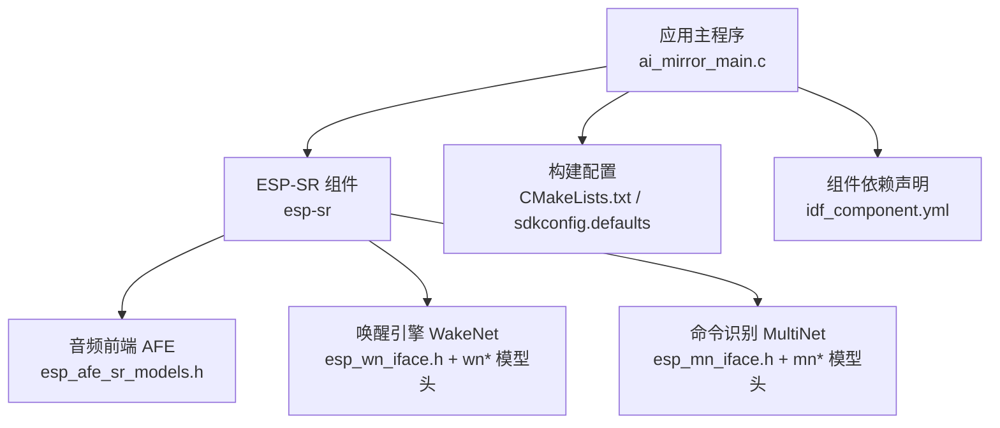
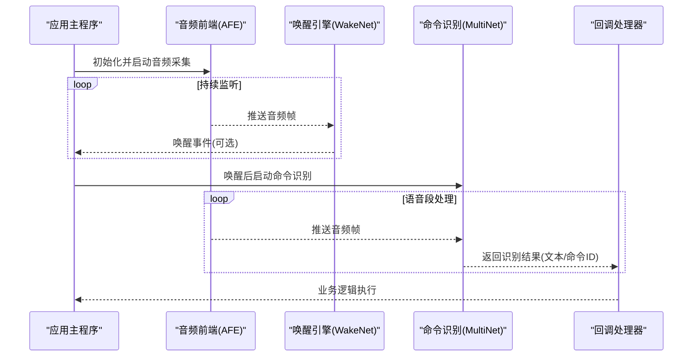
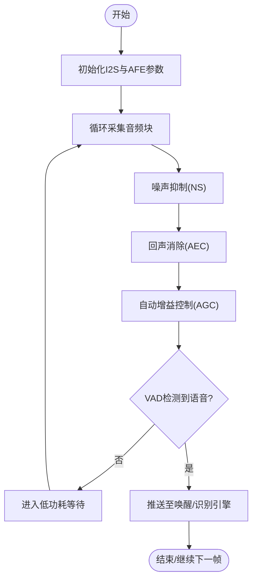
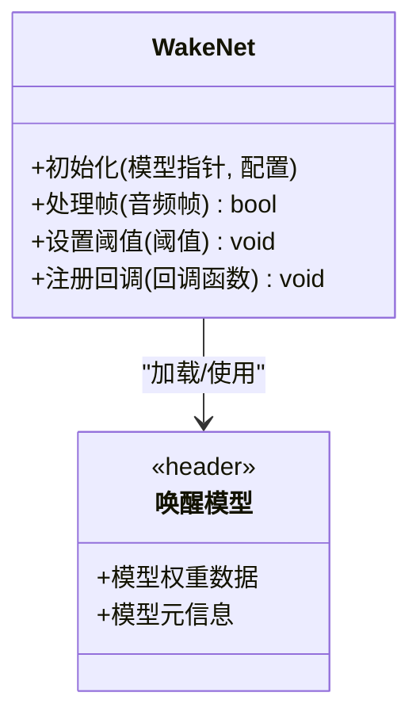
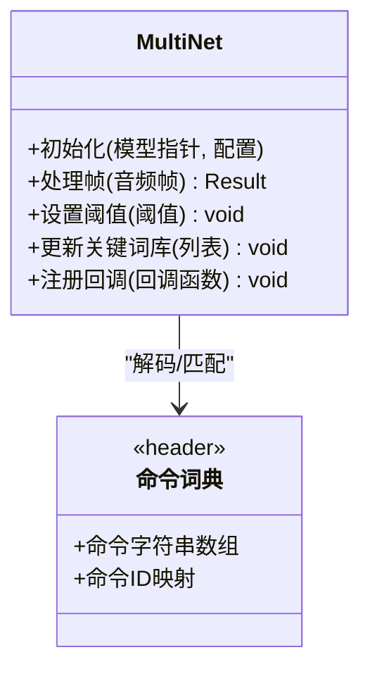
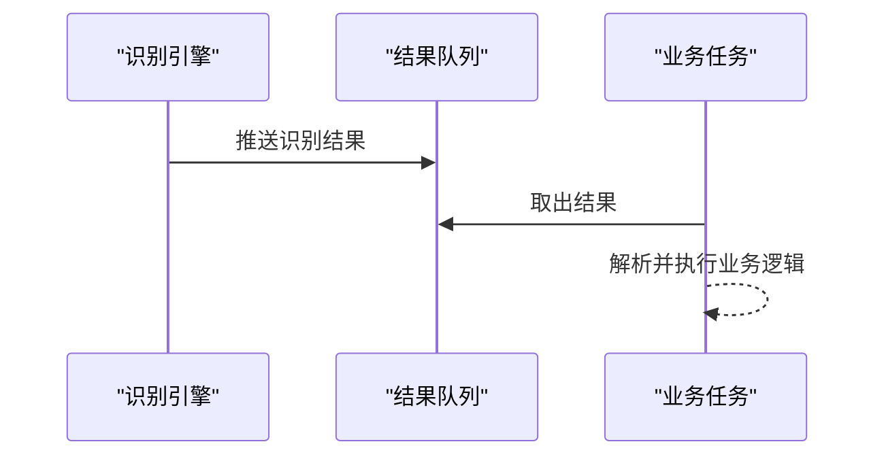
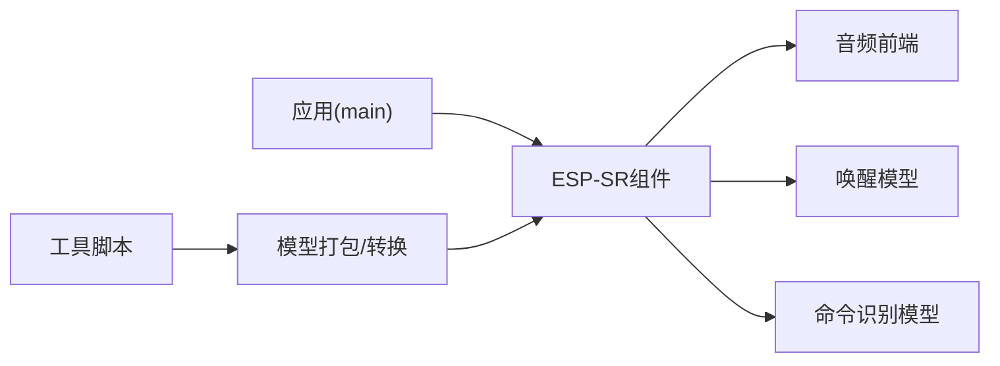

# 语音识别系统

<cite>
**本文档引用的文件**   
- [ai_mirror_main.c](file://Firmware/esp32_ai_mirror/main/ai_mirror_main.c)
- [ai_mirror_config.h](file://Firmware/esp32_ai_mirror/main/ai_mirror_config.h)
- [CMakeLists.txt](file://Firmware/esp32_ai_mirror/CMakeLists.txt)
- [sdkconfig.defaults](file://Firmware/esp32_ai_mirror/sdkconfig.defaults)
- [idf_component.yml](file://Firmware/esp32_ai_mirror/main/idf_component.yml)
- [esp_mn_iface.h](file://Firmware/esp32_ai_mirror/components/espressif__esp-sr/include/esp32/esp_mn_iface.h)
- [esp_wn_iface.h](file://Firmware/esp32_ai_mirror/components/espressif__esp-sr/include/esp32/esp_wn_iface.h)
- [esp_afe_sr_models.h](file://Firmware/esp32_ai_mirror/components/espressif__esp-sr/include/esp32/esp_afe_sr_models.h)
- [esp_mn_speech_commands.h](file://Firmware/esp32_ai_mirror/components/espressif__esp-sr/src/include/esp_mn_speech_commands.h)
- [multinet2_ch.h](file://Firmware/esp32_ai_mirror/components/espressif__esp-sr/include/esp32/multinet2_ch.h)
- [nihaoxiaozhi_wn5.h](file://Firmware/esp32_ai_mirror/components/espressif__esp-sr/include/esp32/nihaoxiaozhi_wn5.h)
- [hilexin_wn5.h](file://Firmware/esp32_ai_mirror/components/espressif__esp-sr/include/esp32/hilexin_wn5.h)
- [movemodel.py](file://Firmware/esp32_ai_mirror/components/espressif__esp-sr/model/movemodel.py)
- [pack_model.py](file://Firmware/esp32_ai_mirror/components/espressif__esp-sr/model/pack_model.py)
- [prepare_for_fst.py](file://Firmware/esp32_ai_mirror/components/espressif__esp-sr/tool/fst/prepare_for_fst.py)
- [multinet_g2p.py](file://Firmware/esp32_ai_mirror/components/espressif__esp-sr/tool/multinet_g2p.py)
- [multinet_pinyin.py](file://Firmware/esp32_ai_mirror/components/espressif__esp-sr/tool/multinet_pinyin.py)
</cite>

## 目录
1. [简介](#简介)
2. [项目结构](#项目结构)
3. [核心组件](#核心组件)
4. [架构总览](#架构总览)
5. [详细组件分析](#详细组件分析)
6. [依赖关系分析](#依赖关系分析)
7. [性能考虑](#性能考虑)
8. [故障排查指南](#故障排查指南)
9. [结论](#结论)
10. [附录](#附录)

## 简介
本文件面向AI镜子项目的语音识别子系统，聚焦于ESP-SR（Espressif Speech Recognition）组件的集成与配置。内容涵盖唤醒词检测、语音命令识别、多语言支持、音频前端处理（采集、降噪、回声消除）、WakeNet与MultiNet模型部署、阈值与关键词库管理、结果回调机制、模型训练与自定义扩展、性能优化策略以及调试与常见问题解决方案。文档力求以循序渐进的方式帮助开发者快速理解并落地语音功能。

## 项目结构
本项目采用ESP-IDF工程组织方式，语音相关能力由components下的espressif__esp-sr组件提供，应用层位于main目录。关键路径：
- 应用入口与配置：main/ai_mirror_main.c、main/ai_mirror_config.h
- 构建与组件依赖：CMakeLists.txt、sdkconfig.defaults、main/idf_component.yml
- ESP-SR接口与模型头文件：components/espressif__esp-sr/include/esp32/*
- 语音命令定义与工具：src/include/esp_mn_speech_commands.h、tool/*、model/*

图表来源 
- [ai_mirror_main.c](file://Firmware/esp32_ai_mirror/main/ai_mirror_main.c)
- [CMakeLists.txt](file://Firmware/esp32_ai_mirror/CMakeLists.txt)
- [sdkconfig.defaults](file://Firmware/esp32_ai_mirror/sdkconfig.defaults)
- [idf_component.yml](file://Firmware/esp32_ai_mirror/main/idf_component.yml)
- [esp_afe_sr_models.h](file://Firmware/esp32_ai_mirror/components/espressif__esp-sr/include/esp32/esp_afe_sr_models.h)
- [esp_wn_iface.h](file://Firmware/esp32_ai_mirror/components/espressif__esp-sr/include/esp32/esp_wn_iface.h)
- [esp_mn_iface.h](file://Firmware/esp32_ai_mirror/components/espressif__esp-sr/include/esp32/esp_mn_iface.h)

章节来源
- [ai_mirror_main.c](file://Firmware/esp32_ai_mirror/main/ai_mirror_main.c)
- [CMakeLists.txt](file://Firmware/esp32_ai_mirror/CMakeLists.txt)
- [sdkconfig.defaults](file://Firmware/esp32_ai_mirror/sdkconfig.defaults)
- [idf_component.yml](file://Firmware/esp32_ai_mirror/main/idf_component.yml)

## 核心组件
- 音频前端（AFE）：负责I2S采集、增益控制、噪声抑制、回声消除、VAD等预处理，为后续识别提供高质量音频流。
- 唤醒引擎（WakeNet）：低功耗持续监听，匹配内置或自定义唤醒词，触发后续识别流程。
- 语音命令识别（MultiNet）：在唤醒后运行，将语音片段转换为文本或命令ID，支持中英文及多语言模型。
- 命令词典与工具链：通过命令列表与工具脚本生成FST/拼音映射，便于扩展新命令。

章节来源
- [esp_afe_sr_models.h](file://Firmware/esp32_ai_mirror/components/espressif__esp-sr/include/esp32/esp_afe_sr_models.h)
- [esp_wn_iface.h](file://Firmware/esp32_ai_mirror/components/espressif__esp-sr/include/esp32/esp_wn_iface.h)
- [esp_mn_iface.h](file://Firmware/esp32_ai_mirror/components/espressif__esp-sr/include/esp32/esp_mn_iface.h)
- [esp_mn_speech_commands.h](file://Firmware/esp32_ai_mirror/components/espressif__esp-sr/src/include/esp_mn_speech_commands.h)

## 架构总览
下图展示了从音频采集到识别结果的端到端数据流，以及各模块之间的调用关系。

图表来源 
- [ai_mirror_main.c](file://Firmware/esp32_ai_mirror/main/ai_mirror_main.c)
- [esp_afe_sr_models.h](file://Firmware/esp32_ai_mirror/components/espressif__esp-sr/include/esp32/esp_afe_sr_models.h)
- [esp_wn_iface.h](file://Firmware/esp32_ai_mirror/components/espressif__esp-sr/include/esp32/esp_wn_iface.h)
- [esp_mn_iface.h](file://Firmware/esp32_ai_mirror/components/espressif__esp-sr/include/esp32/esp_mn_iface.h)

## 详细组件分析

### 音频前端（AFE）与预处理流程
- 功能要点
  - I2S音频采集：采样率、位宽、通道数需与硬件一致。
  - 噪声抑制（NS）：降低环境底噪，提升信噪比。
  - 回声消除（AEC）：消除扬声器回音对麦克风的影响。
  - 自动增益控制（AGC）：动态调整输入音量。
  - 语音活动检测（VAD）：判断是否有人声，减少无效计算。
- 典型流程
  - 初始化设备与参数
  - 启动DMA/I2S读取音频块
  - 依次经过NS/AEC/AGC/VAD
  - 输出标准化后的音频帧给WakeNet/MultiNet

章节来源
- [esp_afe_sr_models.h](file://Firmware/esp32_ai_mirror/components/espressif__esp-sr/include/esp32/esp_afe_sr_models.h)

### 唤醒引擎（WakeNet）
- 工作原理
  - 基于轻量级神经网络持续监听音频流，匹配预设唤醒词。
  - 支持多种唤醒词模型头文件，可按需选择或替换。
- 集成要点
  - 选择合适的唤醒模型头（如中文/英文）。
  - 设置唤醒阈值，平衡误唤醒与漏唤醒。
  - 注册唤醒事件回调，用于切换至命令识别阶段。
- 常用模型头
  - 中文示例：nihaoxiaozhi_wn5.h、hilexin_wn5.h
  - 其他语言或定制词：参考include/esp32下对应wn*头文件

图表来源 
- [esp_wn_iface.h](file://Firmware/esp32_ai_mirror/components/espressif__esp-sr/include/esp32/esp_wn_iface.h)
- [nihaoxiaozhi_wn5.h](file://Firmware/esp32_ai_mirror/components/espressif__esp-sr/include/esp32/nihaoxiaozhi_wn5.h)
- [hilexin_wn5.h](file://Firmware/esp32_ai_mirror/components/espressif__esp-sr/include/esp32/hilexin_wn5.h)

章节来源
- [esp_wn_iface.h](file://Firmware/esp32_ai_mirror/components/espressif__esp-sr/include/esp32/esp_wn_iface.h)
- [nihaoxiaozhi_wn5.h](file://Firmware/esp32_ai_mirror/components/espressif__esp-sr/include/esp32/nihaoxiaozhi_wn5.h)
- [hilexin_wn5.h](file://Firmware/esp32_ai_mirror/components/espressif__esp-sr/include/esp32/hilexin_wn5.h)

### 语音命令识别（MultiNet）
- 工作原理
  - 将唤醒后的语音片段转换为文本或命令ID，支持中英文等多语言模型。
  - 内部包含声学模型与语言模型（FST），可结合拼音/字符集进行解码。
- 集成要点
  - 选择合适语言模型头（如multinet2_ch.h）。
  - 配置关键词库（命令列表），确保与FST一致。
  - 设置识别阈值与超时，避免长时间占用CPU。
  - 注册识别结果回调，获取文本或命令ID。
- 常用模型头
  - 中文：multinet2_ch.h、mn*系列
  - 英文：mn*_en.h

图表来源 
- [esp_mn_iface.h](file://Firmware/esp32_ai_mirror/components/espressif__esp-sr/include/esp32/esp_mn_iface.h)
- [multinet2_ch.h](file://Firmware/esp32_ai_mirror/components/espressif__esp-sr/include/esp32/multinet2_ch.h)
- [esp_mn_speech_commands.h](file://Firmware/esp32_ai_mirror/components/espressif__esp-sr/src/include/esp_mn_speech_commands.h)

章节来源
- [esp_mn_iface.h](file://Firmware/esp32_ai_mirror/components/espressif__esp-sr/include/esp32/esp_mn_iface.h)
- [multinet2_ch.h](file://Firmware/esp32_ai_mirror/components/espressif__esp-sr/include/esp32/multinet2_ch.h)
- [esp_mn_speech_commands.h](file://Firmware/esp32_ai_mirror/components/espressif__esp-sr/src/include/esp_mn_speech_commands.h)

### 识别结果回调机制
- 设计建议
  - 回调函数应轻量，仅做必要的数据拷贝与状态标记。
  - 使用队列或消息总线将识别结果投递到业务线程。
  - 区分唤醒事件与识别结果事件，避免混淆。
- 典型流程
  - 引擎回调 -> 入队 -> 业务线程消费 -> 执行动作

[此图为概念性流程图，不直接映射具体源码文件]

### 多语言支持与关键词库管理
- 多语言
  - 通过不同语言模型头实现（如中文/英文）。
  - 注意语言包与FST的一致性。
- 关键词库
  - 维护命令字符串数组与ID映射。
  - 使用工具脚本生成FST，保证解码一致性。

章节来源
- [multinet2_ch.h](file://Firmware/esp32_ai_mirror/components/espressif__esp-sr/include/esp32/multinet2_ch.h)
- [esp_mn_speech_commands.h](file://Firmware/esp32_ai_mirror/components/espressif__esp-sr/src/include/esp_mn_speech_commands.h)

## 依赖关系分析
- 组件依赖
  - 应用层依赖ESP-SR组件提供的AFE/WakeNet/MultiNet接口。
  - 构建系统通过CMake与idf_component.yml声明依赖。
- 模型依赖
  - 唤醒与识别模型以头文件形式嵌入，需在编译期链接。
- 工具链依赖
  - 模型打包与FST生成依赖Python脚本。

图表来源 
- [CMakeLists.txt](file://Firmware/esp32_ai_mirror/CMakeLists.txt)
- [idf_component.yml](file://Firmware/esp32_ai_mirror/main/idf_component.yml)
- [movemodel.py](file://Firmware/esp32_ai_mirror/components/espressif__esp-sr/model/movemodel.py)
- [pack_model.py](file://Firmware/esp32_ai_mirror/components/espressif__esp-sr/model/pack_model.py)
- [prepare_for_fst.py](file://Firmware/esp32_ai_mirror/components/espressif__esp-sr/tool/fst/prepare_for_fst.py)

章节来源
- [CMakeLists.txt](file://Firmware/esp32_ai_mirror/CMakeLists.txt)
- [idf_component.yml](file://Firmware/esp32_ai_mirror/main/idf_component.yml)

## 性能考虑
- 内存使用
  - 合理选择模型精度（如q8量化）以降低RAM/Flash占用。
  - 避免重复加载模型，尽量全局复用实例。
- CPU占用
  - 使用VAD减少无效推理。
  - 合理设置帧长与采样率，平衡时延与算力。
- 识别准确率调优
  - 调整唤醒/识别阈值，权衡误唤醒与漏检。
  - 优化音频前端参数（NS/AEC/AGC）提升输入质量。
- 功耗优化
  - 在无语音时进入低功耗模式，仅在唤醒事件时唤醒CPU。

[本节为通用指导，不直接分析具体文件]

## 故障排查指南
- 常见问题
  - 无法唤醒：检查唤醒模型是否正确加载、阈值是否过高、音频链路是否正常。
  - 识别不准确：确认关键词库与FST一致，检查环境噪声与回声问题。
  - 高CPU占用：降低采样率/帧长，启用VAD，减少不必要的推理。
  - 内存不足：选择更小的模型或量化版本，释放未用资源。
- 调试建议
  - 打印AFE关键指标（SNR、VAD状态）。
  - 记录唤醒与识别事件时间戳，定位延迟瓶颈。
  - 使用工具脚本验证FST与命令列表一致性。

章节来源
- [prepare_for_fst.py](file://Firmware/esp32_ai_mirror/components/espressif__esp-sr/tool/fst/prepare_for_fst.py)
- [multinet_g2p.py](file://Firmware/esp32_ai_mirror/components/espressif__esp-sr/tool/multinet_g2p.py)
- [multinet_pinyin.py](file://Firmware/esp32_ai_mirror/components/espressif__esp-sr/tool/multinet_pinyin.py)

## 结论
ESP-SR为AI镜子提供了完整的语音识别方案，涵盖音频前端、唤醒与命令识别、多语言支持与工具链。通过合理的配置与优化，可在资源受限的嵌入式平台上实现稳定、低延迟、低功耗的语音交互体验。建议开发者从标准模型入手，逐步引入自定义唤醒词与命令扩展，并结合调试工具持续优化性能与准确率。

## 附录
- 模型训练与自定义方法
  - 使用movemodel.py与pack_model.py进行模型打包与格式转换。
  - 通过prepare_for_fst.py生成FST，确保命令列表与解码器一致。
  - 利用multinet_g2p.py与multinet_pinyin.py辅助拼音与发音映射。
- 最佳实践
  - 先验证音频链路质量，再调参识别阈值。
  - 小步迭代：每次只变更一个参数或模型，便于定位问题。
  - 建立回归测试用例，覆盖常见环境与噪声场景。

章节来源
- [movemodel.py](file://Firmware/esp32_ai_mirror/components/espressif__esp-sr/model/movemodel.py)
- [pack_model.py](file://Firmware/esp32_ai_mirror/components/espressif__esp-sr/model/pack_model.py)
- [prepare_for_fst.py](file://Firmware/esp32_ai_mirror/components/espressif__esp-sr/tool/fst/prepare_for_fst.py)
- [multinet_g2p.py](file://Firmware/esp32_ai_mirror/components/espressif__esp-sr/tool/multinet_g2p.py)
- [multinet_pinyin.py](file://Firmware/esp32_ai_mirror/components/espressif__esp-sr/tool/multinet_pinyin.py)