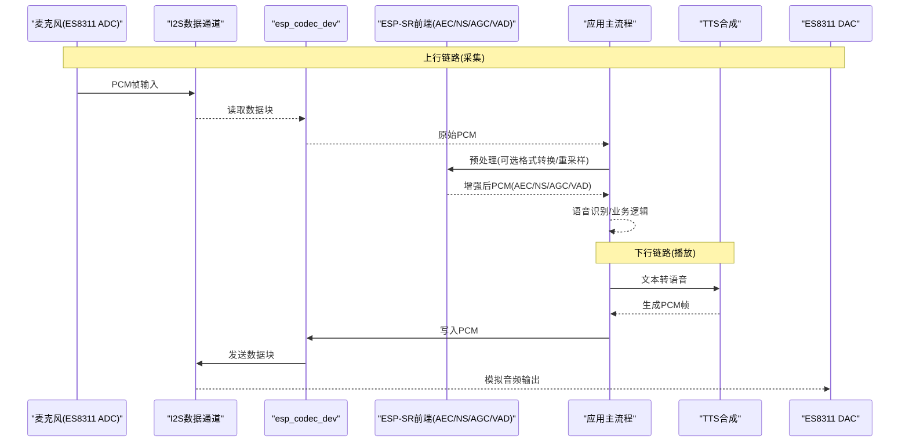
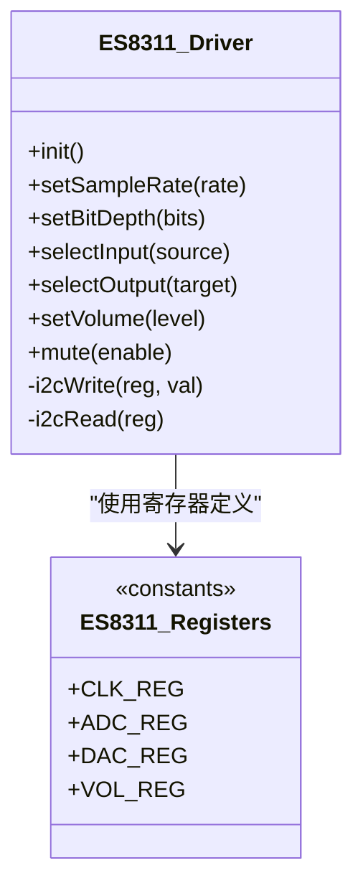
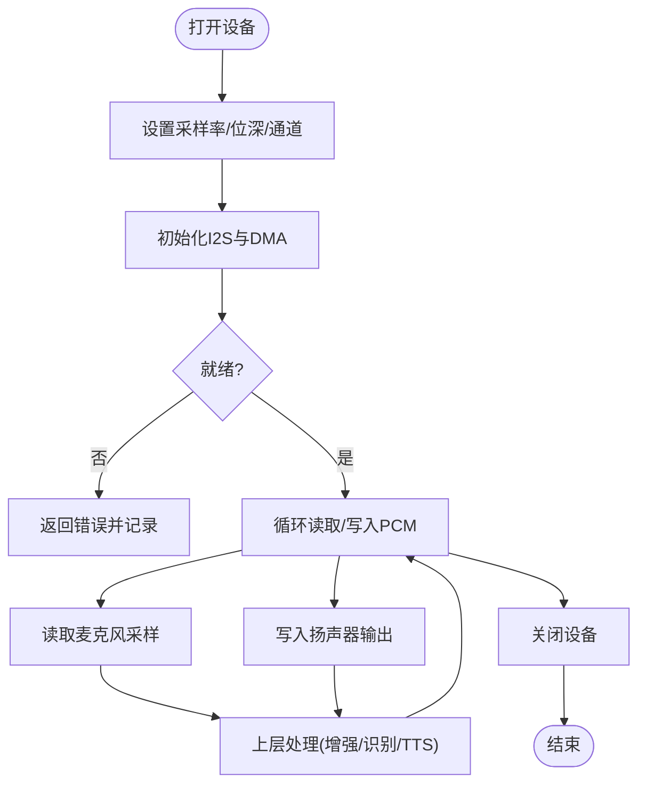
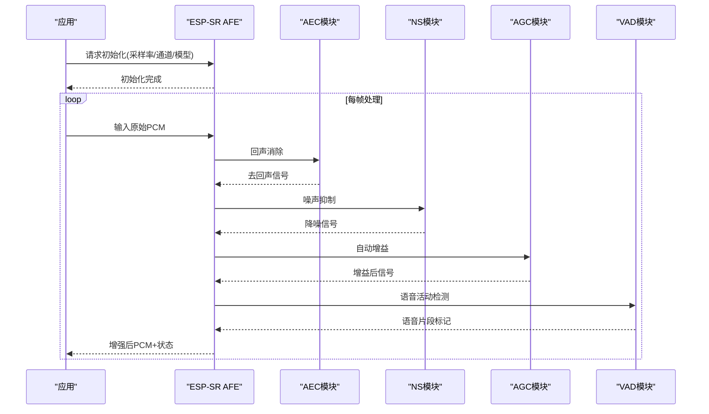
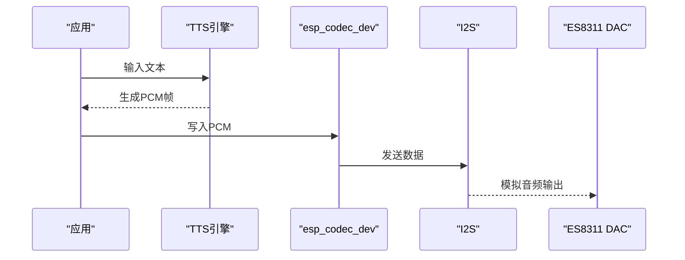
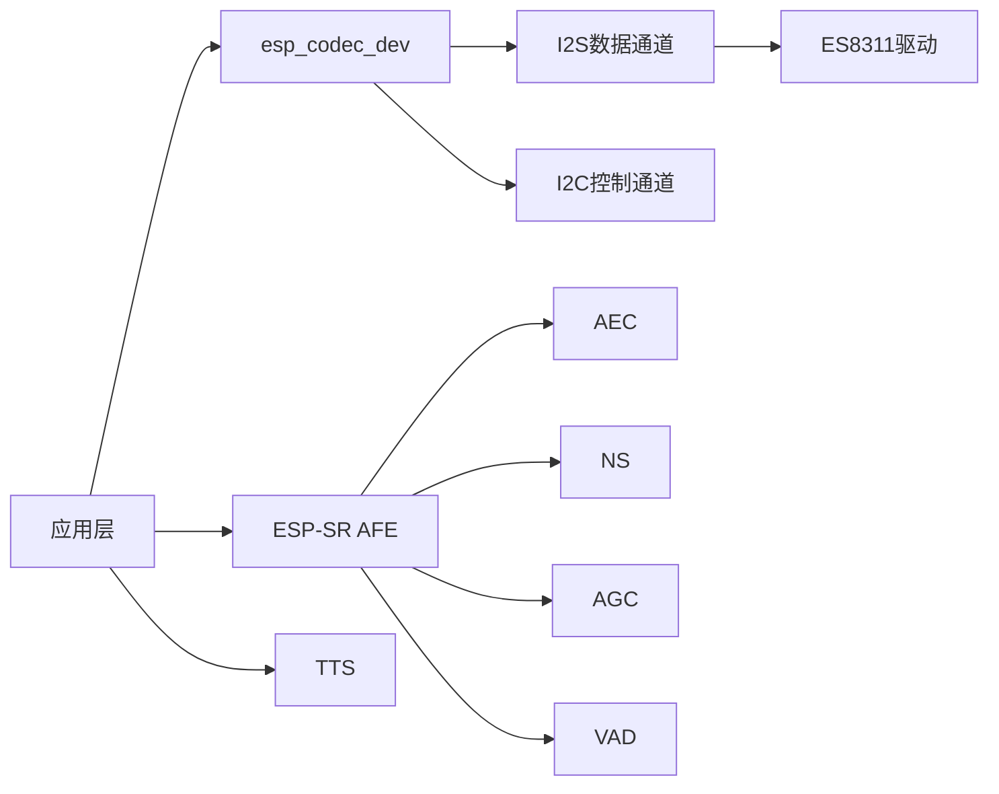

# 音频处理系统

<cite>
**本文引用的文件**   
- [ai_mirror_main.c](file://Firmware/esp32_ai_mirror/main/ai_mirror_main.c)
- [ai_mirror_config.h](file://Firmware/esp32_ai_mirror/main/ai_mirror_config.h)
- [es8311.c](file://Firmware/esp32_ai_mirror/managed_components/espressif__es8311/es8311.c)
- [es8311.h](file://Firmware/esp32_ai_mirror/managed_components/espressif__es8311/include/es8311.h)
- [es8311_reg.h](file://Firmware/esp32_ai_mirror/managed_components/espressif__es8311/priv_include/es8311_reg.h)
- [esp_codec_dev.c](file://Firmware/esp32_ai_mirror/managed_components/espressif__esp_codec_dev/esp_codec_dev.c)
- [esp_codec_dev.h](file://Firmware/esp32_ai_mirror/managed_components/espressif__esp_codec_dev/include/esp_codec_dev.h)
- [audio_codec_data_i2s.c](file://Firmware/esp32_ai_mirror/managed_components/espressif__esp_codec_dev/platform/audio_codec_data_i2s.c)
- [audio_codec_ctrl_i2c.c](file://Firmware/esp32_ai_mirror/managed_components/espressif__esp_codec_dev/platform/audio_codec_ctrl_i2c.c)
- [esp_afe_sr_1mic.ref](file://Firmware/esp32_ai_mirror/components/espressif__esp-sr/src/esp_afe_sr_1mic.ref)
- [esp_agc.h](file://Firmware/esp32_ai_mirror/components/espressif__esp-sr/include/esp_agc.h)
- [esp_ns.h](file://Firmware/esp32_ai_mirror/components/espressif__esp-sr/include/esp_ns.h)
- [esp_aec.h](file://Firmware/esp32_ai_mirror/components/espressif__esp-sr/include/esp_aec.h)
- [esp_vad.h](file://Firmware/esp32_ai_mirror/components/espressif__esp-sr/include/esp_vad.h)
- [esp_afe_sr_iface.h](file://Firmware/esp32_ai_mirror/components/espressif__esp-sr/include/esp_afe_sr_iface.h)
- [esp_afe_sr_models.h](file://Firmware/esp32_ai_mirror/components/espressif__esp-sr/include/esp_afe_sr_models.h)
- [esp_tts_chinese.h](file://Firmware/esp32_ai_mirror/components/espressif__esp-sr/esp-tts/esp_tts_chinese/include/esp_tts_chinese.h)
- [CMakeLists.txt](file://Firmware/esp32_ai_mirror/CMakeLists.txt)
- [sdkconfig.defaults](file://Firmware/esp32_ai_mirror/sdkconfig.defaults)
</cite>

## 目录
1. [简介](#简介)
2. [项目结构](#项目结构)
3. [核心组件](#核心组件)
4. [架构总览](#架构总览)
5. [详细组件分析](#详细组件分析)
6. [依赖关系分析](#依赖关系分析)
7. [性能考虑](#性能考虑)
8. [故障诊断指南](#故障诊断指南)
9. [结论](#结论)
10. [附录](#附录)

## 简介
本技术文档面向AI镜子的音频处理子系统，围绕ES8311编解码器驱动、ESP-SR前端增强（AGC/NS/AEC/VAD）、I2S数据通路、TTS播放链路以及缓冲区与实时性优化进行系统化说明。文档覆盖从麦克风采集到扬声器输出的完整音频流，解释关键算法的作用与集成方式，并提供参数调优、监控与排障建议，帮助开发者快速集成与扩展音频功能。

## 项目结构
本项目基于ESP-IDF构建，音频相关代码主要分布在以下位置：
- 应用层入口与配置：main目录下的主程序与配置文件
- 编解码器驱动：ES8311驱动组件
- 通用编解码设备抽象：esp_codec_dev组件（I2S数据通道、I2C控制通道）
- 语音前端与增强：esp-sr组件（AEC/NS/AGC/VAD等）
- TTS合成：esp-sr中的中文TTS库
- 构建与SDK配置：CMakeLists与sdkconfig.defaults

```mermaid
graph TB
subgraph "应用层"
APP["应用主流程<br/>ai_mirror_main.c"]
CFG["系统配置<br/>ai_mirror_config.h"]
end
subgraph "编解码设备抽象"
ECD["esp_codec_dev<br/>统一接口"]
I2S["I2S数据通道<br/>audio_codec_data_i2s.c"]
I2C["I2C控制通道<br/>audio_codec_ctrl_i2c.c"]
end
subgraph "硬件驱动"
ES8311["ES8311驱动<br/>es8311.c / es8311.h"]
REG["寄存器定义<br/>es8311_reg.h"]
end
subgraph "语音前端与增强"
AFE["AFE接口与模型<br/>esp_afe_sr_iface.h / esp_afe_sr_models.h"]
AGC["自动增益控制<br/>esp_agc.h"]
NS["噪声抑制<br/>esp_ns.h"]
AEC["回声消除<br/>esp_aec.h"]
VAD["语音活动检测<br/>esp_vad.h"]
REF["单麦参考实现<br/>esp_afe_sr_1mic.ref"]
end
subgraph "TTS"
TTS["中文TTS<br/>esp_tts_chinese.h"]
end
APP --> ECD
ECD --> I2S
ECD --> I2C
ECD --> ES8311
ES8311 --> REG
APP --> AFE
AFE --> AGC
AFE --> NS
AFE --> AEC
AFE --> VAD
AFE --> REF
APP --> TTS
```

图表来源
- [ai_mirror_main.c:1-200](file://Firmware/esp32_ai_mirror/main/ai_mirror_main.c#L1-L200)
- [esp_codec_dev.c:1-200](file://Firmware/esp32_ai_mirror/managed_components/espressif__esp_codec_dev/esp_codec_dev.c#L1-L200)
- [audio_codec_data_i2s.c:1-200](file://Firmware/esp32_ai_mirror/managed_components/espressif__esp_codec_dev/platform/audio_codec_data_i2s.c#L1-L200)
- [audio_codec_ctrl_i2c.c:1-200](file://Firmware/esp32_ai_mirror/managed_components/espressif__esp_codec_dev/platform/audio_codec_ctrl_i2c.c#L1-L200)
- [es8311.c:1-200](file://Firmware/esp32_ai_mirror/managed_components/espressif__es8311/es8311.c#L1-L200)
- [es8311.h:1-200](file://Firmware/esp32_ai_mirror/managed_components/espressif__es8311/include/es8311.h#L1-L200)
- [es8311_reg.h:1-200](file://Firmware/esp32_ai_mirror/managed_components/espressif__es8311/priv_include/es8311_reg.h#L1-L200)
- [esp_afe_sr_iface.h:1-200](file://Firmware/esp32_ai_mirror/components/espressif__esp-sr/include/esp_afe_sr_iface.h#L1-L200)
- [esp_afe_sr_models.h:1-200](file://Firmware/esp32_ai_mirror/components/espressif__esp-sr/include/esp_afe_sr_models.h#L1-L200)
- [esp_agc.h:1-200](file://Firmware/esp32_ai_mirror/components/espressif__esp-sr/include/esp_agc.h#L1-L200)
- [esp_ns.h:1-200](file://Firmware/esp32_ai_mirror/components/espressif__esp-sr/include/esp_ns.h#L1-L200)
- [esp_aec.h:1-200](file://Firmware/esp32_ai_mirror/components/espressif__esp-sr/include/esp_aec.h#L1-L200)
- [esp_vad.h:1-200](file://Firmware/esp32_ai_mirror/components/espressif__esp-sr/include/esp_vad.h#L1-L200)
- [esp_tts_chinese.h:1-200](file://Firmware/esp32_ai_mirror/components/espressif__esp-sr/esp-tts/esp_tts_chinese/include/esp_tts_chinese.h#L1-L200)

章节来源
- [CMakeLists.txt:1-100](file://Firmware/esp32_ai_mirror/CMakeLists.txt#L1-L100)
- [sdkconfig.defaults:1-100](file://Firmware/esp32_ai_mirror/sdkconfig.defaults#L1-L100)

## 核心组件
- ES8311编解码器驱动：提供I2C寄存器访问、时钟与电源管理、ADC/DAC路径选择、音量控制等能力。
- esp_codec_dev抽象层：统一编解码设备接口，屏蔽底层差异，向上提供打开/关闭、采样率/位深设置、数据读写、音量控制等API。
- I2S数据通道：负责PCM数据的DMA传输，连接CPU与ES8311的I2S接口，支持双工或半双工模式。
- ESP-SR前端增强：包括AEC（回声消除）、NS（噪声抑制）、AGC（自动增益控制）、VAD（语音活动检测），通过AFE接口接入。
- TTS模块：将文本转换为PCM音频流，供DAC输出播放。

章节来源
- [es8311.c:1-200](file://Firmware/esp32_ai_mirror/managed_components/espressif__es8311/es8311.c#L1-L200)
- [es8311.h:1-200](file://Firmware/esp32_ai_mirror/managed_components/espressif__es8311/include/es8311.h#L1-L200)
- [esp_codec_dev.c:1-200](file://Firmware/esp32_ai_mirror/managed_components/espressif__esp_codec_dev/esp_codec_dev.c#L1-L200)
- [esp_codec_dev.h:1-200](file://Firmware/esp32_ai_mirror/managed_components/espressif__esp_codec_dev/include/esp_codec_dev.h#L1-L200)
- [audio_codec_data_i2s.c:1-200](file://Firmware/esp32_ai_mirror/managed_components/espressif__esp_codec_dev/platform/audio_codec_data_i2s.c#L1-L200)
- [audio_codec_ctrl_i2c.c:1-200](file://Firmware/esp32_ai_mirror/managed_components/espressif__esp_codec_dev/platform/audio_codec_ctrl_i2c.c#L1-L200)
- [esp_afe_sr_iface.h:1-200](file://Firmware/esp32_ai_mirror/components/espressif__esp-sr/include/esp_afe_sr_iface.h#L1-L200)
- [esp_agc.h:1-200](file://Firmware/esp32_ai_mirror/components/espressif__esp-sr/include/esp_agc.h#L1-L200)
- [esp_ns.h:1-200](file://Firmware/esp32_ai_mirror/components/espressif__esp-sr/include/esp_ns.h#L1-L200)
- [esp_aec.h:1-200](file://Firmware/esp32_ai_mirror/components/espressif__esp-sr/include/esp_aec.h#L1-L200)
- [esp_vad.h:1-200](file://Firmware/esp32_ai_mirror/components/espressif__esp-sr/include/esp_vad.h#L1-L200)
- [esp_tts_chinese.h:1-200](file://Firmware/esp32_ai_mirror/components/espressif__esp-sr/esp-tts/esp_tts_chinese/include/esp_tts_chinese.h#L1-L200)

## 架构总览
下图展示从麦克风采集到扬声器输出的端到端数据流，包含增强处理与TTS播放路径。



图表来源
- [audio_codec_data_i2s.c:1-200](file://Firmware/esp32_ai_mirror/managed_components/espressif__esp_codec_dev/platform/audio_codec_data_i2s.c#L1-L200)
- [esp_codec_dev.c:1-200](file://Firmware/esp32_ai_mirror/managed_components/espressif__esp_codec_dev/esp_codec_dev.c#L1-L200)
- [esp_afe_sr_iface.h:1-200](file://Firmware/esp32_ai_mirror/components/espressif__esp-sr/include/esp_afe_sr_iface.h#L1-L200)
- [esp_tts_chinese.h:1-200](file://Firmware/esp32_ai_mirror/components/espressif__esp-sr/esp-tts/esp_tts_chinese/include/esp_tts_chinese.h#L1-L200)

## 详细组件分析

### ES8311驱动与配置
- 功能要点
  - I2C寄存器读写与时钟/电源初始化
  - ADC/DAC路径选择、采样率与位深配置
  - 音量调节与静音控制
  - 与I2S接口的引脚与时序绑定
- 典型配置项
  - 采样率：如16kHz/48kHz
  - 位深：16bit/24bit
  - 通道数：单声道/立体声
  - 输入源：MIC/LINE-IN
  - 输出目标：SPK/HP
- 错误处理
  - I2C通信失败重试与回退策略
  - 寄存器写失败的日志与状态上报



图表来源
- [es8311.c:1-200](file://Firmware/esp32_ai_mirror/managed_components/espressif__es8311/es8311.c#L1-L200)
- [es8311.h:1-200](file://Firmware/esp32_ai_mirror/managed_components/espressif__es8311/include/es8311.h#L1-L200)
- [es8311_reg.h:1-200](file://Firmware/esp32_ai_mirror/managed_components/espressif__es8311/priv_include/es8311_reg.h#L1-L200)

章节来源
- [es8311.c:1-200](file://Firmware/esp32_ai_mirror/managed_components/espressif__es8311/es8311.c#L1-L200)
- [es8311.h:1-200](file://Firmware/esp32_ai_mirror/managed_components/espressif__es8311/include/es8311.h#L1-L200)
- [es8311_reg.h:1-200](file://Firmware/esp32_ai_mirror/managed_components/espressif__es8311/priv_include/es8311_reg.h#L1-L200)

### esp_codec_dev抽象层与I2S数据通道
- 功能要点
  - 统一的设备打开/关闭、参数设置、数据读写接口
  - 适配不同编解码芯片，隐藏I2C/I2S细节
  - 音量控制与静音开关
- I2S数据通道
  - DMA缓冲与环形队列
  - 中断回调触发数据搬运
  - 双工模式下的收发同步



图表来源
- [esp_codec_dev.c:1-200](file://Firmware/esp32_ai_mirror/managed_components/espressif__esp_codec_dev/esp_codec_dev.c#L1-L200)
- [audio_codec_data_i2s.c:1-200](file://Firmware/esp32_ai_mirror/managed_components/espressif__esp_codec_dev/platform/audio_codec_data_i2s.c#L1-L200)

章节来源
- [esp_codec_dev.c:1-200](file://Firmware/esp32_ai_mirror/managed_components/espressif__esp_codec_dev/esp_codec_dev.c#L1-L200)
- [esp_codec_dev.h:1-200](file://Firmware/esp32_ai_mirror/managed_components/espressif__esp_codec_dev/include/esp_codec_dev.h#L1-L200)
- [audio_codec_data_i2s.c:1-200](file://Firmware/esp32_ai_mirror/managed_components/espressif__esp_codec_dev/platform/audio_codec_data_i2s.c#L1-L200)

### ESP-SR前端增强（AEC/NS/AGC/VAD）
- 功能要点
  - AEC：消除扬声器回声对麦克风信号的影响
  - NS：抑制环境噪声，提升信噪比
  - AGC：根据输入电平动态调整增益
  - VAD：检测语音活动，减少非语音段处理开销
- 集成方式
  - 通过AFE接口获取增强后的PCM帧
  - 可结合单麦参考实现进行参数调优



图表来源
- [esp_afe_sr_iface.h:1-200](file://Firmware/esp32_ai_mirror/components/espressif__esp-sr/include/esp_afe_sr_iface.h#L1-L200)
- [esp_afe_sr_models.h:1-200](file://Firmware/esp32_ai_mirror/components/espressif__esp-sr/include/esp_afe_sr_models.h#L1-L200)
- [esp_aec.h:1-200](file://Firmware/esp32_ai_mirror/components/espressif__esp-sr/include/esp_aec.h#L1-L200)
- [esp_ns.h:1-200](file://Firmware/esp32_ai_mirror/components/espressif__esp-sr/include/esp_ns.h#L1-L200)
- [esp_agc.h:1-200](file://Firmware/esp32_ai_mirror/components/espressif__esp-sr/include/esp_agc.h#L1-L200)
- [esp_vad.h:1-200](file://Firmware/esp32_ai_mirror/components/espressif__esp-sr/include/esp_vad.h#L1-L200)
- [esp_afe_sr_1mic.ref:1-200](file://Firmware/esp32_ai_mirror/components/espressif__esp-sr/src/esp_afe_sr_1mic.ref#L1-L200)

章节来源
- [esp_afe_sr_iface.h:1-200](file://Firmware/esp32_ai_mirror/components/espressif__esp-sr/include/esp_afe_sr_iface.h#L1-L200)
- [esp_afe_sr_models.h:1-200](file://Firmware/esp32_ai_mirror/components/espressif__esp-sr/include/esp_afe_sr_models.h#L1-L200)
- [esp_aec.h:1-200](file://Firmware/esp32_ai_mirror/components/espressif__esp-sr/include/esp_aec.h#L1-L200)
- [esp_ns.h:1-200](file://Firmware/esp32_ai_mirror/components/espressif__esp-sr/include/esp_ns.h#L1-L200)
- [esp_agc.h:1-200](file://Firmware/esp32_ai_mirror/components/espressif__esp-sr/include/esp_agc.h#L1-L200)
- [esp_vad.h:1-200](file://Firmware/esp32_ai_mirror/components/espressif__esp-sr/include/esp_vad.h#L1-L200)
- [esp_afe_sr_1mic.ref:1-200](file://Firmware/esp32_ai_mirror/components/espressif__esp-sr/src/esp_afe_sr_1mic.ref#L1-L200)

### TTS播放链路
- 功能要点
  - 文本到语音的实时合成
  - 输出PCM帧，供esp_codec_dev写入I2S
- 集成方式
  - 在应用层调用TTS接口，获取音频数据块
  - 将数据块写入编解码设备，经DAC播放



图表来源
- [esp_tts_chinese.h:1-200](file://Firmware/esp32_ai_mirror/components/espressif__esp-sr/esp-tts/esp_tts_chinese/include/esp_tts_chinese.h#L1-L200)
- [esp_codec_dev.c:1-200](file://Firmware/esp32_ai_mirror/managed_components/espressif__esp_codec_dev/esp_codec_dev.c#L1-L200)
- [audio_codec_data_i2s.c:1-200](file://Firmware/esp32_ai_mirror/managed_components/espressif__esp_codec_dev/platform/audio_codec_data_i2s.c#L1-L200)

章节来源
- [esp_tts_chinese.h:1-200](file://Firmware/esp32_ai_mirror/components/espressif__esp-sr/esp-tts/esp_tts_chinese/include/esp_tts_chinese.h#L1-L200)
- [esp_codec_dev.c:1-200](file://Firmware/esp32_ai_mirror/managed_components/espressif__esp_codec_dev/esp_codec_dev.c#L1-L200)

### 音频格式转换、采样率调整与音量控制
- 格式转换
  - 在应用层或DSP库中进行位深转换（如16bit/24bit）
  - 多声道到单声道的混音或选择
- 采样率调整
  - 使用重采样算法匹配AFE或TTS所需采样率
  - 注意延迟与音质折中
- 音量控制
  - 硬件音量（ES8311寄存器）
  - 软件音量（数字增益）

章节来源
- [es8311.c:1-200](file://Firmware/esp32_ai_mirror/managed_components/espressif__es8311/es8311.c#L1-L200)
- [esp_codec_dev.c:1-200](file://Firmware/esp32_ai_mirror/managed_components/espressif__esp_codec_dev/esp_codec_dev.c#L1-L200)

### 音频缓冲区管理与实时优化
- 缓冲区策略
  - 环形缓冲与双缓冲避免数据竞争
  - DMA大小与中断频率平衡延迟与CPU占用
- 实时性优化
  - 低延迟路径优先（短帧长、高优先级任务）
  - 避免阻塞操作与频繁内存分配
- 内存使用
  - 预分配固定大小缓冲区
  - 复用缓冲区减少碎片

章节来源
- [audio_codec_data_i2s.c:1-200](file://Firmware/esp32_ai_mirror/managed_components/espressif__esp_codec_dev/platform/audio_codec_data_i2s.c#L1-L200)
- [esp_codec_dev.c:1-200](file://Firmware/esp32_ai_mirror/managed_components/espressif__esp_codec_dev/esp_codec_dev.c#L1-L200)

### 设备初始化流程、错误处理与异常恢复
- 初始化流程
  - I2C控制器初始化与ES8311复位
  - I2S时钟与引脚配置
  - 编解码设备参数设置（采样率/位深/通道）
  - AFE初始化与模型加载
- 错误处理
  - I2C读写失败重试与降级
  - I2S DMA错误回调与恢复
  - AFE初始化失败的回退策略
- 异常恢复
  - 看门狗与心跳监测
  - 自动重启音频子任务

章节来源
- [es8311.c:1-200](file://Firmware/esp32_ai_mirror/managed_components/espressif__es8311/es8311.c#L1-L200)
- [audio_codec_ctrl_i2c.c:1-200](file://Firmware/esp32_ai_mirror/managed_components/espressif__esp_codec_dev/platform/audio_codec_ctrl_i2c.c#L1-L200)
- [audio_codec_data_i2s.c:1-200](file://Firmware/esp32_ai_mirror/managed_components/espressif__esp_codec_dev/platform/audio_codec_data_i2s.c#L1-L200)
- [esp_afe_sr_iface.h:1-200](file://Firmware/esp32_ai_mirror/components/espressif__esp-sr/include/esp_afe_sr_iface.h#L1-L200)

## 依赖关系分析
- 组件耦合
  - 应用层依赖esp_codec_dev统一接口
  - esp_codec_dev依赖I2S数据通道与I2C控制通道
  - I2S数据通道依赖ES8311驱动
  - AFE依赖ESP-SR增强模块
- 外部依赖
  - ESP-IDF内核与外设驱动
  - ESP-SR库与TTS库



图表来源
- [esp_codec_dev.c:1-200](file://Firmware/esp32_ai_mirror/managed_components/espressif__esp_codec_dev/esp_codec_dev.c#L1-L200)
- [audio_codec_data_i2s.c:1-200](file://Firmware/esp32_ai_mirror/managed_components/espressif__esp_codec_dev/platform/audio_codec_data_i2s.c#L1-L200)
- [audio_codec_ctrl_i2c.c:1-200](file://Firmware/esp32_ai_mirror/managed_components/espressif__esp_codec_dev/platform/audio_codec_ctrl_i2c.c#L1-L200)
- [es8311.c:1-200](file://Firmware/esp32_ai_mirror/managed_components/espressif__es8311/es8311.c#L1-L200)
- [esp_afe_sr_iface.h:1-200](file://Firmware/esp32_ai_mirror/components/espressif__esp-sr/include/esp_afe_sr_iface.h#L1-L200)
- [esp_tts_chinese.h:1-200](file://Firmware/esp32_ai_mirror/components/espressif__esp-sr/esp-tts/esp_tts_chinese/include/esp_tts_chinese.h#L1-L200)

章节来源
- [CMakeLists.txt:1-100](file://Firmware/esp32_ai_mirror/CMakeLists.txt#L1-L100)
- [sdkconfig.defaults:1-100](file://Firmware/esp32_ai_mirror/sdkconfig.defaults#L1-L100)

## 性能考虑
- 延迟与吞吐
  - 减小I2S帧长以降低延迟，但需权衡CPU占用
  - 合理设置DMA缓冲大小，避免溢出或欠载
- CPU与内存
  - 使用固定大小缓冲与对象池减少分配开销
  - 将耗时处理移至后台任务，保持音频线程实时性
- 算法复杂度
  - AEC/NS/AGC参数调优以平衡效果与计算量
  - 重采样与格式转换尽量使用定点运算

[本节为通用指导，不直接分析具体文件]

## 故障诊断指南
- 常见问题
  - I2C通信失败：检查引脚、上拉电阻与地址配置
  - 无声音输出：确认DAC路径、音量与静音状态
  - 回声严重：调整AEC参数与环境声学条件
  - 噪声大：优化NS参数与麦克风增益
  - 卡顿或爆音：增大缓冲区或降低处理负载
- 诊断工具
  - 日志打印关键状态与错误码
  - 示波器/频谱仪观察波形与频域特性
  - 内置测试用例验证数据通路

章节来源
- [audio_codec_ctrl_i2c.c:1-200](file://Firmware/esp32_ai_mirror/managed_components/espressif__esp_codec_dev/platform/audio_codec_ctrl_i2c.c#L1-L200)
- [audio_codec_data_i2s.c:1-200](file://Firmware/esp32_ai_mirror/managed_components/espressif__esp_codec_dev/platform/audio_codec_data_i2s.c#L1-L200)
- [es8311.c:1-200](file://Firmware/esp32_ai_mirror/managed_components/espressif__es8311/es8311.c#L1-L200)

## 结论
本音频处理系统以ES8311为编解码核心，通过esp_codec_dev抽象层与I2S数据通道实现稳定可靠的PCM传输；借助ESP-SR前端增强提升语音质量；TTS模块提供自然流畅的语音输出。通过合理的缓冲区管理、实时优化与完善的错误处理机制，系统在资源受限环境下仍能保持良好性能。开发者可依据本文档进行参数调优与功能扩展。

[本节为总结，不直接分析具体文件]

## 附录
- 参数配置建议
  - 采样率：16kHz（语音识别）或48kHz（高保真播放）
  - 位深：16bit（默认）或24bit（高质量）
  - 通道：单声道（采集）/立体声（播放）
- 监控指标
  - 丢包率、缓冲区欠载/溢出次数
  - CPU占用与内存峰值
  - 音频质量主观评价（清晰度、噪声水平、回声残留）

[本节为补充信息，不直接分析具体文件]