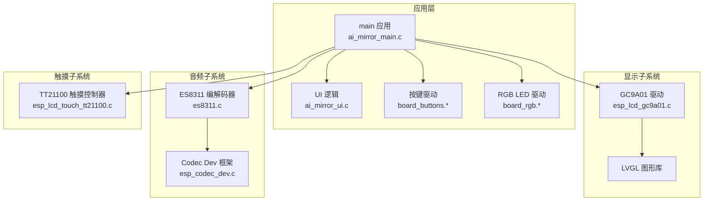
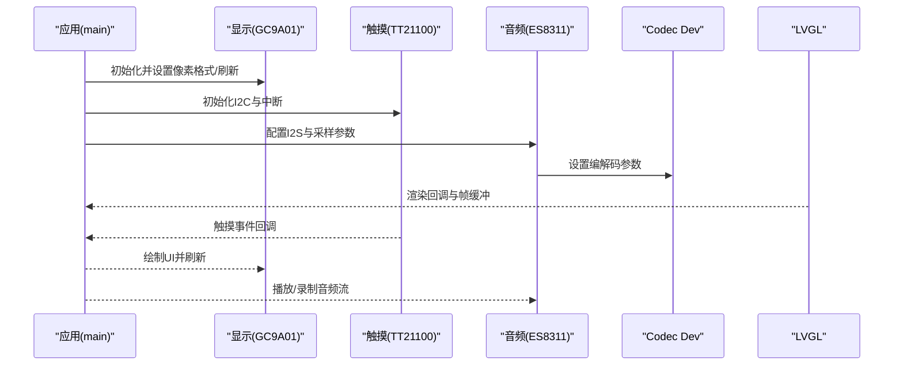
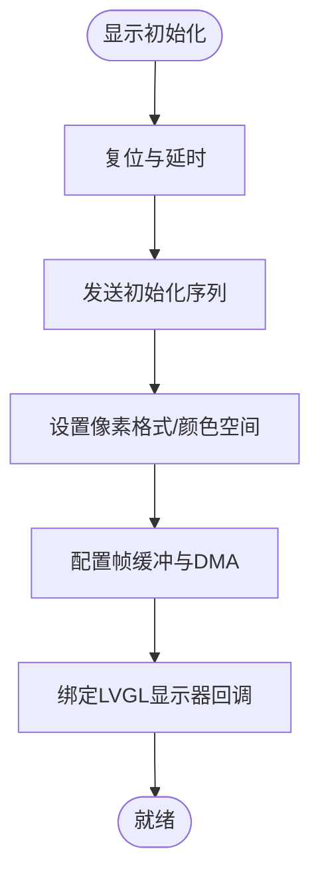
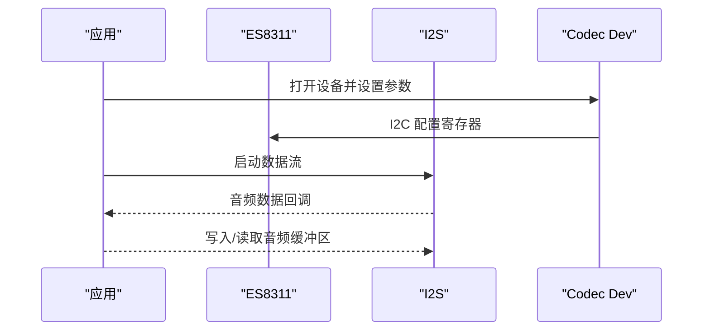
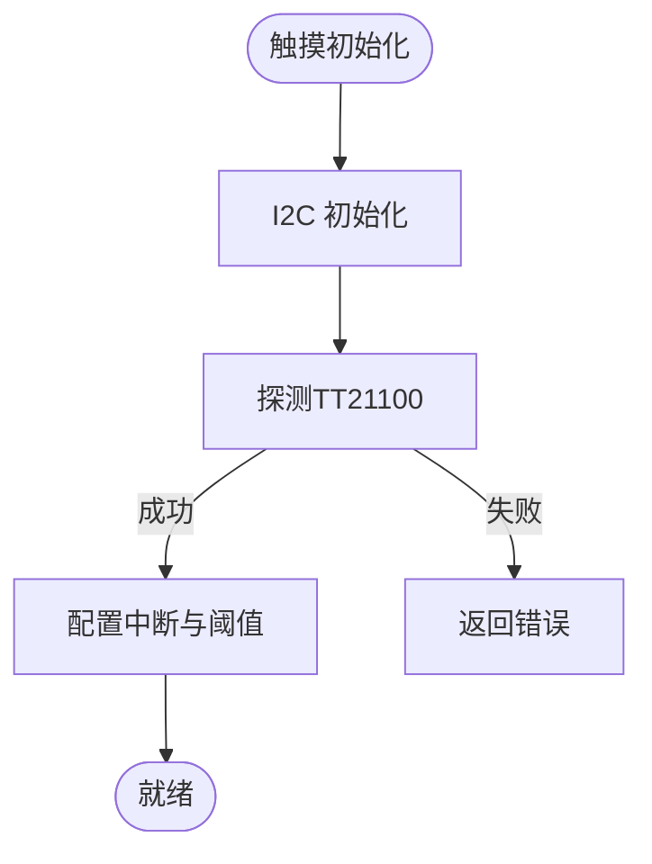
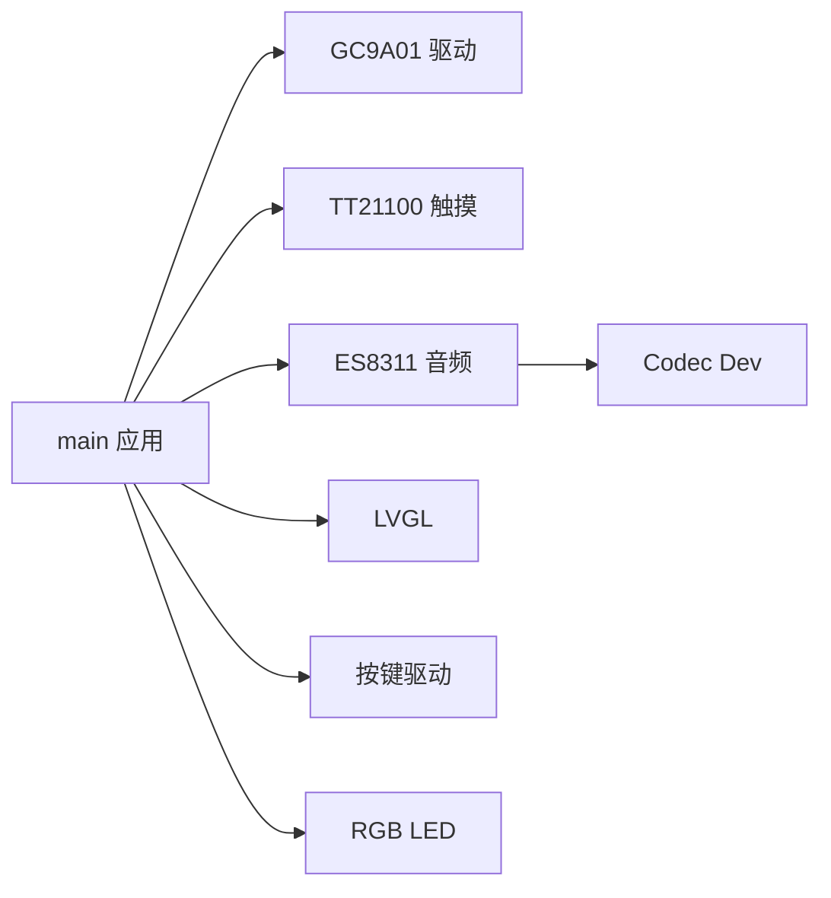

# 硬件规格

<cite>
**本文引用的文件**   
- [ai_mirror_config.h](file://Firmware/esp32_ai_mirror/main/ai_mirror_config.h)
- [ai_mirror_main.c](file://Firmware/esp32_ai_mirror/main/ai_mirror_main.c)
- [board_buttons.c](file://Firmware/esp32_ai_mirror/main/board_buttons.c)
- [board_buttons.h](file://Firmware/esp32_ai_mirror/main/board_buttons.h)
- [board_rgb.c](file://Firmware/esp32_ai_mirror/main/board_rgb.c)
- [board_rgb.h](file://Firmware/esp32_ai_mirror/main/board_rgb.h)
- [idf_component.yml](file://Firmware/esp32_ai_mirror/components/espressif__esp-sr/idf_component.yml)
- [CMakeLists.txt](file://Firmware/esp32_ai_mirror/CMakeLists.txt)
- [sdkconfig.defaults](file://Firmware/esp32_ai_mirror/sdkconfig.defaults)
- [partitions_n16r8.csv](file://Firmware/esp32_ai_mirror/partitions_n16r8.csv)
- [esp_lcd_gc9a01.c](file://Firmware/esp32_ai_mirror/components/espressif__esp_lcd_gc9a01/esp_lcd_gc9a01.c)
- [esp_lcd_touch_tt21100.c](file://Firmware/esp32_ai_mirror/managed_components/espressif__esp_lcd_touch_tt21100/esp_lcd_touch_tt21100.c)
- [es8311.c](file://Firmware/esp32_ai_mirror/managed_components/espressif__es8311/es8311.c)
- [esp_codec_dev.c](file://Firmware/esp32_ai_mirror/managed_components/espressif__esp_codec_dev/esp_codec_dev.c)
</cite>

## 目录
1. [简介](#简介)
2. [项目结构](#项目结构)
3. [核心组件](#核心组件)
4. [架构总览](#架构总览)
5. [详细组件分析](#详细组件分析)
6. [依赖关系分析](#依赖关系分析)
7. [性能与功耗考量](#性能与功耗考量)
8. [故障排查指南](#故障排查指南)
9. [结论](#结论)
10. [附录：引脚分配与设计约束](#附录引脚分配与设计约束)

## 简介
本文件为AI镜子项目的硬件规格说明，围绕主控ESP32-S3、显示模块（GC9A01驱动屏）、音频子系统（ES8311编解码器）、触摸输入（TT21100控制器）、电源管理与外设（LED、按键等）进行系统化梳理。文档同时给出硬件连接思路、引脚分配建议、设计约束与技术选型依据，帮助硬件工程师与固件开发者快速对齐实现方案。

## 项目结构
本项目基于ESP-IDF构建，采用组件化架构：
- 应用层位于 main 目录，包含系统初始化、UI、板级外设（按键、RGB LED）、WiFi配网等。
- 显示驱动通过 esp_lcd_gc9a01 组件提供；触摸输入通过 esp_lcd_touch_tt21100 组件提供；音频通过 es8311 与 esp_codec_dev 组件提供。
- 工程配置集中在 sdkconfig.defaults、CMakeLists.txt、idf_component.yml 与分区表 partitions_n16r8.csv。

图表来源
- [ai_mirror_main.c:1-200](file://Firmware/esp32_ai_mirror/main/ai_mirror_main.c#L1-L200)
- [esp_lcd_gc9a01.c:1-200](file://Firmware/esp32_ai_mirror/components/espressif__esp_lcd_gc9a01/esp_lcd_gc9a01.c#L1-L200)
- [esp_lcd_touch_tt21100.c:1-200](file://Firmware/esp32_ai_mirror/managed_components/espressif__esp_lcd_touch_tt21100/esp_lcd_touch_tt21100.c#L1-L200)
- [es8311.c:1-200](file://Firmware/esp32_ai_mirror/managed_components/espressif__es8311/es8311.c#L1-L200)
- [esp_codec_dev.c:1-200](file://Firmware/esp32_ai_mirror/managed_components/espressif__esp_codec_dev/esp_codec_dev.c#L1-L200)

章节来源
- [CMakeLists.txt:1-120](file://Firmware/esp32_ai_mirror/CMakeLists.txt#L1-L120)
- [sdkconfig.defaults:1-200](file://Firmware/esp32_ai_mirror/sdkconfig.defaults#L1-L200)
- [idf_component.yml:1-120](file://Firmware/esp32_ai_mirror/components/espressif__esp-sr/idf_component.yml#L1-L120)

## 核心组件
- 主控芯片 ESP32-S3
  - CPU：双核 Xtensa LX7，最高主频支持至 240 MHz，内置矢量指令加速，适合语音与图像任务。
  - 内存：内部 SRAM 约 512 KB，外部 PSRAM 通常 8 MB（由分区表与 BSP 决定），满足 LVGL 帧缓冲与模型加载需求。
  - 外设：I2S、SPI、I2C、GPIO、PWM、USB OTG、Wi-Fi/BLE 等，适配显示、音频、触摸与通信。
- 显示模块：GC9A01 驱动屏幕
  - 典型分辨率 240×240，色彩深度 16/24 bpp，接口多为 SPI 或 MIPI DSI（本项目使用 SPI 路径）。
  - 通过 esp_lcd_gc9a01 组件初始化时序、像素格式与刷新策略。
- 音频子系统：ES8311 编解码器
  - I2S 数据接口，I2C 控制总线，支持麦克风输入与扬声器输出，具备数字滤波与音量控制。
  - 通过 esp_codec_dev 抽象层统一配置采样率、位宽与通道数。
- 触摸输入：TT21100 触摸屏控制器
  - I2C 接口，支持多点触控与中断上报，配合 LVGL 输入事件处理。
- 电源管理
  - 典型供电 5V USB 输入，经 LDO/DC-DC 转换为 3.3V 供 ESP32-S3 与外设；电池场景需考虑充电管理与低功耗模式。
- 其他外设
  - 板载 LED（RGB）、按键输入、状态指示灯等，用于交互反馈与调试。

章节来源
- [ai_mirror_config.h:1-200](file://Firmware/esp32_ai_mirror/main/ai_mirror_config.h#L1-L200)
- [sdkconfig.defaults:1-200](file://Firmware/esp32_ai_mirror/sdkconfig.defaults#L1-L200)
- [partitions_n16r8.csv:1-120](file://Firmware/esp32_ai_mirror/partitions_n16r8.csv#L1-L120)

## 架构总览
下图展示从应用到各硬件子系统的调用关系与数据流：

图表来源
- [ai_mirror_main.c:1-200](file://Firmware/esp32_ai_mirror/main/ai_mirror_main.c#L1-L200)
- [esp_lcd_gc9a01.c:1-200](file://Firmware/esp32_ai_mirror/components/espressif__esp_lcd_gc9a01/esp_lcd_gc9a01.c#L1-L200)
- [esp_lcd_touch_tt21100.c:1-200](file://Firmware/esp32_ai_mirror/managed_components/espressif__esp_lcd_touch_tt21100/esp_lcd_touch_tt21100.c#L1-L200)
- [es8311.c:1-200](file://Firmware/esp32_ai_mirror/managed_components/espressif__es8311/es8311.c#L1-L200)
- [esp_codec_dev.c:1-200](file://Firmware/esp32_ai_mirror/managed_components/espressif__esp_codec_dev/esp_codec_dev.c#L1-L200)

## 详细组件分析

### 主控芯片 ESP32-S3
- 特性要点
  - 双核 LX7，支持向量运算与加密引擎，适合语音前端与轻量推理。
  - 丰富的外设：I2S（音频）、SPI（显示）、I2C（触摸/传感器）、GPIO/PWM（LED/背光）。
  - Wi-Fi/BLE 集成，便于远程配网与OTA。
- 内存与存储
  - 内部SRAM 512KB，PSRAM 8MB（常见配置），分区表划分 OTA、文件系统与模型区。
- 时钟与电源
  - 默认主频 240MHz，可动态降频以省电；3.3V 供电，注意去耦与热设计。

章节来源
- [sdkconfig.defaults:1-200](file://Firmware/esp32_ai_mirror/sdkconfig.defaults#L1-L200)
- [partitions_n16r8.csv:1-120](file://Firmware/esp32_ai_mirror/partitions_n16r8.csv#L1-L120)

### 显示模块：GC9A01 驱动屏
- 规格
  - 分辨率：240×240（常见）
  - 色彩深度：16bpp/24bpp（根据驱动配置）
  - 接口：SPI（本项目采用），CS/DC/MOSI/SCK/RST/BL 等
- 驱动与初始化
  - 通过 esp_lcd_gc9a01 组件完成复位、初始化序列、像素格式与帧缓冲配置。
  - 与 LVGL 集成，设置显示器回调与刷新区域优化。
- 性能与刷新
  - SPI 带宽受限，建议启用 DMA 传输、减少全屏刷新频率，按需局部刷新。

图表来源
- [esp_lcd_gc9a01.c:1-200](file://Firmware/esp32_ai_mirror/components/espressif__esp_lcd_gc9a01/esp_lcd_gc9a01.c#L1-L200)

章节来源
- [esp_lcd_gc9a01.c:1-200](file://Firmware/esp32_ai_mirror/components/espressif__esp_lcd_gc9a01/esp_lcd_gc9a01.c#L1-L200)

### 音频子系统：ES8311 编解码器
- 特性
  - I2S 数据接口，I2C 控制；支持单/多路 ADC/DAC，内置数字滤波器与音量控制。
  - 典型采样率 16k/44.1k/48k Hz，位宽 16bit，立体声/单声道可选。
- 驱动与配置
  - 通过 es8311 组件与 esp_codec_dev 框架统一配置采样率、位宽、通道与增益。
  - I2S 主机模式，MCLK/BCLK/LRCK 与数据线连接 ESP32-S3。
- 音频链路
  - 麦克风输入 → ADC → I2S → 语音前端/ASR
  - TTS 输出 → DAC → I2S → 扬声器/耳机

图表来源
- [es8311.c:1-200](file://Firmware/esp32_ai_mirror/managed_components/espressif__es8311/es8311.c#L1-L200)
- [esp_codec_dev.c:1-200](file://Firmware/esp32_ai_mirror/managed_components/espressif__esp_codec_dev/esp_codec_dev.c#L1-L200)

章节来源
- [es8311.c:1-200](file://Firmware/esp32_ai_mirror/managed_components/espressif__es8311/es8311.c#L1-L200)
- [esp_codec_dev.c:1-200](file://Firmware/esp32_ai_mirror/managed_components/espressif__esp_codec_dev/esp_codec_dev.c#L1-L200)

### 触摸输入：TT21100 触摸屏控制器
- 功能
  - I2C 接口，支持多点触控、触摸中断、坐标上报。
  - 与 LVGL 输入事件对接，实现滑动、点击等交互。
- 连接方式
  - SDA/SCL 接 ESP32-S3 I2C，INT 引脚触发中断，VCC/GND 供电。
- 驱动初始化
  - 通过 esp_lcd_touch_tt21100 组件完成 I2C 探测、中断配置与坐标读取。

图表来源
- [esp_lcd_touch_tt21100.c:1-200](file://Firmware/esp32_ai_mirror/managed_components/espressif__esp_lcd_touch_tt21100/esp_lcd_touch_tt21100.c#L1-L200)

章节来源
- [esp_lcd_touch_tt21100.c:1-200](file://Firmware/esp32_ai_mirror/managed_components/espressif__esp_lcd_touch_tt21100/esp_lcd_touch_tt21100.c#L1-L200)

### 电源管理与电池支持
- 供电要求
  - 典型 5V USB 输入，经 DC-DC/LDO 转为 3.3V；确保纹波与瞬态响应满足 ESP32-S3 峰值电流需求。
- 功耗特性
  - Wi-Fi/BLE 高负载时瞬时电流较大，需足够电容与走线宽度；空闲时可进入 Light Sleep 降低功耗。
- 电池支持
  - 若采用锂电池，需充电管理（如 TP4056/专用PMIC），低电量检测与休眠策略；注意放电曲线与保护电路。

章节来源
- [sdkconfig.defaults:1-200](file://Firmware/esp32_ai_mirror/sdkconfig.defaults#L1-L200)

### 传感器与其他外设：LED 与按键
- LED 指示灯
  - RGB LED 通过 PWM 控制，用于状态指示与交互反馈；可通过 board_rgb 组件封装。
- 按键输入
  - GPIO 扫描或中断方式，支持短按/长按；board_buttons 组件提供事件分发。

章节来源
- [board_rgb.c:1-200](file://Firmware/esp32_ai_mirror/main/board_rgb.c#L1-L200)
- [board_buttons.c:1-200](file://Firmware/esp32_ai_mirror/main/board_buttons.c#L1-L200)

## 依赖关系分析
- 组件依赖
  - 应用依赖显示、触摸、音频与 LVGL；显示依赖 GC9A01 驱动；音频依赖 ES8311 与 Codec Dev；触摸依赖 TT21100。
- 构建与配置
  - CMakeLists 与 idf_component.yml 声明组件依赖；sdkconfig.defaults 配置外设与运行时选项；分区表定义存储布局。

图表来源
- [CMakeLists.txt:1-120](file://Firmware/esp32_ai_mirror/CMakeLists.txt#L1-L120)
- [idf_component.yml:1-120](file://Firmware/esp32_ai_mirror/components/espressif__esp-sr/idf_component.yml#L1-L120)

章节来源
- [CMakeLists.txt:1-120](file://Firmware/esp32_ai_mirror/CMakeLists.txt#L1-L120)
- [idf_component.yml:1-120](file://Firmware/esp32_ai_mirror/components/espressif__esp-sr/idf_component.yml#L1-L120)

## 性能与功耗考量
- 显示性能
  - SPI 带宽有限，建议启用 DMA、减少全屏刷新、使用局部刷新与压缩图像。
  - LVGL 帧缓冲大小与刷新频率需平衡内存占用与流畅度。
- 音频性能
  - I2S 数据路径尽量使用 DMA 与环形缓冲，避免阻塞；合理选择采样率与位宽。
- 功耗优化
  - 非活跃时段关闭外设时钟与中断；Wi-Fi 间歇工作；必要时进入 Light/Deep Sleep。
- 存储与模型
  - 分区表预留足够空间给语音模型与资源；Flash 读取速度影响冷启动时间。

[本节为通用指导，不直接分析具体文件]

## 故障排查指南
- 显示无输出
  - 检查 SPI 接线与时序；确认复位/片选/数据命令引脚配置；查看初始化序列是否完整。
- 触摸无响应
  - 验证 I2C 地址与上拉电阻；确认中断引脚有效；查看坐标读取流程。
- 音频无声或失真
  - 核对 I2S 时钟与相位；检查 ES8311 寄存器配置；确认音量与静音状态。
- 按键误触发
  - 增加消抖与阈值；检查 GPIO 电平与外部电路。
- 系统不稳定
  - 检查电源纹波与去耦电容；关注热点与散热；适当降低主频或关闭非必要外设。

章节来源
- [board_buttons.c:1-200](file://Firmware/esp32_ai_mirror/main/board_buttons.c#L1-L200)
- [board_rgb.c:1-200](file://Firmware/esp32_ai_mirror/main/board_rgb.c#L1-L200)
- [esp_lcd_gc9a01.c:1-200](file://Firmware/esp32_ai_mirror/components/espressif__esp_lcd_gc9a01/esp_lcd_gc9a01.c#L1-L200)
- [esp_lcd_touch_tt21100.c:1-200](file://Firmware/esp32_ai_mirror/managed_components/espressif__esp_lcd_touch_tt21100/esp_lcd_touch_tt21100.c#L1-L200)
- [es8311.c:1-200](file://Firmware/esp32_ai_mirror/managed_components/espressif__es8311/es8311.c#L1-L200)

## 结论
本项目以 ESP32-S3 为核心，结合 GC9A01 显示、ES8311 音频与 TT21100 触摸，形成完整的 AI 镜子交互平台。通过组件化驱动与 LVGL 图形栈，可实现流畅的 UI 与语音交互。设计时需重点关注 SPI/I2S 带宽、电源稳定性与功耗优化，合理划分分区与内存，确保系统稳定与成本可控。

[本节为总结性内容，不直接分析具体文件]

## 附录：引脚分配与设计约束
- 引脚分配建议（示例，实际以原理图为准）
  - 显示（SPI）
    - MOSI、SCK、CS、DC、RST、BL 对应 ESP32-S3 的 SPI2 或 SPI3 引脚
  - 触摸（I2C）
    - SDA、SCL 对应 ESP32-S3 的 I2C1，INT 接任意 GPIO
  - 音频（I2S）
    - BCLK、LRCK、SDOUT/SDIN 对应 ESP32-S3 I2S 引脚；ES8311 控制 I2C 复用或独立 I2C
  - 按键与 LED
    - 按键接 GPIO（带内部上拉/下拉）；RGB LED 接 PWM 输出
- 设计约束与注意事项
  - SPI 走线尽量短且等长，避免反射；I2C 上拉电阻取值合理（2.2k–4.7k）。
  - I2S 时钟路径保持完整回路，避免串扰；音频地平面与信号地分离良好。
  - 电源路径加去耦电容（0.1μF/1μF），关键节点加钽电容；注意热设计与散热。
  - 分区表预留 OTA、文件系统与模型空间，避免覆盖；Flash 校验与安全启动按需启用。

章节来源
- [sdkconfig.defaults:1-200](file://Firmware/esp32_ai_mirror/sdkconfig.defaults#L1-L200)
- [partitions_n16r8.csv:1-120](file://Firmware/esp32_ai_mirror/partitions_n16r8.csv#L1-L120)
- [board_buttons.c:1-200](file://Firmware/esp32_ai_mirror/main/board_buttons.c#L1-L200)
- [board_rgb.c:1-200](file://Firmware/esp32_ai_mirror/main/board_rgb.c#L1-L200)