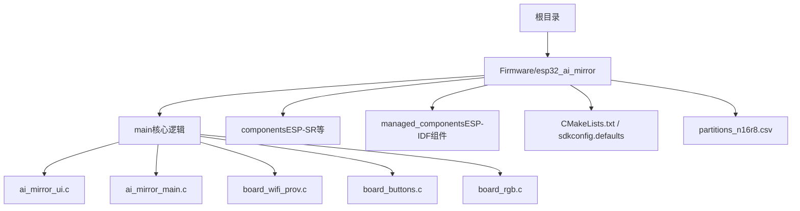
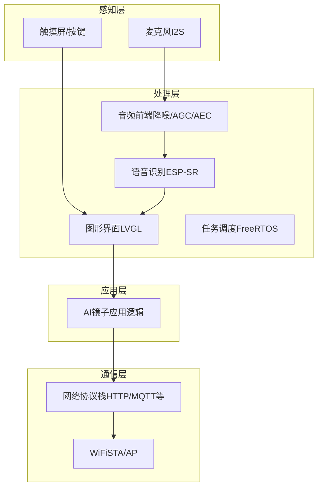
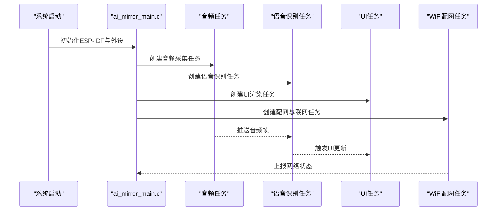
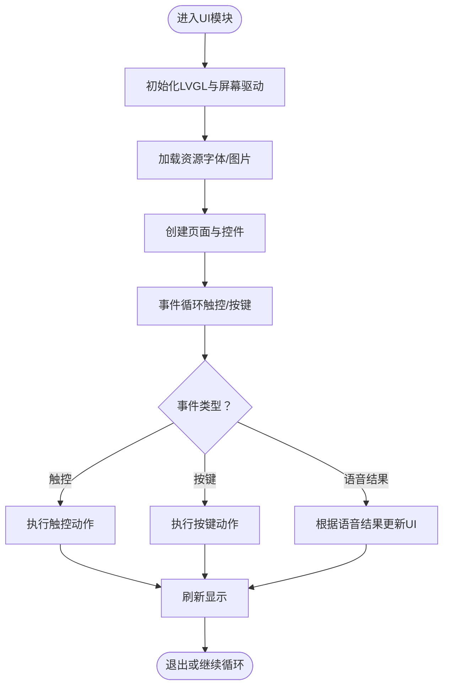
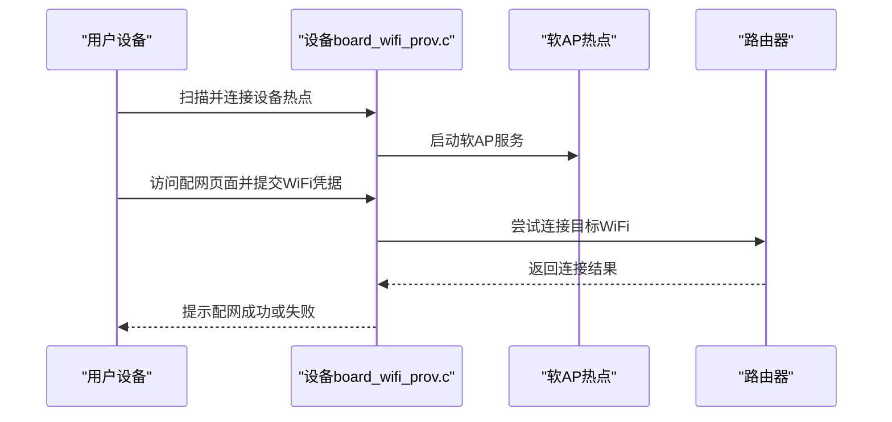
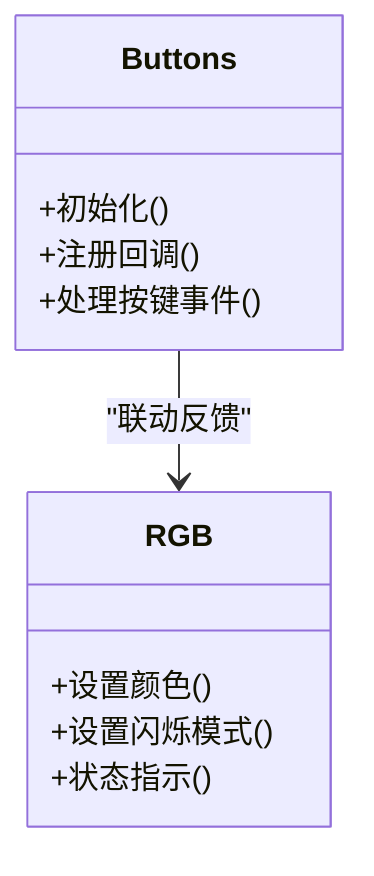
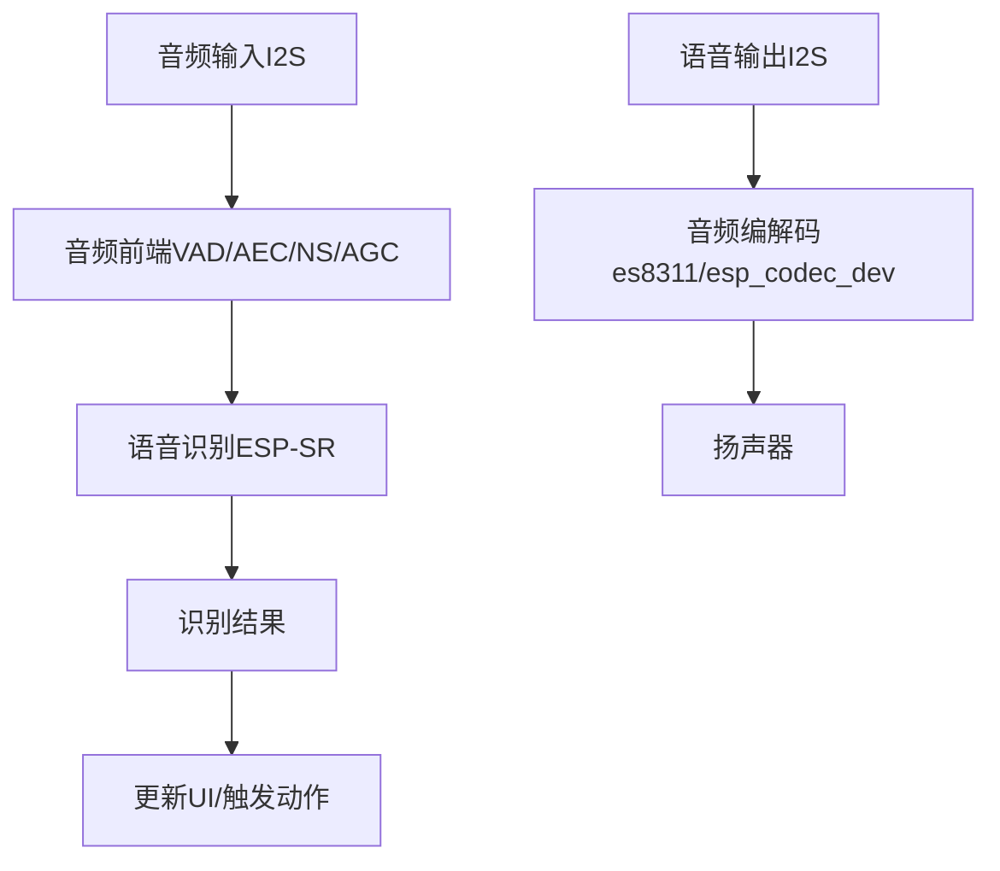
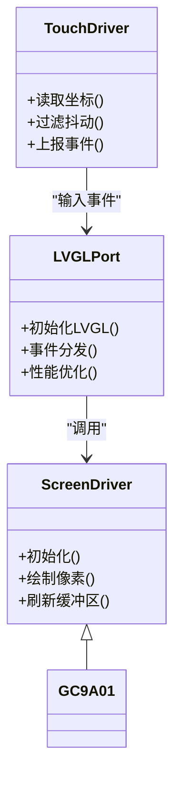
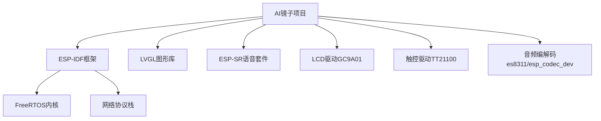

# 项目介绍

<cite>
**本文引用的文件**   
- [README.md](file://README.md)
- [README_en.md](file://README_en.md)
- [Firmware/esp32_ai_mirror/README.md](file://Firmware/esp32_ai_mirror/README.md)
- [Firmware/esp32_ai_mirror/main/ai_mirror_main.c](file://Firmware/esp32_ai_mirror/main/ai_mirror_main.c)
- [Firmware/esp32_ai_mirror/main/ai_mirror_ui.c](file://Firmware/esp32_ai_mirror/main/ai_mirror_ui.c)
- [Firmware/esp32_ai_mirror/main/board_wifi_prov.c](file://Firmware/esp32_ai_mirror/main/board_wifi_prov.c)
- [Firmware/esp32_ai_mirror/main/board_buttons.c](file://Firmware/esp32_ai_mirror/main/board_buttons.c)
- [Firmware/esp32_ai_mirror/main/board_rgb.c](file://Firmware/esp32_ai_mirror/main/board_rgb.c)
- [Firmware/esp32_ai_mirror/CMakeLists.txt](file://Firmware/esp32_ai_mirror/CMakeLists.txt)
- [Firmware/esp32_ai_mirror/partitions_n16r8.csv](file://Firmware/esp32_ai_mirror/partitions_n16r8.csv)
- [Firmware/esp32_ai_mirror/sdkconfig.defaults](file://Firmware/esp32_ai_mirror/sdkconfig.defaults)
- [Firmware/esp32_ai_mirror/WiFi配网功能计划书.md](file://Firmware/esp32_ai_mirror/WiFi配网功能计划书.md)
- [Firmware/esp32_ai_mirror/小智项目分析.md](file://Firmware/esp32_ai_mirror/小智项目分析.md)
</cite>

## 目录
1. [简介](#简介)
2. [项目结构](#项目结构)
3. [核心组件](#核心组件)
4. [架构总览](#架构总览)
5. [详细组件分析](#详细组件分析)
6. [依赖关系分析](#依赖关系分析)
7. [性能考量](#性能考量)
8. [故障排查指南](#故障排查指南)
9. [结论](#结论)
10. [附录](#附录)

## 简介
AI镜子项目是一款基于ESP32-S3的智能镜子设备，将嵌入式AI、语音交互、图形界面与WiFi连接能力集成于一个紧凑的硬件平台中。其核心价值在于：
- 以“镜子”为载体，提供无感、自然的交互入口，适合家居、办公等场景。
- 通过本地语音识别与合成，实现低延迟、隐私友好的对话体验。
- 借助LVGL图形库与触控输入，构建直观的人机界面。
- 利用WiFi进行网络通信与远程服务对接，支持云端AI能力扩展。

主要应用场景包括：
- 智能家居控制与信息展示（天气、日程、通知）
- 语音助手与问答交互
- 健康与健身辅助（如镜前运动指导）
- 个性化信息面板（照片轮播、日历、待办事项）

技术特点涵盖：
- 嵌入式AI：在ESP32-S3上运行轻量级语音模型，支持唤醒词检测与命令识别。
- 实时音频处理：I2S音频采集与播放，噪声抑制、回声消除与自动增益。
- 图形界面：基于LVGL的高性能UI框架，适配触摸屏与按键输入。
- WiFi连接：支持软AP与STA模式，便于设备配网与数据通信。

开源性质与社区支持：
- 项目采用开源协议，鼓励社区贡献与二次开发。
- 依托ESP-IDF生态与LVGL社区，具备完善的文档与示例资源。

历史背景与发展路线图：
- 初期聚焦于ESP32-S3平台的语音交互与显示基础能力验证。
- 逐步完善WiFi配网、UI交互与音频链路，形成完整产品形态。
- 未来计划增强多模态交互、更多语音模型与云服务集成。

适用人群与学习价值：
- 开发者：可快速上手ESP32-S3嵌入式开发，掌握音频、显示与网络栈集成。
- 硬件爱好者：了解传感器、音频编解码器与屏幕驱动的实际应用。
- AI应用开发者：实践端侧语音模型部署与推理优化。

许可证信息与贡献指南概述：
- 详见仓库根目录与固件目录中的许可证说明与贡献规范。
- 建议遵循代码风格、提交规范与测试要求，确保质量与一致性。

**章节来源**
- [README.md](file://README.md)
- [README_en.md](file://README_en.md)
- [Firmware/esp32_ai_mirror/README.md](file://Firmware/esp32_ai_mirror/README.md)

## 项目结构
项目采用分层与模块化组织方式：
- 根目录包含总体说明与跨模块文档。
- Firmware/esp32_ai_mirror为ESP-IDF工程，包含主程序、组件与配置。
- main目录为核心业务逻辑，涵盖启动流程、UI、WiFi配网、按键与RGB指示。
- components与managed_components存放第三方组件与SDK。
- CMakeLists.txt与sdkconfig.defaults定义构建与系统配置。
- partitions_n16r8.csv划分Flash分区，用于固件、OTA与文件系统。

**图示来源**
- [Firmware/esp32_ai_mirror/CMakeLists.txt](file://Firmware/esp32_ai_mirror/CMakeLists.txt)
- [Firmware/esp32_ai_mirror/sdkconfig.defaults](file://Firmware/esp32_ai_mirror/sdkconfig.defaults)
- [Firmware/esp32_ai_mirror/partitions_n16r8.csv](file://Firmware/esp32_ai_mirror/partitions_n16r8.csv)
- [Firmware/esp32_ai_mirror/main/ai_mirror_main.c](file://Firmware/esp32_ai_mirror/main/ai_mirror_main.c)
- [Firmware/esp32_ai_mirror/main/ai_mirror_ui.c](file://Firmware/esp32_ai_mirror/main/ai_mirror_ui.c)
- [Firmware/esp32_ai_mirror/main/board_wifi_prov.c](file://Firmware/esp32_ai_mirror/main/board_wifi_prov.c)
- [Firmware/esp32_ai_mirror/main/board_buttons.c](file://Firmware/esp32_ai_mirror/main/board_buttons.c)
- [Firmware/esp32_ai_mirror/main/board_rgb.c](file://Firmware/esp32_ai_mirror/main/board_rgb.c)

**章节来源**
- [Firmware/esp32_ai_mirror/CMakeLists.txt](file://Firmware/esp32_ai_mirror/CMakeLists.txt)
- [Firmware/esp32_ai_mirror/sdkconfig.defaults](file://Firmware/esp32_ai_mirror/sdkconfig.defaults)
- [Firmware/esp32_ai_mirror/partitions_n16r8.csv](file://Firmware/esp32_ai_mirror/partitions_n16r8.csv)

## 核心组件
- 启动与调度：ai_mirror_main.c负责系统初始化、任务创建与生命周期管理。
- 用户界面：ai_mirror_ui.c基于LVGL构建页面、事件处理与动画。
- WiFi配网：board_wifi_prov.c实现软AP与STA切换，完成设备接入网络。
- 输入与反馈：board_buttons.c处理按键事件；board_rgb.c控制LED状态指示。
- 音频与AI：components/espressif__esp-sr提供语音前端与模型推理；managed_components下的es8311与esp_codec_dev负责音频编解码。
- 显示驱动：managed_components下的esp_lcd_gc9a01与lvgl_port适配屏幕与触摸。

这些组件协同工作，形成从音频采集、语音识别到UI展示与网络通信的完整链路。

**章节来源**
- [Firmware/esp32_ai_mirror/main/ai_mirror_main.c](file://Firmware/esp32_ai_mirror/main/ai_mirror_main.c)
- [Firmware/esp32_ai_mirror/main/ai_mirror_ui.c](file://Firmware/esp32_ai_mirror/main/ai_mirror_ui.c)
- [Firmware/esp32_ai_mirror/main/board_wifi_prov.c](file://Firmware/esp32_ai_mirror/main/board_wifi_prov.c)
- [Firmware/esp32_ai_mirror/main/board_buttons.c](file://Firmware/esp32_ai_mirror/main/board_buttons.c)
- [Firmware/esp32_ai_mirror/main/board_rgb.c](file://Firmware/esp32_ai_mirror/main/board_rgb.c)

## 架构总览
整体架构围绕ESP32-S3平台，分为感知层（音频与输入）、处理层（AI推理与UI渲染）、通信层（WiFi与网络）与应用层（业务逻辑）。

**图示来源**
- [Firmware/esp32_ai_mirror/main/ai_mirror_main.c](file://Firmware/esp32_ai_mirror/main/ai_mirror_main.c)
- [Firmware/esp32_ai_mirror/main/ai_mirror_ui.c](file://Firmware/esp32_ai_mirror/main/ai_mirror_ui.c)
- [Firmware/esp32_ai_mirror/main/board_wifi_prov.c](file://Firmware/esp32_ai_mirror/main/board_wifi_prov.c)

## 详细组件分析

### 启动与任务调度（ai_mirror_main.c）
- 负责ESP-IDF环境初始化、外设驱动加载、内存与堆配置。
- 创建关键任务：音频采集与处理、语音识别、UI刷新、WiFi配网与网络通信。
- 管理事件循环与消息队列，协调各模块协作。

**图示来源**
- [Firmware/esp32_ai_mirror/main/ai_mirror_main.c](file://Firmware/esp32_ai_mirror/main/ai_mirror_main.c)

**章节来源**
- [Firmware/esp32_ai_mirror/main/ai_mirror_main.c](file://Firmware/esp32_ai_mirror/main/ai_mirror_main.c)

### 用户界面（ai_mirror_ui.c）
- 使用LVGL构建页面布局、控件与动画效果。
- 处理触控与按键事件，响应语音识别结果并更新显示。
- 管理主题、字体与图片资源，保证流畅的交互体验。

**图示来源**
- [Firmware/esp32_ai_mirror/main/ai_mirror_ui.c](file://Firmware/esp32_ai_mirror/main/ai_mirror_ui.c)

**章节来源**
- [Firmware/esp32_ai_mirror/main/ai_mirror_ui.c](file://Firmware/esp32_ai_mirror/main/ai_mirror_ui.c)

### WiFi配网（board_wifi_prov.c）
- 支持软AP模式生成热点，引导用户通过手机App或浏览器完成配网。
- 切换到STA模式连接目标WiFi，获取IP地址并建立网络连接。
- 提供状态指示与错误重试机制，提升用户体验。

**图示来源**
- [Firmware/esp32_ai_mirror/main/board_wifi_prov.c](file://Firmware/esp32_ai_mirror/main/board_wifi_prov.c)

**章节来源**
- [Firmware/esp32_ai_mirror/main/board_wifi_prov.c](file://Firmware/esp32_ai_mirror/main/board_wifi_prov.c)

### 输入与反馈（board_buttons.c与board_rgb.c）
- board_buttons.c监听按键中断，映射为系统事件，触发相应操作。
- board_rgb.c控制RGB LED颜色与闪烁模式，用于状态指示（如配网中、已连接、错误等）。

**图示来源**
- [Firmware/esp32_ai_mirror/main/board_buttons.c](file://Firmware/esp32_ai_mirror/main/board_buttons.c)
- [Firmware/esp32_ai_mirror/main/board_rgb.c](file://Firmware/esp32_ai_mirror/main/board_rgb.c)

**章节来源**
- [Firmware/esp32_ai_mirror/main/board_buttons.c](file://Firmware/esp32_ai_mirror/main/board_buttons.c)
- [Firmware/esp32_ai_mirror/main/board_rgb.c](file://Firmware/esp32_ai_mirror/main/board_rgb.c)

### 音频与AI（ESP-SR与Codec）
- ESP-SR提供语音前端（VAD、AEC、NS、AGC）与多语言语音识别模型。
- es8311与esp_codec_dev实现I2S音频采集与播放，支持采样率转换与音量控制。
- 模型文件与工具链位于components/espressif__esp-sr/model与tool目录。

**图示来源**
- [Firmware/esp32_ai_mirror/components/espressif__esp-sr](file://Firmware/esp32_ai_mirror/components/espressif__esp-sr)
- [Firmware/esp32_ai_mirror/managed_components/espressif__es8311](file://Firmware/esp32_ai_mirror/managed_components/espressif__es8311)
- [Firmware/esp32_ai_mirror/managed_components/espressif__esp_codec_dev](file://Firmware/esp32_ai_mirror/managed_components/espressif__esp_codec_dev)

**章节来源**
- [Firmware/esp32_ai_mirror/components/espressif__esp-sr](file://Firmware/esp32_ai_mirror/components/espressif__esp-sr)
- [Firmware/esp32_ai_mirror/managed_components/espressif__es8311](file://Firmware/esp32_ai_mirror/managed_components/espressif__es8311)
- [Firmware/esp32_ai_mirror/managed_components/espressif__esp_codec_dev](file://Firmware/esp32_ai_mirror/managed_components/espressif__esp_codec_dev)

### 显示与触控（GC9A01与LVGL）
- GC9A01屏幕驱动通过SPI接口与ESP32-S3通信，提供高分辨率显示。
- LVGL_port封装LVGL与ESP-LCD，简化移植与性能优化。
- 触控由TT21100驱动，支持多点触控与手势识别。

**图示来源**
- [Firmware/esp32_ai_mirror/managed_components/espressif__esp_lcd_gc9a01](file://Firmware/esp32_ai_mirror/managed_components/espressif__esp_lcd_gc9a01)
- [Firmware/esp32_ai_mirror/managed_components/espressif__esp_lvgl_port](file://Firmware/esp32_ai_mirror/managed_components/espressif__esp_lvgl_port)
- [Firmware/esp32_ai_mirror/managed_components/espressif__esp_lcd_touch_tt21100](file://Firmware/esp32_ai_mirror/managed_components/espressif__esp_lcd_touch_tt21100)

**章节来源**
- [Firmware/esp32_ai_mirror/managed_components/espressif__esp_lcd_gc9a01](file://Firmware/esp32_ai_mirror/managed_components/espressif__esp_lcd_gc9a01)
- [Firmware/esp32_ai_mirror/managed_components/espressif__esp_lvgl_port](file://Firmware/esp32_ai_mirror/managed_components/espressif__esp_lvgl_port)
- [Firmware/esp32_ai_mirror/managed_components/espressif__esp_lcd_touch_tt21100](file://Firmware/esp32_ai_mirror/managed_components/espressif__esp_lcd_touch_tt21100)

## 依赖关系分析
项目依赖ESP-IDF框架与多个官方组件，同时引入LVGL与ESP-SR以实现AI与UI能力。

**图示来源**
- [Firmware/esp32_ai_mirror/CMakeLists.txt](file://Firmware/esp32_ai_mirror/CMakeLists.txt)
- [Firmware/esp32_ai_mirror/sdkconfig.defaults](file://Firmware/esp32_ai_mirror/sdkconfig.defaults)

**章节来源**
- [Firmware/esp32_ai_mirror/CMakeLists.txt](file://Firmware/esp32_ai_mirror/CMakeLists.txt)
- [Firmware/esp32_ai_mirror/sdkconfig.defaults](file://Firmware/esp32_ai_mirror/sdkconfig.defaults)

## 性能考量
- 音频链路：合理设置采样率与缓冲区大小，避免溢出与延迟。
- 语音识别：选择合适模型与量化策略，平衡精度与资源占用。
- UI渲染：减少重绘区域，使用双缓冲与异步刷新提升流畅度。
- WiFi通信：优化请求频率与数据包大小，降低功耗与带宽占用。
- 内存管理：监控堆使用与碎片化，避免长时间运行导致的泄漏。

[本节为通用指导，不直接分析具体文件]

## 故障排查指南
- 无法开机或频繁重启：检查电源与复位电路，查看日志定位崩溃点。
- 语音无响应：确认麦克风通路、VAD阈值与模型加载状态。
- UI卡顿或黑屏：检查LVGL刷新频率与显存分配，确认屏幕驱动初始化。
- WiFi配网失败：验证热点创建与路由器兼容性，检查凭据与信号强度。
- 按键无效：确认GPIO配置与中断优先级，检查去抖逻辑。

**章节来源**
- [Firmware/esp32_ai_mirror/WiFi配网功能计划书.md](file://Firmware/esp32_ai_mirror/WiFi配网功能计划书.md)
- [Firmware/esp32_ai_mirror/小智项目分析.md](file://Firmware/esp32_ai_mirror/小智项目分析.md)

## 结论
AI镜子项目以ESP32-S3为核心，整合语音、显示与网络能力，构建了完整的智能交互终端。其模块化设计与开源生态使其具备良好的可扩展性与学习价值。通过持续优化音频链路、UI性能与网络稳定性，项目可为智能家居与个人助手提供可靠的技术支撑。

[本节为总结性内容，不直接分析具体文件]

## 附录
- 许可证信息：请查阅仓库根目录与固件目录中的LICENSE或相关声明。
- 贡献指南：遵循代码风格、提交规范与测试要求，确保质量与一致性。
- 参考文档：ESP-IDF官方文档、LVGL文档与ESP-SR使用说明。

[本节为补充信息，不直接分析具体文件]