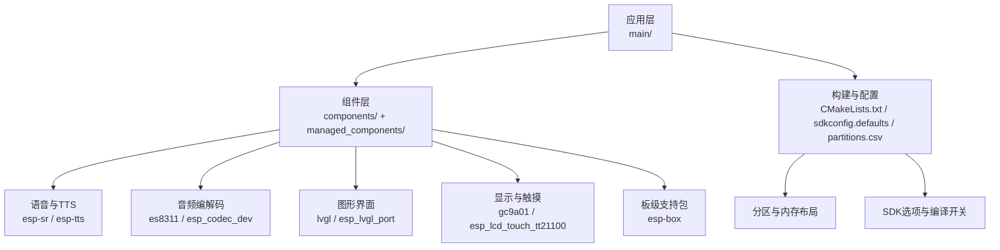
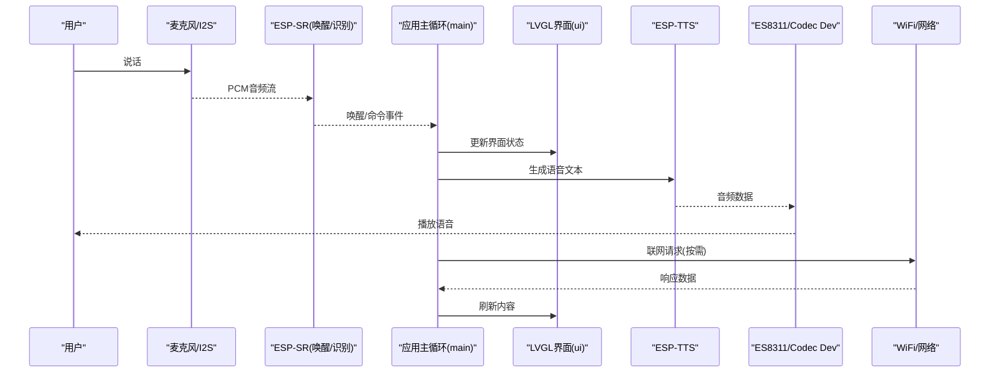
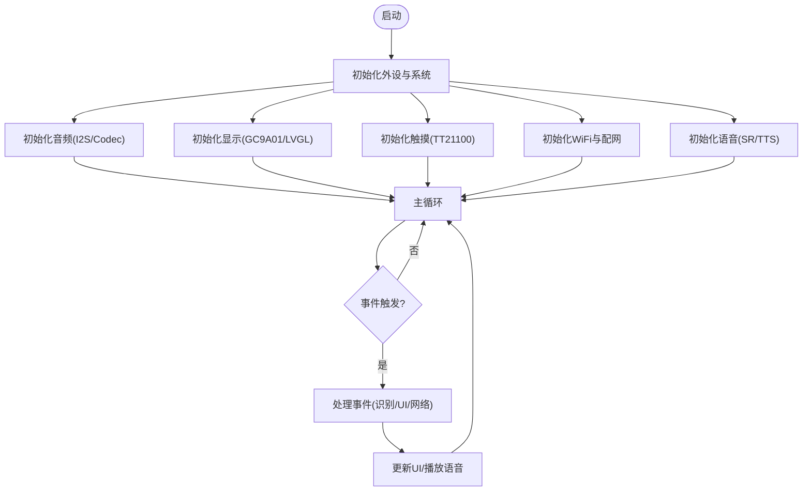
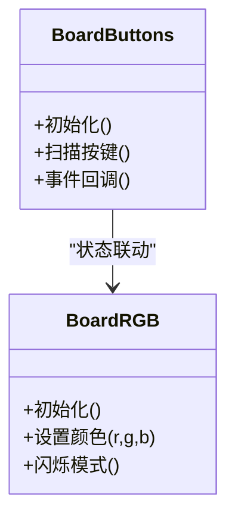
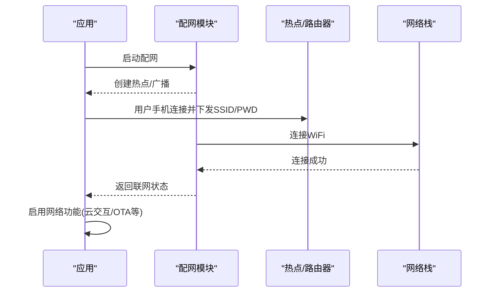
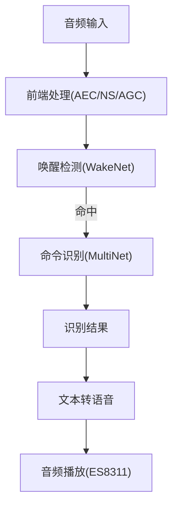
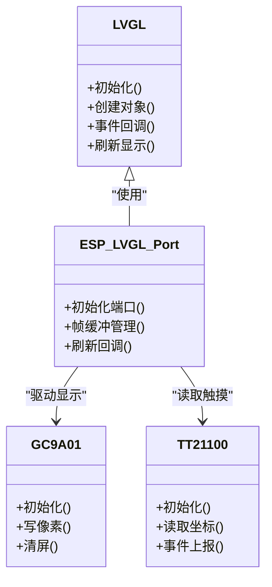
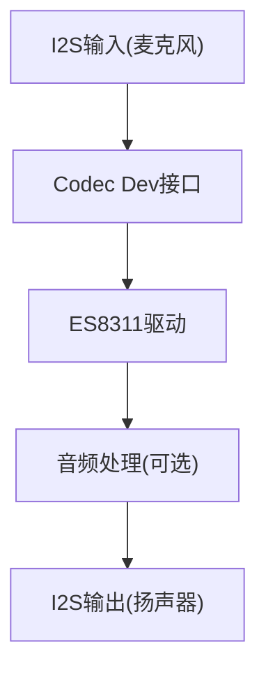
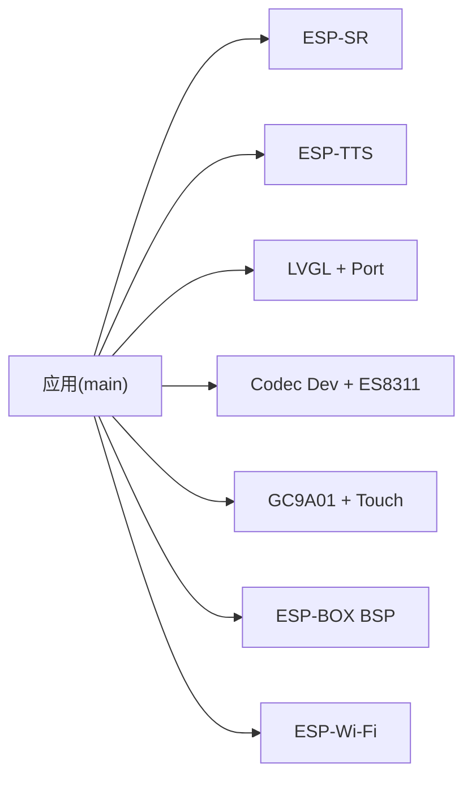

# 项目概览

<cite>
**本文引用的文件**   
- [README.md](file://README.md)
- [Firmware/esp32_ai_mirror/README.md](file://Firmware/esp32_ai_mirror/README.md)
- [Firmware/esp32_ai_mirror/main/ai_mirror_main.c](file://Firmware/esp32_ai_mirror/main/ai_mirror_main.c)
- [Firmware/esp32_ai_mirror/main/ai_mirror_ui.c](file://Firmware/esp32_ai_mirror/main/ai_mirror_ui.c)
- [Firmware/esp32_ai_mirror/main/ai_mirror_config.h](file://Firmware/esp32_ai_mirror/main/ai_mirror_config.h)
- [Firmware/esp32_ai_mirror/main/board_buttons.c](file://Firmware/esp32_ai_mirror/main/board_buttons.c)
- [Firmware/esp32_ai_mirror/main/board_buttons.h](file://Firmware/esp32_ai_mirror/main/board_buttons.h)
- [Firmware/esp32_ai_mirror/main/board_rgb.c](file://Firmware/esp32_ai_mirror/main/board_rgb.c)
- [Firmware/esp32_ai_mirror/main/board_rgb.h](file://Firmware/esp32_ai_mirror/main/board_rgb.h)
- [Firmware/esp32_ai_mirror/main/board_wifi_prov.c](file://Firmware/esp32_ai_mirror/main/board_wifi_prov.c)
- [Firmware/esp32_ai_mirror/main/board_wifi_prov.h](file://Firmware/esp32_ai_mirror/main/board_wifi_prov.h)
- [Firmware/esp32_ai_mirror/CMakeLists.txt](file://Firmware/esp32_ai_mirror/CMakeLists.txt)
- [Firmware/esp32_ai_mirror/partitions_n16r8.csv](file://Firmware/esp32_ai_mirror/partitions_n16r8.csv)
- [Firmware/esp32_ai_mirror/sdkconfig.defaults](file://Firmware/esp32_ai_mirror/sdkconfig.defaults)
- [Firmware/esp32_ai_mirror/WiFi配网功能计划书.md](file://Firmware/esp32_ai_mirror/WiFi配网功能计划书.md)
- [Firmware/esp32_ai_mirror/小智项目分析.md](file://Firmware/esp32_ai_mirror/小智项目分析.md)
- [Firmware/esp32_ai_mirror/components/espressif__esp-sr/README.md](file://Firmware/esp32_ai_mirror/components/espressif__esp-sr/README.md)
- [Firmware/esp32_ai_mirror/components/espressif__esp-sr/esp-tts/README.md](file://Firmware/esp32_ai_mirror/components/espressif__esp-sr/esp-tts/README.md)
- [Firmware/esp32_ai_mirror/managed_components/espressif__es8311/README.md](file://Firmware/esp32_ai_mirror/managed_components/espressif__es8311/README.md)
- [Firmware/esp32_ai_mirror/managed_components/espressif__esp_codec_dev/README.md](file://Firmware/esp32_ai_mirror/managed_components/espressif__esp_codec_dev/README.md)
- [Firmware/esp32_ai_mirror/managed_components/espressif__esp-lvgl_port/README.md](file://Firmware/esp32_ai_mirror/managed_components/espressif__esp-lvgl_port/README.md)
- [Firmware/esp32_ai_mirror/managed_components/lvgl__lvgl/README.md](file://Firmware/esp32_ai_mirror/managed_components/lvgl__lvgl/README.md)
- [Firmware/esp32_ai_mirror/managed_components/espressif__esp-box/README.md](file://Firmware/esp32_ai_mirror/managed_components/espressif__esp-box/README.md)
</cite>

## 目录
1. [简介](#简介)
2. [项目结构](#项目结构)
3. [核心组件](#核心组件)
4. [架构总览](#架构总览)
5. [详细组件分析](#详细组件分析)
6. [依赖关系分析](#依赖关系分析)
7. [性能考量](#性能考量)
8. [故障排查指南](#故障排查指南)
9. [结论](#结论)
10. [附录](#附录)

## 简介
AI镜子项目是一个基于ESP32的智能镜子设备，集成了语音识别、显示界面与WiFi连接能力。其目标是在低功耗嵌入式平台上提供流畅的交互体验：通过麦克风采集语音、进行本地唤醒与命令识别，结合LVGL图形界面呈现状态与信息，并通过WiFi完成联网与远程服务交互。硬件层面采用ESP32-S3主控芯片，配合音频编解码器（如ES8311）、触摸屏驱动与GC9A01显示屏，软件层面基于ESP-IDF框架，集成ESP-SR语音套件、ESP-TTS文本转语音、LVGL图形库与ESP-LVGL端口适配，形成“感知—处理—呈现—交互”的闭环。

本概览文档面向初学者与有经验的开发者，既提供清晰的项目理解路径，也给出深入的技术细节与架构图示，帮助快速上手与扩展开发。

## 项目结构
项目采用分层与模块化组织方式：
- 顶层说明与配置：根目录README、固件目录CMakeLists、分区表、默认SDK配置等
- 应用主程序：main目录下包含入口、UI、板级外设（按钮、RGB灯、WiFi配网）与配置头文件
- 组件层：components与managed_components分别存放官方与第三方组件（ESP-SR、ESP-TTS、Codec Dev、LVGL、LCD Touch、BSP等）
- 设计与计划文档：WiFi配网功能计划书、小智项目分析等

图表来源 
- [Firmware/esp32_ai_mirror/CMakeLists.txt](file://Firmware/esp32_ai_mirror/CMakeLists.txt)
- [Firmware/esp32_ai_mirror/sdkconfig.defaults](file://Firmware/esp32_ai_mirror/sdkconfig.defaults)
- [Firmware/esp32_ai_mirror/partitions_n16r8.csv](file://Firmware/esp32_ai_mirror/partitions_n16r8.csv)

章节来源
- [Firmware/esp32_ai_mirror/README.md](file://Firmware/esp32_ai_mirror/README.md)
- [Firmware/esp32_ai_mirror/CMakeLists.txt](file://Firmware/esp32_ai_mirror/CMakeLists.txt)
- [Firmware/esp32_ai_mirror/sdkconfig.defaults](file://Firmware/esp32_ai_mirror/sdkconfig.defaults)
- [Firmware/esp32_ai_mirror/partitions_n16r8.csv](file://Firmware/esp32_ai_mirror/partitions_n16r8.csv)

## 核心组件
- 主控与平台：ESP32-S3，运行ESP-IDF，提供高性能双核CPU、丰富外设与低功耗特性
- 语音识别与唤醒：ESP-SR（WakeNet/MultiNet），支持本地关键词唤醒与命令识别
- 文本转语音：ESP-TTS，将识别结果或系统提示转为语音播放
- 音频编解码：ES8311与ESP Codec Dev，负责I2S音频数据流、增益控制与采样率管理
- 图形界面：LVGL + ESP-LVGL Port，提供流畅UI渲染与事件处理
- 显示与触摸：GC9A01屏驱动与TT21100触摸控制器，实现触控交互
- 板级支持：ESP-BOX BSP，统一封装按键、RGB灯、屏幕与触摸初始化
- WiFi与配网：ESP-Wi-Fi与配网流程（参考WiFi配网功能计划书）

章节来源
- [Firmware/esp32_ai_mirror/components/espressif__esp-sr/README.md](file://Firmware/esp32_ai_mirror/components/espressif__esp-sr/README.md)
- [Firmware/esp32_ai_mirror/components/espressif__esp-sr/esp-tts/README.md](file://Firmware/esp32_ai_mirror/components/espressif__esp-sr/esp-tts/README.md)
- [Firmware/esp32_ai_mirror/managed_components/espressif__es8311/README.md](file://Firmware/esp32_ai_mirror/managed_components/espressif__es8311/README.md)
- [Firmware/esp32_ai_mirror/managed_components/espressif__esp_codec_dev/README.md](file://Firmware/esp32_ai_mirror/managed_components/espressif__esp_codec_dev/README.md)
- [Firmware/esp32_ai_mirror/managed_components/espressif__esp-lvgl_port/README.md](file://Firmware/esp32_ai_mirror/managed_components/espressif__esp-lvgl_port/README.md)
- [Firmware/esp32_ai_mirror/managed_components/lvgl__lvgl/README.md](file://Firmware/esp32_ai_mirror/managed_components/lvgl__lvgl/README.md)
- [Firmware/esp32_ai_mirror/managed_components/espressif__esp-box/README.md](file://Firmware/esp32_ai_mirror/managed_components/espressif__esp-box/README.md)
- [Firmware/esp32_ai_mirror/WiFi配网功能计划书.md](file://Firmware/esp32_ai_mirror/WiFi配网功能计划书.md)

## 架构总览
整体架构围绕“输入—处理—输出”展开：
- 输入：麦克风经I2S进入ESP32-S3，ESP-SR进行前端处理与唤醒/识别
- 处理：应用层解析识别结果，调用TTS生成语音，更新UI状态
- 输出：ES8311播放语音；GC9A01显示界面；触摸事件回传至LVGL
- 网络：WiFi用于联网与云端交互（按配网计划执行）

图表来源 
- [Firmware/esp32_ai_mirror/main/ai_mirror_main.c](file://Firmware/esp32_ai_mirror/main/ai_mirror_main.c)
- [Firmware/esp32_ai_mirror/main/ai_mirror_ui.c](file://Firmware/esp32_ai_mirror/main/ai_mirror_ui.c)
- [Firmware/esp32_ai_mirror/components/espressif__esp-sr/README.md](file://Firmware/esp32_ai_mirror/components/espressif__esp-sr/README.md)
- [Firmware/esp32_ai_mirror/components/espressif__esp-sr/esp-tts/README.md](file://Firmware/esp32_ai_mirror/components/espressif__esp-sr/esp-tts/README.md)
- [Firmware/esp32_ai_mirror/managed_components/espressif__es8311/README.md](file://Firmware/esp32_ai_mirror/managed_components/espressif__es8311/README.md)
- [Firmware/esp32_ai_mirror/managed_components/espressif__esp_codec_dev/README.md](file://Firmware/esp32_ai_mirror/managed_components/espressif__esp_codec_dev/README.md)
- [Firmware/esp32_ai_mirror/managed_components/espressif__esp-lvgl_port/README.md](file://Firmware/esp32_ai_mirror/managed_components/espressif__esp-lvgl_port/README.md)

## 详细组件分析

### 应用主程序与入口
- ai_mirror_main.c：系统初始化、任务调度、模块装配（音频、显示、触摸、WiFi、语音）与主循环
- ai_mirror_ui.c：LVGL界面构建、事件回调、页面切换与状态展示
- ai_mirror_config.h：全局配置项（分辨率、引脚映射、功能开关等）

图表来源 
- [Firmware/esp32_ai_mirror/main/ai_mirror_main.c](file://Firmware/esp32_ai_mirror/main/ai_mirror_main.c)
- [Firmware/esp32_ai_mirror/main/ai_mirror_ui.c](file://Firmware/esp32_ai_mirror/main/ai_mirror_ui.c)
- [Firmware/esp32_ai_mirror/main/ai_mirror_config.h](file://Firmware/esp32_ai_mirror/main/ai_mirror_config.h)

章节来源
- [Firmware/esp32_ai_mirror/main/ai_mirror_main.c](file://Firmware/esp32_ai_mirror/main/ai_mirror_main.c)
- [Firmware/esp32_ai_mirror/main/ai_mirror_ui.c](file://Firmware/esp32_ai_mirror/main/ai_mirror_ui.c)
- [Firmware/esp32_ai_mirror/main/ai_mirror_config.h](file://Firmware/esp32_ai_mirror/main/ai_mirror_config.h)

### 板级外设：按钮与RGB灯
- board_buttons.c/.h：按键扫描与事件上报，用于快捷操作与模式切换
- board_rgb.c/.h：RGB指示灯控制，反馈系统状态（如联网、识别中、错误）

图表来源 
- [Firmware/esp32_ai_mirror/main/board_buttons.c](file://Firmware/esp32_ai_mirror/main/board_buttons.c)
- [Firmware/esp32_ai_mirror/main/board_buttons.h](file://Firmware/esp32_ai_mirror/main/board_buttons.h)
- [Firmware/esp32_ai_mirror/main/board_rgb.c](file://Firmware/esp32_ai_mirror/main/board_rgb.c)
- [Firmware/esp32_ai_mirror/main/board_rgb.h](file://Firmware/esp32_ai_mirror/main/board_rgb.h)

章节来源
- [Firmware/esp32_ai_mirror/main/board_buttons.c](file://Firmware/esp32_ai_mirror/main/board_buttons.c)
- [Firmware/esp32_ai_mirror/main/board_buttons.h](file://Firmware/esp32_ai_mirror/main/board_buttons.h)
- [Firmware/esp32_ai_mirror/main/board_rgb.c](file://Firmware/esp32_ai_mirror/main/board_rgb.c)
- [Firmware/esp32_ai_mirror/main/board_rgb.h](file://Firmware/esp32_ai_mirror/main/board_rgb.h)

### WiFi配网与联网
- board_wifi_prov.c/.h：实现WiFi配网流程（如二维码/热点引导），连接后提供网络能力
- 参考文档：WiFi配网功能计划书，明确流程、状态机与异常处理

图表来源 
- [Firmware/esp32_ai_mirror/main/board_wifi_prov.c](file://Firmware/esp32_ai_mirror/main/board_wifi_prov.c)
- [Firmware/esp32_ai_mirror/main/board_wifi_prov.h](file://Firmware/esp32_ai_mirror/main/board_wifi_prov.h)
- [Firmware/esp32_ai_mirror/WiFi配网功能计划书.md](file://Firmware/esp32_ai_mirror/WiFi配网功能计划书.md)

章节来源
- [Firmware/esp32_ai_mirror/main/board_wifi_prov.c](file://Firmware/esp32_ai_mirror/main/board_wifi_prov.c)
- [Firmware/esp32_ai_mirror/main/board_wifi_prov.h](file://Firmware/esp32_ai_mirror/main/board_wifi_prov.h)
- [Firmware/esp32_ai_mirror/WiFi配网功能计划书.md](file://Firmware/esp32_ai_mirror/WiFi配网功能计划书.md)

### 语音与TTS
- ESP-SR：提供唤醒词检测与命令识别，降低功耗并提升响应速度
- ESP-TTS：将文本转换为语音，配合Codec Dev进行播放
- 模型与资源：在components/espressif__esp-sr/model下管理多语言与唤醒模型

图表来源 
- [Firmware/esp32_ai_mirror/components/espressif__esp-sr/README.md](file://Firmware/esp32_ai_mirror/components/espressif__esp-sr/README.md)
- [Firmware/esp32_ai_mirror/components/espressif__esp-sr/esp-tts/README.md](file://Firmware/esp32_ai_mirror/components/espressif__esp-sr/esp-tts/README.md)

章节来源
- [Firmware/esp32_ai_mirror/components/espressif__esp-sr/README.md](file://Firmware/esp32_ai_mirror/components/espressif__esp-sr/README.md)
- [Firmware/esp32_ai_mirror/components/espressif__esp-sr/esp-tts/README.md](file://Firmware/esp32_ai_mirror/components/espressif__esp-sr/esp-tts/README.md)

### 图形界面与显示
- LVGL：轻量级GUI引擎，提供控件、布局与动画
- ESP-LVGL Port：桥接ESP-IDF与LVGL，管理帧缓冲与刷新
- GC9A01与Touch：屏幕驱动与触摸控制器，实现触控事件到LVGL

图表来源 
- [Firmware/esp32_ai_mirror/managed_components/lvgl__lvgl/README.md](file://Firmware/esp32_ai_mirror/managed_components/lvgl__lvgl/README.md)
- [Firmware/esp32_ai_mirror/managed_components/espressif__esp-lvgl_port/README.md](file://Firmware/esp32_ai_mirror/managed_components/espressif__esp-lvgl_port/README.md)

章节来源
- [Firmware/esp32_ai_mirror/managed_components/lvgl__lvgl/README.md](file://Firmware/esp32_ai_mirror/managed_components/lvgl__lvgl/README.md)
- [Firmware/esp32_ai_mirror/managed_components/espressif__esp-lvgl_port/README.md](file://Firmware/esp32_ai_mirror/managed_components/espressif__esp-lvgl_port/README.md)

### 音频编解码
- ES8311：I2S音频编解码器，支持ADC/DAC与音量控制
- ESP Codec Dev：统一的音频设备抽象，简化不同Codec的接入

图表来源 
- [Firmware/esp32_ai_mirror/managed_components/espressif__es8311/README.md](file://Firmware/esp32_ai_mirror/managed_components/espressif__es8311/README.md)
- [Firmware/esp32_ai_mirror/managed_components/espressif__esp_codec_dev/README.md](file://Firmware/esp32_ai_mirror/managed_components/espressif__esp_codec_dev/README.md)

章节来源
- [Firmware/esp32_ai_mirror/managed_components/espressif__es8311/README.md](file://Firmware/esp32_ai_mirror/managed_components/espressif__es8311/README.md)
- [Firmware/esp32_ai_mirror/managed_components/espressif__esp_codec_dev/README.md](file://Firmware/esp32_ai_mirror/managed_components/espressif__esp_codec_dev/README.md)

### 构建系统与分区
- CMakeLists.txt：定义组件、源文件与链接选项
- partitions_n16r8.csv：划分NVS、OTA、文件系统与应用程序空间
- sdkconfig.defaults：默认SDK配置（Wi-Fi、蓝牙、LVGL、音频等）

章节来源
- [Firmware/esp32_ai_mirror/CMakeLists.txt](file://Firmware/esp32_ai_mirror/CMakeLists.txt)
- [Firmware/esp32_ai_mirror/partitions_n16r8.csv](file://Firmware/esp32_ai_mirror/partitions_n16r8.csv)
- [Firmware/esp32_ai_mirror/sdkconfig.defaults](file://Firmware/esp32_ai_mirror/sdkconfig.defaults)

## 依赖关系分析
- 应用层依赖组件层：main模块通过CMake与Kconfig引入esp-sr、esp-tts、codec dev、lvgl、lcd touch、bsp等
- 组件间解耦：通过标准接口（I2S、SPI、I2C）与抽象层（Codec Dev、LVGL Port）减少耦合
- 外部依赖：ESP-IDF工具链、Python环境（部分脚本）、模型打包工具

图表来源 
- [Firmware/esp32_ai_mirror/CMakeLists.txt](file://Firmware/esp32_ai_mirror/CMakeLists.txt)
- [Firmware/esp32_ai_mirror/sdkconfig.defaults](file://Firmware/esp32_ai_mirror/sdkconfig.defaults)

章节来源
- [Firmware/esp32_ai_mirror/CMakeLists.txt](file://Firmware/esp32_ai_mirror/CMakeLists.txt)
- [Firmware/esp32_ai_mirror/sdkconfig.defaults](file://Firmware/esp32_ai_mirror/sdkconfig.defaults)

## 性能考量
- 语音处理：合理配置AFE参数（降噪、回声消除、自动增益），降低误唤醒与延迟
- 图形渲染：优化LVGL帧缓冲与刷新策略，避免频繁全屏刷新
- 音频链路：选择合适的采样率与缓冲区大小，平衡音质与CPU占用
- 内存与分区：根据模型与UI资源调整分区大小，避免NVS或文件系统不足
- 功耗管理：利用ESP32-S3的低功耗模式与动态频率调节

[本节为通用指导，不直接分析具体文件]

## 故障排查指南
- 无法开机或卡死：检查电源与复位电路，确认Flash烧录与分区正确
- 无声音或杂音：验证I2S时钟与引脚配置，检查ES8311寄存器与音量设置
- 触摸无效：确认触摸控制器驱动初始化与中断配置，检查SPI/I2C通信
- 界面卡顿：降低LVGL刷新频率，减少复杂动画与图片尺寸
- WiFi配网失败：检查路由器兼容性、信号强度与证书配置，查看日志定位阶段

章节来源
- [Firmware/esp32_ai_mirror/managed_components/espressif__es8311/README.md](file://Firmware/esp32_ai_mirror/managed_components/espressif__es8311/README.md)
- [Firmware/esp32_ai_mirror/managed_components/espressif__esp_codec_dev/README.md](file://Firmware/esp32_ai_mirror/managed_components/espressif__esp_codec_dev/README.md)
- [Firmware/esp32_ai_mirror/managed_components/espressif__esp-lvgl_port/README.md](file://Firmware/esp32_ai_mirror/managed_components/espressif__esp-lvgl_port/README.md)
- [Firmware/esp32_ai_mirror/WiFi配网功能计划书.md](file://Firmware/esp32_ai_mirror/WiFi配网功能计划书.md)

## 结论
AI镜子项目以ESP32-S3为核心，整合了语音识别、TTS、LVGL图形界面与WiFi联网能力，形成了完整的智能交互终端。通过模块化设计与标准接口，项目在可维护性与可扩展性方面具备良好基础。对于初学者，建议从README与示例入手，逐步理解各模块职责与数据流；对于资深开发者，可聚焦于语音模型优化、UI性能调优与网络服务集成，进一步提升产品体验。

[本节为总结，不直接分析具体文件]

## 附录
- 技术栈选择原因
  - ESP32-S3：双核高算力、丰富外设、低功耗，适合边缘AI与多媒体处理
  - ESP-SR/ESP-TTS：开源、可定制、离线优先，满足隐私与实时性需求
  - LVGL：轻量、跨平台、生态完善，适合嵌入式GUI
  - ESP Codec Dev：统一抽象，降低多Codec适配成本
- 开发环境与依赖
  - ESP-IDF工具链与命令行
  - Python环境（用于脚本与模型打包）
  - 调试器与串口工具（用于日志与测试）
- 学习路径建议
  - 阅读README与项目分析文档，了解整体设计
  - 搭建开发环境，编译并烧录固件
  - 逐个模块验证（音频、显示、触摸、WiFi、语音）
  - 扩展功能（自定义UI、增加命令、接入云服务）

章节来源
- [README.md](file://README.md)
- [Firmware/esp32_ai_mirror/README.md](file://Firmware/esp32_ai_mirror/README.md)
- [Firmware/esp32_ai_mirror/小智项目分析.md](file://Firmware/esp32_ai_mirror/小智项目分析.md)