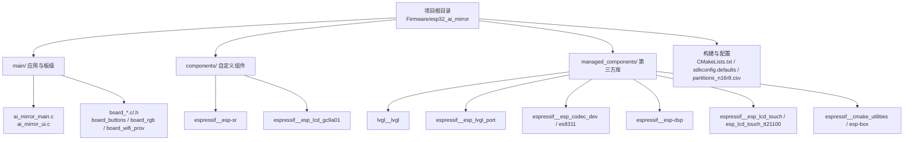
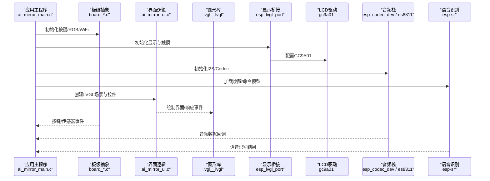
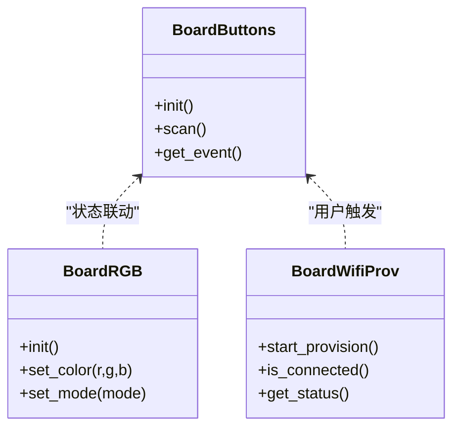
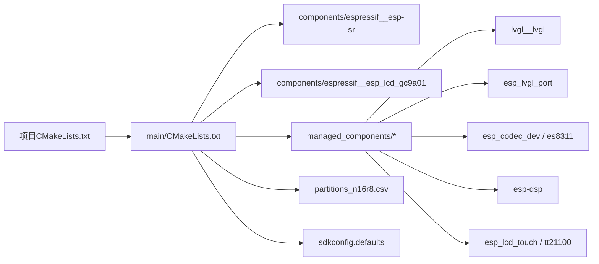

# 项目结构

<cite>
**本文引用的文件**   
- [Firmware/esp32_ai_mirror/main/CMakeLists.txt](file://Firmware/esp32_ai_mirror/main/CMakeLists.txt)
- [Firmware/esp32_ai_mirror/main/Kconfig.projbuild](file://Firmware/esp32_ai_mirror/main/Kconfig.projbuild)
- [Firmware/esp32_ai_mirror/main/ai_mirror_config.h](file://Firmware/esp32_ai_mirror/main/ai_mirror_config.h)
- [Firmware/esp32_ai_mirror/main/ai_mirror_main.c](file://Firmware/esp32_ai_mirror/main/ai_mirror_main.c)
- [Firmware/esp32_ai_mirror/main/ai_mirror_ui.c](file://Firmware/esp32_ai_mirror/main/ai_mirror_ui.c)
- [Firmware/esp32_ai_mirror/main/board_buttons.c](file://Firmware/esp32_ai_mirror/main/board_buttons.c)
- [Firmware/esp32_ai_mirror/main/board_buttons.h](file://Firmware/esp32_ai_mirror/main/board_buttons.h)
- [Firmware/esp32_ai_mirror/main/board_rgb.c](file://Firmware/esp32_ai_mirror/main/board_rgb.c)
- [Firmware/esp32_ai_mirror/main/board_rgb.h](file://Firmware/esp32_ai_mirror/main/board_rgb.h)
- [Firmware/esp32_ai_mirror/main/board_wifi_prov.c](file://Firmware/esp32_ai_mirror/main/board_wifi_prov.c)
- [Firmware/esp32_ai_mirror/main/board_wifi_prov.h](file://Firmware/esp32_ai_mirror/main/board_wifi_prov.h)
- [Firmware/esp32_ai_mirror/main/idf_component.yml](file://Firmware/esp32_ai_mirror/main/idf_component.yml)
- [Firmware/esp32_ai_mirror/CMakeLists.txt](file://Firmware/esp32_ai_mirror/CMakeLists.txt)
- [Firmware/esp32_ai_mirror/sdkconfig.defaults](file://Firmware/esp32_ai_mirror/sdkconfig.defaults)
- [Firmware/esp32_ai_mirror/partitions_n16r8.csv](file://Firmware/esp32_ai_mirror/partitions_n16r8.csv)
- [Firmware/esp32_ai_mirror/dependencies.lock](file://Firmware/esp32_ai_mirror/dependencies.lock)
- [Firmware/esp32_ai_mirror/components/espressif__esp-sr/CMakeLists.txt](file://Firmware/esp32_ai_mirror/components/espressif__esp-sr/CMakeLists.txt)
- [Firmware/esp32_ai_mirror/components/espressif__esp-sr/idf_component.yml](file://Firmware/esp32_ai_mirror/components/espressif__esp-sr/idf_component.yml)
- [Firmware/esp32_ai_mirror/components/espressif__esp_lcd_gc9a01/CMakeLists.txt](file://Firmware/esp32_ai_mirror/components/espressif__esp_lcd_gc9a01/CMakeLists.txt)
- [Firmware/esp32_ai_mirror/components/espressif__esp_lcd_gc9a01/idf_component.yml](file://Firmware/esp32_ai_mirror/components/espressif__esp_lcd_gc9a01/idf_component.yml)
- [Firmware/esp32_ai_mirror/managed_components/espressif__cmake_utilities/CMakeLists.txt](file://Firmware/esp32_ai_mirror/managed_components/espressif__cmake_utilities/CMakeLists.txt)
- [Firmware/esp32_ai_mirror/managed_components/espressif__cmake_utilities/idf_component.yml](file://Firmware/esp32_ai_mirror/managed_components/espressif__cmake_utilities/idf_component.yml)
- [Firmware/esp32_ai_mirror/managed_components/espressif__es8311/CMakeLists.txt](file://Firmware/esp32_ai_mirror/managed_components/espressif__es8311/CMakeLists.txt)
- [Firmware/esp32_ai_mirror/managed_components/espressif__es8311/idf_component.yml](file://Firmware/esp32_ai_mirror/managed_components/espressif__es8311/idf_component.yml)
- [Firmware/esp32_ai_mirror/managed_components/espressif__esp-box/CMakeLists.txt](file://Firmware/esp32_ai_mirror/managed_components/espressif__esp-box/CMakeLists.txt)
- [Firmware/esp32_ai_mirror/managed_components/espressif__esp-box/idf_component.yml](file://Firmware/esp32_ai_mirror/managed_components/espressif__esp-box/idf_component.yml)
- [Firmware/esp32_ai_mirror/managed_components/espressif__esp-dsp/CMakeLists.txt](file://Firmware/esp32_ai_mirror/managed_components/espressif__esp-dsp/CMakeLists.txt)
- [Firmware/esp32_ai_mirror/managed_components/espressif__esp-dsp/idf_component.yml](file://Firmware/esp32_ai_mirror/managed_components/espressif__esp-dsp/idf_component.yml)
- [Firmware/esp32_ai_mirror/managed_components/espressif__esp_codec_dev/CMakeLists.txt](file://Firmware/esp32_ai_mirror/managed_components/espressif__esp_codec_dev/CMakeLists.txt)
- [Firmware/esp32_ai_mirror/managed_components/espressif__esp_codec_dev/idf_component.yml](file://Firmware/esp32_ai_mirror/managed_components/espressif__esp_codec_dev/idf_component.yml)
- [Firmware/esp32_ai_mirror/managed_components/espressif__esp_lcd_touch/CMakeLists.txt](file://Firmware/esp32_ai_mirror/managed_components/espressif__esp_lcd_touch/CMakeLists.txt)
- [Firmware/esp32_ai_mirror/managed_components/espressif__esp_lcd_touch/idf_component.yml](file://Firmware/esp32_ai_mirror/managed_components/espressif__esp_lcd_touch/idf_component.yml)
- [Firmware/esp32_ai_mirror/managed_components/espressif__esp_lcd_touch_tt21100/CMakeLists.txt](file://Firmware/esp32_ai_mirror/managed_components/espressif__esp_lcd_touch_tt21100/CMakeLists.txt)
- [Firmware/esp32_ai_mirror/managed_components/espressif__esp_lcd_touch_tt21100/idf_component.yml](file://Firmware/esp32_ai_mirror/managed_components/espressif__esp_lcd_touch_tt21100/idf_component.yml)
- [Firmware/esp32_ai_mirror/managed_components/espressif__esp_lvgl_port/CMakeLists.txt](file://Firmware/esp32_ai_mirror/managed_components/espressif__esp_lvgl_port/CMakeLists.txt)
- [Firmware/esp32_ai_mirror/managed_components/espressif__esp_lvgl_port/idf_component.yml](file://Firmware/esp32_ai_mirror/managed_components/espressif__esp_lvgl_port/idf_component.yml)
- [Firmware/esp32_ai_mirror/managed_components/lvgl__lvgl/CMakeLists.txt](file://Firmware/esp32_ai_mirror/managed_components/lvgl__lvgl/CMakeLists.txt)
- [Firmware/esp32_ai_mirror/managed_components/lvgl__lvgl/idf_component.yml](file://Firmware/esp32_ai_mirror/managed_components/lvgl__lvgl/idf_component.yml)
</cite>

## 目录
1. [简介](#简介)
2. [项目结构](#项目结构)
3. [核心组件](#核心组件)
4. [架构总览](#架构总览)
5. [详细组件分析](#详细组件分析)
6. [依赖关系分析](#依赖关系分析)
7. [性能考虑](#性能考虑)
8. [故障排查指南](#故障排查指南)
9. [结论](#结论)
10. [附录](#附录)

## 简介
本文件为AI镜子项目的“项目结构”文档，面向开发者与贡献者，系统化说明整体目录组织、主程序与UI逻辑、板级支持模块、自定义组件与托管第三方库的组织方式、配置体系（sdkconfig、CMakeLists.txt、idf_component.yml等）、代码规范与命名约定、代码导航技巧、扩展新模块的方法以及构建流程与依赖管理。内容基于仓库实际结构与常见ESP-IDF工程实践整理，便于快速上手与长期维护。

## 项目结构
本项目采用ESP-IDF标准工程布局，核心位于 Firmware/esp32_ai_mirror 目录：
- main：应用主程序与界面逻辑、板级驱动封装、WiFi配网等
- components：本地自定义或半托管组件（如语音识别、LCD驱动）
- managed_components：通过ESP-IDF Component Manager引入的第三方库（LVGL、音频编解码、触摸、显示桥接等）
- 根级配置文件：CMakeLists.txt、sdkconfig.defaults、partitions_n16r8.csv、dependencies.lock等

图表来源
- [Firmware/esp32_ai_mirror/CMakeLists.txt](file://Firmware/esp32_ai_mirror/CMakeLists.txt)
- [Firmware/esp32_ai_mirror/main/CMakeLists.txt](file://Firmware/esp32_ai_mirror/main/CMakeLists.txt)

章节来源
- [Firmware/esp32_ai_mirror/CMakeLists.txt](file://Firmware/esp32_ai_mirror/CMakeLists.txt)
- [Firmware/esp32_ai_mirror/main/CMakeLists.txt](file://Firmware/esp32_ai_mirror/main/CMakeLists.txt)

## 核心组件
- ai_mirror_main.c：应用入口与任务编排，负责初始化各子系统（显示、音频、网络、语音等），并协调事件循环与状态机。
- ai_mirror_ui.c：基于LVGL的界面逻辑，包含页面切换、控件更新、事件处理与动画。
- board_*.c/.h：板级抽象层，封装按键、RGB灯、WiFi配网等硬件相关能力，向上提供统一接口。
- ai_mirror_config.h：项目级配置头文件，集中定义编译开关、引脚映射、功能裁剪等。

职责划分建议
- 应用层（main）：业务流程、任务调度、跨模块通信
- UI层（ui）：视图渲染、交互事件、资源管理
- 板级层（board_*）：硬件抽象、外设驱动封装、平台差异隔离
- 组件层（components/managed_components）：功能复用、算法与协议栈、图形与音频库

章节来源
- [Firmware/esp32_ai_mirror/main/ai_mirror_main.c](file://Firmware/esp32_ai_mirror/main/ai_mirror_main.c)
- [Firmware/esp32_ai_mirror/main/ai_mirror_ui.c](file://Firmware/esp32_ai_mirror/main/ai_mirror_ui.c)
- [Firmware/esp32_ai_mirror/main/board_buttons.c](file://Firmware/esp32_ai_mirror/main/board_buttons.c)
- [Firmware/esp32_ai_mirror/main/board_buttons.h](file://Firmware/esp32_ai_mirror/main/board_buttons.h)
- [Firmware/esp32_ai_mirror/main/board_rgb.c](file://Firmware/esp32_ai_mirror/main/board_rgb.c)
- [Firmware/esp32_ai_mirror/main/board_rgb.h](file://Firmware/esp32_ai_mirror/main/board_rgb.h)
- [Firmware/esp32_ai_mirror/main/board_wifi_prov.c](file://Firmware/esp32_ai_mirror/main/board_wifi_prov.c)
- [Firmware/esp32_ai_mirror/main/board_wifi_prov.h](file://Firmware/esp32_ai_mirror/main/board_wifi_prov.h)
- [Firmware/esp32_ai_mirror/main/ai_mirror_config.h](file://Firmware/esp32_ai_mirror/main/ai_mirror_config.h)

## 架构总览
下图展示应用启动到UI渲染与外设交互的关键路径，体现main与UI、板级抽象、第三方库之间的协作关系。

图表来源
- [Firmware/esp32_ai_mirror/main/ai_mirror_main.c](file://Firmware/esp32_ai_mirror/main/ai_mirror_main.c)
- [Firmware/esp32_ai_mirror/main/ai_mirror_ui.c](file://Firmware/esp32_ai_mirror/main/ai_mirror_ui.c)
- [Firmware/esp32_ai_mirror/main/board_buttons.c](file://Firmware/esp32_ai_mirror/main/board_buttons.c)
- [Firmware/esp32_ai_mirror/main/board_rgb.c](file://Firmware/esp32_ai_mirror/main/board_rgb.c)
- [Firmware/esp32_ai_mirror/main/board_wifi_prov.c](file://Firmware/esp32_ai_mirror/main/board_wifi_prov.c)
- [Firmware/esp32_ai_mirror/components/espressif__esp_lcd_gc9a01/CMakeLists.txt](file://Firmware/esp32_ai_mirror/components/espressif__esp_lcd_gc9a01/CMakeLists.txt)
- [Firmware/esp32_ai_mirror/managed_components/espressif__esp_lvgl_port/CMakeLists.txt](file://Firmware/esp32_ai_mirror/managed_components/espressif__esp_lvgl_port/CMakeLists.txt)
- [Firmware/esp32_ai_mirror/managed_components/lvgl__lvgl/CMakeLists.txt](file://Firmware/esp32_ai_mirror/managed_components/lvgl__lvgl/CMakeLists.txt)
- [Firmware/esp32_ai_mirror/managed_components/espressif__esp_codec_dev/CMakeLists.txt](file://Firmware/esp32_ai_mirror/managed_components/espressif__esp_codec_dev/CMakeLists.txt)
- [Firmware/esp32_ai_mirror/managed_components/espressif__es8311/CMakeLists.txt](file://Firmware/esp32_ai_mirror/managed_components/espressif__es8311/CMakeLists.txt)
- [Firmware/esp32_ai_mirror/components/espressif__esp-sr/CMakeLists.txt](file://Firmware/esp32_ai_mirror/components/espressif__esp-sr/CMakeLists.txt)

## 详细组件分析

### 主程序与任务编排（ai_mirror_main.c）
- 作用：系统初始化、任务创建、事件分发、模块生命周期管理
- 关键流程：
  - 初始化日志、内存、外设时钟
  - 初始化显示（LVGL + GC9A01）、触摸、音频（I2S + Codec）、语音（WakeNet/MultiNet）
  - 创建UI线程与应用线程，注册事件回调
  - 进入事件循环，处理按键、音频流、网络消息与UI刷新

章节来源
- [Firmware/esp32_ai_mirror/main/ai_mirror_main.c](file://Firmware/esp32_ai_mirror/main/ai_mirror_main.c)

### 界面逻辑（ai_mirror_ui.c）
- 作用：基于LVGL的页面与控件管理、事件绑定、动画与资源加载
- 关键流程：
  - 初始化LVGL显示与输入设备
  - 构建主界面、设置主题与字体
  - 监听按键/触摸事件，触发页面切换或动作
  - 与音频/语音模块对接，更新UI状态

章节来源
- [Firmware/esp32_ai_mirror/main/ai_mirror_ui.c](file://Firmware/esp32_ai_mirror/main/ai_mirror_ui.c)

### 板级抽象（board_*.c/.h）
- board_buttons：按键扫描、去抖、事件上报
- board_rgb：LED控制、呼吸灯效果、状态指示
- board_wifi_prov：WiFi配网流程、二维码/热点引导、连接状态反馈

图表来源
- [Firmware/esp32_ai_mirror/main/board_buttons.c](file://Firmware/esp32_ai_mirror/main/board_buttons.c)
- [Firmware/esp32_ai_mirror/main/board_buttons.h](file://Firmware/esp32_ai_mirror/main/board_buttons.h)
- [Firmware/esp32_ai_mirror/main/board_rgb.c](file://Firmware/esp32_ai_mirror/main/board_rgb.c)
- [Firmware/esp32_ai_mirror/main/board_rgb.h](file://Firmware/esp32_ai_mirror/main/board_rgb.h)
- [Firmware/esp32_ai_mirror/main/board_wifi_prov.c](file://Firmware/esp32_ai_mirror/main/board_wifi_prov.c)
- [Firmware/esp32_ai_mirror/main/board_wifi_prov.h](file://Firmware/esp32_ai_mirror/main/board_wifi_prov.h)

章节来源
- [Firmware/esp32_ai_mirror/main/board_buttons.c](file://Firmware/esp32_ai_mirror/main/board_buttons.c)
- [Firmware/esp32_ai_mirror/main/board_buttons.h](file://Firmware/esp32_ai_mirror/main/board_buttons.h)
- [Firmware/esp32_ai_mirror/main/board_rgb.c](file://Firmware/esp32_ai_mirror/main/board_rgb.c)
- [Firmware/esp32_ai_mirror/main/board_rgb.h](file://Firmware/esp32_ai_mirror/main/board_rgb.h)
- [Firmware/esp32_ai_mirror/main/board_wifi_prov.c](file://Firmware/esp32_ai_mirror/main/board_wifi_prov.c)
- [Firmware/esp32_ai_mirror/main/board_wifi_prov.h](file://Firmware/esp32_ai_mirror/main/board_wifi_prov.h)

### 自定义组件（components）
- espressif__esp-sr：语音识别套件（唤醒词、多语种命令识别、TTS集成）
- espressif__esp_lcd_gc9a01：GC9A01 LCD控制器驱动

职责划分
- 语音链路：采集→降噪→VAD→唤醒→ASR→文本输出
- 显示链路：MCU→LVGL→esp_lvgl_port→GC9A01

章节来源
- [Firmware/esp32_ai_mirror/components/espressif__esp-sr/CMakeLists.txt](file://Firmware/esp32_ai_mirror/components/espressif__esp-sr/CMakeLists.txt)
- [Firmware/esp32_ai_mirror/components/espressif__esp-sr/idf_component.yml](file://Firmware/esp32_ai_mirror/components/espressif__esp-sr/idf_component.yml)
- [Firmware/esp32_ai_mirror/components/espressif__esp_lcd_gc9a01/CMakeLists.txt](file://Firmware/esp32_ai_mirror/components/espressif__esp_lcd_gc9a01/CMakeLists.txt)
- [Firmware/esp32_ai_mirror/components/espressif__esp_lcd_gc9a01/idf_component.yml](file://Firmware/esp32_ai_mirror/components/espressif__esp_lcd_gc9a01/idf_component.yml)

### 托管第三方库（managed_components）
- lvgl__lvgl：图形界面框架
- espressif__esp_lvgl_port：LVGL与ESP-IDF HAL的桥接
- espressif__esp_codec_dev / espressif__es8311：音频编解码与DAC/ADC控制
- espressif__esp-dsp：数字信号处理库
- espressif__esp_lcd_touch / espressif__esp_lcd_touch_tt21100：触摸驱动
- espressif__cmake_utilities / espressif__esp-box：构建工具与开发板BSP

版本管理与锁定
- idf_component.yml：声明组件依赖与版本范围
- dependencies.lock：锁定具体版本，保证可重复构建

章节来源
- [Firmware/esp32_ai_mirror/managed_components/lvgl__lvgl/CMakeLists.txt](file://Firmware/esp32_ai_mirror/managed_components/lvgl__lvgl/CMakeLists.txt)
- [Firmware/esp32_ai_mirror/managed_components/lvgl__lvgl/idf_component.yml](file://Firmware/esp32_ai_mirror/managed_components/lvgl__lvgl/idf_component.yml)
- [Firmware/esp32_ai_mirror/managed_components/espressif__esp_lvgl_port/CMakeLists.txt](file://Firmware/esp32_ai_mirror/managed_components/espressif__esp_lvgl_port/CMakeLists.txt)
- [Firmware/esp32_ai_mirror/managed_components/espressif__esp_lvgl_port/idf_component.yml](file://Firmware/esp32_ai_mirror/managed_components/espressif__esp_lvgl_port/idf_component.yml)
- [Firmware/esp32_ai_mirror/managed_components/espressif__esp_codec_dev/CMakeLists.txt](file://Firmware/esp32_ai_mirror/managed_components/espressif__esp_codec_dev/CMakeLists.txt)
- [Firmware/esp32_ai_mirror/managed_components/espressif__esp_codec_dev/idf_component.yml](file://Firmware/esp32_ai_mirror/managed_components/espressif__esp_codec_dev/idf_component.yml)
- [Firmware/esp32_ai_mirror/managed_components/espressif__es8311/CMakeLists.txt](file://Firmware/esp32_ai_mirror/managed_components/espressif__es8311/CMakeLists.txt)
- [Firmware/esp32_ai_mirror/managed_components/espressif__es8311/idf_component.yml](file://Firmware/esp32_ai_mirror/managed_components/espressif__es8311/idf_component.yml)
- [Firmware/esp32_ai_mirror/managed_components/espressif__esp-dsp/CMakeLists.txt](file://Firmware/esp32_ai_mirror/managed_components/espressif__esp-dsp/CMakeLists.txt)
- [Firmware/esp32_ai_mirror/managed_components/espressif__esp-dsp/idf_component.yml](file://Firmware/esp32_ai_mirror/managed_components/espressif__esp-dsp/idf_component.yml)
- [Firmware/esp32_ai_mirror/managed_components/espressif__esp_lcd_touch/CMakeLists.txt](file://Firmware/esp32_ai_mirror/managed_components/espressif__esp_lcd_touch/CMakeLists.txt)
- [Firmware/esp32_ai_mirror/managed_components/espressif__esp_lcd_touch/idf_component.yml](file://Firmware/esp32_ai_mirror/managed_components/espressif__esp_lcd_touch/idf_component.yml)
- [Firmware/esp32_ai_mirror/managed_components/espressif__esp_lcd_touch_tt21100/CMakeLists.txt](file://Firmware/esp32_ai_mirror/managed_components/espressif__esp_lcd_touch_tt21100/CMakeLists.txt)
- [Firmware/esp32_ai_mirror/managed_components/espressif__esp_lcd_touch_tt21100/idf_component.yml](file://Firmware/esp32_ai_mirror/managed_components/espressif__esp_lcd_touch_tt21100/idf_component.yml)
- [Firmware/esp32_ai_mirror/managed_components/espressif__cmake_utilities/CMakeLists.txt](file://Firmware/esp32_ai_mirror/managed_components/espressif__cmake_utilities/CMakeLists.txt)
- [Firmware/esp32_ai_mirror/managed_components/espressif__cmake_utilities/idf_component.yml](file://Firmware/esp32_ai_mirror/managed_components/espressif__cmake_utilities/idf_component.yml)
- [Firmware/esp32_ai_mirror/managed_components/espressif__esp-box/CMakeLists.txt](file://Firmware/esp32_ai_mirror/managed_components/espressif__esp-box/CMakeLists.txt)
- [Firmware/esp32_ai_mirror/managed_components/espressif__esp-box/idf_component.yml](file://Firmware/esp32_ai_mirror/managed_components/espressif__esp-box/idf_component.yml)

## 依赖关系分析
- 顶层CMakeLists.txt定义目标与组件集合，main/CMakeLists.txt声明应用源文件与依赖组件
- idf_component.yml声明组件依赖树，dependencies.lock固化版本
- partitions_n16r8.csv定义Flash分区（OTA、文件系统、模型等）
- sdkconfig.defaults提供默认Kconfig选项，Kconfig.projbuild补充项目级配置

图表来源
- [Firmware/esp32_ai_mirror/CMakeLists.txt](file://Firmware/esp32_ai_mirror/CMakeLists.txt)
- [Firmware/esp32_ai_mirror/main/CMakeLists.txt](file://Firmware/esp32_ai_mirror/main/CMakeLists.txt)
- [Firmware/esp32_ai_mirror/partitions_n16r8.csv](file://Firmware/esp32_ai_mirror/partitions_n16r8.csv)
- [Firmware/esp32_ai_mirror/sdkconfig.defaults](file://Firmware/esp32_ai_mirror/sdkconfig.defaults)
- [Firmware/esp32_ai_mirror/dependencies.lock](file://Firmware/esp32_ai_mirror/dependencies.lock)

章节来源
- [Firmware/esp32_ai_mirror/CMakeLists.txt](file://Firmware/esp32_ai_mirror/CMakeLists.txt)
- [Firmware/esp32_ai_mirror/main/CMakeLists.txt](file://Firmware/esp32_ai_mirror/main/CMakeLists.txt)
- [Firmware/esp32_ai_mirror/partitions_n16r8.csv](file://Firmware/esp32_ai_mirror/partitions_n16r8.csv)
- [Firmware/esp32_ai_mirror/sdkconfig.defaults](file://Firmware/esp32_ai_mirror/sdkconfig.defaults)
- [Firmware/esp32_ai_mirror/dependencies.lock](file://Firmware/esp32_ai_mirror/dependencies.lock)

## 性能考虑
- 显示与UI
  - LVGL帧率与刷新策略：合理设置刷新区域、减少重绘、使用双缓冲
  - DMA传输与SPI频率：在稳定前提下提升SPI速率，降低CPU占用
- 音频与语音
  - I2S缓冲区大小与中断优先级：平衡时延与稳定性
  - VAD阈值与降噪参数：降低误唤醒与功耗
  - ASR模型选择：根据芯片资源权衡精度与速度
- 内存与存储
  - Flash分区规划：模型、媒体资源与固件分区预留充足空间
  - 堆与栈分配：避免大对象频繁分配，使用静态缓存池

[本节为通用指导，不直接分析具体文件]

## 故障排查指南
- 构建失败
  - 检查idf_component.yml依赖版本与dependencies.lock一致性
  - 清理build目录后重新生成配置
- 显示异常
  - 校验GC9A01初始化序列与时序参数
  - 确认LVGL端口配置与DMA通道可用
- 无声音或杂音
  - 检查I2S引脚与ES8311寄存器配置
  - 验证采样率、位宽与音量增益
- WiFi无法配网
  - 查看配网日志与热点名称是否正确
  - 确认DNS与NTP时间同步

章节来源
- [Firmware/esp32_ai_mirror/main/CMakeLists.txt](file://Firmware/esp32_ai_mirror/main/CMakeLists.txt)
- [Firmware/esp32_ai_mirror/main/idf_component.yml](file://Firmware/esp32_ai_mirror/main/idf_component.yml)
- [Firmware/esp32_ai_mirror/dependencies.lock](file://Firmware/esp32_ai_mirror/dependencies.lock)

## 结论
本项目的目录与组件划分清晰，遵循ESP-IDF最佳实践：应用层聚焦业务与调度，UI层专注交互与渲染，板级抽象屏蔽硬件差异，第三方库通过Component Manager统一管理。通过合理的配置与依赖锁定，可实现稳定、可复现的构建与部署。后续扩展应遵循现有分层与命名规范，优先以组件形式集成新功能。

[本节为总结性内容，不直接分析具体文件]

## 附录

### 配置文件位置与作用
- sdkconfig.defaults：默认Kconfig选项，覆盖默认值
- Kconfig.projbuild：项目级配置项定义与菜单
- CMakeLists.txt（根与main）：构建目标、源文件与依赖声明
- idf_component.yml（main与各组件）：组件依赖与版本约束
- partitions_n16r8.csv：Flash分区表（固件、OTA、文件系统、模型）
- dependencies.lock：依赖版本锁定，确保可重复构建

章节来源
- [Firmware/esp32_ai_mirror/sdkconfig.defaults](file://Firmware/esp32_ai_mirror/sdkconfig.defaults)
- [Firmware/esp32_ai_mirror/main/Kconfig.projbuild](file://Firmware/esp32_ai_mirror/main/Kconfig.projbuild)
- [Firmware/esp32_ai_mirror/CMakeLists.txt](file://Firmware/esp32_ai_mirror/CMakeLists.txt)
- [Firmware/esp32_ai_mirror/main/CMakeLists.txt](file://Firmware/esp32_ai_mirror/main/CMakeLists.txt)
- [Firmware/esp32_ai_mirror/main/idf_component.yml](file://Firmware/esp32_ai_mirror/main/idf_component.yml)
- [Firmware/esp32_ai_mirror/partitions_n16r8.csv](file://Firmware/esp32_ai_mirror/partitions_n16r8.csv)
- [Firmware/esp32_ai_mirror/dependencies.lock](file://Firmware/esp32_ai_mirror/dependencies.lock)

### 代码规范与命名约定
- 文件名：小写下划线分隔，模块名与功能语义明确（如 board_buttons.c）
- 函数与变量：驼峰或下划线风格统一，避免缩写歧义
- 头文件：仅暴露必要接口，内部实现放在.c中
- 注释：关键逻辑与API添加简明注释，保持与实现一致
- 错误码：统一返回码与日志级别，便于定位问题

[本节为通用指导，不直接分析具体文件]

### 代码导航与查找技巧
- 全局搜索：按关键字搜索函数/宏/头文件，定位调用链
- 符号跳转：从调用处跳转到定义，理解模块边界
- 依赖图：通过idf_component.yml与CMakeLists.txt梳理依赖
- 构建产物：查看build目录下的链接信息与编译选项，辅助定位问题

[本节为通用指导，不直接分析具体文件]

### 如何添加新模块与扩展功能
- 新建组件
  - 在components或managed_components下新增目录，编写CMakeLists.txt与id_component.yml
  - 在main/CMakeLists.txt中添加依赖与源文件
- 配置项
  - 在Kconfig.projbuild中新增选项，并在sdkconfig.defaults中设置默认值
- 集成步骤
  - 在main中初始化模块，注册事件回调
  - 在UI层增加对应页面或控件
  - 更新依赖锁定与分区表（如需）

[本节为通用指导，不直接分析具体文件]

### 构建流程与依赖管理
- 配置阶段：读取sdkconfig.defaults与Kconfig，生成sdkconfig
- 依赖解析：idf_component.yml解析依赖树，生成依赖锁文件
- 编译链接：CMakeLists.txt收集源文件与库，生成二进制
- 打包烧录：按分区表生成镜像，支持OTA与回滚

章节来源
- [Firmware/esp32_ai_mirror/CMakeLists.txt](file://Firmware/esp32_ai_mirror/CMakeLists.txt)
- [Firmware/esp32_ai_mirror/main/CMakeLists.txt](file://Firmware/esp32_ai_mirror/main/CMakeLists.txt)
- [Firmware/esp32_ai_mirror/main/idf_component.yml](file://Firmware/esp32_ai_mirror/main/idf_component.yml)
- [Firmware/esp32_ai_mirror/dependencies.lock](file://Firmware/esp32_ai_mirror/dependencies.lock)
- [Firmware/esp32_ai_mirror/partitions_n16r8.csv](file://Firmware/esp32_ai_mirror/partitions_n16r8.csv)