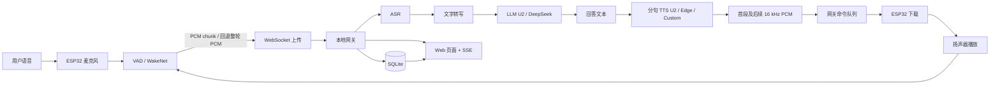
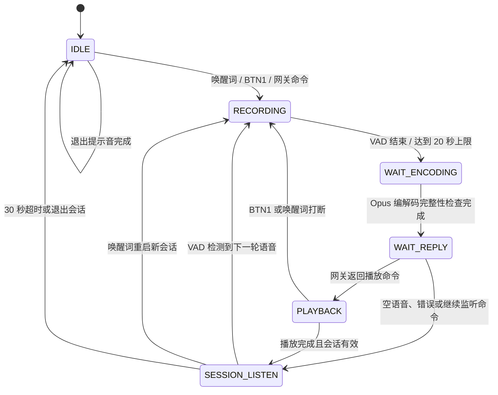
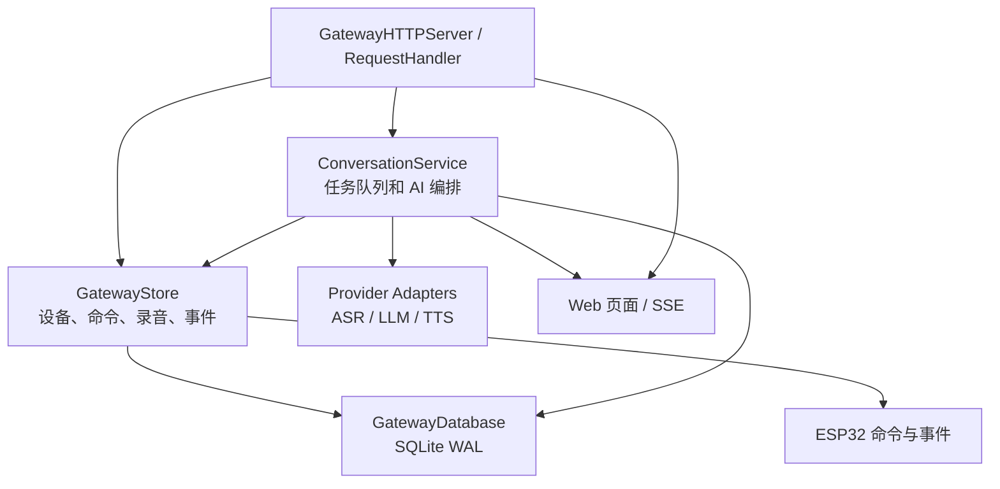

# AI Mirror 本次对话修改与功能设计说明

## 1. 文档目的

本文整理本次对话中围绕 AI Mirror 完成的功能改造、故障修复、架构设计、数据流、状态机、测试结果和当前限制。

本文不记录任何真实 API Key。密钥应通过网关 Web 配置、环境变量或本地 SQLite 配置保存，并避免写入源码和日志。

## 2. 最终目标

系统目标是让 ESP32 设备通过本地网关完成连续语音交互：

1. ESP32 通过唤醒词或按键开始录音。
2. ESP32 将录音上传到本地网关。
3. 网关执行 ASR 语音转文字。
4. 网关调用 LLM 生成回答。
5. 网关调用 TTS 生成 16 kHz、单声道、16-bit PCM。
6. ESP32 下载并播放回答。
7. 播放结束后自动回到长聊天监听状态。
8. 长聊天中可以继续说话、用语音命令退出，也可以再次说唤醒词打断并重启新会话。
9. Web 页面查看对话、录音、处理耗时和网关日志，并可修改模型配置。

## 3. 已完成的主要修改

### 3.1 本地网关服务

涉及文件：

- `gateway/src/app.py`
- `gateway/src/ai_services.py`
- `gateway/tests/test_gateway.py`
- `gateway/web/index.html`
- `gateway/web/app.js`
- `gateway/web/styles.css`

已实现：

- 提供 Web 页面和 HTTP API。
- 提供 ESP32 命令轮询接口。
- 提供 ESP32 录音 WebSocket 接口。
- 使用 SQLite 保存录音元数据、对话轮次、模型配置、事件和日志。
- 录音保存为 WAV，可通过 Web 播放。
- 使用 SSE 将后台处理状态和日志推送到 Web 页面。
- 网关支持设备在线状态、命令队列和播放事件回传。
- Web 对话窗口最多展示 20 条记录，避免历史记录无限增长影响页面性能。

主要接口：

| 接口 | 作用 |
| --- | --- |
| `GET /health` | 网关和 AI Worker 健康状态 |
| `GET /api/config` | 查询公开模型配置 |
| `POST /api/config` | 更新模型配置 |
| `GET /api/conversations` | 查询对话记录 |
| `GET /api/logs` | 查询日志 |
| `GET /api/stream` | SSE 实时事件流 |
| `GET /api/recordings/{id}/audio` | 播放 WAV 录音 |
| `GET /api/devices/{id}/commands` | ESP32 获取命令 |
| `POST /api/devices/{id}/events` | ESP32 回传事件 |
| `GET /ws/devices/{id}/recordings` | ESP32 上传录音的 WebSocket |

#### 3.1.1 ESP32 与网关通信格式

##### 公共约定

- 字符编码：JSON 使用 UTF-8。
- 设备认证：ESP32 请求携带 `X-Device-Token: <device_token>`。
- 设备 ID：路径中的 `{device_id}` 只允许字母、数字、`.`、`_`、`-`，长度 1～64。
- JSON 请求体上限：64 KiB。
- 单条录音 PCM 消息上限：8 MiB。
- 时间字段：网关使用 ISO 8601 UTC 字符串，例如 `2026-08-01T10:43:14.499+00:00`。
- 命令由网关生成唯一 `id`，ESP32 使用该 ID 回传对应事件。

##### 1. ESP32 长轮询获取命令

请求：

```http
GET /api/devices/ai-mirror-001/commands?wait_ms=1000 HTTP/1.1
Host: 192.168.10.100:8000
X-Device-Token: <device_token>
```

有命令时返回：

```json
{
  "id": "command-id-32-or-more-chars",
  "device_id": "ai-mirror-001",
  "type": "play_audio",
  "created_at": "2026-08-01T10:43:14.499+00:00",
  "turn_id": "turn-id-32-hex",
  "audio_path": "/api/tts/turn-id-32-hex/pcm",
  "sample_rate": 16000,
  "sample_count": 24000
}
```

无命令时返回 `204 No Content`。`wait_ms` 最大 30000 ms，ESP32 当前按轮询配置周期请求。

支持的命令类型：

| `type` | 必需字段 | 含义 |
| --- | --- | --- |
| `ping` | 无 | 连通性检查 |
| `get_status` | 无 | 请求设备堆内存和运行时间 |
| `start_recording` | 无 | 远程请求开始录音 |
| `play_audio` | `turn_id`、`audio_path`、`sample_rate`、`sample_count` | 下载并播放 TTS PCM |
| `continue_listening` | `turn_id` 可选 | 继续长聊天监听 |
| `end_conversation` | `turn_id` 可选 | 请求结束长聊天 |

`play_audio` 当前要求：

- `audio_path` 必须匹配 `/api/tts/{turn_id}/pcm`。
- `sample_rate` 必须是 `16000`。
- `sample_count` 必须大于 0，且不超过 `1,048,576` 个采样点（2 MiB PCM）。

##### 2. ESP32 回传设备事件

请求：

```http
POST /api/devices/ai-mirror-001/events HTTP/1.1
Host: 192.168.10.100:8000
Content-Type: application/json
X-Device-Token: <device_token>
```

通用事件格式：

```json
{
  "command_id": "command-id-or-empty",
  "type": "playback_completed",
  "details": {
    "playback_ms": 1530,
    "reason": ""
  }
}
```

常用事件：

| 事件类型 | `details` 字段 | 触发时机 |
| --- | --- | --- |
| `online` | `command_transport`、`recording_transport` | 网关通信任务启动 |
| `pong` | `ok` | 响应 `ping` |
| `status` | `free_heap`、`minimum_free_heap`、`uptime_ms` | 响应 `get_status` |
| `recording_requested` | `accepted` | 接受远程录音命令 |
| `recording_saved` | 由 WebSocket ACK 返回，不走 HTTP 事件 | 网关保存录音后 |
| `playback_buffered` | `sample_count`、`download_ms` | PCM 下载并进入播放队列 |
| `playback_started` | `playback_ms`、`reason` | 扬声器开始播放 |
| `playback_completed` | `playback_ms`、`reason` | 播放完成 |
| `playback_aborted` | `playback_ms`、`reason` | BTN1 或唤醒词打断播放 |
| `playback_failed` | `playback_ms`、`reason` | 下载、队列或 I2S 播放失败 |
| `conversation_session_started` | `session_id`、`turn_index` | 创建新长聊天会话 |
| `conversation_listening` | `session_id`、`turn_index` | 播放结束，进入下一轮监听 |
| `conversation_session_ended` | `session_id`、`turn_index` | 长聊天超时或唤醒词重启旧会话 |
| `conversation_session_voice_ended` | `session_id`、`turn_index` | 语音命令结束会话 |
| `conversation_session_reply_timeout` | `session_id`、`turn_index` | 等待网关回答超时 |
| `listening_resumed` | `accepted` | 接受继续监听命令 |
| `conversation_end_requested` | `accepted` | 接受结束会话命令 |

##### 3. 录音 WebSocket

连接地址：

```text
ws://192.168.10.100:8000/ws/devices/ai-mirror-001/recordings
```

握手时携带 `X-Device-Token`。连接建立后，每一轮录音按以下顺序发送两个 WebSocket 消息：

**第一帧：文本 JSON 元数据**

```json
{
  "type": "recording_pcm",
  "protocol_version": 1,
  "transport": "turn",
  "session_id": "0123abcd4567ef89",
  "turn_index": 1,
  "sample_rate": 16000,
  "channels": 1,
  "bits_per_sample": 16,
  "sample_count": 32000
}
```

**第二帧：二进制 PCM**

- 格式：signed 16-bit little-endian PCM。
- 声道：单声道。
- 采样率：当前 ESP32 为 16 kHz。
- 字节数：`sample_count * channels * (bits_per_sample / 8)`。
- 上例应发送 `32000 * 2 = 64000` 字节。

网关保存成功后返回文本 ACK：

```json
{
  "type": "recording_saved",
  "recording": {
    "id": "recording-id-32-hex",
    "device_id": "ai-mirror-001",
    "session_id": "0123abcd4567ef89",
    "turn_index": 1,
    "sample_rate": 16000,
    "channels": 1,
    "bits_per_sample": 16,
    "sample_count": 32000,
    "duration_ms": 2000,
    "audio_url": "/api/recordings/recording-id-32-hex/audio"
  }
}
```

如果校验失败，网关返回：

```json
{
  "type": "recording_error",
  "error": "recording is too large"
}
```

常见错误包括：元数据不是 `recording_pcm`、协议版本不支持、`transport` 不是 `turn`、采样格式不是单声道 16-bit、`sample_count` 与二进制长度不一致、消息超过 8 MiB。错误后网关会使用 WebSocket close code `1008` 关闭连接。

##### 4. ESP32 下载播放 PCM

网关发送 `play_audio` 命令后，ESP32 请求：

```http
GET /api/tts/turn-id-32-hex/pcm HTTP/1.1
Host: 192.168.10.100:8000
X-Device-Token: <device_token>
```

响应要求：

```http
HTTP/1.1 200 OK
Content-Type: application/octet-stream
Content-Length: sample_count * 2
```

响应体为 16 kHz、单声道、signed 16-bit little-endian PCM。ESP32 会校验 HTTP 状态码和 `Content-Length` 是否与命令中的 `sample_count` 一致，校验失败不会进入播放队列。

##### 5. 网关 Web 与 ESP32 协议的关系

SSE `/api/stream` 只用于浏览器查看后台处理进度和日志，不是 ESP32 音频通道。浏览器可通过配置 API 和命令 API 控制网关，但设备命令仍由 ESP32 通过带 Token 的长轮询获取。

##### 6. 流式录音协议（P1 已实现）

网关能力接口支持以下消息名称：

```text
stream_session_start
stream_pcm_chunk
stream_session_end
```

`/api/capabilities` 返回：

```json
{
  "recording_protocol_version": 2,
  "turn_upload": true,
  "continuous_streaming": true,
  "streaming_audio": true,
  "streaming_asr": false,
  "sentence_tts": true,
  "stream_fallback": true,
  "voice_end_conversation": true
}
```

默认云知声配置下 `streaming_asr` 为 `false`；切换到本地 SenseVoice 或自定义 HTTP ASR
并启用流式 ASR 后，该字段为 `true`。ESP32 在开始录音时发送 `stream_session_start`，录音期间连续发送多个二进制 PCM
chunk，结束时发送 `stream_session_end`。网关边收边保存会话，并在配置为本地
SenseVoice 或自定义 HTTP ASR 时按间隔提交局部音频识别任务，通过
`stream_partial` 返回中间文字；云知声异步 ASR 没有实时片段接口时，自动使用结束后的
整段 ASR 作为最终结果。流式会话失败时，固件仍会回退到原来的整段 WebSocket 上传。

开始帧示例：

```json
{
  "type": "stream_session_start",
  "protocol_version": 2,
  "transport": "stream",
  "stream_id": "session-id-0001-1234",
  "session_id": "0123abcd4567ef89",
  "turn_index": 1,
  "sample_rate": 16000,
  "channels": 1,
  "bits_per_sample": 16
}
```

开始 ACK 为 `stream_session_started`；中间文字示例为：

```json
{
  "type": "stream_partial",
  "stream_id": "session-id-0001-1234",
  "transcript": "帮我查一下天气"
}
```

结束帧为 `{"type":"stream_session_end"}`，网关返回
`stream_session_ended`，其中包含最终保存的录音元数据。二进制帧仍为
16 kHz、单声道、signed 16-bit little-endian PCM；所有帧累计大小不能超过 8 MiB。

TTS 回复会按标点分句，首句生成后立即下发 `play_audio`；多句音频分别保存为
`/api/tts/{turn_id}/chunk/{index}/pcm`，单句回复继续使用兼容的
`/api/tts/{turn_id}/pcm` 路径。这样可在完整回答和全部 TTS 生成前开始播放，降低首音频延迟。

### 3.2 ESP32 与网关通信

涉及文件：

- `main/ai_mirror_main.c`
- `main/ai_mirror_gateway.c`
- `main/ai_mirror_gateway.h`
- `main/ai_mirror_audio_playback.c`
- `main/ai_mirror_audio_playback.h`

当前设备参数：

- 网关地址：`http://192.168.10.100:8000`
- 设备 ID：`ai-mirror-001`
- ESP32 地址：`192.168.10.161`
- 烧录串口：`COM10`

通信方式：

- 命令方向：ESP32 通过 HTTP 轮询网关命令。
- 录音方向：ESP32 默认通过 WebSocket 连续上传 PCM chunk；失败时回退为一整轮 PCM。
- 播放方向：ESP32 收到 `play_audio` 命令后，通过 HTTP 下载网关生成的 PCM。
- 事件方向：ESP32 通过 HTTP 回传在线、会话、播放和错误事件。

当前同时支持“按轮次上传”和“连续流式上传”。网关优先接收流式 PCM；连接、发送或结束失败时，固件自动使用按轮次上传，保证旧链路可用。

### 3.3 录音和 Opus 链路

曾经使用构造的录音和 Opus 数据验证过：

1. ESP32 构造测试 PCM。
2. PCM 编码为 Opus。
3. 上传到网关。
4. 网关回传播放数据。
5. ESP32 解码并比对原始数据。

验证完成后已恢复真实麦克风录音逻辑。当前固件仍保留 Opus 编码/解码完整性检查，但实际语音处理链路上传的是录音 PCM，网关保存为 WAV 后再进行 ASR。

### 3.4 ASR、LLM、TTS 选择和配置

网关支持三类 ASR：

- 云知声 `u2-asr`
- 本地 `SenseVoiceSmall`
- 自定义 HTTP ASR

网关支持两类 LLM：

- 云知声 U2，配置项为 `unisound_llm_model=u2`
- DeepSeek，保留作为可选项

网关支持三类 TTS：

- 云知声 `u2-tts`
- Edge TTS
- 自定义 HTTP TTS

Web 页面可以修改：

- ASR Provider、模型、语言和运行设备
- 云知声 Base URL、ASR/LLM/TTS 模型和音色
- DeepSeek Base URL、模型和思考开关
- TTS Provider、音色、语速和音量
- LLM 系统提示词
- 自定义 TTS API 提示词
- 各类 API 超时时间和轮询间隔
- 流式 ASR 开关、局部识别间隔
- 分句 TTS 开关、单句最大字符数

重要区别：LLM 的 `system_prompt` 控制回答内容和表达风格；真实声音由 TTS 的 `voice_id`、速度、音量、音调、情绪等参数决定。当前云知声 TTS 适配器使用结构化声音参数，`tts_prompt` 主要用于自定义 HTTP TTS。

### 3.5 文本清理和语音播报

为解决 LLM 返回 `《*文本*》` 时 TTS 把格式符号念出来的问题，网关在进入 TTS 前增加文本清理：

- 删除 `《》`、`〈〉`、半角和全角星号等视觉格式标记。
- 合并多余空格。
- 规范换行。
- 保留原始 LLM 文本用于 Web 展示，只有发送给 TTS 的副本会被清理。

### 3.6 长聊天模式

固件新增连续会话状态：

- 第一次唤醒或按键创建 `session_id`。
- 每一轮递增 `turn_index`。
- AI 播放完成后进入 `AUDIO_STATE_SESSION_LISTEN`。
- 长聊天监听时使用 VAD 判断用户是否开始下一轮说话。
- 有效语音进入新的录音轮次，并复用同一个会话 ID。
- 当前长聊天无操作超时时间已设置为 **30 秒**。

长聊天结束方式：

- 30 秒无操作自动结束。
- 用户说退出类语音命令。
- 网页或网关发送 `end_conversation` 命令。

退出时播放结束提示音，然后回到普通唤醒词模式。

### 3.7 长聊天中的唤醒词打断

固件现在在两个位置监听唤醒词：

1. `AUDIO_STATE_SESSION_LISTEN`：等待用户下一轮讲话时检测唤醒词。
2. `AUDIO_STATE_PLAYBACK`：ESP32 播放 LLM 回答时，先经过 AEC 去除扬声器回声，再交给 WakeNet 检测。

检测到唤醒词后：

1. 立即停止当前播放。
2. 清空播放和 Opus 编码队列。
3. 上报旧会话结束事件。
4. 创建新的 `session_id`。
5. 上报新会话开始事件。
6. 播放开始提示音。
7. 立即进入新的录音状态。

唤醒词打断不会额外播放结束提示音，以降低打断延迟；正常退出和超时仍播放结束提示音。

### 3.8 长聊天播放延迟修复

曾发现网关已经返回音频，但 ESP32 要等到长聊天超时后才开始播放。原因是播放队列只在 `IDLE` 和 `WAIT_REPLY` 状态消费，`SESSION_LISTEN` 状态没有及时取出播放请求。

修复内容：

- 播放请求现在在 `IDLE`、`WAIT_REPLY`、`SESSION_LISTEN` 三种状态都可以被取出。
- 播放消费逻辑放在 `continue_listening` 命令处理之前，避免旧的继续监听命令抢先改变状态。
- 播放结束后重新设置长聊天监听保护窗口和 30 秒超时计时器。

## 4. 整体架构



设计原则：

- ESP32 负责实时音频采集、VAD、WakeNet、AEC、播放和低延迟状态机。
- 网关负责网络、文件、数据库、模型调用、任务编排和 Web 展示。
- AI 服务与固件解耦，后续可以替换 ASR、LLM 或 TTS，而不需要大幅改动 ESP32。
- 当前同时支持连续流式上传和按轮次回退；Provider 不支持实时 ASR 时仍在结束后执行最终识别。

## 5. ESP32 状态机



### 状态说明

| 状态 | 作用 |
| --- | --- |
| `IDLE` | 普通唤醒词监听，不进行录音上传 |
| `RECORDING` | 采集麦克风，VAD 判断结束，写入录音缓冲区 |
| `WAIT_ENCODING` | 等待异步 Opus 编码和解码完整性检查 |
| `WAIT_REPLY` | 等待网关完成 ASR、LLM、TTS 并下发播放命令 |
| `PLAYBACK` | AEC 处理麦克风，同时播放 PCM 和检测唤醒词 |
| `SESSION_LISTEN` | 长聊天等待下一轮语音，并运行 WakeNet/VAD |

## 6. 一轮对话的详细流程

### 6.1 首轮对话

1. 设备处于 `IDLE`。
2. WakeNet 检测到唤醒词，创建 `session_id`。
3. 播放开始提示音，并进入 `RECORDING`。
4. 麦克风音频经过 VAD，检测到尾部静音后结束录音。
5. 如果持续讲话超过 20 秒，触发录音缓冲区上限。
6. ESP32 优先通过 WebSocket 连续发送 PCM chunk；流式连接失败时才将整轮 PCM 放入上传队列回退发送。
7. 网关保存 WAV，并向 AI Worker 投递处理任务。
8. ASR 生成转写文本并写入 SQLite。
9. 如果是退出命令，网关发送 `end_conversation`；否则继续调用 LLM。
10. LLM 使用系统提示词和最近历史轮次生成回答。
11. 网关清理 TTS 不应朗读的格式标记。
12. TTS 按标点分句；首句生成 PCM 后立即向 ESP32 入队 `play_audio`，后续句子继续生成并排队。
13. ESP32 下载 PCM、回传 `playback_buffered`，然后播放。
14. 播放结束回传 `playback_completed`，进入 `SESSION_LISTEN`。

### 6.2 长聊天下一轮

1. `SESSION_LISTEN` 设置 800 ms 的回声/提示音保护窗口。
2. 保护窗口结束后估计环境噪声并设置 VAD 阈值。
3. WakeNet 和 VAD 同时处理麦克风数据。
4. VAD 检测到有效语音后复制短预滚音频，避免丢掉开头字词。
5. 新轮次递增 `turn_index`，但继续使用同一个 `session_id`。
6. 后续流程与首轮相同。

### 6.3 长聊天唤醒词打断

1. 播放期间：AEC 去除扬声器回声，WakeNet 检测唤醒词。
2. 监听期间：WakeNet 直接检测麦克风音频。
3. 检测成功后停止播放或当前监听。
4. 清空旧队列并结束旧会话。
5. 生成新的会话 ID，立即进入新的 `RECORDING`。

## 7. 日志和耗时统计

网关对每一轮记录：

- ASR 耗时
- LLM 耗时
- TTS 耗时
- 首段 TTS 入队耗时（日志中记录，用于衡量首音频延迟）
- 后台处理总耗时
- 播放命令入队时间
- ESP32 下载/缓冲时间
- ESP32 实际播放耗时
- 端到端耗时

典型链路的时间计算为：

```text
处理耗时 = ASR + LLM + TTS + 网关内部处理
设备等待 = 播放命令入队 -> ESP32 playback_started
播放耗时 = playback_started -> playback_completed
端到端耗时 = 后台开始处理 -> ESP32 播放完成
```

之前排查到的主要延迟不是网关 HTTP 下载，而是播放队列在 `SESSION_LISTEN` 状态没有及时消费，修复后已从固件状态机层处理。

## 8. 当前运行和部署状态

最近一次验证：

- ESP-IDF 增量编译通过。
- `build/ai_mirror.bin` 生成成功。
- 应用分区已烧录到 `COM10`。
- Flash 写入后哈希校验通过。
- ESP32 启动成功并连接 Wi-Fi。
- ESP32 通过 WebSocket 连接到 `192.168.10.100:8000`。
- 网关 `/api/devices` 已确认 `ai-mirror-001` 在线。

最近一次运行时配置快照：

- ASR：`sensevoice_local` / `iic/SenseVoiceSmall`
- LLM Provider：`unisound`
- LLM 模型配置：`u2`
- TTS Provider：运行时可切换，最近一次状态为 `edge_tts`
- 长聊天超时：固件 30 秒

代码中的默认配置仍保留云知声 ASR、U2 LLM 和 U2-TTS 选项；运行时配置保存在网关 SQLite，因此 Web 页面修改后可能与默认值不同。

## 9. 当前限制和风险

### 9.1 单轮语音最长约 20 秒

ESP32 固件本地录音缓冲区仍约为 20 秒，但流式模式会在录音期间持续上传 PCM，网关侧不再
要求单个 WebSocket 二进制消息承载整轮音频；本地缓冲仍用于 Opus 完整性检查和流式失败回退。

### 9.2 流式 ASR 的 Provider 差异

流式音频和局部 ASR 接口已经启用。SenseVoice 和自定义 HTTP ASR 支持按间隔提交音频快照并
发布 `stream_partial`；云知声当前仍使用结束后的异步整段 ASR，因此云知声模式的中间文字
不会提前产生，但最终结果和旧链路一致。

### 9.3 长聊天不是无限上下文

每轮会话只携带有限历史轮次，避免 LLM 上下文和响应时间无限增长。历史轮数由网关配置控制。

### 9.4 云知声异步 ASR/TTS 依赖网络和任务轮询

云知声 ASR/TTS 使用文件上传、创建任务、轮询任务、下载文件的流程，网络波动或服务排队会增加延迟。网关配置了请求超时和轮询间隔。

### 9.5 Web 页面只展示最近 20 条对话

SQLite 中的历史数据仍然保留；“最多 20 条”是展示限制，不是自动删除数据库记录。

## 10. 推荐的后续工作

按优先级建议：

1. 增加真实语音回归测试：首轮问答、长聊天连续两轮、播放中唤醒词打断、30 秒超时退出。
2. 在网关日志中增加统一的 `session_id`、`turn_index` 和 Trace ID，便于跨设备追踪。
3. 已实现 WebSocket 分片上传、局部 ASR 任务、分句 TTS 和首段提前播放；下一步应补充真实设备延迟基准。
4. 如果使用云知声 U2-TTS，增加 Web 页面中的音色、情绪、语速、音调和方言配置，并将这些参数传入 TTS API。
5. 对播放队列增加最大长度和过期命令清理，避免网络恢复后播放陈旧回答。
6. 为 ESP32 状态机抽取主机可测试的纯逻辑层，增加自动化状态转移测试。
7. 生产部署时启用 HTTPS/WSS、设备 token 轮换和最小权限访问，避免明文 Token 在局域网中传输。

## 11. 关键文件索引

| 文件 | 职责 |
| --- | --- |
| `main/ai_mirror_main.c` | ESP32 音频采集、VAD、WakeNet、AEC、状态机和播放流程 |
| `main/ai_mirror_gateway.c` | ESP32 网关 HTTP/WebSocket 客户端、命令和事件处理 |
| `main/ai_mirror_audio_playback.c` | 播放队列和 PCM 播放数据管理 |
| `gateway/src/app.py` | 网关 HTTP/WebSocket 服务、设备和录音 API |
| `gateway/src/ai_services.py` | SQLite、ASR、LLM、TTS、任务队列、日志和耗时统计 |
| `gateway/tests/test_gateway.py` | 网关 HTTP/WebSocket、播放、配置和对话链路测试 |
| `gateway/web/index.html` | Web 页面结构和配置表单 |
| `gateway/web/app.js` | Web 数据加载、SSE、对话展示和配置提交 |
| `gateway/web/styles.css` | Web 页面样式 |
| `gateway/docs/unisound-maas-api.md` | 云知声 MaaS API 调研和接入说明 |

## 12. 网关代码思路设计

### 12.1 分层职责

网关采用“传输层、设备存储层、AI 编排层、模型适配层、展示层”分层，核心原则是 HTTP/WebSocket 请求线程不直接执行耗时的 ASR、LLM、TTS。



模块职责：

| 模块 | 主要职责 | 不负责的事情 |
| --- | --- | --- |
| `GatewayHTTPServer` / `GatewayRequestHandler` | 路由、认证、JSON 解析、WebSocket 帧处理、HTTP 响应 | 不执行模型推理 |
| `GatewayStore` | 录音文件、设备在线时间、命令队列、设备事件 | 不决定 ASR/LLM/TTS 业务流程 |
| `GatewayDatabase` | SQLite schema、配置、对话轮次、日志、耗时字段和迁移 | 不直接访问 ESP32 |
| `ConversationService` | 录音转轮次、任务排队、ASR→LLM→TTS 编排、状态更新 | 不解析底层 WebSocket 帧 |
| Provider Adapter | 将统一接口转换为 SenseVoice、云知声、DeepSeek、Edge TTS 或自定义 HTTP | 不管理设备会话 |
| Web UI | 配置、对话、录音播放、日志和 SSE 展示 | 不直接保存设备录音 |

### 12.2 录音入口的处理思路

录音上传入口遵循“先校验、再落盘、后排队”的顺序，保证 ESP32 收到 ACK 时文件已经可靠保存，而不是 AI 处理已经完成。

```text
WebSocket 握手
    ↓
校验 X-Device-Token 和 device_id
    ↓
读取 recording_pcm 元数据文本帧
    ↓
校验 protocol_version / transport / sample_rate / channels / bits / sample_count
    ↓
读取 PCM 二进制帧并校验实际长度
    ↓
写入临时 WAV 文件
    ↓
原子 rename 为正式录音文件
    ↓
写入录音 metadata JSON，并更新设备和事件
    ↓
GatewayDatabase.ensure_turn()
    ↓
ConversationService.enqueue(turn_id)
    ↓
立即返回 recording_saved ACK
```

落盘采用临时文件再替换正式文件的方式，避免服务异常时留下看似完整但实际不完整的 WAV。录音元数据中保存 `recording_id`、`device_id`、`session_id`、`turn_index`、采样信息、时长、文件大小和访问 URL。

### 12.3 后台任务队列设计

`ConversationService` 使用一个后台 Worker 和一个任务队列：

- HTTP/WebSocket 线程只负责接收和排队。
- `enqueue()` 使用 `_queued` 集合去重，防止同一个 `turn_id` 被重复加入。
- Worker 从队列取出 `turn_id`，调用 `_process_turn()`。
- Worker 捕获未处理异常并将当前轮次标记为 `failed`，不会因为单轮模型错误退出。
- 服务启动或配置恢复后，`resume_waiting()` 会重新排队 `pending` 和 `waiting_for_llm_config` 轮次。
- `close()` 使用空任务作为停止标记，并等待 Worker 有限时间退出。

伪代码：

```python
def recording_saved(recording):
    turn = database.ensure_turn(recording)
    enqueue(turn.id)
    publish("turn_updated", turn)

def worker_loop():
    while True:
        turn_id = jobs.get()
        if turn_id is None:
            return
        try:
            process_turn(turn_id)
        except Exception as error:
            mark_failed(turn_id, error)
        finally:
            queued.discard(turn_id)
            jobs.task_done()
```

### 12.4 单轮 AI Pipeline

`_process_turn()` 按以下顺序执行，每一步都先更新 SQLite 状态，再发布 SSE 更新和写入日志：

```text
pending
  ↓
transcribing
  ↓
transcript_ready
  ↓
meaningful transcript check
  ├─ 无意义短语音 → ignored → continue_listening
  └─ 退出命令 → session_end_requested → end_conversation
  ↓
llm_generating
  ↓
llm_ready
  ↓
tts_synthesizing
  ↓
playback_queued
  ↓
ESP32 playback_started
  ↓
ESP32 playback_completed
```

如果某一步失败：

- ASR 失败：写入 `asr_failed`，记录错误和耗时，并尽量发送 `continue_listening`。
- LLM 未配置：写入 `waiting_for_llm_config`，等待 Web 配置后重试。
- LLM 失败：写入 `llm_failed`，记录错误，并恢复监听。
- TTS 失败：写入 `tts_failed`，记录错误，并恢复监听。
- 播放命令下发失败：写入 `playback_failed`。
- Worker 外层异常：写入 `failed`，Worker 继续处理后续任务。

### 12.5 Provider Adapter 设计

网关内部使用统一的三个函数签名，通过配置选择实际实现：

```python
transcriber(audio_path, config) -> transcript
llm_caller(messages, config) -> (response, usage)
tts_caller(text, pcm_path, config) -> {
    "sample_rate": 16000,
    "sample_count": number,
    "duration_ms": number,
}
```

当前路由逻辑：

```text
ASR:
  unisound        → 文件上传 → 异步 ASR 任务 → 轮询 → results
  sensevoice_local→ 本地 AutoModel.generate()
  custom_http     → multipart/form-data HTTP API

LLM:
  unisound        → OpenAI 兼容 /chat/completions，模型 u2
  deepseek        → OpenAI 兼容 /chat/completions

TTS:
  unisound        → 异步 TTS 任务 → 下载 MP3 → ffmpeg 转 PCM
  edge_tts        → Edge TTS → ffmpeg 转 PCM
  custom_http     → 自定义 HTTP → WAV/MP3/PCM 适配
```

所有 TTS Provider 最终都必须输出 ESP32 可接受的 16 kHz、单声道、signed 16-bit PCM。这样 ESP32 不需要知道上游使用了哪种 TTS。

### 12.6 SQLite 数据设计

当前数据库主要包括：

- `settings`：键值式配置，敏感字段单独处理。
- `conversation_turns`：每一轮录音、转写、回答、模型、状态和耗时。
- `gateway_logs`：结构化日志，包含级别、组件、消息、详情和可选 `turn_id`。

设计要点：

- SQLite 开启 WAL，改善 Web 查询和后台 Worker 同时访问时的读写并发。
- Python 侧使用 `RLock` 保护连接和状态。
- `recording_id` 唯一关联一轮对话，避免同一录音重复创建 turn。
- 对话记录按 `created_at` 建立设备索引。
- 配置更新采用白名单字段和范围校验。
- API Key 不返回明文，只返回 `*_configured` 和掩码状态。
- 数据库 schema 支持启动时增量迁移，新增耗时字段不会要求手工重建数据库。

### 12.7 命令队列和播放闭环

网关处理完 TTS 后，不直接访问 ESP32，而是调用 PlaybackSender 将命令放入设备命令队列：

```text
TTS PCM 写入 gateway/data/tts/{turn_id}.pcm
    ↓
生成 play_audio 命令
    ↓
保存 playback_command_id / playback_queued_at
    ↓
ESP32 长轮询取命令
    ↓
ESP32 下载 /api/tts/{turn_id}/pcm
    ↓
ESP32 回传 playback_buffered / playback_started
    ↓
ESP32 播放完成后回传 playback_completed
    ↓
网关按 command_id 找回 turn 并计算耗时
```

这种设计的好处是：

- 网关 Worker 不需要一直占用 HTTP 连接等待设备。
- ESP32 暂时离线时，命令可以留在设备队列中等待轮询。
- 网关可以区分后台处理耗时、设备等待耗时和实际播放耗时。
- ESP32 回传 `playback_aborted` 或 `playback_failed` 时，可以准确更新对应轮次。

### 12.8 SSE 和 Web 页面更新

`ConversationService.publish()` 将配置变更、录音创建、turn 状态变化和日志写入订阅队列。每个 SSE 客户端拥有最多 100 条事件的内存队列：

- 新事件正常入队。
- 队列满时丢弃最旧事件，再加入最新事件。
- 15 秒无事件时发送 keep-alive，避免代理或浏览器断开连接。
- 浏览器收到 `turn_updated` 后重新加载对应数据，收到 `log` 后刷新日志区域。

SSE 只负责实时展示，SQLite 才是可恢复的事实来源；浏览器刷新后仍可从 `/api/conversations` 和 `/api/logs` 重新读取状态。

### 12.9 配置安全和错误边界

网关配置更新不直接信任 Web 输入：

1. 只接受白名单字段。
2. Provider、语言、设备、URL、数值范围分别校验。
3. 自定义 ASR/TTS Provider 必须同时配置 API URL。
4. API Key 只在非空提交时更新，支持显式 `clear_*_api_key` 清除。
5. 日志只记录“已配置”状态和安全字段，不记录 Authorization Header。
6. 设备接口统一使用 `X-Device-Token`，Web 配置接口则由部署层负责访问控制。

### 12.10 后续网关演进路线

当前代码适合单设备或少量设备的本地网关。后续扩大规模时建议按以下顺序演进：

1. 将单 Worker 改为有限大小的 Worker 池，并按 `device_id/session_id` 保证同一会话顺序。
2. 为每个任务增加取消、超时、重试次数和退避策略。
3. 为录音和 TTS 文件增加 TTL 清理、磁盘配额和校验哈希。
4. 为每条请求增加 `trace_id`，贯穿 WebSocket、数据库、ASR、LLM、TTS 和设备事件。
5. 实现真正的 WebSocket 流式音频会话，网关侧增加流式 ASR Adapter。
6. 使用 HTTPS/WSS、设备 Token 轮换和基于设备的权限范围。
7. 当设备数量明显增加时，将 SQLite 替换为 PostgreSQL，并把任务队列迁移到 Redis 或其他可靠队列。

## 13. 后续升级规划

本节作为后续迭代的执行路线。原则是先保证当前单设备链路稳定，再逐步增加实时性、可维护性和多设备能力；每个阶段都应保留旧协议和旧 Provider 作为回退路径。

### 13.1 P0：稳定性和可观测性（优先实施）

目标：让当前“唤醒词 → 录音 → ASR → LLM → TTS → ESP32 播放”的闭环可长期运行。

- 为每轮对话统一生成 `trace_id`，贯穿 WebSocket、录音、ASR、LLM、TTS、命令队列和播放事件。
- 增加请求超时、最大重试次数和指数退避；区分可重试错误、配置错误、鉴权错误和设备错误。
- 增加网关健康检查：线程状态、队列长度、SQLite 可写性、磁盘空间、最近一次 Provider 成功时间。
- 增加录音/TTS 文件清理策略：按天数、总容量和单文件大小清理，并保留最近 20 条 Web 展示记录。
- 增加一键导出诊断包，包含脱敏后的配置、日志、耗时和协议版本，不包含 API Key 和原始音频。

验收标准：连续运行 24 小时无 Worker 线程退出；模拟 ASR/LLM/TTS 超时后，ESP32 能在规定时间内回到监听或唤醒词状态；通过 `trace_id` 可以定位任意一轮失败原因。

### 13.2 P1：降低语音对话延迟

目标：减少用户等待时间，改善当前异步任务和整段录音模式的体验。

- 保持现有整段录音接口，同时实现方案 C 的 WebSocket 二进制音频流接口：`stream_begin`、`stream_write`、`stream_end`。
- 新增流式 ASR Adapter 接口，先支持自定义 HTTP/WebSocket Provider，再接入云知声或本地流式模型。
- TTS 增加分句合成和分片播放；LLM 输出句子结束后即可开始首段 TTS，不等待完整回答。
- 在 Web 页面展示端到端首字延迟、首音频延迟和完整播放耗时，区分网络、模型和设备等待时间。
- ESP32 增加播放中断缓冲策略：收到新一轮唤醒或打断事件时，安全停止当前音频并清空过期播放队列。

验收标准：旧设备仍可使用当前 PCM 下载协议；启用流式能力的设备可以在首句生成后开始播放；任意流式失败能够自动退回整段录音模式。

### 13.3 P1：对话体验和上下文管理

目标：让长聊天更像连续对话，而不是多轮独立问答。

- 为 `session_id` 增加显式生命周期：创建、暂停、恢复、结束和超时关闭。
- 增加上下文窗口管理：按 Token 数截断旧消息，并保留会话摘要，避免长聊天超出 LLM 上下文限制。
- 支持 Web 配置系统提示词、TTS 提示词、回答长度、语气和禁用词；配置变更记录版本号并可恢复上一版本。
- 支持用户说“暂停/继续/清除上下文”等控制命令，并在 `/api/capabilities` 中声明设备是否支持。
- 为唤醒词打断增加优先级：唤醒词打断 > 退出命令 > 播放完成 > 普通环境噪声。

验收标准：长聊天超过上下文窗口后仍能保持最近主题；说出退出、暂停或重新唤醒命令时，状态机不会卡在播放或等待状态。

### 13.4 P2：安全和多设备支持

目标：从可信局域网原型升级为可管理的家庭或小型部署服务。

- Web 管理界面增加登录认证、会话过期和 CSRF 防护；生产部署默认启用 HTTPS/WSS。
- 设备 Token 支持创建、吊销、轮换和权限范围；设备只能访问自身录音、命令和 TTS 资源。
- 增加 `protocol_version` 和能力协商，允许新旧固件同时在线。
- 将设备、会话、任务、日志和 Provider 配置拆分为明确的数据库实体，必要时迁移到 PostgreSQL。
- 当设备数超过单进程承载能力时，引入 Redis 任务队列和独立 Worker；Web/API 与 AI Worker 分离部署。

验收标准：单个设备 Token 泄露不会访问其他设备数据；旧固件可以继续使用兼容接口；网关重启后未完成任务状态可恢复或明确标记失败。

### 13.5 推荐迭代顺序

```text
阶段 0：当前代码整理与回归测试
  ↓
阶段 1：trace_id、超时重试、健康检查、文件清理
  ↓
阶段 2：上下文摘要、控制命令、配置版本管理
  ↓
阶段 3：方案 C 流式音频、流式 ASR、分句 TTS
  ↓
阶段 4：Web 安全、Token 轮换、协议能力协商
  ↓
阶段 5：多设备 Worker 池、Redis/PostgreSQL、集群部署
```

每一阶段完成后都应执行：网关单元测试、ESP32 编译检查、至少一轮真实设备端到端测试，以及异常场景测试（断网、超时、重复上传、播放中断和网关重启）。
